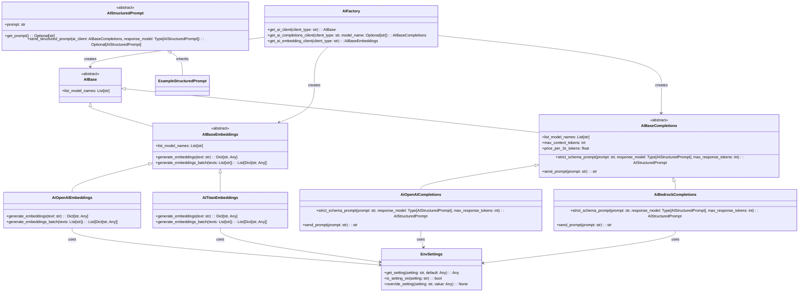

# ai-api-unified · Unified Foundation-Model Client Library

> **Version:** 0.1.6 &nbsp;|&nbsp; **License:** MIT

`ai-api-unified` provides a single, typed interface for calling both completion-style
LLMs and text-embedding models across vendors (OpenAI, Amazon Bedrock/Titan, …).

## Prerequisites

- **Python 3.11.1**  
  We strongly recommend using [pyenv](https://github.com/pyenv/pyenv) to install and pin 3.12.1,
  so that compiled wheels (e.g. `tiktoken`) are available and no Rust toolchain is required.

## Structure



## Installation

```bash
# from your internal Artifactory PyPI
pip install ai-api-unified
```

## Quick start

## Configuration via Environment Variables

This library is fully configurable through environment variables—in exactly the way shown in the provided `.env_template`. You can swap providers, engines, and models without changing code. Below are the key variables:

### EMBEDDING_ENGINE

Controls which embedding backend to use.

- `openai` → uses OpenAI’s embedding API
- `titan` → uses Amazon Titan embeddings

_Default: `openai`_

### COMPLETIONS_ENGINE

Controls which family of completion (chat/LLM) models to use.

- `openai` → uses OpenAI’s completion API
- `nova` → uses Amazon Nova (Bedrock) LLMs
- `llama` → uses Meta Llama family via Bedrock
- `anthropic` → uses Anthropic Claude family via Bedrock
- `mistral` → uses Mistral family via Bedrock
- `cohere` → uses Cohere Command family via Bedrock
- `ai21` → uses AI21 Jamba family via Bedrock
- `rerank` → uses Amazon Rerank via Bedrock

_Default: `openai`_

Submit a PR to add new ones.

### OPENAI_API_KEY

Your OpenAI API key. Required when `EMBEDDING_ENGINE` or `COMPLETIONS_ENGINE` is set to `openai`.

### EMBEDDING_MODEL_NAME

The exact model identifier for embeddings.

- **OpenAI examples:**

  - `text-embedding-3-small` – cost-effective small embedding
  - `text-embedding-3-large` – higher-capacity large embedding
  - `text-embedding-ada-002` – versatile general-purpose embedding
  - `text-search-ada-doc-001` – optimized for document search
  - `text-search-davinci-doc-001` – high-accuracy document search
  - `code-search-ada-text-001` – code-aware embedding for search
  - `code-search-babbage-text-001` – larger-capacity code search
  - `text-similarity-ada-001` – basic text similarity
  - `text-similarity-babbage-001` – mid-range text similarity
  - `text-similarity-curie-001` – higher-quality text similarity

- **Amazon Bedrock examples:**
  - `amazon.titan-embed-text-v2:0` – Titan Text Embed V2
  - `amazon.titan-embed-text-v1:0` – Titan Text Embed V1

_Default: `text-embedding-3-small`_

### COMPLETIONS_MODEL_NAME

The exact model identifier for completions. Changing this in config will allow a no-code update to your program. Alternatively, you can set the model on class initialization in code.

- **OpenAI example:**

  - `gpt-4o-mini` – optimized for cost-sensitive, low-latency use
  - `gpt-4o` – general-purpose GPT-4o
  - `gpt-4o-16k` – GPT-4o with 16 000-token context
  - `gpt-4` – standard GPT-4
  - `gpt-4-32k` – GPT-4 with 32 000-token context
  - `gpt-3.5-turbo` – flagship GPT-3.5 model
  - `gpt-3.5-turbo-16k` – GPT-3.5 with 16 000-token context
  - `text-davinci-003` – high-quality text generation
  - `text-curie-001` – balanced speed and capability
  - `code-davinci-002` – code-optimized completions

- **Amazon Bedrock examples:**
  - `amazon.nova-pro-v1:0` – Nova Pro
  - `amazon.nova-lite-v1:0` – Nova Lite
  - `amazon.nova-micro-v1:0` – Nova Micro
  - `amazon.nova-canvas-v1:0` – Nova Canvas
  - `amazon.titan-text-premier-v1:0` – Titan Text Premier
  - `anthropic.claude-opus-4-20250514-v1:0` – Claude Opus 4
  - `anthropic.claude-sonnet-4-20250514-v1:0` – Claude Sonnet 4
  - `meta.llama2-70b-chat-hf:2` – Llama 2 Chat 70B
  - `meta.llama3-70b-instruct-v1:0` – Llama 3 Instruct 70B
  - `mistral.mistral-large-2407-v1:0` – Mistral Large
  - `cohere.command-r-plus-v1:0` – Cohere Command R+
  - `ai21.jamba-1-5-large-v1:0` – AI21 Jamba 1.5 Large

_Default: `gpt-4o-mini`_

### EMBEDDING_DIMENSIONS

Dimensionality of the embedding vectors.

- `1536` for OpenAI embeddings
- `1024` for Titan embeddings

_Default: `1536`_

### AWS credentials for Bedrock - these are ephermeral and must be set at runtime.

Note: to use Bedrock, you must get your access environment set up independently, since there is no API key approach to using Bedrock. Read more here: https://docs.aws.amazon.com/cli/latest/userguide/cli-configure-envvars.html.

```bash
AWS_ACCESS_KEY_ID=
AWS_SECRET_ACCESS_KEY=
AWS_SESSION_TOKEN=
```

### AWS_REGION

AWS region for Bedrock/Titan when using Amazon services.

_Default: `us-east-1`_

## Example Code

```python
"""
Creates a foundation model API client with a single call.
Can swap models with a config or param change.

Create a structured output subclass with your required structure,
and then use it with a single call.
"""
from ai_api_unified.ai_factory import AIFactory
from ai_api_unified.ai_base import AIBaseCompletions

# easy auto-selects engine and model via .env
client: AIBaseCompletions = AIFactory.get_ai_client()
# OR, specify everything
client: AIBaseCompletions = AIFactory.get_ai_completions_client(
                              client_type=AIBase.CLIENT_TYPE_COMPLETIONS,
                              completions_engine="anthropic",
                              model_name="anthropic.claude-opus-4-20250514-v1:0")

# Converse!
response = client.send_prompt("Say hello in Spanish")
print(response)  # → "Hola"

# More fun: see AIStructuredPrompt for easy structured output prompting

# Structured Prompts
class YourStructuredPrompt(AIStructuredPrompt):
    message_input_field: str  # this is an input field, not a result

    message_output_field: Optional[str] = None # This is a parsed output field

    @staticmethod
    def get_prompt(
        message_input: str,
    ) -> str:
        prompt = textwrap.dedent(
            f"""
            Reply with than uppercase version of the message_input in the test_output field.
            message_input: '{message_input_field}'
            """
        ).strip()
        return prompt

    @classmethod
    def model_json_schema(cls) -> Dict[str, Any]:
        """
        JSON schema for the LLM’s *output* only.
        """
        # start with a fresh copy of the base schema (deep-copied there)
        schema: Dict[str, Any] = deepcopy(super().model_json_schema())
        schema["properties"]["message_output_field"] = {"type": "string"}
        # make test_output required for the LLM response
        schema.setdefault("required", [])
        schema["required"].append("message_output_field")
        return schema


  structured_prompt: YourStructuredPrompt = YourStructuredPrompt(message_input_field="hello")
  structured_prompt_result: YourStructuredPrompt = (
      structured_prompt.send_structured_prompt(
          client, ExampleStructuredPrompt
      )
  )
  print(structured_prompt_result.message_output_field) # -> "HELLO"

# Embeddings client use
embedder: AIBaseEmbeddings = AIFactory.get_ai_embedding_client()
dict_embeddings: Dict[str, Any] = embedder.generate_embeddings("vectorize me")
# dict_embeddings holds {"embedding": [], "text": "vectorize me", "dimensions": int}
```

---

## Repository layout

```
src/ai_api_unified/          ← package source
└── ai_base.py           ← abstract interfaces
└── ai_factory.py        ← runtime factory
tests/                   ← pytest suite
.env_template            ← sample environment config
```

---

## Development

```bash
# create virtualenv & install runtime + dev dependencies
poetry install --with dev
pytest -q
```

## Roadmap

- Add simple method for a developer to cycle through models to test them
- Add more provider back-ends (Anthropic, Google).
- Provide async variants for high-throughput workloads.
