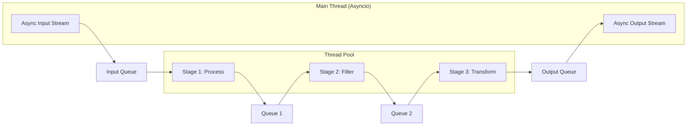

# Examples

This page provides comprehensive examples of using the Async Task Pipeline framework for various use cases.

## Pipeline Architecture Overview

The following diagram shows the basic structure of a pipeline with three processing stages:



## Basic Pipeline

Here's a simple example that demonstrates the core functionality:

```python
import asyncio
from async_task_pipeline import AsyncTaskPipeline

async def basic_example():
    # Create pipeline with timing enabled
    pipeline = AsyncTaskPipeline(max_queue_size=50, enable_timing=True)

    # Add processing stages
    pipeline.add_stage("multiply", lambda x: x * 2)
    pipeline.add_stage("filter_even", lambda x: x if x % 4 == 0 else None)
    pipeline.add_stage("stringify", lambda x: f"Result: {x}")

    # Start the pipeline
    await pipeline.start()

    # Create input data
    async def data_generator():
        for i in range(1, 21):
            yield i
            await asyncio.sleep(0.01)  # Simulate streaming data

    # Process the input stream
    await pipeline.process_input_stream(data_generator())

    # Collect results
    results = []
    async for result in pipeline.generate_output_stream():
        results.append(result)

    # Get performance statistics
    stats = pipeline.get_latency_summary()
    print(f"Processed {stats['total_items']} items")
    print(f"Average latency: {stats['avg_total_latency']:.3f}s")

    # Stop the pipeline
    await pipeline.stop()

    return results

# Run the example
# results = asyncio.run(basic_example())
# print(results)  # ['Result: 4', 'Result: 8', 'Result: 12', ...]
```

## CPU-Intensive Processing

Example with CPU-bound tasks like image processing or data transformation:

```python
import asyncio
import time
from async_task_pipeline import AsyncTaskPipeline

def cpu_intensive_task(data):
    """Simulate CPU-intensive processing"""
    # Simulate heavy computation
    result = 0
    for i in range(data * 1000):
        result += i ** 0.5
    return result

def validate_result(data):
    """Validation stage"""
    return data if data > 1000 else None

async def cpu_intensive_example():
    pipeline = AsyncTaskPipeline(max_queue_size=10, enable_timing=True)

    # Add CPU-intensive stages
    pipeline.add_stage("compute", cpu_intensive_task)
    pipeline.add_stage("validate", validate_result)
    pipeline.add_stage("round", lambda x: round(x, 2))

    await pipeline.start()

    # Generate input data
    async def workload_generator():
        for i in range(1, 11):
            yield i
            await asyncio.sleep(0.1)

    # Process workload
    await pipeline.process_input_stream(workload_generator())

    results = []
    async for result in pipeline.generate_output_stream():
        results.append(result)

    # Analyze performance
    stats = pipeline.get_latency_summary()
    print(f"Total items: {stats['total_items']}")
    print(f"Average latency: {stats['avg_total_latency']:.3f}s")

    for stage_name, stage_stats in stats['stage_statistics'].items():
        timing = stage_stats['timing_breakdown']
        print(f"{stage_name}:")
        print(f"  Computation ratio: {timing['computation_ratio']:.1%}")
        print(f"  Avg processing time: {timing['avg_computation_time']*1000:.1f}ms")

    await pipeline.stop()
    return results
```

## Data Transformation Pipeline

Example for ETL-style data processing:

```python
import asyncio
import json
from typing import Dict, Any
from async_task_pipeline import AsyncTaskPipeline

def parse_json(raw_data: str) -> Dict[str, Any]:
    """Parse JSON data"""
    try:
        return json.loads(raw_data)
    except json.JSONDecodeError:
        return None

def validate_data(data: Dict[str, Any]) -> Dict[str, Any]:
    """Validate required fields"""
    required_fields = ['id', 'name', 'value']
    if all(field in data for field in required_fields):
        return data
    return None

def transform_data(data: Dict[str, Any]) -> Dict[str, Any]:
    """Transform and enrich data"""
    return {
        'id': data['id'],
        'name': data['name'].upper(),
        'value': data['value'] * 1.1,  # Apply 10% markup
        'processed_at': time.time()
    }

async def etl_example():
    pipeline = AsyncTaskPipeline(max_queue_size=100, enable_timing=True)

    # Build ETL pipeline
    pipeline.add_stage("parse", parse_json)
    pipeline.add_stage("validate", validate_data)
    pipeline.add_stage("transform", transform_data)

    await pipeline.start()

    # Simulate streaming JSON data
    sample_data = [
        '{"id": 1, "name": "item1", "value": 100}',
        '{"id": 2, "name": "item2", "value": 200}',
        '{"invalid": "json"}',  # This will be filtered out
        '{"id": 3, "name": "item3", "value": 300}',
    ]

    async def json_stream():
        for json_str in sample_data:
            yield json_str
            await asyncio.sleep(0.05)

    await pipeline.process_input_stream(json_stream())

    results = []
    async for result in pipeline.generate_output_stream():
        results.append(result)

    await pipeline.stop()
    return results
```

## Generator-Based Processing

Example where stages can produce multiple outputs:

```python
import asyncio
from async_task_pipeline import AsyncTaskPipeline

def split_text(text: str):
    """Split text into words (generator)"""
    for word in text.split():
        yield word.strip('.,!?')

def filter_long_words(word: str):
    """Filter words longer than 3 characters"""
    return word if len(word) > 3 else None

def uppercase_word(word: str):
    """Convert to uppercase"""
    return word.upper()

async def text_processing_example():
    pipeline = AsyncTaskPipeline(max_queue_size=50, enable_timing=True)

    # Text processing pipeline
    pipeline.add_stage("split", split_text)
    pipeline.add_stage("filter", filter_long_words)
    pipeline.add_stage("uppercase", uppercase_word)

    await pipeline.start()

    # Input sentences
    sentences = [
        "The quick brown fox jumps over the lazy dog",
        "Python is a great programming language",
        "Async processing makes things fast"
    ]

    async def sentence_stream():
        for sentence in sentences:
            yield sentence
            await asyncio.sleep(0.1)

    await pipeline.process_input_stream(sentence_stream())

    words = []
    async for word in pipeline.generate_output_stream():
        words.append(word)

    await pipeline.stop()
    return words
```

## Performance Analysis

Example focusing on performance monitoring and analysis:

```python
import asyncio
from async_task_pipeline import AsyncTaskPipeline, log_pipeline_performance_analysis

def slow_stage(data):
    """Intentionally slow stage for demonstration"""
    time.sleep(0.1)  # Simulate slow processing
    return data * 2

def fast_stage(data):
    """Fast processing stage"""
    return data + 1

async def performance_analysis_example():
    # Enable detailed timing
    pipeline = AsyncTaskPipeline(max_queue_size=20, enable_timing=True)

    pipeline.add_stage("slow_process", slow_stage)
    pipeline.add_stage("fast_process", fast_stage)
    pipeline.add_stage("final_transform", lambda x: f"Final: {x}")

    await pipeline.start()

    # Process data
    async def data_stream():
        for i in range(10):
            yield i
            await asyncio.sleep(0.02)

    await pipeline.process_input_stream(data_stream())

    results = []
    async for result in pipeline.generate_output_stream():
        results.append(result)

    # Detailed performance analysis
    log_pipeline_performance_analysis(pipeline)

    # Manual analysis
    stats = pipeline.get_latency_summary()
    print(f"\nManual Analysis:")
    print(f"Overall computation efficiency: {stats['overall_efficiency']['computation_efficiency']:.1%}")

    for stage_name, stage_stats in stats['stage_statistics'].items():
        timing = stage_stats['timing_breakdown']
        print(f"{stage_name}: {timing['computation_ratio']:.1%} computation")

    await pipeline.stop()
    return results

# Run performance analysis
# asyncio.run(performance_analysis_example())
```

## Error Handling

Example with robust error handling:

```python
import asyncio
import logging
from async_task_pipeline import AsyncTaskPipeline, logger

# Configure logging
logging.basicConfig(level=logging.INFO)

def risky_operation(data):
    """Operation that might fail"""
    if data % 3 == 0:
        raise ValueError(f"Cannot process {data}")
    return data * 2

def safe_wrapper(func):
    """Wrapper to handle errors gracefully"""
    def wrapper(data):
        try:
            return func(data)
        except Exception as e:
            logger.error(f"Error processing {data}: {e}")
            return None  # Filter out failed items
    return wrapper

async def error_handling_example():
    pipeline = AsyncTaskPipeline(max_queue_size=30, enable_timing=True)

    # Wrap risky operations
    pipeline.add_stage("risky", safe_wrapper(risky_operation))
    pipeline.add_stage("safe", lambda x: x + 10)

    await pipeline.start()

    # Input data that will cause some failures
    async def data_with_errors():
        for i in range(1, 11):
            yield i
            await asyncio.sleep(0.05)

    await pipeline.process_input_stream(data_with_errors())

    results = []
    async for result in pipeline.generate_output_stream():
        results.append(result)

    print(f"Successfully processed {len(results)} items")
    print(f"Results: {results}")

    await pipeline.stop()
    return results
```

## Best Practices

### 1. Resource Management

Always use proper resource management:

```python
async def resource_managed_pipeline():
    pipeline = AsyncTaskPipeline(enable_timing=True)

    try:
        # Setup pipeline
        pipeline.add_stage("process", lambda x: x * 2)
        await pipeline.start()

        # Process data
        # ... your processing logic ...

    finally:
        # Always clean up
        await pipeline.stop()
```

### 2. Monitoring and Logging

Enable comprehensive monitoring:

```python
import logging
from async_task_pipeline import logger, log_pipeline_performance_analysis

# Configure detailed logging
logger.setLevel(logging.DEBUG)
handler = logging.StreamHandler()
formatter = logging.Formatter('%(asctime)s - %(name)s - %(levelname)s - %(message)s')
handler.setFormatter(formatter)
logger.addHandler(handler)

# Use performance analysis
async def monitored_pipeline():
    pipeline = AsyncTaskPipeline(enable_timing=True)
    # ... setup and processing ...

    # Analyze performance
    log_pipeline_performance_analysis(pipeline)
```

### 3. Queue Sizing

Choose appropriate queue sizes based on your use case:

```python
# For memory-constrained environments
pipeline = AsyncTaskPipeline(max_queue_size=10)

# For high-throughput scenarios
pipeline = AsyncTaskPipeline(max_queue_size=1000)

# For balanced performance
pipeline = AsyncTaskPipeline(max_queue_size=100)  # Default
```

These examples demonstrate the flexibility and power of the Async Task Pipeline framework for various data processing scenarios.
