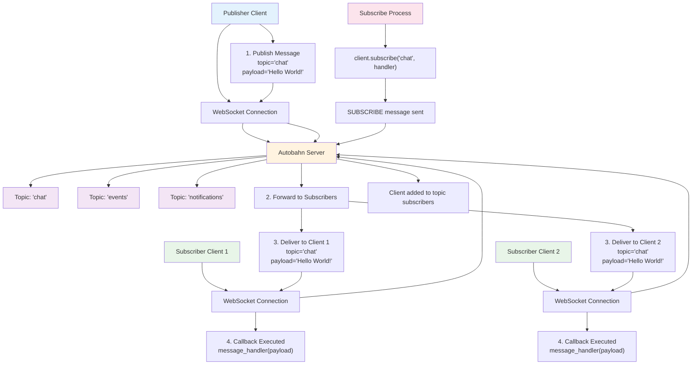
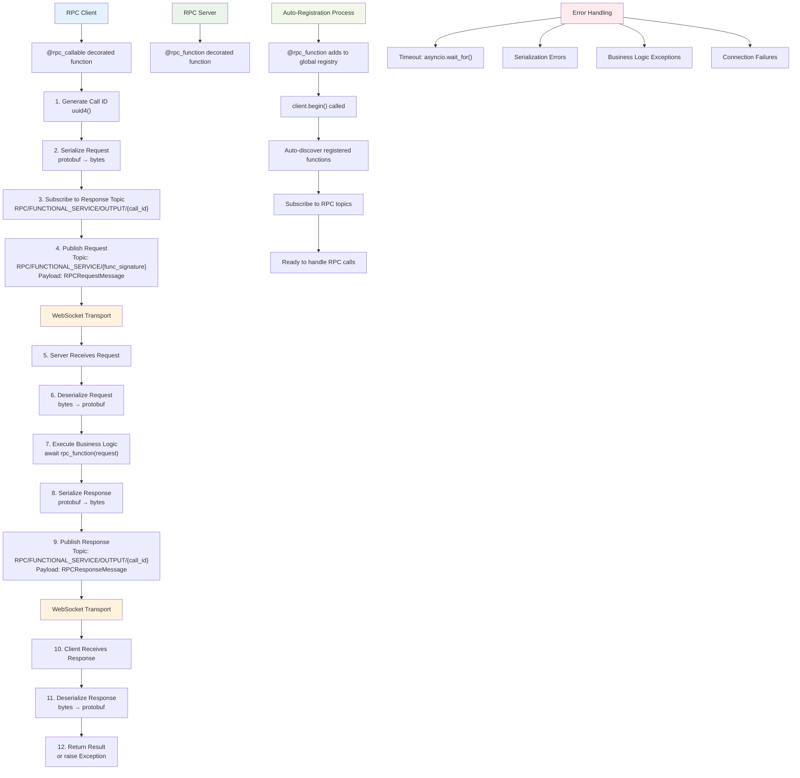

# Autobahn Client

A modern, production-ready Python client for Autobahn WebSocket communication with built-in RPC support, automatic reconnection, and comprehensive error handling.

## Features

- **🚀 WebSocket Communication**: Reliable WebSocket client with automatic reconnection
- **🔧 RPC System**: Powerful decorator-based RPC with type safety and validation
- **⚡ Async/Await**: Fully async/await compatible
- **🛡️ Error Handling**: Comprehensive error handling with detailed logging
- **🔄 Auto-Reconnection**: Automatic reconnection with configurable intervals
- **📝 Type Safety**: Full type annotations and validation
- **🏗️ Protobuf**: Protocol Buffers for efficient message serialization

## Installation

```bash
pip install autobahn_client
```

## Quick Start

```python
import asyncio
from autobahn_client import Autobahn
from autobahn_client.util import Address

async def main():
    # Create client
    client = Autobahn(Address("localhost", 8080))
    
    # Connect
    await client.begin()
    
    # Subscribe to a topic
    async def message_handler(payload: bytes):
        print(f"Received: {payload}")
    
    await client.subscribe("my-topic", message_handler)
    
    # Publish a message
    await client.publish("my-topic", b"Hello, World!")
    
    # Keep running
    await asyncio.sleep(1)

asyncio.run(main())
```

## Configuration

### Basic Configuration

```python
from autobahn_client import Autobahn
from autobahn_client.util import Address

# Basic configuration
client = Autobahn(
    address=Address("localhost", 8080),
    reconnect=True,                        # Enable auto-reconnection
    reconnect_interval_seconds=1.0         # Reconnect every 1 second
)
```

### Connection Management

```python
# Start the client
await client.begin()

# Check connection status
await client.ping()

# Manual publish (will auto-reconnect if needed)
await client.publish("topic", b"data")

# Subscribe with error handling
async def safe_handler(payload: bytes):
    try:
        # Process message
        print(f"Got: {payload}")
    except Exception as e:
        print(f"Handler error: {e}")

await client.subscribe("events", safe_handler)

# Unsubscribe
await client.unsubscribe("events")
```

## Pub/Sub System Architecture

The following diagram shows how the publish/subscribe system works:



**How it works:**
1. **Subscription**: Clients subscribe to topics they're interested in
2. **Publication**: Any client can publish messages to any topic
3. **Distribution**: The server forwards messages to all subscribers of that topic  
4. **Delivery**: Each subscriber's callback function is executed with the message

## RPC System

The Autobahn client includes a powerful RPC system with decorators for both client calls and server functions. **RPC functions are automatically discovered and registered when you call `begin()`** - no manual registration required!

### RPC Server (Service Provider)

Create RPC services using the `@rpc_function` decorator:

```python
from autobahn_client import Autobahn
from autobahn_client.proto.message_pb2 import PublishMessage
from google.protobuf.message import Message
import asyncio

# Define your RPC functions - they will be auto-registered!
@Autobahn.rpc_function()
async def get_user(request: PublishMessage) -> PublishMessage:
    """Get user information."""
    # Process the request
    user_data = f"User: {request.topic}"
    
    # Return response
    return PublishMessage(
        topic="user-response",
        payload=user_data.encode()
    )

@Autobahn.rpc_function()
async def process_data(request: PublishMessage) -> None:
    """Process data without returning anything."""
    print(f"Processing: {request.payload.decode()}")
    # No return value

async def main():
    client = Autobahn(Address("localhost", 8080))
    
    # Just call begin() - RPC functions are automatically registered!
    await client.begin()
    
    print("RPC server running with auto-registered functions...")
    # Keep the server running
    while True:
        await asyncio.sleep(1)

asyncio.run(main())
```

### RPC Client (Service Consumer)

Create RPC client calls using the `@rpc_callable` decorator:

```python
from autobahn_client import Autobahn
from autobahn_client.proto.message_pb2 import PublishMessage
import asyncio

# Define RPC client methods
@Autobahn.rpc_callable(timeout_ms=5000)
async def call_get_user(request: PublishMessage) -> PublishMessage:
    """Client method to call get_user RPC."""
    pass  # Implementation handled by decorator

@Autobahn.rpc_callable(timeout_ms=3000)
async def call_process_data(request: PublishMessage) -> None:
    """Client method to call process_data RPC."""
    pass  # Implementation handled by decorator

async def main():
    client = Autobahn(Address("localhost", 8080))
    await client.begin()
    
    # Make RPC calls
    try:
        # Call with return value
        request = PublishMessage(topic="john_doe", payload=b"get user info")
        response = await call_get_user(client, request)
        print(f"User info: {response.payload.decode()}")
        
        # Call without return value
        data_request = PublishMessage(topic="data", payload=b"some data")
        await call_process_data(client, data_request)
        print("Data processed successfully")
        
    except TimeoutError as e:
        print(f"RPC timeout: {e}")
    except Exception as e:
        print(f"RPC error: {e}")

asyncio.run(main())
```

### RPC Type Safety

All RPC functions must have proper type annotations:

```python
from typing import Optional
from google.protobuf.message import Message

# ✅ Correct: Proper type annotations
@Autobahn.rpc_function()
async def valid_rpc(request: PublishMessage) -> Optional[PublishMessage]:
    if request.payload:
        return PublishMessage(topic="response", payload=b"data")
    return None

# ❌ Invalid: Missing type annotations
@Autobahn.rpc_function()
async def invalid_rpc(request):  # No type annotation
    return "error"

# ❌ Invalid: Wrong parameter count
@Autobahn.rpc_function()
async def invalid_rpc2(req1: Message, req2: Message) -> Message:  # Too many params
    pass
```

### How RPC Auto-Registration Works

1. **Decoration Time**: When you use `@Autobahn.rpc_function()`, the function is added to a global registry
2. **Connection Time**: When you call `client.begin()`, all registered RPC functions are automatically discovered and registered with that client instance
3. **Ready to Serve**: Your RPC services are immediately available to handle incoming requests

```python
# Step 1: Decorate your functions (happens at import time)
@Autobahn.rpc_function()
async def my_service(request: MyRequest) -> MyResponse:
    return MyResponse(data="processed")

# Step 2: Create client and call begin() - auto-registration happens here!
async def main():
    client = Autobahn(Address("localhost", 8080))
    await client.begin()  # 🎉 my_service is now automatically registered!
    
    # Your RPC service is ready to handle calls
    await asyncio.sleep(float('inf'))
```

## RPC System Architecture

The following diagram shows the complete RPC request/response flow:



**RPC Flow Explained:**
1. **Client Side**: Decorated function generates unique call ID and subscribes to response topic
2. **Request**: Serialized request published to function-specific topic
3. **Server Side**: Auto-registered function receives and processes the request
4. **Response**: Result serialized and published back to the response topic
5. **Completion**: Client receives response, deserializes it, and returns the result

**Key Features:**
- 🔄 **Automatic Registration**: Functions decorated with `@rpc_function` are auto-discovered
- 🆔 **Unique Call IDs**: Each RPC call gets a UUID to match requests with responses
- ⏱️ **Timeout Handling**: Configurable timeouts with proper cleanup
- 🛡️ **Error Handling**: Comprehensive error handling at every step
- 🔒 **Type Safety**: Full type validation for requests and responses

## Advanced Features

### Custom Message Types

```python
from google.protobuf.message import Message

# Define your custom protobuf message types
# (You would typically generate these from .proto files)

@Autobahn.rpc_function()
async def handle_custom_message(request: YourCustomMessage) -> YourResponseMessage:
    # Process custom message
    response = YourResponseMessage()
    response.field = request.input_field
    return response
```

### Error Handling

```python
import logging

# Configure logging
logging.basicConfig(level=logging.INFO)

async def robust_handler(payload: bytes):
    try:
        # Your message processing logic
        data = json.loads(payload.decode())
        # Process data...
    except json.JSONDecodeError:
        logging.error("Invalid JSON received")
    except Exception as e:
        logging.error(f"Handler error: {e}")

await client.subscribe("topic", robust_handler)
```

### Connection Monitoring

```python
async def monitor_connection():
    client = Autobahn(Address("localhost", 8080), reconnect=True)
    await client.begin()
    
    while True:
        try:
            await client.ping()
            print("Connection healthy")
        except ConnectionError:
            print("Connection lost - will auto-reconnect")
        
        await asyncio.sleep(5)
```

## Error Handling & Logging

The client provides comprehensive error handling and logging:

```python
import logging

# Enable debug logging
logging.basicConfig(level=logging.DEBUG)

# The client will automatically log:
# - Connection events
# - RPC calls and responses
# - Errors and exceptions
# - Reconnection attempts

# Handle specific errors
try:
    await client.publish("topic", b"data")
except ConnectionError:
    print("Not connected")
except Exception as e:
    print(f"Unexpected error: {e}")
```

## API Reference

### Autobahn Class

#### Constructor

```python
Autobahn(
    address: Address,                    # WebSocket server address
    reconnect: bool = True,             # Enable auto-reconnection
    reconnect_interval_seconds: float = 1.0  # Reconnection interval
)
```

#### Methods

- **`async begin()`** - Start the client, connect to server, and auto-register all RPC functions
- **`async publish(topic: str, payload: bytes)`** - Publish message to topic
- **`async subscribe(topic: str, callback: Callable)`** - Subscribe to topic
- **`async unsubscribe(topic: str)`** - Unsubscribe from topic
- **`async ping()`** - Send ping to server

#### Decorators

- **`@Autobahn.rpc_function()`** - Mark function as RPC service (auto-registered on `begin()`)
- **`@Autobahn.rpc_callable(timeout_ms: float = 3000)`** - Create RPC client call

#### RPC Auto-Registration

When you call `begin()`, the client automatically:
1. Discovers all functions decorated with `@rpc_function`
2. Registers them as RPC services
3. Sets up WebSocket subscriptions to handle incoming RPC calls
4. Logs the registration process

No manual registration required!

### Address Class

```python
Address(host: str, port: int)
```

Simple dataclass for WebSocket server address.

## Protocol Buffers

This package uses Protocol Buffers for message serialization. Key message types:

- **`PublishMessage`** - Standard publish/subscribe messages
- **`TopicMessage`** - Topic subscription/unsubscription
- **`RPCRequestMessage`** - RPC request messages
- **`RPCResponseMessage`** - RPC response messages

### Compiling Proto Files

If you modify the `.proto` files:

```bash
# Install protobuf compiler
# macOS: brew install protobuf
# Ubuntu: apt-get install protobuf-compiler

# Compile proto files
protoc --python_out=. proto/message.proto
```

## Best Practices

### 1. Always Use Type Annotations

```python
# ✅ Good
@Autobahn.rpc_function()
async def process_user(request: UserRequest) -> UserResponse:
    pass

# ❌ Bad
@Autobahn.rpc_function()
async def process_user(request):
    pass
```

### 2. Handle Errors Gracefully

```python
async def safe_rpc_call():
    try:
        result = await my_rpc_call(client, request)
        return result
    except TimeoutError:
        logging.warning("RPC call timed out")
        return None
    except Exception as e:
        logging.error(f"RPC call failed: {e}")
        raise
```

### 3. Use Connection Monitoring

```python
# Enable auto-reconnection
client = Autobahn(address, reconnect=True)

# Monitor connection health
async def health_check():
    while True:
        try:
            await client.ping()
        except Exception:
            pass  # Auto-reconnection will handle it
        await asyncio.sleep(30)
```

### 4. Proper Resource Cleanup

```python
async def main():
    client = Autobahn(Address("localhost", 8080))
    try:
        await client.begin()
        # Your application logic
        
    except KeyboardInterrupt:
        print("Shutting down...")
    finally:
        # Cleanup is handled automatically
        pass
```

## Examples

Check out the `examples/` directory for complete working examples:

- **`basic_client.py`** - Basic pub/sub client
- **`rpc_server.py`** - RPC service provider
- **`rpc_client.py`** - RPC service consumer
- **`chat_application.py`** - Complete chat application

## Contributing

1. Fork the repository
2. Create a feature branch
3. Add tests for new features
4. Ensure all tests pass
5. Submit a pull request

## License

MIT License - see LICENSE file for details.

## Changelog

### v0.1.1 (Latest)
- 🎉 Complete RPC system overhaul
- ✅ Fixed type extraction bug
- ✅ Fixed response handling logic
- ✅ Fixed race conditions in service registration
- ✅ Added instance-specific service registry
- ✅ Comprehensive error handling and logging
- ✅ Added input validation for RPC decorators
- ✅ Improved Optional type handling
- ✅ Added resource cleanup mechanisms

### v0.1.0
- Basic WebSocket client
- Simple pub/sub functionality
- Initial RPC implementation
