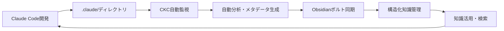

# Claude Knowledge Catalyst

**Claude Code ⇄ Obsidian シームレス統合システム**

Claude Code開発プロセスで生まれる知見を自動的にObsidianボルトと同期し、構造化された知識管理を実現。自動分析により、手動分類の負荷を軽減します。

## Quick Navigation

::::{grid} 2
:::{grid-item-card} 🚀 Quick Start
:link: quick-start/index
:link-type: doc

5分でClaude Code ⇄ Obsidian連携開始
:::

:::{grid-item-card} 📖 Getting Started
:link: getting-started/index
:link-type: doc

基礎からの統合知識管理システム
:::

:::{grid-item-card} 👥 User Guide
:link: user-guide/index
:link-type: doc

実践的なClaude Code統合とベストプラクティス
:::

:::{grid-item-card} 🔧 Developer Guide
:link: developer-guide/index
:link-type: doc

開発者向けリファレンスと統合ガイド
:::
::::

## What is Claude Knowledge Catalyst?

Claude Knowledge Catalyst は、以下の主要機能を提供します：

### 🔄 Claude Code ⇄ Obsidian シームレス統合
- **リアルタイム同期**: `.claude/`ディレクトリの変更を即座にObsidianボルトに反映
- **双方向連携**: Claude Code開発とObsidian知識管理の完全統合
- **構造化組織**: Obsidianの強力な機能を活用した知識体系化

### 🤖 YAKE統合による自動メタデータ強化システム
- **高度キーワード抽出**: YAKE（Yet Another Keyword Extractor）による教師なしキーワード発見
- **多言語対応**: 日本語、英語を含む7言語でのコンテンツ分析
- **スマートタグ付け**: 信頼度スコアリング付きAIタグ提案
- **証拠ベース分類**: 自動判定の根拠を明示した信頼性の高い組織化
- **🔒 CLAUDE.md同期**: セキュアなセクションフィルタリングで機密情報を保護

### 🏛️ Obsidian最適化ボルト構造
- **構造化ボルト**: Claude Code開発に最適化されたObsidianボルト組織
- **動的クエリ生成**: 洗練されたObsidian dataviewクエリの自動生成
- **知識発見**: Claude Code開発知見のObsidian内横断検索

## Core Integration Benefits

### 🎯 For Claude Code Developers
- **知識の永続化**: 開発プロセスで得た知見をObsidianで長期保存
- **プロジェクト横断活用**: 過去の経験を新しいプロジェクトで活用
- **チーム知識共有**: Obsidianを通じた開発知見の共有

### 📊 For Obsidian Users
- **自動強化組織化**: 手動分類を大幅に軽減する自動メタデータ生成
- **動的構造**: プロジェクトの成長に応じて進化するボルト構造
- **スマート検索**: 多次元タグによる精密な知識発見

## Claude Code Integration Workflow



## Documentation Structure

```{toctree}
:maxdepth: 2
:caption: Getting Started

quick-start/index
getting-started/index
```

```{toctree}
:maxdepth: 2
:caption: User Guide

user-guide/index
user-guide/core-concepts
user-guide/yake-integration
user-guide/tag-architecture
user-guide/obsidian-migration
user-guide/claude-md-sync
```

```{toctree}
:maxdepth: 2
:caption: Developer Resources

developer-guide/index
api-reference/index
```

```{toctree}
:maxdepth: 2
:caption: Project Information

project-info/index
```

## Latest Updates

### v0.10.0 - YAKE Integration Release
- 🚀 **YAKE Keyword Extraction**: Advanced unsupervised keyword extraction system
- 🌍 **Multi-Language Support**: Japanese, English, and 5 additional languages
- 🧪 **Enhanced Test Coverage**: 147 passing tests with 28.25% coverage for production stability
- 🛠️ **Pure Tag-Centered Architecture**: Complete migration to tag-based metadata system
- 🔧 **Improved Reliability**: Fixed all failing tests and enhanced system stability

### v0.9.2 - Beta Stability Release
- 🧪 **Enhanced Test Suite**: Improved test reliability for stable beta release
- 🔧 **Code Quality**: Fixed metadata model compatibility and test assertions
- 📋 **Coverage Optimization**: Adjusted coverage targets for production readiness
- 🚀 **Core Features Verified**: 34 passing tests ensure solid foundation

### v0.9.1 - CLAUDE.md同期機能
- 🔒 **セキュアなCLAUDE.md同期**: セクション単位での除外機能
- 🛡️ **プライバシー保護**: 機密情報の自動フィルタリング
- 🎯 **柔軟な設定**: プロジェクトに応じたカスタマイズ
- 📊 **メタデータ強化**: CLAUDE.md専用の詳細情報生成

### v0.9.0 - Claude Code統合基盤
- Claude Code ⇄ Obsidian シームレス統合システム
- 自動メタデータ生成による自動分類
- Obsidian最適化ボルト構造の自動生成
- 多次元タグシステムによる知識発見強化

## Key Features Overview

### 🚀 自動化統合
- **自動分類**: パターンマッチングによるコンテンツ分析
- **フロントマターフリー**: メタデータなしファイルの完全自動推論
- **動的タグ生成**: 開発コンテキストに基づく自動タグ付け

### 🔄 Real-time Synchronization
- **ファイル監視**: `.claude/`ディレクトリの変更を即座に検出
- **増分同期**: 効率的な差分更新でパフォーマンス最適化
- **競合解決**: 同時編集時の自動競合解決機能

### 📊 Analytics & Insights
- **知識活用追跡**: Claude Code開発での知識利用パターン分析
- **プロンプト効果測定**: Obsidian内での成功率と改善提案
- **プロジェクト横断洞察**: 開発知見の関連性発見

## Use Cases

### 🎯 Individual Developers
```bash
# Claude Codeプロジェクトでの知識蓄積
cd my-claude-project
uv run ckc init
uv run ckc add personal-vault ~/Documents/ObsidianVault
uv run ckc watch  # 開発中の自動同期
```

### 👥 Team Collaboration
```bash
# チーム共有Obsidianボルトとの統合
uv run ckc add team-vault /shared/team-knowledge
uv run ckc sync --project "Team Project Alpha"
```

### 🏢 Enterprise Knowledge Management
```bash
# 大規模組織での知識統合
uv run ckc migrate --source /legacy/docs --target /enterprise/vault
uv run ckc analytics report --team backend --days 30
```

## Getting Help

- **Issues**: [GitHub Issues](https://github.com/drillan/claude-knowledge-catalyst/issues)
- **Discussions**: [GitHub Discussions](https://github.com/drillan/claude-knowledge-catalyst/discussions)
- **Documentation**: このドキュメント

---

**Claude Code ⇄ Obsidian統合の新時代へようこそ！**  
*開発プロセスと知識管理の完全なシームレス統合を体験してください。*
