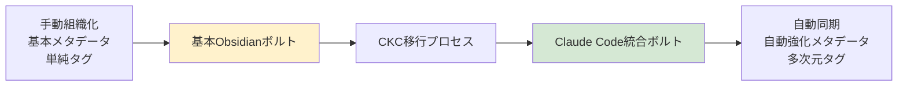
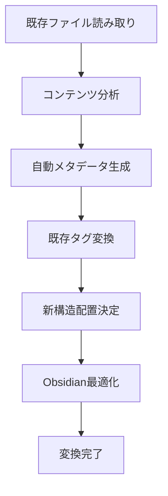

# Obsidian Migration Guide

既存のObsidianボルトをClaude Code統合用に強化し、シームレス統合システムへ移行する方法を詳しく解説します。

## 移行の概要

### 移行の目的

既存のObsidianボルトを**Claude Code ⇄ Obsidian統合システム**に対応させ、以下を実現します：

- **Claude Code開発知見の自動同期**
- **自動強化メタデータによる組織化**
- **手動分類負荷の軽減**
- **高度な知識発見機能**

### Before → After



## 移行前の準備

### 既存ボルトの分析

```bash
# 移行前の状況確認
uv run ckc analyze-vault /path/to/existing/obsidian --report

# 出力例:
# ボルト統計:
# - 総ファイル数: 245
# - フロントマター付き: 89 (36%)
# - タグ使用: 156 (64%)
# - ディレクトリ構造: カテゴリベース
# - 推定移行時間: 15分
```

### バックアップの作成

```bash
# 安全のための完全バックアップ
cp -r /path/to/obsidian/vault /path/to/obsidian/vault.backup.$(date +%Y%m%d)

# 重要ファイルの確認
ls -la /path/to/obsidian/vault/.obsidian/
```

## 移行方法

### Method 1: 完全移行（推奨）

既存ボルトを新しい構造に完全移行：

```bash
# ドライラン（変更内容の確認）
uv run ckc migrate \
  --source /existing/obsidian/vault \
  --target /enhanced/claude-integrated/vault \
  --dry-run \
  --verbose

# 実際の移行実行
uv run ckc migrate \
  --source /existing/obsidian/vault \
  --target /enhanced/claude-integrated/vault \
  --backup \
  --preserve-structure
```

**移行内容:**
- 全ファイルの自動分析とメタデータ強化
- Claude Code統合最適化構造への再編成
- 既存タグの多次元タグシステムへの変換
- Obsidian設定の統合機能対応

### Method 2: インプレース強化

既存ボルトをそのまま強化：

```bash
# 既存ボルトの直接強化
uv run ckc migrate \
  --source /existing/obsidian/vault \
  --target /existing/obsidian/vault \
  --in-place \
  --enhance-only
```

**強化内容:**
- 自動分析による既存ファイルのメタデータ強化
- Claude Code統合用ディレクトリの追加
- 既存構造を保持したまま機能追加

### Method 3: 段階的移行

重要ファイルから段階的に移行：

```bash
# フェーズ1: 重要ファイルのみ
uv run ckc migrate \
  --source /existing/obsidian/vault \
  --target /enhanced/vault \
  --filter "*.md" \
  --priority-only

# フェーズ2: 残りのファイル
uv run ckc migrate \
  --source /existing/obsidian/vault \
  --target /enhanced/vault \
  --continue \
  --incremental
```

## 移行プロセス詳細

### Phase 1: 構造分析

```bash
# 既存構造の詳細分析
uv run ckc analyze-structure /existing/vault --output analysis.json

# 分析結果例
{
  "structure_type": "category_based",
  "directories": {
    "Notes": 45,
    "Projects": 23, 
    "Resources": 67,
    "Daily": 89
  },
  "metadata_coverage": "36%",
  "tag_usage": "mixed",
  "recommendation": "full_migration"
}
```

### Phase 2: ファイル分析・変換



**変換例:**

```markdown
# BEFORE (既存Obsidianファイル)
---
tags: [development, api, backend]
created: 2024-01-15
---

# API設計ガイド
RESTful APIの設計原則について...
```

```markdown
# AFTER (Claude Code統合強化)
---
title: "API設計ガイド"
type: concept
tech: [rest, api, backend]
domain: [web-dev, backend]
team: [backend, fullstack]
status: production
complexity: intermediate
confidence: high
claude_integration: true
source_migration: "Notes/API設計ガイド.md"
obsidian_tags: ["#development", "#api", "#backend"]
created: 2024-01-15
updated: 2025-06-20
migration_date: 2025-06-20
---

# API設計ガイド

RESTful APIの設計原則について...

## Claude Code統合用メタデータ
- **分析信頼度**: 92%
- **推奨活用場面**: バックエンド設計、API開発
- **関連知識**: [[REST設計パターン]], [[HTTP ステータスコード]]

## 自動生成クエリ
```dataview
LIST FROM #concept AND #backend
WHERE contains(tech, "api")
```
```

### Phase 3: 構造最適化

```bash
# 最適化された構造の生成
obsidian-vault/
├── _system/                    # CKC管理（新規追加）
│   ├── templates/              # Claude Code特化テンプレート
│   ├── queries/                # 動的検索クエリ
│   └── migration_report.md     # 移行レポート
├── _attachments/               # メディアファイル（既存保持）
├── inbox/                      # 未処理（新規）
├── active/                     # 作業中（新規）
├── archive/                    # 完了・非推奨（新規）
├── knowledge/                  # メイン知識領域（強化）
│   ├── prompts/               # 自動分析により自動分類
│   ├── code/                  # コードスニペット
│   ├── concepts/              # 概念・設計
│   └── resources/             # 参考資料
└── legacy/                     # 旧構造（必要に応じて保持）
    ├── Notes/                 # 既存Notes→knowledge/に移行済み
    ├── Projects/              # 一部をactive/に移行
    └── Daily/                 # archive/に移行
```

## 移行後の確認

### 移行結果の検証

```bash
# 移行完了確認
uv run ckc status --vault /enhanced/vault

# 統計確認
uv run ckc analytics migration-report --vault /enhanced/vault

# 出力例:
# 移行統計:
# ✅ 処理済みファイル: 245/245 (100%)
# ✅ 強化メタデータ: 189/245 (77%)
# ✅ 自動分類成功: 201/245 (82%)
# ✅ 構造最適化: 完了
# ⚠️  手動確認推奨: 15ファイル
```

### Claude Code統合テスト

```bash
# CKCプロジェクトから統合テスト
cd your-claude-project
uv run ckc add migrated-vault /enhanced/vault
uv run ckc sync --test

# サンプルファイルで動作確認
echo "# テスト用プロンプト
Claude Code統合テストです。" > .claude/migration_test.md

uv run ckc classify .claude/migration_test.md
uv run ckc sync
```

## 移行パターン別ガイド

### パターン1: 研究・学術ノート

**特徴:**
- 大量の概念ファイル
- 詳細な参考文献
- カテゴリ分類済み

**移行戦略:**
```bash
# 学術特化移行
uv run ckc migrate \
  --source /research/vault \
  --target /enhanced/vault \
  --academic-mode \
  --preserve-citations \
  --enhance-concepts
```

### パターン2: 開発ノート

**特徴:**
- コードスニペット多数
- プロジェクト分けされた構造
- 技術メモ中心

**移行戦略:**
```bash
# 開発特化移行
uv run ckc migrate \
  --source /dev/vault \
  --target /enhanced/vault \
  --dev-mode \
  --tech-focus \
  --project-mapping
```

### パターン3: 個人知識管理

**特徴:**
- 雑多なファイル構成
- タグ付け不統一
- 日次ノート中心

**移行戦略:**
```bash
# 個人特化移行
uv run ckc migrate \
  --source /personal/vault \
  --target /enhanced/vault \
  --personal-mode \
  --smart-cleanup \
  --auto-organize
```

## トラブルシューティング

### よくある問題と解決方法

#### 1. 大量ファイルでの移行停止

```bash
# バッチサイズ調整
uv run ckc migrate \
  --source /large/vault \
  --target /enhanced/vault \
  --batch-size 50 \
  --resume-on-error
```

#### 2. メタデータ衝突

```bash
# 既存メタデータの優先度設定
uv run ckc migrate \
  --source /vault \
  --target /enhanced/vault \
  --metadata-priority existing \
  --conflict-resolution merge
```

#### 3. 特殊文字・日本語ファイル名

```bash
# エンコーディング問題の解決
uv run ckc migrate \
  --source /vault \
  --target /enhanced/vault \
  --encoding utf-8 \
  --normalize-filenames
```

### 移行ログの確認

```bash
# 詳細ログの確認
cat ~/.ckc/migration.log

# エラーファイルの特定
uv run ckc migration-status --errors-only

# 手動修正が必要なファイル
uv run ckc migration-status --manual-review
```

## 移行後の最適化

### 継続的な改善

```bash
# 定期的な最適化
uv run ckc optimize --vault /enhanced/vault --weekly

# 分析の再実行（新しいアルゴリズムでの改善）
uv run ckc reanalyze --confidence-below 80 --upgrade-model
```

### Claude Code統合の活用

```bash
# 移行済みボルトでのClaude Code開発
cd new-claude-project
uv run ckc init
uv run ckc add main-vault /enhanced/vault
uv run ckc watch  # 自動同期開始

# 移行された知識の活用
uv run ckc search --from-migration --tech python
```

## 移行成功のベストプラクティス

### 事前準備
1. **完全バックアップ**の作成
2. **段階的アプローチ**の採用
3. **移行計画**の策定

### 移行実行
1. **ドライラン**での事前確認
2. **小規模テスト**での検証
3. **段階的実行**での安全性確保

### 移行後
1. **継続的最適化**の実施
2. **Claude Code統合**の活用
3. **チームメンバー**への共有

## まとめ

Obsidian移行により、以下が実現されます：

### 🎯 主目標達成
- **Claude Code ⇄ Obsidian完全統合**
- **開発プロセスでの知識自動蓄積**
- **手動分類負荷の劇的軽減**

### 🚀 副次的効果
- **自動強化メタデータ**による高度組織化
- **多次元タグシステム**での知識発見
- **Obsidian最適化構造**での効率向上

移行により、既存の知識資産を保持しながら、Claude Code統合の革新的機能を享受できるようになります。