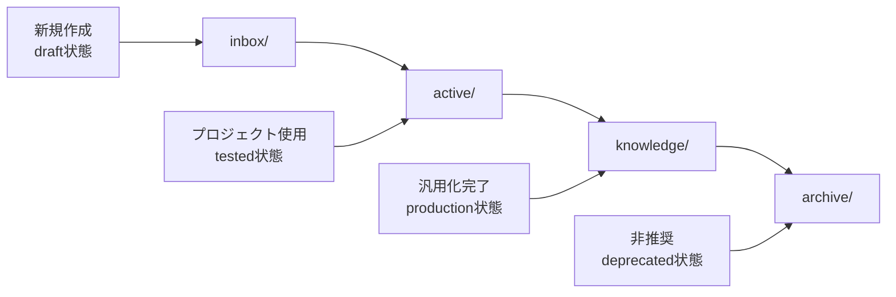

# Core Concepts

Claude Knowledge Catalystの中核となる概念と設計思想について説明します。

## Claude Code ⇄ Obsidian統合の原理

CKCは「Claude Code開発プロセス」と「Obsidian知識管理」の完全なシームレス統合を実現します。

### 統合アーキテクチャ

```{mermaid}
graph TB
    A[Claude Code開発] --> B[.claude/ディレクトリ]
    B --> C[CKC リアルタイム監視]
    C --> D[自動分析エンジン]
    D --> E[メタデータ生成]
    E --> F[Obsidianボルト構造化]
    F --> G[知識活用・検索]
    G --> H[開発プロセス改善]
    H --> A

    style A fill:#e1f5fe
    style F fill:#f3e5f5
    style D fill:#fff3e0
```

## シームレス統合システム

### 🔄 リアルタイム同期メカニズム

CKCは`.claude/`ディレクトリの変更を即座に検出し、Obsidianボルトに反映します：

```
# 同期プロセスの例
claude_file_created → 自動分析 → メタデータ生成 → Obsidian配置
.claude/prompt.md → コンテンツ解析 → タグ付け → knowledge/prompts/
```

#### 同期の流れ
1. **ファイル検出**: `.claude/`内の新規作成・変更を監視
2. **自動分析**: コンテンツを解析してObsidian用メタデータを生成
3. **構造化配置**: Obsidianボルトの最適な位置に配置
4. **関連付け**: 既存知識との関連性を自動発見

### 🤖 自動メタデータ強化

#### 自動分析システム

CKCは以下の要素を総合的に分析して、Obsidian最適化メタデータを生成します：

```yaml
# 自動分析によるメタデータ生成例
title: "API統合パターン"
type: prompt                    # コンテンツ性質の自動判定
tech: [python, fastapi, rest]   # 技術スタック自動抽出
domain: [web-dev, backend]      # 領域分類
complexity: intermediate       # 難易度推定
confidence: high              # 分析信頼度
claude_model: sonnet-4        # 使用Claudeモデル
success_rate: 85              # 推定効果性
obsidian_tags: ["#development", "#api", "#backend"]
```

#### 分析根拠の透明性

自動判定の根拠を明示することで、信頼性の高い分類を実現：

```bash
$ uv run ckc classify .claude/api_prompt.md --show-evidence

分析結果:
├── type: prompt (信頼度: 92%)
│   └── 根拠: "以下のプロンプトを使用して" "APIを統合する方法"
├── tech: [python, fastapi] (信頼度: 88%)
│   └── 根拠: "FastAPI", "Python", "uvicorn"
└── complexity: intermediate (信頼度: 85%)
    └── 根拠: 技術的詳細レベル、前提知識要件
```

## Obsidian最適化ボルト構造

### 🏛️ 状態ベース組織化

従来のカテゴリベースではなく、開発ワークフローに基づく組織化：

```
obsidian-vault/
├── _system/          # CKC管理システム
│   ├── templates/    # Claude Code特化テンプレート
│   └── queries/      # 動的検索クエリ
├── _attachments/     # 添付ファイル・メディア
├── inbox/            # 新規作成・未処理
├── active/           # 現在作業中のプロジェクト
├── archive/          # 完了・非推奨コンテンツ
└── knowledge/        # 成熟した知識（メイン領域）
    ├── prompts/      # プロンプト集
    ├── code/         # コードスニペット
    ├── concepts/     # 概念・アイデア
    └── resources/    # リソース・参考資料
```

### 知識成熟度の管理

コンテンツは開発プロセスに応じて自動的に移行されます：



## インテリジェント分類システム（副次的効果）

### 多次元タグアーキテクチャ

手動分類負荷を軽減する自動タグ付けシステム：

#### 主要タグ次元

```yaml
# 7次元タグシステム（自動生成）
type: [prompt, code, concept, resource]           # コンテンツ性質
tech: [python, react, fastapi, kubernetes, ...]   # 技術スタック
domain: [web-dev, ml, devops, mobile, ...]        # アプリケーション領域
team: [backend, frontend, ml-research, devops]    # チーム所有権
status: [draft, tested, production, deprecated]   # ライフサイクル状態
complexity: [beginner, intermediate, advanced]    # スキルレベル
confidence: [low, medium, high]                   # コンテンツ信頼性
```

#### Claude Code特化タグ

```yaml
# Claude Code開発特化メタデータ
claude_model: [opus, sonnet, haiku, sonnet-4]     # 使用Claudeモデル
claude_feature: [analysis, code-generation, ...]  # Claude機能
success_rate: 85                                  # プロンプト成功率
iteration: 3                                      # 改善回数
project_context: "API開発プロジェクト"               # プロジェクト文脈
```

### 動的関連性発見

Obsidian内での知識発見を強化する自動関連付け：

````markdown
# 自動生成されるObsidianクエリ例

## 関連プロンプト
```
TABLE success_rate, tech, updated
FROM #prompt
WHERE contains(tech, "python") AND status = "production"
SORT success_rate DESC
```

## プロジェクト横断知識
```
LIST FROM [[Current Project]]
WHERE type = "concept" AND confidence = "high"
```
````

## Obsidian統合のメリット

### 🎯 For Claude Code Developers

#### 知識の永続化
- **自動保存**: 開発中に生成した知見を自動的にObsidianに保存
- **バージョン管理**: 知識の進化を追跡
- **検索可能**: 過去の経験を簡単に見つけられる

#### プロジェクト横断活用
```bash
# 過去のプロンプトを新プロジェクトで活用
uv run ckc search --tech python --success-rate ">80"
# → 高成功率のPythonプロンプトをObsidianで発見
```

### 📊 For Obsidian Users

#### 自動強化組織化
- **自動分類**: 手動でのカテゴリ分けが不要
- **メタデータ生成**: 豊富な検索可能属性を自動追加
- **関連性発見**: 意外な知識のつながりを発見

#### 動的構造
```yaml
# プロジェクト成長に応じた構造進化
初期段階: inbox/ → active/
成熟段階: active/ → knowledge/
完了後: knowledge/ → archive/
```

## 設定とカスタマイズ

### Claude Code統合設定

```yaml
# ckc_config.yaml - Claude Code特化設定
version: "1.0"
project_name: "Claude API Project"

# Claude Code統合
claude_integration:
  watch_claude_dir: true
  auto_sync: true
  sync_claude_md: false  # セキュリティ重視

# Obsidian最適化
obsidian:
  vault_path: "/Users/dev/ObsidianVault"
  structure_type: "state_based"  # 状態ベース組織化
  auto_queries: true             # 動的クエリ生成

# 自動分析設定
ai:
  auto_classification: true
  confidence_threshold: 0.75
  evidence_tracking: true
```

### テンプレートシステム

Claude Code開発に特化したObsidianテンプレート：

```markdown
# プロンプトテンプレート
---
type: prompt
claude_model: "{{model}}"
success_rate:
iteration: 1
project: "{{project_name}}"
created: {{date}}
---

# {{title}}

## 目的
{{purpose}}

## プロンプト
{{prompt_content}}

## 期待される出力
{{expected_output}}

## 使用例
{{example}}

## 改善履歴
- v1: {{change_log}}
```

## ベストプラクティス

### 効果的な統合のために

1. **プロジェクト初期設定**
   ```bash
   cd new-claude-project
   uv run ckc init
   uv run ckc add main-vault ~/ObsidianVault
   ```

2. **継続的な知識蓄積**
   ```bash
   uv run ckc watch  # 開発中の自動同期
   ```

3. **知識活用**
   ```bash
   uv run ckc search --project previous --success-rate ">75"
   ```

### チーム協働

```yaml
# チーム設定例
team_integration:
  shared_vault: "/shared/team-knowledge"
  team_tags: ["backend", "frontend", "ml-research"]
  project_sharing: true
```

## まとめ

CKCのコア概念は「Claude Code開発プロセス」と「Obsidian知識管理」の完全統合です。自動メタデータ強化により手動分類負荷を軽減し、開発者が本来の作業に集中できる環境を提供します。

多次元タグシステムは副次的効果として、Obsidian内での高度な知識発見と組織化を実現します。
