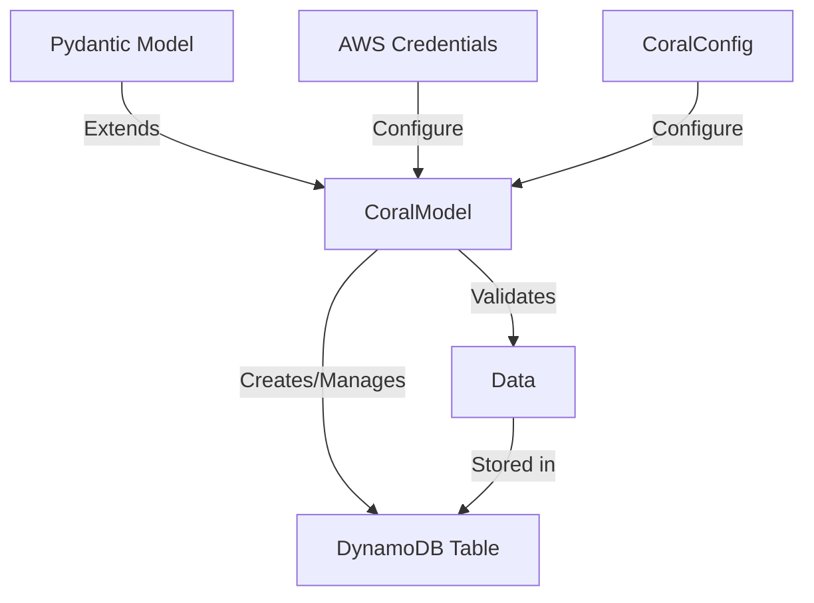

# Welcome to Coraline

[](https://pypi.org/project/coraline/)
[](https://pypi.org/project/coraline/)
[](https://github.com/megalus/coraline/blob/main/LICENSE)
[](https://github.com/megalus/coraline/actions/workflows/publish.yml)

Coraline is a Python library that provides a seamless integration between Pydantic models and AWS DynamoDB tables. It allows you to define your data models using Pydantic's powerful validation system and easily map them to DynamoDB tables.

## Features

- Define DynamoDB tables using Pydantic models
- Automatic table creation and management
- Type validation and conversion
- Support for complex data types
- Easy configuration of AWS credentials
- Simplified CRUD operations

## Installation

```shell
# Basic installation
pip install coraline

# With boto3 dependency
pip install coraline[boto]
```

## Documentation

### Architecture



---

## Quick Start

### Define Your Model

```python
import uuid
from enum import Enum
from coraline import CoralModel, KeyField, HashType
from pydantic import SecretStr, Field


class UserType(Enum):
    USER = "USER"
    ADMIN = "ADMIN"


class Users(CoralModel):
    user_id: uuid.UUID = KeyField(
        default=lambda: uuid.uuid4(),
        hash_key=HashType.HASH,
        alias="userId"
    )
    user_type: UserType = KeyField(
        ...,
        hash_type=HashType.RANGE,
        alias="userType"
    )
    name: str
    age: int = Field(..., gt=0)
    password: SecretStr


# Create the table if it doesn't exist
Users.get_or_create_table()

# Create and save a new user
new_user = Users(
    name="John Doe",
    user_type=UserType.USER,
    age=30,
    password="123456"
)
new_user.save()
```

This example:

1. Defines a `Users` model that extends `CoralModel`
2. Creates a DynamoDB table named `Users` with:
   - `PAY_PER_REQUEST` billing mode (default)
   - `userId` (String) as the Hash Key
   - `userType` (String) as the Range Key
   - Additional fields: `name` (String), `age` (Number), and `password` (String)
3. Creates and saves a new user record to the table

## Table Configuration

Use the `CoralConfig` class to customize your DynamoDB table settings.

```python
import uuid
from enum import Enum
from coraline import (
    CoralModel,
    KeyField,
    HashType,
    CoralConfig,
    BillingMode,
    TableClass
)
from pydantic import SecretStr, Field


class UserType(Enum):
    USER = "USER"
    ADMIN = "ADMIN"


def to_camel(string: str) -> str:
    """Convert snake_case to camelCase"""
    return ''.join(word.capitalize() for word in string.split('_'))


# CoralModel is a subclass of Pydantic's BaseModel
class Users(CoralModel):
    # CoralConfig is a subclass of Pydantic's ConfigDict
    model_config = CoralConfig(
        # Custom table name (default is the class name)
        table_name="MyUsers",

        # Set billing mode to PROVISIONED (default is PAY_PER_REQUEST)
        billing_mode=BillingMode.PROVISIONED,
        read_capacity_units=5,
        write_capacity_units=5,

        # Convert field names to camelCase in DynamoDB
        alias_generator=to_camel,

        # Prevent fields from being excluded when None
        protect_from_exclusion=True,

        # Set table storage class
        table_class=TableClass.STANDARD_INFREQUENT_ACCESS,

        # Add any additional parameters accepted by boto3's create_table
        extra_table_params={
            "Tags": [
                {
                    "Key": "Project",
                    "Value": "MyProject"
                }
            ]
        }
    )

    # KeyField is a subclass of Pydantic's Field
    user_id: uuid.UUID = KeyField(
        default=lambda: uuid.uuid4(),
        hash_key=HashType.HASH
    )
    user_type: UserType = KeyField(
        ...,
        hash_type=HashType.RANGE
    )
    name: str
    age: int = Field(..., gt=0)
    password: SecretStr
```

### Available Configuration Options

| Option                   | Description                                                | Default                       |
|--------------------------|------------------------------------------------------------|-------------------------------|
| `table_name`             | Custom name for the DynamoDB table                         | Class name                    |
| `billing_mode`           | `BillingMode.PROVISIONED` or `BillingMode.PAY_PER_REQUEST` | `BillingMode.PAY_PER_REQUEST` |
| `read_capacity_units`    | Read capacity units (when using PROVISIONED)               | 5                             |
| `write_capacity_units`   | Write capacity units (when using PROVISIONED)              | 5                             |
| `alias_generator`        | Function to transform field names                          | None                          |
| `protect_from_exclusion` | Prevent fields from being excluded when None               | False                         |
| `table_class`            | Storage class for the table                                | `TableClass.STANDARD`         |
| `extra_table_params`     | Additional parameters for boto3's create_table             | {}                            |

---

## AWS Credentials Configuration

Coraline provides multiple ways to configure AWS credentials for connecting to DynamoDB. The library follows a priority order when determining which credentials to use:

1. Class-specific configuration in `model_config`
2. Coraline environment variables
3. Standard AWS environment variables

### Environment Variables

You can set AWS credentials using environment variables:

```dotenv
# Standard AWS environment variables
AWS_REGION="us-east-1"
AWS_ACCESS_KEY_ID="your-access-key"
AWS_SECRET_ACCESS_KEY="your-secret-key"

# Coraline-specific environment variables (take precedence)
CORALINE_AWS_REGION="us-west-2"
CORALINE_AWS_ACCESS_KEY_ID="your-coraline-access-key"
CORALINE_AWS_SECRET_ACCESS_KEY="your-coraline-secret-key"
CORALINE_ENDPOINT_URL="http://localhost:8000"  # For local development
```

### Model Configuration

You can specify AWS credentials directly in your model configuration:

```python
from coraline import CoralModel, CoralConfig

class Users(CoralModel):
    model_config = CoralConfig(
        # AWS credentials
        aws_region="us-east-1",
        aws_access_key_id="your-access-key",
        aws_secret_access_key="your-secret-key",
        aws_endpoint_url="http://localhost:8000"  # For local development
    )
```

### Using Boto3 Config

For more advanced configuration, you can use a boto3 Config instance:

```python
from botocore.config import Config
from coraline import CoralModel, CoralConfig

# Create a boto3 Config instance
config = Config(
    region_name="us-east-1",
    endpoint_url="http://localhost:8000",
    retries={
        'max_attempts': 10,
        'mode': 'standard'
    }
)

class Users(CoralModel):
    model_config = CoralConfig(
        aws_config=config
    )
```

### Local Development

For local development with DynamoDB Local:

```python
from coraline import CoralModel, CoralConfig

class Users(CoralModel):
    model_config = CoralConfig(
        aws_region="local",
        aws_endpoint_url="http://localhost:8000"
    )
```

---

## Basic Operations

Coraline provides a set of methods to interact with DynamoDB tables. Here are the most common operations:

### Table Operations

#### Create or Get Table

Creates a new table if it doesn't exist, or returns information about the existing table:

```python
# Create the table if it doesn't exist
table_description: dict = Users.get_or_create_table()

# Get the table name (returns "Users" by default, or the custom name if specified)
table_name: str = Users.get_table_name()
```

#### Get Table Information

Retrieve detailed information about the table:

```python
# Get basic table information
table_info: dict = Users.get_table_info()

# Include additional describe operations
table_info: dict = Users.get_table_info(
    include=[
        "describe_continuous_backups",
        "describe_time_to_live"
    ]
)
```

> **Note**: Only describe operations that take just the TableName parameter are supported, such as:
> - `describe_continuous_backups`
> - `describe_time_to_live`
> - `describe_limits`
>
> Operations that require additional parameters (like `describe_backup`, `describe_global_table`) are not supported through this method.

### Record Operations

#### Check if a Record Exists

Check if a record exists by providing all hash and range keys:

```python
# Check if a user exists
user_exists: bool = Users.exists(
    user_id="12345678-1234-1234-1234-123456789012",
    user_type=UserType.USER
)
```

#### Get a Record

Retrieve a record by providing all hash and range keys:

```python
# Get a user
user: Users = Users.get(
    user_id="12345678-1234-1234-1234-123456789012",
    user_type=UserType.USER
)

# Access user properties
print(f"User name: {user.name}")
print(f"User age: {user.age}")
```

#### Create and Save a Record

Create a new record and save it to the table:

```python
# Create a new user
new_user = Users(
    name="John Doe",
    user_type=UserType.USER,
    age=30,
    password="123456"
)

# Save the user to the table
new_user.save()
```

#### Update a Record

Update an existing record:

```python
# Get an existing user
user = Users.get(
    user_id="12345678-1234-1234-1234-123456789012",
    user_type=UserType.USER
)

# Update properties
user.name = "Jane Doe"
user.age = 31

# Save the changes
user.save()
```

#### Delete a Record

Delete an existing record:

```python
# Get an existing user
user = Users.get(
    user_id="12345678-1234-1234-1234-123456789012",
    user_type=UserType.USER
)

# Delete the user
user.delete()

# You can also use the async version
await user.adelete()

# Verify the user no longer exists
user_exists = Users.exists(
    user_id="12345678-1234-1234-1234-123456789012",
    user_type=UserType.USER
)
assert user_exists is False
```

### Advanced Operations

#### Using boto3's Client Directly

For operations not covered by Coraline's methods, you can access the boto3 client directly:

```python
# Get the boto3 client
client = Users.get_client()

# Use any boto3 DynamoDB client method
client.create_backup(
    TableName=Users.get_table_name(),
    BackupName="MyBackup"
)

# Or from an instance
user = Users.get(
    user_id="12345678-1234-1234-1234-123456789012",
    user_type=UserType.USER
)
user.get_client().update_time_to_live(
    TableName=user.table_name(),
    TimeToLiveSpecification={
        'Enabled': True,
        'AttributeName': 'ExpirationTime'
    }
)
```

---

## Contributing

Contributions are welcome! Please feel free to submit a Pull Request.

1. Fork the repository
2. Create your feature branch (`git checkout -b feature/amazing-feature`)
3. Commit your changes (`git commit -m 'feat: add some amazing feature'`)
4. Push to the branch (`git push origin feature/amazing-feature`)
5. Open a Pull Request

Please make sure to update tests as appropriate.

## Issues and Support

If something isn't working as expected, don't panic. Get a towel and please open an [issue](https://github.com/megalus/coraline/issues).

## License

This project is licensed under the MIT License - see the [LICENSE](LICENSE) file for details.
