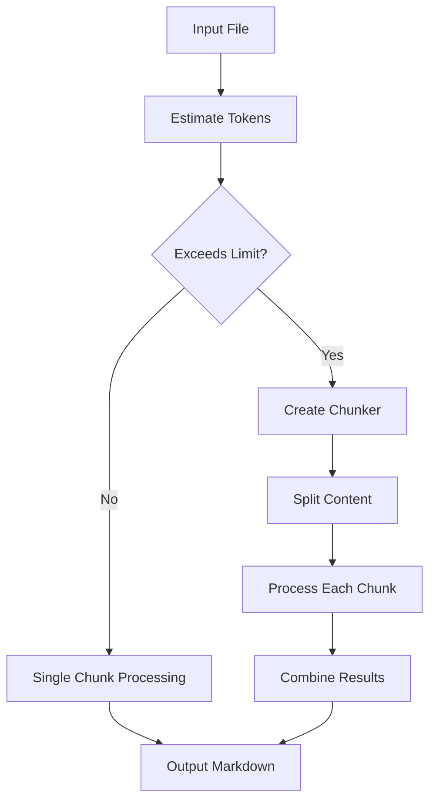

# Intelligent Chunking Feature for Large Files

This guide explains the intelligent chunking functionality that handles large plain text and CSV files that exceed AI token limitations.

## Overview

The chunking feature automatically detects when files are too large for AI processing and intelligently splits them into smaller chunks while maintaining content coherence and structure. This ensures that even very large files can be processed successfully.

## Key Features

### 🔍 **Automatic Token Detection**
- Estimates token count for content before processing
- Compares against service-specific token limits
- Automatically triggers chunking when needed

### 📊 **Smart CSV Chunking**
- Preserves headers across all chunks
- Maintains table structure
- Splits data rows while keeping headers intact
- Combines results into cohesive markdown tables

### 📝 **Intelligent Text Chunking**
- Splits at natural boundaries (paragraphs, sentences)
- Maintains context and readability
- Preserves document structure
- Combines chunks into unified documents

### 🤖 **AI-Aware Processing**
- Uses chunk-aware prompts for better results
- Provides context about chunk position (first, middle, last)
- Maintains consistency across chunks
- Intelligent response combination

## Technical Implementation

### Token Limits by Service

| Service | Model | Token Limit | Notes |
|---------|-------|-------------|-------|
| OpenAI | GPT-4o | 25,000 | Conservative limit considering rate limits |
| OpenAI | GPT-4 | 7,000 | 8k context window |
| OpenAI | GPT-3.5-turbo | 15,000 | 16k context window |
| OLLAMA | Default | 3,000 | Conservative for local models |

### Chunking Strategies

#### CSV Files
1. **Header Preservation**: Headers are included in every chunk
2. **Row-Based Splitting**: Splits data rows while maintaining table structure
3. **Intelligent Combination**: Merges table chunks without duplicate headers
4. **Metadata Tracking**: Tracks row ranges and total counts

#### Text Files
1. **Paragraph Boundaries**: Splits at double newlines first
2. **Sentence Boundaries**: Falls back to sentence splits for large paragraphs
3. **Character Limits**: Final fallback to character-based splitting
4. **Context Preservation**: Maintains document flow and structure

### Processing Flow



## Usage Examples

### Automatic Processing
```python
from services.plain_text_converter import PlainTextConverter

# Initialize converter (chunking is automatic)
converter = PlainTextConverter()

# Convert large file - chunking happens automatically
success = converter.convert_file("large_data.csv", "output.md")
```

### Check Token Limits
```python
from services.text_chunking_utils import TokenEstimator

# Estimate tokens in content
tokens = TokenEstimator.estimate_tokens(content)
print(f"Content has approximately {tokens} tokens")

# Get service limits
max_tokens = TokenEstimator.get_max_tokens("openai", "gpt-4o")
print(f"Service limit: {max_tokens} tokens")
```

### Manual Chunking
```python
from services.text_chunking_utils import create_chunker

# Create CSV chunker
chunker = create_chunker("csv", max_tokens=25000)
chunks = chunker.chunk_csv(csv_content, delimiter=",")

# Create text chunker
chunker = create_chunker("text", max_tokens=25000)
chunks = chunker.chunk_text(text_content)
```

## Logging and Monitoring

The chunking feature provides detailed logging:

```
INFO - Processing large csv content with chunking (68536 tokens, max: 25000)
INFO - Split content into 3 chunks
INFO - Processing chunk 1/3 (24500 tokens)
INFO - Processing chunk 2/3 (24000 tokens)
INFO - Processing chunk 3/3 (20036 tokens)
INFO - Successfully analyzed chunk 1/3 of csv content
```

## Performance Considerations

### Benefits
- ✅ **Large File Support**: Process files of any size
- ✅ **Quality Preservation**: Maintains AI analysis quality
- ✅ **Automatic Operation**: No user intervention required
- ✅ **Error Recovery**: Graceful handling of failed chunks

### Considerations
- ⏱️ **Processing Time**: Multiple API calls increase processing time
- 💰 **API Costs**: More chunks = more API requests
- 🔄 **Rate Limits**: May hit rate limits with very large files
- 📊 **Memory Usage**: Temporary storage of chunks

## Error Handling

### Chunk Processing Failures
- Individual chunk failures don't stop the entire process
- Failed chunks are replaced with error messages and raw content
- Processing continues with remaining chunks

### Fallback Behavior
- If AI processing fails entirely, falls back to basic markdown conversion
- Preserves original content in code blocks
- Provides clear error messages

## Configuration

### Token Limits
Token limits are configured in `services/text_chunking_utils.py`:

```python
TOKEN_LIMITS = {
    'openai': {
        'gpt-4o': 25000,   # Conservative limit
        'gpt-4': 7000,
        'gpt-3.5-turbo': 15000
    },
    'ollama': {
        'default': 3000,
        'llava:latest': 3000
    }
}
```

### Chunking Parameters
- **Characters per token**: 4 (estimation ratio)
- **Paragraph splitting**: Primary method for text
- **Sentence splitting**: Secondary method for text
- **Row-based splitting**: Method for CSV files

## Testing

### Test Large Files
```bash
# Run chunking functionality tests
python test_chunking_functionality.py

# Test with your actual files
python test_user_files.py
```

### Test Results
- ✅ Token estimation accuracy
- ✅ CSV chunking with header preservation
- ✅ Text chunking at natural boundaries
- ✅ AI processing with chunk awareness
- ✅ Response combination quality

## Best Practices

### For CSV Files
1. **Clean Data**: Ensure consistent formatting
2. **Header Quality**: Use descriptive column headers
3. **Size Awareness**: Very large files may take longer to process

### For Text Files
1. **Structure**: Well-structured documents chunk better
2. **Paragraphs**: Use double newlines for paragraph breaks
3. **Sections**: Clear section headers improve chunking

### For Performance
1. **Monitor Logs**: Watch for chunking activity
2. **Rate Limits**: Be aware of API rate limits
3. **File Size**: Consider pre-processing extremely large files

## Troubleshooting

### Common Issues

**Issue**: Chunking not triggered for large files
**Solution**: Check token estimation and limits in logs

**Issue**: Poor chunk combination quality
**Solution**: Verify content structure and chunk boundaries

**Issue**: Rate limit errors
**Solution**: Reduce file size or implement delays between chunks

**Issue**: Memory issues with very large files
**Solution**: Consider file preprocessing or streaming approaches

## Future Enhancements

Planned improvements:
- **Streaming Processing**: Process chunks without loading entire file
- **Custom Chunk Sizes**: User-configurable chunk sizes
- **Parallel Processing**: Process multiple chunks simultaneously
- **Smart Boundaries**: Better detection of natural split points
- **Progress Tracking**: Real-time progress indicators

## Integration

The chunking feature is fully integrated with:
- **PlainTextConverter**: Automatic chunking for large files
- **DocumentConverterManager**: Seamless batch processing
- **AI Services**: Chunk-aware prompts and processing
- **Error Handling**: Graceful degradation and recovery

This feature ensures that your document conversion system can handle files of any size while maintaining high-quality AI-enhanced output.
