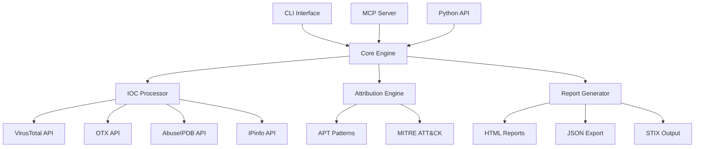

# 🛡️ FastMCP ThreatIntel - AI-Powered Threat Intelligence

[](https://github.com/4R9UN/fastmcp-threatintel/actions/workflows/ci.yml)
[](https://codecov.io/gh/4R9UN/fastmcp-threatintel)
[](https://badge.fury.io/py/fastmcp-threatintel)
[](https://www.python.org/downloads/)
[](https://opensource.org/licenses/Apache-2.0)
[](https://hub.docker.com/r/4r9un/fastmcp-threatintel)

>🚀 **Modern, Cross-Platform Threat Intelligence Analysis Tool** powered by AI and multiple threat intelligence sources

A comprehensive Model Context Protocol (MCP) server that provides enterprise-grade threat intelligence capabilities through natural language AI prompts. Analyze IPs, domains, URLs, and file hashes across multiple threat intelligence platforms with advanced APT attribution and interactive reporting.


## ✨ Key Features

### 🔍 **Multi-Source Intelligence**
- **VirusTotal**: File and URL reputation analysis
- **AlienVault OTX**: Open threat exchange data
- **AbuseIPDB**: IP reputation and geolocation
- **IPinfo**: Enhanced geolocation and ASN data

### 🤖 **AI-Powered Analysis**
- Natural language threat intelligence queries
- Advanced APT attribution with confidence scoring
- MITRE ATT&CK technique mapping
- Intelligent IOC type detection

### 📊 **Rich Reporting & Visualization**
- Interactive HTML reports with D3.js network graphs
- Multiple output formats (Markdown, JSON, HTML)
- STIX-compliant threat intelligence output
- Real-time progress indicators

### 🚀 **Multiple Deployment Options**
- **MCP Server**: Integrate with Claude Desktop and VSCode
- **Standalone CLI**: Interactive and batch processing modes
- **Docker Container**: Production-ready containerization
- **Python Package**: Embed in your applications

### 🌍 **Cross-Platform Support**
- Windows, macOS, and Linux compatibility
- Poetry and UV package manager support
- Docker multi-architecture builds
- Comprehensive CI/CD pipeline

## 🚀 Quick Start

### Using UV (Recommended)
```bash
# Clone and install
git clone https://github.com/4R9UN/fastmcp-threatintel.git
cd fastmcp-threatintel
uv sync

# Interactive setup wizard
uv run threatintel setup

# Analyze a single IOC
uv run threatintel analyze 192.168.1.1

# Start interactive mode
uv run threatintel interactive
```

### Using Poetry
```bash
# Clone and install
git clone https://github.com/4R9UN/fastmcp-threatintel.git
cd fastmcp-threatintel
poetry install

# Run analysis
poetry run threatintel analyze example.com --output-format html --open-browser
```

### Using Docker
```bash
# Pull and run
docker pull 4r9un/fastmcp-threatintel:latest
docker run -e VIRUSTOTAL_API_KEY=your_key 4r9un/fastmcp-threatintel analyze 8.8.8.8
```

### Using pip
```bash
pip install fastmcp-threatintel
threatintel setup  # Interactive configuration
threatintel analyze malware.exe --verbose
```

## 📋 Installation Options

Choose the method that best fits your workflow, from a simple `pip` install to a full development setup.

### 🐳 Docker (Easiest)

For a hassle-free setup, run the tool inside a Docker container. This is perfect for quick deployment or isolated execution.

```bash
# Pull the latest image from Docker Hub
docker pull 4r9un/fastmcp-threatintel:latest

# Run the server, passing your API keys as environment variables
docker run -it --rm \
  -e VIRUSTOTAL_API_KEY="your_key" \
  -e OTX_API_KEY="your_key" \
  -p 8000:8000 \
  4r9un/fastmcp-threatintel:latest server
```
> **Tip**: For production, use the provided `docker-compose.yml` for managed deployments.

### 🐍 pip (Standard)

Install directly from PyPI into your active Python environment. Ideal for using it as a command-line tool.

```bash
# Install the latest stable version
pip install fastmcp-threatintel

# After installation, run the setup wizard
threatintel setup
```
For the latest development version:
```bash
pip install git+https://github.com/4R9UN/fastmcp-threatintel.git
```

### 🔥 UV (Developer - Recommended)

Use **UV** for a lightning-fast development setup. This is the recommended method for contributors.

```bash
# 1. Clone the repository
git clone https://github.com/4R9UN/fastmcp-threatintel.git
cd fastmcp-threatintel

# 2. Install dependencies using UV
# (Install uv first if you don't have it: curl -LsSf https://astral.sh/uv/install.sh | sh)
uv sync --dev

# 3. Run the application
uv run threatintel --version
```

### 📦 Poetry (Developer)

Use **Poetry** for robust dependency management if it's already part of your workflow.

```bash
# 1. Clone the repository
git clone https://github.com/4R9UN/fastmcp-threatintel.git
cd fastmcp-threatintel

# 2. Install dependencies using Poetry
# (Install poetry first if you don't have it: curl -sSL https://install.python-poetry.org | python3 -)
poetry install

# 3. Activate the virtual environment and run
poetry shell
threatintel --version
```

## 🔧 Configuration

### Environment Variables
Create a `.env` file or set environment variables:

```bash
# Required APIs
VIRUSTOTAL_API_KEY=your_virustotal_api_key
OTX_API_KEY=your_alienvault_otx_api_key

# Optional APIs
ABUSEIPDB_API_KEY=your_abuseipdb_api_key
IPINFO_API_KEY=your_ipinfo_api_key

# Performance Settings
CACHE_TTL=3600              # Cache time-to-live in seconds
MAX_RETRIES=3               # Maximum API retry attempts
REQUEST_TIMEOUT=30          # Request timeout in seconds
```

### API Keys Setup

| Service | Required | Free Tier | Get Key |
|---------|----------|-----------|---------|
| **VirusTotal** | ✅ Yes | 1,000 requests/day | [Sign Up](https://www.virustotal.com/gui/join-us) |
| **OTX** | ✅ Yes | Unlimited | [Sign Up](https://otx.alienvault.com/) |
| **AbuseIPDB** | ❌ Optional | 1,000 requests/day | [Sign Up](https://www.abuseipdb.com/register) |
| **IPinfo** | ❌ Optional | 50,000 requests/month | [Sign Up](https://ipinfo.io/signup) |

## 💻 Usage Examples

### CLI Usage

```bash
# Analyze single IOC with rich output
threatintel analyze 192.168.1.1 --output-format table --verbose

# Batch analysis from file
threatintel batch iocs.txt --output-file report.html --output-format html

# Interactive mode with real-time analysis
threatintel interactive

# Server mode for MCP integration
threatintel server --host 0.0.0.0 --port 8000
```

## 🔌 MCP Integration

Integrate `fastmcp-threatintel` with your favorite AI assistant that supports the Model Context Protocol (MCP), such as the Claude Desktop app or VSCode with the Roo-Cline extension.

The MCP server allows your AI assistant to directly call the tools available in this package (e.g., `analyze_iocs`).

### How it Works
You configure your MCP client (VSCode/Claude) to launch the `threatintel` server. The client will manage the server's lifecycle, starting it when needed. The server then exposes its tools to the AI.

### Configuration Steps

#### 🖥️ VSCode with Roo-Cline

1.  **Install the Extension**: Make sure you have the [Roo-Cline](https://marketplace.visualstudio.com/items?itemName=RooVeterinaryInc.roo-cline) extension installed in VSCode.
2.  **Open MCP Settings**:
    *   Open the Command Palette (`Ctrl+Shift+P` or `Cmd+Shift+P`).
    *   Type `Roo: Open MCP Settings` and press Enter.
    *   This will open your `mcp_settings.json` file.
3.  **Add Server Configuration**: Add the following JSON object to the `mcpServers` dictionary. This example uses **UV**.

    ```json
    {
      "mcpServers": {
        "threatintel": {
          "command": "uv",
          "args": ["run", "threatintel", "server", "--port", "8001"],
          "cwd": "/path/to/your/fastmcp-threatintel/project",
          "env": {
            // API keys are automatically loaded from the .env file
            // in the specified 'cwd'. You can override them here if needed.
            // "VIRUSTOTAL_API_KEY": "your_key_here"
          }
        }
      }
    }
    ```

    **Configuration Notes:**
    *   **`cwd`**: **Crucially**, replace `/path/to/your/fastmcp-threatintel/project` with the **absolute path** to where you cloned this repository.
    *   **`command` & `args`**:
        *   If you use **Poetry**, change `command` to `"poetry"` and `args` to `["run", "threatintel", "server", "--port", "8001"]`.
        *   If you installed with **pip** into a virtual environment, you'll need to point to the python executable in that venv.
    *   **`port`**: It's recommended to use a different port (e.g., `8001`) for the client-managed server to avoid conflicts if you run it manually.
    *   **`env`**: API keys are loaded from the `.env` file in your project directory (`cwd`). You only need to set them here to override the `.env` file.

#### 🐍 Using a Python Virtual Environment (`venv`)

If you are not using a package manager like UV or Poetry, you can configure the MCP server to use a standard Python virtual environment.

1.  **Create & Activate Venv**: From the project root, create and activate a virtual environment.
    ```bash
    # Create the venv
    python -m venv .venv

    # Activate it
    # Windows
    .venv\Scripts\activate
    # macOS / Linux
    source .venv/bin/activate
    ```
2.  **Install the Package**: Install the package in editable mode so your changes are reflected.
    ```bash
    pip install -e .
    ```
3.  **Configure MCP Settings**: In your `mcp_settings.json`, you must provide the **absolute path** to the Python executable inside your `.venv`.

    ```json
    {
      "mcpServers": {
        "threatintel": {
          // Use the absolute path to the python executable in your venv
          "command": "/path/to/your/fastmcp-threatintel/project/.venv/bin/python", // macOS/Linux example
          // "command": "C:\\path\\to\\your\\fastmcp-threatintel\\project\\.venv\\Scripts\\python.exe", // Windows example
          "args": [
            "-m",
            "threatintel.cli",
            "server",
            "--port",
            "8001"
          ],
          "cwd": "/path/to/your/fastmcp-threatintel/project"
        }
      }
    }
    ```
    **Key Points:**
    *   Replace `/path/to/your/fastmcp-threatintel/project` with the correct absolute path on your machine.
    *   The `command` must point directly to the `python` or `python.exe` file within the virtual environment.
    *   Using `"-m", "threatintel.cli"` tells Python to run the `cli` module, which is the most reliable way to launch the server from a venv.

#### 🤖 Claude Desktop App

The process is similar for the Claude Desktop application.

1.  **Locate Configuration**: Find the MCP configuration file for the Claude Desktop application. This is typically located in the application's settings or preferences directory.
2.  **Add Server Configuration**: Add a similar configuration to the `mcpServers` section.

    ```json
    {
      "mcpServers": {
        "threatintel": {
          "command": "uv",
          "args": ["run", "threatintel", "server"],
          "cwd": "/path/to/your/fastmcp-threatintel/project"
        }
      }
    }
    ```
    **Note**: Ensure the `cwd` path is correct for your system.

### ✅ Verify the Integration

After configuring, you can test it in your AI assistant:

1.  Open a new chat.
2.  Type `@threatintel` to see if the tool is recognized.
3.  Send a prompt to invoke a tool:

    ```
    @threatintel(analyze_iocs, ioc_string='8.8.8.8')
    ```

    Or use a natural language prompt:

    ```
    @threatintel Can you analyze the IP address 8.8.8.8 and give me a full report?
    ```

### Python API

```python
import asyncio
from threatintel import analyze_iocs, IOC

async def analyze_threats():
    iocs = [
        {"value": "192.168.1.1", "type": "ip"},
        {"value": "malware.exe", "type": "md5"}
    ]
    
    report = await analyze_iocs(
        iocs=iocs,
        output_format="json",
        include_graph=True
    )
    
    print(report)

asyncio.run(analyze_threats())
```

## 🎯 AI Prompt Examples

### Basic Analysis
```
"Analyze IP 8.8.8.8 for any security threats and provide geolocation data"
"Check if domain example.com has any malicious associations"
"Investigate this hash: d41d8cd98f00b204e9800998ecf8427e"
```

### Advanced Attribution
```
"Perform comprehensive threat analysis on 185.220.101.1 including APT attribution with confidence scoring"
"Analyze these IOCs and identify potential nation-state actors: [list of IOCs]"
"Generate MITRE ATT&CK mapping for the identified threat patterns"
```

### Bulk Analysis
```
"Process this list of 100 IP addresses and generate an executive summary"
"Analyze all domains in our threat feed and identify high-confidence APT campaigns"
"Create a security incident report with timeline and attribution analysis"
```

## 📊 Reports & Visualization

### Interactive HTML Reports
- 🎨 Modern, responsive design with dark/light modes
- 📈 D3.js network graphs showing IOC relationships
- 🔍 Detailed tables with sortable columns
- 📋 APT attribution with confidence indicators
- 💾 Export capabilities (PDF, CSV, JSON)

### Output Formats
- **Table**: Rich terminal tables with color coding
- **Markdown**: GitHub-flavored markdown reports
- **JSON**: Structured data for automation
- **HTML**: Interactive web reports
- **STIX**: Industry-standard threat intelligence format

## 🏗️ Architecture



## 🧪 Development

### Setup Development Environment
```bash
# Clone repository
git clone https://github.com/4R9UN/fastmcp-threatintel.git
cd fastmcp-threatintel

# Install with development dependencies
uv sync --dev

# Install pre-commit hooks
uv run pre-commit install

# Run tests
uv run pytest

# Type checking
uv run mypy src/

# Code formatting
uv run ruff format src/ tests/
```

### Testing
```bash
# Run all tests with coverage
uv run pytest --cov=src/threatintel --cov-report=html

# Run specific test categories
uv run pytest tests/unit/
uv run pytest tests/integration/ -v
uv run pytest -m "not slow"

# Performance tests
uv run pytest tests/performance/ --benchmark-only
```

### Building
```bash
# Build package
uv build

# Build Docker image
docker build -t fastmcp-threatintel .

# Build documentation
uv run mkdocs build
```

## 📈 Performance & Scaling

### Benchmarks
- **Single IOC Analysis**: ~2-5 seconds
- **Batch Processing**: ~500 IOCs/minute
- **Memory Usage**: <100MB for typical workloads
- **Cache Hit Rate**: >90% in production environments

### Production Deployment
```yaml
# docker-compose.yml
version: '3.8'
services:
  threatintel:
    image: 4r9un/fastmcp-threatintel:latest
    environment:
      - VIRUSTOTAL_API_KEY=${VIRUSTOTAL_API_KEY}
      - OTX_API_KEY=${OTX_API_KEY}
      - CACHE_TTL=7200
      - MAX_RETRIES=5
    volumes:
      - ./reports:/app/reports
    ports:
      - "8000:8000"
    restart: unless-stopped
```

## 🤝 Contributing

We welcome contributions! Please see our [Contributing Guide](docs/development/contributing.md) for details.

### Quick Contributing Steps
1. 🍴 Fork the repository
2. 🌿 Create a feature branch: `git checkout -b feature/amazing-feature`
3. 💻 Make your changes and add tests
4. ✅ Run tests: `uv run pytest`
5. 📝 Commit: `git commit -m 'Add amazing feature'`
6. 🚀 Push: `git push origin feature/amazing-feature`
7. 🔄 Create a Pull Request

### Development Standards
- ✅ Type hints for all functions
- 🧪 Tests for new features (>80% coverage)
- 📚 Documentation for public APIs
- 🎨 Code formatting with Ruff and Black
- 🔍 Linting with mypy and ruff
- 📦 Semantic versioning with Commitizen

## 📜 License

This project is licensed under the Apache License 2.0 - see the [LICENSE](LICENSE) file for details.

## 🙏 Acknowledgments

- **FastMCP**: For the excellent MCP framework
- **VirusTotal**: For comprehensive malware analysis APIs
- **AlienVault OTX**: For open threat intelligence sharing
- **AbuseIPDB**: For IP reputation services
- **MITRE**: For the ATT&CK framework

## 🔗 Links

- 📚 [Documentation](https://4r9un.github.io/fastmcp-threatintel/)
- 🐛 [Issue Tracker](https://github.com/4R9UN/fastmcp-threatintel/issues)
- 💬 [Discussions](https://github.com/4R9UN/fastmcp-threatintel/discussions)
- 📦 [PyPI Package](https://pypi.org/project/fastmcp-threatintel/)
- 🐳 [Docker Hub](https://hub.docker.com/r/4r9un/fastmcp-threatintel)

---

<div align="center">

**⭐ Star this repo if you find it useful! ⭐**

Made with ❤️ for the cybersecurity community

[Report Bug](https://github.com/4R9UN/fastmcp-threatintel/issues) •
[Request Feature](https://github.com/4R9UN/fastmcp-threatintel/issues) •
[Documentation](https://4r9un.github.io/fastmcp-threatintel/)

</div>
