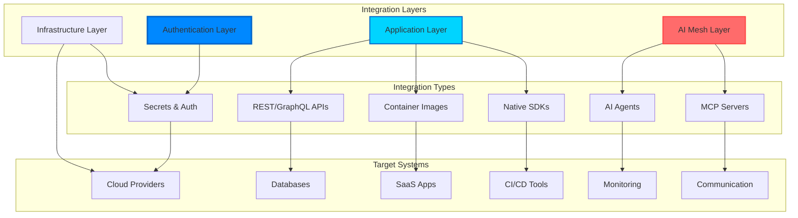

# Integrations

Kubiya provides a unified integration layer that seamlessly connects your infrastructure, applications, cloud services, and AI capabilities. This creates an intelligent automation mesh that spans both application and infrastructure layers.

## Integration Architecture



## Integration Management API

Kubiya provides a comprehensive API for managing integrations programmatically:

### Listing Available Integrations

```python
from kubiya_workflow_sdk import KubiyaClient

client = KubiyaClient(api_key="your-key")

# Get all available integrations
integrations = client.get_integrations()

for integration in integrations:
    print(f"Name: {integration['name']}")
    print(f"Type: {integration['type']}")
    print(f"Auth: {integration.get('auth_type', 'none')}")
    print(f"Status: {integration.get('status', 'active')}")
```

### Integration Types

Kubiya supports several integration categories:

<Tabs>
  <Tab title="Infrastructure">
    ```python
    # Cloud providers
    aws_integration = {
        "name": "aws-prod",
        "type": "cloud",
        "provider": "aws",
        "auth_type": "iam_role",
        "config": {
            "region": "us-east-1",
            "role_arn": "arn:aws:iam::123456789:role/kubiya-automation"
        }
    }
    
    # Kubernetes clusters
    k8s_integration = {
        "name": "prod-cluster",
        "type": "kubernetes",
        "auth_type": "service_account",
        "config": {
            "cluster_endpoint": "https://k8s.company.com",
            "namespace": "production"
        }
    }
    ```
  </Tab>
  
  <Tab title="Applications">
    ```python
    # SaaS applications
    github_integration = {
        "name": "github-org",
        "type": "vcs",
        "provider": "github",
        "auth_type": "oauth2",
        "config": {
            "org": "my-company",
            "scopes": ["repo", "workflow"]
        }
    }
    
    # Databases
    postgres_integration = {
        "name": "analytics-db",
        "type": "database",
        "provider": "postgresql",
        "auth_type": "credentials",
        "config": {
            "host": "db.internal.com",
            "port": 5432,
            "database": "analytics"
        }
    }
    ```
  </Tab>
  
  <Tab title="AI Services">
    ```python
    # LLM providers
    openai_integration = {
        "name": "openai-gpt4",
        "type": "ai",
        "provider": "openai",
        "auth_type": "api_key",
        "config": {
            "model": "gpt-4",
            "temperature": 0.7
        }
    }
    
    # Custom AI services
    ml_service_integration = {
        "name": "recommendation-engine",
        "type": "ai",
        "provider": "custom",
        "auth_type": "bearer_token",
        "config": {
            "endpoint": "https://ml.company.com/v1/predict"
        }
    }
    ```
  </Tab>
</Tabs>

## Authentication Scenarios

### 1. Multi-Account AWS IAM

For complex AWS environments with multiple accounts and varying credentials:

```python
from kubiya_workflow_sdk.dsl import workflow, step

def create_multi_account_aws_workflow():
    wf = workflow("multi-account-aws")
    
    # Step 1: Assume role in production account
    assume_prod = (
        step("assume-prod-role")
        .docker(
            image="amazon/aws-cli:latest",
            command="""
aws sts assume-role \
  --role-arn arn:aws:iam::111111111111:role/kubiya-prod \
  --role-session-name kubiya-automation \
  --output json
"""
        )
        .env(
            AWS_ACCESS_KEY_ID="${secrets.aws_master_key}",
            AWS_SECRET_ACCESS_KEY="${secrets.aws_master_secret}"
        )
        .output("PROD_CREDS")
    )
    
    # Step 2: Use production credentials
    deploy_prod = (
        step("deploy-to-prod")
        .docker(
            image="amazon/aws-cli:latest",
            content="""#!/bin/bash
# Parse credentials from previous step
export AWS_ACCESS_KEY_ID=$(echo $PROD_CREDS | jq -r '.Credentials.AccessKeyId')
export AWS_SECRET_ACCESS_KEY=$(echo $PROD_CREDS | jq -r '.Credentials.SecretAccessKey')
export AWS_SESSION_TOKEN=$(echo $PROD_CREDS | jq -r '.Credentials.SessionToken')

# Deploy using production credentials
aws ecs update-service --cluster prod --service app --force-new-deployment
"""
        )
        .env(PROD_CREDS="${PROD_CREDS}")
        .depends("assume-prod-role")
    )
    
    # Step 3: Assume role in staging account
    assume_staging = (
        step("assume-staging-role")
        .docker(
            image="amazon/aws-cli:latest",
            command="""
aws sts assume-role \
  --role-arn arn:aws:iam::222222222222:role/kubiya-staging \
  --role-session-name kubiya-automation
"""
        )
        .env(
            AWS_ACCESS_KEY_ID="${secrets.aws_master_key}",
            AWS_SECRET_ACCESS_KEY="${secrets.aws_master_secret}"
        )
        .output("STAGING_CREDS")
    )
    
    # Add steps to workflow
    wf.data["steps"].extend([
        assume_prod.to_dict(),
        deploy_prod.to_dict(),
        assume_staging.to_dict()
    ])
    
    return wf
```

### 2. OAuth2 User-Based Identity

For applications requiring user-specific authentication:

```python
from kubiya_workflow_sdk.dsl import workflow, step

def create_user_specific_github_workflow(user_email: str):
    wf = workflow("user-github-workflow")
    
    # Step 1: Get user's OAuth token from secure store
    get_token = (
        step("get-user-token")
        .docker(
            image="kubiya/secret-manager:latest",
            command=f"get-secret github_oauth_{user_email.replace('@', '_').replace('.', '_')}"
        )
        .output("USER_TOKEN")
    )
    
    # Step 2: Use user-specific token for operations
    create_pr = (
        step("create-pr")
        .docker(
            image="cli/cli:latest",  # GitHub CLI
            content="""#!/bin/bash
# Configure gh CLI with user token
echo "${USER_TOKEN}" | gh auth login --with-token

# Create PR as the specific user
gh pr create \
  --title "Automated update by ${USER_EMAIL}" \
  --body "This PR was created by Kubiya on behalf of ${USER_EMAIL}" \
  --base main \
  --head feature/auto-update
"""
        )
        .env(
            USER_TOKEN="${USER_TOKEN}",
            USER_EMAIL=user_email
        )
        .depends("get-user-token")
    )
    
    # Add steps to workflow
    wf.data["steps"].extend([
        get_token.to_dict(),
        create_pr.to_dict()
    ])
    
    return wf
```

### 3. Certificate-Based Authentication

For systems requiring mTLS or certificate authentication:

```python
from kubiya_workflow_sdk.dsl import workflow, step

def create_mtls_api_workflow():
    wf = workflow("mtls-api-workflow")
    
    # Step 1: Retrieve certificates from secure store
    get_certs = (
        step("get-certificates")
        .docker(
            image="kubiya/secret-manager:latest",
            command="retrieve-cert-bundle ${CERT_NAME}"
        )
        .env(CERT_NAME="api-client-cert")
        .output("CERT_BUNDLE")
    )
    
    # Step 2: Use certificates for API calls
    call_api = (
        step("call-secure-api")
        .docker(
            image="curlimages/curl:latest",
            content="""#!/bin/sh
# Extract certificates
echo "$CERT_BUNDLE" | jq -r '.cert' > /tmp/client.crt
echo "$CERT_BUNDLE" | jq -r '.key' > /tmp/client.key
echo "$CERT_BUNDLE" | jq -r '.ca' > /tmp/ca.crt

# Make authenticated API call
curl --cert /tmp/client.crt \
     --key /tmp/client.key \
     --cacert /tmp/ca.crt \
     https://secure-api.company.com/v1/data
"""
        )
        .env(CERT_BUNDLE="${CERT_BUNDLE}")
        .depends("get-certificates")
    )
    
    # Add steps to workflow
    wf.data["steps"].extend([
        get_certs.to_dict(),
        call_api.to_dict()
    ])
    
    return wf
```

## Using Integrations in Workflow Steps

### Accessing Secrets

Kubiya provides secure secret management integrated with your workflow steps:

```python
from kubiya_workflow_sdk.dsl import workflow, step

def create_secure_database_workflow():
    wf = workflow("secure-database")
    
    # Method 1: Direct secret reference
    query_db = (
        step("query-database")
        .docker(
            image="postgres:15",
            command="psql -c 'SELECT * FROM users LIMIT 10'"
        )
        .env(
            PGHOST="${secrets.db_host}",
            PGUSER="${secrets.db_user}",
            PGPASSWORD="${secrets.db_password}",
            PGDATABASE="${secrets.db_name}"
        )
    )
    
    # Method 2: Get secret as a step
    get_config = (
        step("get-db-config")
        .docker(
            image="kubiya/secret-manager:latest",
            command="get-secret production_database"
        )
        .output("DB_CONFIG")
    )
    
    # Use the retrieved secret
    process_data = (
        step("process-data")
        .docker(
            image="python:3.11",
            content="""#!/usr/bin/env python
import json
import os
import psycopg2

config = json.loads(os.environ['DB_CONFIG'])
conn = psycopg2.connect(**config)
# Process data...
"""
        )
        .env(DB_CONFIG="${DB_CONFIG}")
        .depends("get-db-config")
    )
    
    # Add steps to workflow
    wf.data["steps"].extend([
        query_db.to_dict(),
        get_config.to_dict(),
        process_data.to_dict()
    ])
    
    return wf
```

### Using Registered Integrations

Access pre-configured integrations in your workflows:

```python
from kubiya_workflow_sdk.dsl import workflow, step

def create_integration_workflow():
    wf = workflow("use-integrations")
    
    # Use AWS integration through AWS CLI
    aws_op = (
        step("aws-operation")
        .docker(
            image="amazon/aws-cli:latest",
            command="aws ecs update-service --cluster production --service api --force-new-deployment"
        )
        .env(
            AWS_ACCESS_KEY_ID="${aws.prod.access_key}",
            AWS_SECRET_ACCESS_KEY="${aws.prod.secret_key}",
            AWS_DEFAULT_REGION="${aws.prod.region}"
        )
    )
    
    # Use GitHub integration
    github_op = (
        step("github-operation")
        .docker(
            image="cli/cli:latest",
            command="""
gh issue create \
  --repo infrastructure \
  --title "Deployment completed" \
  --body "Production deployment finished at $(date)"
"""
        )
        .env(GH_TOKEN="${github.org.token}")
    )
    
    # Add steps to workflow
    wf.data["steps"].extend([
        aws_op.to_dict(),
        github_op.to_dict()
    ])
    
    return wf
```

## Application Layer Automation

Kubiya makes it easy to automate across your entire application stack:

### 1. API Integration Pattern

```python
from kubiya_workflow_sdk.dsl import workflow, step

def create_api_automation():
    wf = workflow("api-automation")
    
    # REST API automation
    rest_call = (
        step("call-api")
        .docker(
            image="curlimages/curl:latest",
            command="""
curl -X POST https://api.company.com/v1/users \
  -H "Authorization: Bearer ${API_TOKEN}" \
  -H "Content-Type: application/json" \
  -d '{"name": "New User", "role": "developer"}'
"""
        )
        .env(API_TOKEN="${secrets.api_token}")
        .output("API_RESPONSE")
    )
    
    # GraphQL automation
    graphql_call = (
        step("graphql-query")
        .docker(
            image="curlimages/curl:latest",
            command="""
curl -X POST https://api.company.com/graphql \
  -H "Authorization: Bearer ${API_TOKEN}" \
  -H "Content-Type: application/json" \
  -d '{
    "query": "mutation CreateProject($name: String!) { createProject(name: $name) { id name created_at } }",
    "variables": {"name": "New Project"}
  }'
"""
        )
        .env(API_TOKEN="${secrets.api_token}")
    )
    
    # Add steps to workflow
    wf.data["steps"].extend([
        rest_call.to_dict(),
        graphql_call.to_dict()
    ])
    
    return wf
```

### 2. Database Operations

```python
from kubiya_workflow_sdk.dsl import workflow, step

def create_database_automation():
    wf = workflow("database-automation")
    
    # Multi-database operations
    sync_dbs = (
        step("sync-databases")
        .docker(
            image="python:3.11",
            content="""#!/usr/bin/env python
import psycopg2
import pymongo
import redis
import os

# PostgreSQL operations
pg_conn = psycopg2.connect(
    host=os.environ['PG_HOST'],
    user=os.environ['PG_USER'],
    password=os.environ['PG_PASSWORD']
)

# MongoDB operations
mongo_client = pymongo.MongoClient(os.environ['MONGO_URI'])

# Redis operations
redis_client = redis.Redis(
    host=os.environ['REDIS_HOST'],
    password=os.environ['REDIS_PASSWORD']
)

# Sync data between systems
# ... your logic here ...
"""
        )
        .env(
            PG_HOST="${secrets.pg_host}",
            PG_USER="${secrets.pg_user}",
            PG_PASSWORD="${secrets.pg_password}",
            MONGO_URI="${secrets.mongo_uri}",
            REDIS_HOST="${secrets.redis_host}",
            REDIS_PASSWORD="${secrets.redis_password}"
        )
    )
    
    # Add step to workflow
    wf.data["steps"].append(sync_dbs.to_dict())
    
    return wf
```

### 3. SaaS Application Integration

```python
from kubiya_workflow_sdk.dsl import workflow, step

def create_saas_automation():
    wf = workflow("saas-automation")
    
    # Salesforce integration
    update_sf = (
        step("update-salesforce")
        .docker(
            image="salesforce/salesforcedx:latest",
            content="""#!/bin/bash
# Create key file
echo "${SALESFORCE_KEY}" > /tmp/server.key

# Authenticate
sfdx auth:jwt:grant \
  --clientid ${SALESFORCE_CLIENT_ID} \
  --jwtkeyfile /tmp/server.key \
  --username ${SALESFORCE_USERNAME} \
  --instanceurl ${SALESFORCE_INSTANCE_URL}

# Update records
sfdx data:record:update \
  --sobjecttype Account \
  --where "Industry='Technology'" \
  --values "Status='Active'"
"""
        )
        .env(
            SALESFORCE_CLIENT_ID="${secrets.sf_client_id}",
            SALESFORCE_USERNAME="${secrets.sf_username}",
            SALESFORCE_INSTANCE_URL="https://mycompany.my.salesforce.com",
            SALESFORCE_KEY="${secrets.sf_private_key}"
        )
    )
    
    # Add step to workflow
    wf.data["steps"].append(update_sf.to_dict())
    
    return wf
```

## Infrastructure Layer Automation

### 1. Multi-Cloud Infrastructure

```python
from kubiya_workflow_sdk.dsl import workflow, step

def create_multi_cloud_infrastructure():
    wf = workflow("multi-cloud-infrastructure")
    
    # AWS infrastructure
    provision_aws = (
        step("provision-aws")
        .docker(
            image="hashicorp/terraform:latest",
            content="""#!/bin/sh
terraform init -backend-config="bucket=${TF_STATE_BUCKET}"
terraform apply -auto-approve -var="environment=production"
"""
        )
        .env(
            AWS_ACCESS_KEY_ID="${secrets.aws_key}",
            AWS_SECRET_ACCESS_KEY="${secrets.aws_secret}",
            TF_STATE_BUCKET="company-terraform-state"
        )
    )
    
    # Google Cloud infrastructure
    provision_gcp = (
        step("provision-gcp")
        .docker(
            image="google/cloud-sdk:alpine",
            content="""#!/bin/sh
# Authenticate with service account
echo '${GCP_SERVICE_ACCOUNT_KEY}' | gcloud auth activate-service-account --key-file=-

# Deploy resources
gcloud deployment-manager deployments create prod-stack \
  --config=infrastructure.yaml
"""
        )
        .env(GCP_SERVICE_ACCOUNT_KEY="${secrets.gcp_service_account}")
    )
    
    # Azure infrastructure
    provision_azure = (
        step("provision-azure")
        .docker(
            image="mcr.microsoft.com/azure-cli:latest",
            content="""#!/bin/bash
# Login with service principal
az login --service-principal \
  -u ${AZURE_CLIENT_ID} \
  -p ${AZURE_CLIENT_SECRET} \
  --tenant ${AZURE_TENANT_ID}

# Deploy ARM template
az deployment group create \
  --resource-group production \
  --template-file template.json
"""
        )
        .env(
            AZURE_CLIENT_ID="${secrets.azure_client_id}",
            AZURE_CLIENT_SECRET="${secrets.azure_client_secret}",
            AZURE_TENANT_ID="${secrets.azure_tenant_id}"
        )
    )
    
    # Add steps to workflow
    wf.data["steps"].extend([
        provision_aws.to_dict(),
        provision_gcp.to_dict(),
        provision_azure.to_dict()
    ])
    
    return wf
```

### 2. Kubernetes Multi-Cluster Management

```python
from kubiya_workflow_sdk.dsl import workflow, step

def create_kubernetes_multi_cluster():
    wf = workflow("kubernetes-multi-cluster")
    
    clusters = ["prod-us-east", "prod-eu-west", "prod-ap-south"]
    
    for cluster in clusters:
        # Get cluster-specific credentials
        get_config = (
            step(f"get-{cluster}-config")
            .docker(
                image="kubiya/secret-manager:latest",
                command=f"get-secret kubeconfig_{cluster}"
            )
            .output(f"KUBECONFIG_{cluster.upper().replace('-', '_')}")
        )
        
        # Deploy to each cluster
        deploy = (
            step(f"deploy-{cluster}")
            .docker(
                image="bitnami/kubectl:latest",
                content=f"""#!/bin/sh
# Set up kubeconfig
echo "$KUBECONFIG" | base64 -d > /tmp/kubeconfig
export KUBECONFIG=/tmp/kubeconfig
"""
            )
        )
        
        # Add steps
        wf.data["steps"].extend([
            get_config.to_dict(),
            deploy.to_dict()
        ])
    
    return wf
```

## AI Mesh Integration

Kubiya's AI mesh allows intelligent orchestration across all layers:

### Intelligent Decision Making

```python
@workflow
def intelligent_operations():
    # Collect metrics from multiple sources
    metrics = step("collect-metrics").docker(
        image="python:3.11",
        script="""
        import requests
        
        # Collect from Prometheus
        prom_data = requests.get("http://prometheus:9090/api/v1/query",
            params={"query": "up"}).json()
        
        # Collect from CloudWatch
        # ... CloudWatch API calls ...
        
        # Collect from Datadog
        # ... Datadog API calls ...
        
        print(json.dumps({"prometheus": prom_data, ...}))
        """
    ).output("METRICS")
    
    # AI analyzes and decides
    decision = step("ai-analysis").inline_agent(
        message="""Analyze these metrics and determine:
        1. Are there any anomalies?
        2. Should we scale up/down?
        3. Any services need attention?
        
        Metrics: ${METRICS}
        """,
        agent_name="ops-analyst",
        ai_instructions="""You are an expert SRE. Analyze metrics for:
        - Performance anomalies
        - Capacity planning
        - Service health
        Provide specific, actionable recommendations.""",
        runners=["kubiya-hosted"],
        llm_model="gpt-4o"
    ).output("AI_DECISION")
    
    # Execute AI's recommendations
    step("execute-recommendations").docker(
        image="python:3.11",
        script="""
        import json
        
        decision = json.loads(os.environ['AI_DECISION'])
        
        for action in decision.get('actions', []):
            if action['type'] == 'scale':
                # Execute scaling
                subprocess.run([
                    'kubectl', 'scale', 
                    f"deployment/{action['target']}", 
                    f"--replicas={action['replicas']}"
                ])
            elif action['type'] == 'alert':
                # Send alert
                # ... alert logic ...
        """
    ).depends(["collect-metrics", "ai-analysis"])
```

## Integration Best Practices

### 1. **Credential Management**

<Warning>
  Never hardcode credentials in workflows. Always use Kubiya's secret management.
</Warning>

```python
# ❌ Bad: Hardcoded credentials
step("bad").env({"PASSWORD": "actual-password"})

# ✅ Good: Secret reference
step("good").env({"PASSWORD": "${secrets.db_password}"})

# ✅ Better: Get secret step with proper error handling
secret = step("get-secret").get_secret(
    secret_name="production_db",
    on_error="fail"  # or "continue" with default
).output("DB_SECRET")
```

### 2. **Integration Error Handling**

```python
@workflow
def resilient_integration():
    # Retry on integration failures
    step("api-call").http(
        url="https://flaky-api.com/endpoint",
        method="POST"
    ).retry(
        limit=3,
        interval_sec=30,
        exponential_base=2.0
    ).continue_on(
        failure=True,  # Continue workflow even if this fails
        mark_success=True  # Mark as success after retries
    )
```

### 3. **Integration Testing**

```python
@workflow
def test_integrations():
    # Test each integration
    integrations = ["aws-prod", "github-org", "postgres-main"]
    
    for integration in integrations:
        step(f"test-{integration}").integration(
            name=integration,
            action="test_connection"
        ).continue_on(failure=True)
        
    # Aggregate results
    step("report-status").inline_agent(
        message="Generate integration health report",
        runners=["kubiya-hosted"]
    )
```

### 4. **Cross-Layer Security**

```python
@workflow
def secure_cross_layer():
    # Application layer: Rotate API keys
    new_key = step("generate-api-key").docker(
        image="python:3.11",
        script="import secrets; print(secrets.token_urlsafe(32))"
    ).output("NEW_KEY")
    
    # Infrastructure layer: Update secret in vault
    step("update-vault").docker(
        image="vault:latest",
        command="vault kv put secret/api key=${NEW_KEY}",
        env={"VAULT_TOKEN": "${secrets.vault_token}"}
    )
    
    # Application layer: Update running services
    step("rolling-update").docker(
        image="kubectl:latest",
        command="kubectl set env deployment/api API_KEY=${NEW_KEY}"
    )
```

## Next Steps

<CardGroup cols={2}>
  <Card title="Platform Overview" icon="key" href="/concepts/platform-overview">
    Learn about the platform architecture
  </Card>
  <Card title="Workflow Examples" icon="code" href="/workflows/examples">
    See integration patterns in action
  </Card>
  <Card title="API Reference" icon="book" href="/api-reference/compose">
    Complete API documentation
  </Card>
  <Card title="Deployment Guide" icon="shield" href="/deployment/helm-chart">
    Deploy secure integrations
  </Card>
</CardGroup> 