# Platform Overview: From Agent Chaos to Workflow Clarity

Kubiya is a revolutionary platform that bridges the gap between AI capabilities and production reliability. Unlike agent frameworks that let AI run wild, Kubiya puts you **on rails to production** with deterministic, containerized workflows.

## The Rails Approach to AI Automation

```mermaid
graph TD
    subgraph "Traditional Agent Frameworks"
        CHAOS[🌪️ Agent Chaos]
        A1[Unpredictable Paths]
        A2[State Management Hell]
        A3[Debug Nightmares]
        A4[Production Failures]
        
        CHAOS --> A1
        CHAOS --> A2
        CHAOS --> A3
        A1 --> A4
        A2 --> A4
        A3 --> A4
    end
    
    subgraph "Kubiya: On Rails"
        RAILS[🚄 On Rails to Production]
        K1[Natural Language Input]
        K2[Deterministic Workflows]
        K3[Container Isolation]
        K4[Production Success]
        
        RAILS --> K1
        K1 --> K2
        K2 --> K3
        K3 --> K4
    end
    
    style CHAOS fill:#FF5252,stroke:#333,stroke-width:3px,color:#fff
    style A4 fill:#D32F2F,stroke:#333,stroke-width:2px,color:#fff
    
    style RAILS fill:#4CAF50,stroke:#333,stroke-width:3px,color:#fff
    style K4 fill:#2E7D32,stroke:#333,stroke-width:2px,color:#fff
```



## Why "On Rails"?

Just like Ruby on Rails revolutionized web development by providing conventions and structure, Kubiya revolutionizes AI automation by providing:

- **Convention over Configuration**: Sensible defaults for production workflows
- **Guardrails for Safety**: AI generates workflows within safe boundaries
- **Predictable Patterns**: Same input → Same workflow → Same result
- **Clear Path to Production**: From idea to deployed automation in minutes

## Core Architecture


## Key Components

### 1. **ADK (Agent Development Kit)**
The intelligent orchestration layer that understands natural language and generates deterministic workflows.

<Card title="🤖 AI-Powered Generation" icon="robot">
  ADK translates your intent into structured workflows, not unpredictable agent chains
</Card>

### 2. **Workflow Engine**
Executes workflows as directed acyclic graphs (DAGs) with each step running in isolated containers.

<Card title="🚄 Deterministic Execution" icon="train">
  Every execution follows the same path - no surprises, no agent wandering
</Card>

### 3. **Container Runtime**
Every workflow step runs in its own Docker container with complete isolation.

<Card title="🐳 Universal Compatibility" icon="docker">
  Run any language, tool, or software - from Python to Go to Terraform
</Card>

### 4. **Runners**
Deploy runners on your infrastructure (Kubernetes, Docker, local) to execute workflows where your data lives.

<Card title="🏃 Run Anywhere" icon="running">
  Your infrastructure, your control, your security boundaries
</Card>

## From Chaos to Clarity

### The Agent Framework Problem

```mermaid
graph LR
    subgraph "Agent Frameworks Journey"
        START[Start Task]
        
        A1[Agent Thinks]
        A2[Agent Acts]
        A3[Something Breaks]
        A4[Agent Retries]
        A5[Different Path]
        A6[Lost Context]
        A7[Manual Intervention]
        
        START --> A1
        A1 --> A2
        A2 --> A3
        A3 --> A4
        A4 --> A5
        A5 --> A6
        A6 --> A7
        
        A2 -.->|"Maybe?"| SUCCESS[Success?]
        A5 -.->|"Unlikely"| SUCCESS
        A7 --> FAILURE[😭 Production Down]
    end
    
    style A3 fill:#FF5252,stroke:#333,stroke-width:2px
    style A6 fill:#FF5252,stroke:#333,stroke-width:2px
    style FAILURE fill:#D32F2F,stroke:#333,stroke-width:3px,color:#fff
```



### The Kubiya Solution

```mermaid
graph LR
    subgraph "Kubiya Rails Journey"
        START[Define Goal]
        
        K1[ADK Generates Workflow]
        K2[Review & Validate]
        K3[Execute Step 1]
        K4[Execute Step 2]
        K5[Execute Step N]
        K6[Complete]
        
        START --> K1
        K1 --> K2
        K2 --> K3
        K3 --> K4
        K4 --> K5
        K5 --> K6
        
        K6 --> SUCCESS[✅ Predictable Success]
    end
    
    style K1 fill:#9C27B0,stroke:#333,stroke-width:2px,color:#fff
    style K3 fill:#4CAF50,stroke:#333,stroke-width:2px
    style K4 fill:#4CAF50,stroke:#333,stroke-width:2px
    style K5 fill:#4CAF50,stroke:#333,stroke-width:2px
    style SUCCESS fill:#2E7D32,stroke:#333,stroke-width:3px,color:#fff
```



## Platform Capabilities

### Natural Language to Workflow

Transform requirements into production-ready workflows:

```python
# Simple request
workflow = KubiyaWorkflow.from_prompt(
    "Deploy my Node.js app to Kubernetes with health checks",
    runner="kubiya-hosted"
)

# ADK generates complete workflow with:
# - Build steps
# - Test execution
# - Kubernetes deployment
# - Health monitoring
```

### Multi-Language Support

```mermaid
graph TD
    subgraph "One Workflow, Many Languages"
        W[Workflow Definition]
        
        S1["🐍 Python Step<br/>Data Analysis"]
        S2["🟨 JavaScript Step<br/>API Calls"]
        S3["🐹 Go Step<br/>Performance Tasks"]
        S4["🦀 Rust Step<br/>System Operations"]
        S5["☸️ Kubectl Step<br/>Deployments"]
        
        W --> S1
        W --> S2
        W --> S3
        W --> S4
        W --> S5
    end
    
    style S1 fill:#3776AB,stroke:#333,stroke-width:2px,color:#fff
    style S2 fill:#F7DF1E,stroke:#333,stroke-width:2px
    style S3 fill:#00ADD8,stroke:#333,stroke-width:2px,color:#fff
    style S4 fill:#CE422B,stroke:#333,stroke-width:2px,color:#fff
    style S5 fill:#326CE5,stroke:#333,stroke-width:2px,color:#fff
```



### Enterprise-Grade Features

<CardGroup cols={2}>
  <Card title="🔒 Security First" icon="shield">
    - Container isolation
    - No infrastructure access required
    - Audit trails for compliance
    - Secrets management
  </Card>
  
  <Card title="📈 Scalability" icon="chart-line">
    - Serverless execution
    - Auto-scaling runners
    - Parallel step execution
    - Resource optimization
  </Card>
  
  <Card title="🔍 Observability" icon="magnifying-glass">
    - Real-time execution logs
    - Step-by-step visibility
    - Performance metrics
    - Error tracking
  </Card>
  
  <Card title="🔄 Reliability" icon="arrows-rotate">
    - Automatic retries
    - Error handling
    - Rollback capabilities
    - Health checks
  </Card>
</CardGroup>

## Integration Ecosystem


## Use Cases

### DevOps Automation
- CI/CD pipelines
- Infrastructure provisioning
- Deployment automation
- Incident response

### Data Engineering
- ETL pipelines
- Data quality checks
- Report generation
- Analytics workflows

### AI/ML Operations
- Model training pipelines
- Data preprocessing
- Model deployment
- A/B testing

### Business Automation
- Report generation
- Data synchronization
- Notification workflows
- Approval processes

## The Rails Philosophy

<Note>
  **"Convention over Configuration"**: Kubiya provides sensible defaults and patterns that guide you toward production success, just like Rails did for web development.
</Note>

### Rails Principles Applied to AI Automation

1. **DRY (Don't Repeat Yourself)**
   - Reusable workflow templates
   - Shared tool definitions
   - Component libraries

2. **Convention over Configuration**
   - Standard workflow patterns
   - Default retry strategies
   - Built-in error handling

3. **Explicit is Better than Implicit**
   - Clear workflow definitions
   - Visible execution paths
   - Transparent logging

4. **Fast Development, Reliable Deployment**
   - Quick prototyping with AI
   - Production-ready from day one
   - No rewrite needed

## Getting Started

<Steps>
  <Step title="Install SDK">
    ```bash
    pip install kubiya-workflow-sdk
    ```
  </Step>
  
  <Step title="Generate First Workflow">
    ```python
    from kubiya_workflow_sdk import KubiyaWorkflow
    
    workflow = KubiyaWorkflow.from_prompt(
        "Create a backup of my PostgreSQL database",
        runner="kubiya-hosted"
    )
    ```
  </Step>
  
  <Step title="Review and Execute">
    ```python
    # See what will run
    print(workflow.to_yaml())
    
    # Execute with confidence
    result = workflow.execute()
    ```
  </Step>
</Steps>

## Why Choose Kubiya?

<ComparisonTable>
  <Row>
    <Cell>Feature</Cell>
    <Cell>Agent Frameworks</Cell>
    <Cell>Traditional Orchestrators</Cell>
    <Cell>Kubiya</Cell>
  </Row>
  <Row>
    <Cell>AI Integration</Cell>
    <Cell>✅ Deep but chaotic</Cell>
    <Cell>❌ Manual only</Cell>
    <Cell>✅ AI-generated, deterministic</Cell>
  </Row>
  <Row>
    <Cell>Production Ready</Cell>
    <Cell>❌ Experimental</Cell>
    <Cell>✅ Yes, but complex</Cell>
    <Cell>✅ Built for production</Cell>
  </Row>
  <Row>
    <Cell>Debugging</Cell>
    <Cell>❌ Nearly impossible</Cell>
    <Cell>⚠️ Depends on setup</Cell>
    <Cell>✅ Full visibility</Cell>
  </Row>
  <Row>
    <Cell>Language Support</Cell>
    <Cell>⚠️ Limited by framework</Cell>
    <Cell>⚠️ Often Python-only</Cell>
    <Cell>✅ Any language/tool</Cell>
  </Row>
  <Row>
    <Cell>Setup Time</Cell>
    <Cell>Days/Weeks</Cell>
    <Cell>Days/Weeks</Cell>
    <Cell>Minutes</Cell>
  </Row>
</ComparisonTable>

## Next Steps

<CardGroup cols={2}>
  <Card title="Compare with Agent Frameworks" icon="robot" href="/concepts/agent-frameworks-comparison">
    See how Kubiya puts agent chaos on rails
  </Card>
  
  <Card title="Quick Start Guide" icon="rocket" href="/getting-started/quickstart">
    Build your first workflow in 5 minutes
  </Card>
  
  <Card title="Workflow Architecture" icon="sitemap" href="/workflows/architecture">
    Deep dive into containerized execution
  </Card>
  
  <Card title="Why Kubiya?" icon="shield-check" href="/concepts/why-kubiya">
    Understand our security-first approach
  </Card>
</CardGroup>

## Join the Movement

Move from agent chaos to workflow clarity. Join thousands of engineers who've discovered the rails approach to AI automation.

<Card title="Start Building Today" icon="hammer" href="https://app.kubiya.ai">
  Get your API key and put your automation on rails
</Card> 