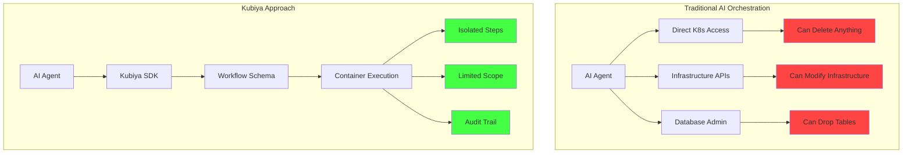

# Why Kubiya: The Safe Path to AI Automation

## The Problem with Traditional AI Orchestration

Most AI orchestration systems require dangerous levels of infrastructure access:

<Warning>
  **Traditional AI Systems Require:**
  - 🔓 Root access to Kubernetes clusters
  - 🔓 Ability to modify any resource
  - 🔓 Direct infrastructure manipulation
  - 🔓 Complex MCP server setups
  - 🔓 God-mode permissions
</Warning>

This creates massive security risks and operational complexity.

## Kubiya's Application-Layer Approach

Kubiya operates **exclusively at the application layer**, providing AI orchestration without infrastructure risk:



## Key Differences

### 1. **No Infrastructure Access**

<Tabs>
  <Tab title="Traditional Systems">
    ```yaml
    # Requires cluster-admin role
    apiVersion: rbac.authorization.k8s.io/v1
    kind: ClusterRoleBinding
    metadata:
      name: ai-agent-god-mode
    roleRef:
      apiGroup: rbac.authorization.k8s.io
      kind: ClusterRole
      name: cluster-admin  # 😱 FULL ACCESS
    subjects:
    - kind: ServiceAccount
      name: ai-agent
    ```
  </Tab>
  
  <Tab title="Kubiya">
    ```python
    # Only defines what to run, not how
    workflow("safe-deployment")
    .step("deploy")
    .docker(
        image="kubectl:latest",
        command="kubectl apply -f app.yaml"
        # Runs in isolated container
        # No cluster access from SDK
    )
    ```
  </Tab>
</Tabs>

### 2. **Deterministic Execution**

**Traditional Multi-Agent Systems:**
- Unpredictable execution paths
- State accumulation between steps
- Difficult to debug or reproduce
- "Garbage in, garbage out" compounding

**Kubiya Workflows:**
- Same input → Same execution path → Same output
- Each step starts fresh (containerized)
- Complete execution visibility
- Easy to test and debug

### 3. **Simple Integration**

<ComparisonTable>
  <Row>
    <Cell>Feature</Cell>
    <Cell>Traditional AI Systems</Cell>
    <Cell>Kubiya</Cell>
  </Row>
  <Row>
    <Cell>Setup Time</Cell>
    <Cell>Days/Weeks (MCP servers, permissions)</Cell>
    <Cell>Minutes (just API key)</Cell>
  </Row>
  <Row>
    <Cell>Integration</Cell>
    <Cell>Complex MCP protocol implementation</Cell>
    <Cell>Simple REST API or SDK</Cell>
  </Row>
  <Row>
    <Cell>Security Model</Cell>
    <Cell>Grant extensive permissions</Cell>
    <Cell>Application-layer only</Cell>
  </Row>
  <Row>
    <Cell>Debugging</Cell>
    <Cell>Trace through agent decisions</Cell>
    <Cell>Clear workflow steps</Cell>
  </Row>
</ComparisonTable>

## Real-World Example

### Deploying with Traditional AI Systems

```python
# Traditional approach - AI has direct infrastructure access
agent = ProductionAgent(
    k8s_config="/root/.kube/config",  # Full cluster access
    aws_credentials=admin_creds,       # Admin AWS access
    github_token=admin_token          # Repo admin access
)

# AI can do ANYTHING - including mistakes
agent.execute("Deploy the new version")
# Risk: Could delete production, modify infrastructure, 
# access secrets, change permissions...
```

### Deploying with Kubiya

```python
# Kubiya approach - AI generates safe workflows
workflow = KubiyaWorkflow.from_prompt(
    "Deploy version 2.0 of my-app to production",
    runner="kubiya-hosted"
)

# AI generates deterministic workflow:
# 1. Run tests in container
# 2. Build in container  
# 3. Deploy via kubectl in container
# 4. Health check in container

# Each step is isolated, audited, and safe
result = workflow.execute()
```

## Why This Matters

### 1. **Security First**

- **No God Mode**: AI can't accidentally delete your database
- **Isolated Execution**: Each step runs in its own container
- **Audit Everything**: Complete trail of what was executed
- **Limited Blast Radius**: Failures are contained

### 2. **Operational Simplicity**

```python
# This is all you need - no complex setup
client = KubiyaClient(api_key="your-key")

# Generate workflows with AI
workflow = client.generate_workflow(
    "Create a CI/CD pipeline for my Node.js app"
)

# Execute safely
result = client.execute_workflow(workflow)
```

### 3. **True Serverless**

- **No Infrastructure Management**: We handle the compute
- **Pay Per Execution**: Not for idle agents
- **Infinite Scale**: From 1 to 1M executions
- **Zero Maintenance**: No MCP servers to maintain

## The ADK Advantage

ADK (Agent Development Kit) provides intelligent orchestration while maintaining safety:

```python
from kubiya_workflow_sdk.providers import get_provider

# ADK operates at application layer
adk = get_provider("adk")

# Generate complex workflows safely
result = await adk.compose(
    task="""Create a workflow that:
    1. Monitors application health
    2. Scales based on load
    3. Manages deployments
    4. Handles incidents""",
    mode="plan"
)

# AI generates workflow schema, not infrastructure commands
# Every action is explicit, auditable, and safe
```

## Common Concerns Addressed

<AccordionGroup>
  <Accordion title="But I need infrastructure access!" icon="server">
    You don't! Kubiya workflows can run ANY Docker container, including:
    - kubectl for Kubernetes operations
    - terraform for infrastructure
    - aws-cli for cloud resources
    - ansible for configuration
    
    The key is these run in **isolated containers**, not with god-mode access.
  </Accordion>
  
  <Accordion title="How do I debug AI-generated workflows?" icon="bug">
    Unlike black-box agents, Kubiya workflows are transparent:
    
    ```python
    # See exactly what will run
    print(workflow.to_yaml())
    
    # Test with dry-run
    client.execute_workflow(workflow, dry_run=True)
    
    # Full execution logs
    for event in client.stream_execution(exec_id):
        print(f"{event.step}: {event.output}")
    ```
  </Accordion>
  
  <Accordion title="What about complex orchestration?" icon="diagram-project">
    Kubiya supports advanced patterns while maintaining safety:
    
    - Parallel execution
    - Conditional logic  
    - Retries and error handling
    - Sub-workflows
    - Human-in-the-loop approvals
    
    All without infrastructure access!
  </Accordion>
</AccordionGroup>

## Migration Path

Moving from traditional AI orchestration to Kubiya:

<Steps>
  <Step title="Audit Current Permissions">
    List all the infrastructure access your AI agents currently have
  </Step>
  
  <Step title="Convert to Workflows">
    Transform agent actions into explicit workflow steps:
    ```python
    # Instead of: agent.scale_deployment(...)
    workflow.step("scale").docker(
        image="kubectl:latest",
        command="kubectl scale deployment/app --replicas=5"
    )
    ```
  </Step>
  
  <Step title="Test in Isolation">
    Run workflows in staging with limited permissions
  </Step>
  
  <Step title="Remove Infrastructure Access">
    Revoke god-mode permissions from AI systems
  </Step>
</Steps>

## The Bottom Line

<Card title="🚀 Choose Kubiya For" icon="check">
  - **Security**: No infrastructure god-mode required
  - **Simplicity**: No complex MCP servers or permissions
  - **Reliability**: Deterministic, debuggable workflows
  - **Scale**: True serverless execution
  - **Speed**: Deploy in minutes, not weeks
</Card>

<Card title="❌ Avoid Traditional AI Orchestration If" icon="xmark" color="red">
  - You care about security (you should!)
  - You want predictable, reliable automation
  - You need to debug and audit executions
  - You don't want to maintain complex infrastructure
  - You value your weekends
</Card>

## Start Safe Today

```bash
# Install Kubiya SDK
pip install kubiya-workflow-sdk

# Set your API key
export KUBIYA_API_KEY="your-key"

# Generate your first workflow with AI
python -c "
from kubiya_workflow_sdk import KubiyaWorkflow
wf = KubiyaWorkflow.from_prompt('Deploy my app safely')
print(wf.execute())
"
```

No cluster admin. No god mode. No risk. Just safe, deterministic AI automation.

<Note>
  **Remember**: The best AI orchestration system is one that enhances your capabilities without compromising your infrastructure security. Kubiya puts you on rails to success, not on a collision course with disaster.
</Note> 