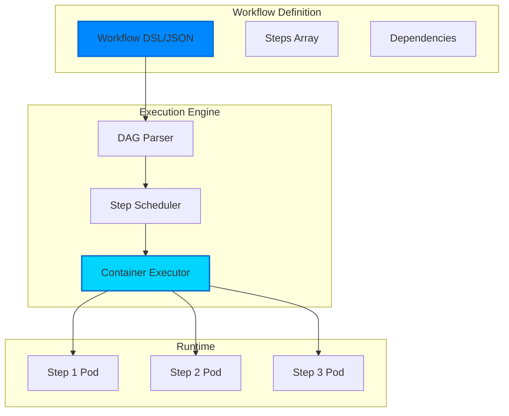
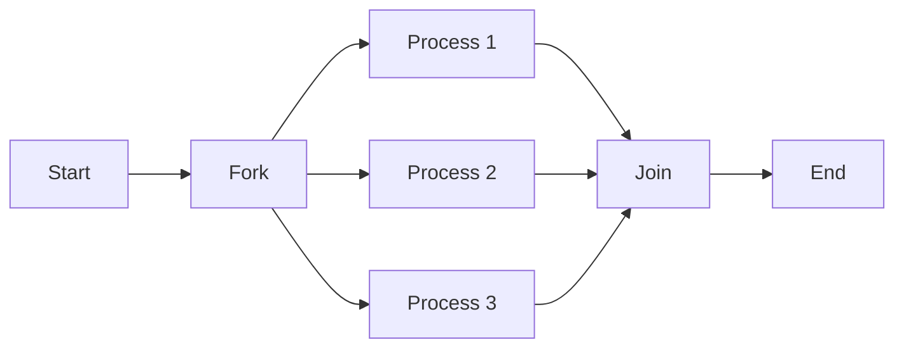
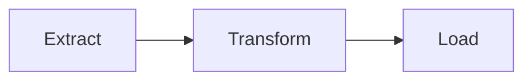
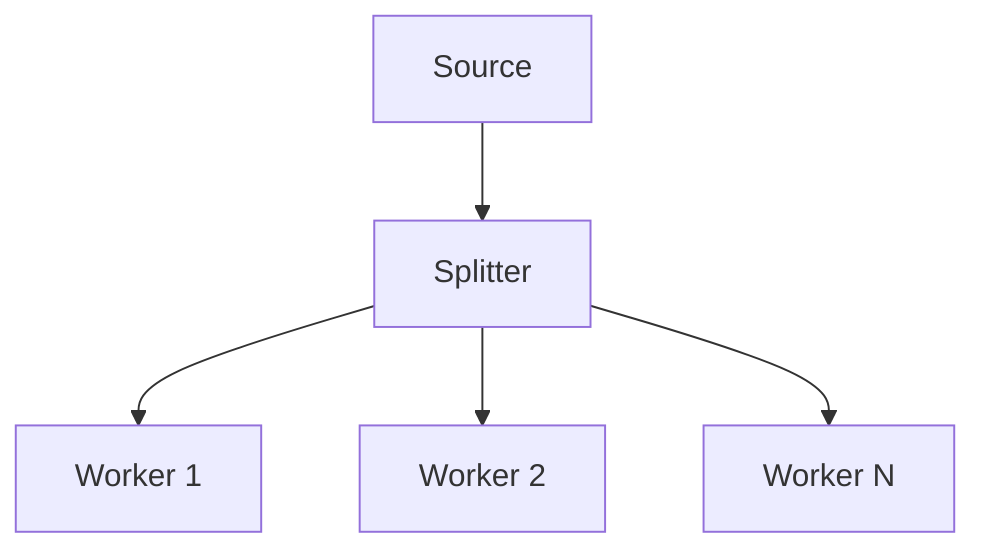

# Workflows

Workflows are the heart of Kubiya - they define sequences of containerized tasks that execute reliably on your infrastructure. Built on the concept of Directed Acyclic Graphs (DAGs), workflows provide deterministic execution with full observability.

<Note>
  **Key Insight**: Every workflow step runs as an independent Docker container. This means you can use ANY language, tool, or software - not just Python. Each execution starts fresh with zero state pollution.
</Note>

## What is a Workflow?

A workflow in Kubiya is:
- A **DAG** (Directed Acyclic Graph) of steps
- Each step runs in its own **Docker container** (serverless execution)
- **Language agnostic** - use Python, Node.js, Go, Rust, or any tool
- Steps can have **dependencies** on other steps
- Execution is **deterministic** and **reproducible**
- Fully **observable** with logs and metrics
- **Stateless** - no pollution between executions

## 🐳 The Container Revolution

Unlike traditional workflow engines that run scripts in a shared Python environment, Kubiya executes every step as a serverless container:

```python
from kubiya_workflow_sdk.dsl import workflow, step

# This workflow uses multiple languages and tools
wf = workflow("multi-language-pipeline")

# Extract with Python
wf.step("extract", command="python", script="""
import pandas as pd
df = pd.read_csv('data.csv')
df.to_json('data.json')
""")

# Transform with Node.js
wf.step("transform", command="node", script="""
const data = require('./data.json');
// Node.js processing
console.log('Processed', data.length, 'records');
""")

# Analyze with R
wf.step("analyze", command="Rscript", script="""
library(ggplot2)
# R statistical analysis
data <- read.csv('data.csv')
summary(data)
""")

# Deploy with Terraform
wf.step("deploy", "terraform apply -auto-approve")
```

## Workflow Architecture



## Core Concepts

### Steps

The atomic unit of work in a workflow:

```python
from kubiya_workflow_sdk.dsl import step

# Simple command step
simple = step("hello", "echo 'Hello World'")

# Step with custom Docker image
process = (
    step("process-data")
    .docker(
        image="python:3.11",
        command="python process.py"
    )
)

# Step with resource limits
heavy = (
    step("heavy-compute")
    .docker(
        image="compute:latest",
        command="./run-analysis.sh"
    )
    # Note: Resources are typically configured at the runner level
)
```

### Dependencies

Steps can depend on other steps, creating the DAG:

```python
from kubiya_workflow_sdk.dsl import workflow, step

# Create workflow
wf = workflow("data-pipeline")

# Step 1: Extract
extract = step("extract", "python extract.py")

# Step 2: Transform (depends on extract)
transform = (
    step("transform", "python transform.py")
    .depends("extract")
)

# Step 3: Load (depends on transform)
load = (
    step("load", "python load.py")
    .depends("transform")
)

# Add steps to workflow
wf.data["steps"].extend([
    extract.to_dict(),
    transform.to_dict(),
    load.to_dict()
])
```

### Parallel Execution

Steps without dependencies run in parallel:

```python
from kubiya_workflow_sdk.dsl import workflow, step

# Create workflow
wf = workflow("parallel-processing")

# These run simultaneously
data1 = step("fetch-source1", "wget https://api1.example.com/data")
data2 = step("fetch-source2", "wget https://api2.example.com/data")
data3 = step("fetch-source3", "wget https://api3.example.com/data")

# This waits for all three
merge = (
    step("merge-data", "python merge.py")
    .depends(["fetch-source1", "fetch-source2", "fetch-source3"])
)

# Add all steps
wf.data["steps"].extend([
    data1.to_dict(),
    data2.to_dict(),
    data3.to_dict(),
    merge.to_dict()
])
```

## Workflow Formats

### Python DSL

The recommended way to define workflows:

```python
from kubiya_workflow_sdk.dsl import workflow, step

def create_deployment_workflow(environment="staging", version=None):
    """Deploy application with health checks"""
    
    # Create workflow
    wf = (
        workflow("deploy-application")
        .description("Deploy application with health checks")
        .params(
            ENVIRONMENT="${ENVIRONMENT:-staging}",
            VERSION="${VERSION}"  # Required at runtime
        )
    )
    
    # Build step
    build = (
        step("build")
        .docker(
            image="docker:latest",
            command=f"docker build -t app:${{VERSION}} ."
        )
        .retry(limit=3)
    )
    
    # Test step
    test = (
        step("test")
        .docker(
            image="app:${VERSION}",
            command="pytest tests/"
        )
        .depends("build")
        .timeout(600)  # 10 minutes
    )
    
    # Deploy step
    deploy = (
        step("deploy")
        .docker(
            image="bitnami/kubectl:latest",
            command="kubectl apply -f deploy/${ENVIRONMENT}.yaml"
        )
        .depends("test")
        # Use preconditions for conditional execution
        .preconditions("${ENVIRONMENT} != 'production' || ${APPROVED} == 'true'")
    )
    
    # Health check
    health = (
        step("health-check")
        .docker(
            image="curlimages/curl:latest",
            command="curl -f http://app/health"
        )
        .depends("deploy")
        .retry(limit=5, interval_sec=30)
    )
    
    # Add all steps
    wf.data["steps"].extend([
        build.to_dict(),
        test.to_dict(),
        deploy.to_dict(),
        health.to_dict()
    ])
    
    return wf
```

### JSON Format

For programmatic generation or storage:

```json
{
  "name": "deploy-application",
  "description": "Deploy application with health checks",
  "params": {
    "environment": {"default": "staging"},
    "version": {"required": true}
  },
  "steps": [
    {
      "name": "build",
      "image": "docker:latest",
      "command": "docker build -t app:${version} .",
      "retry": {"limit": 3}
    },
    {
      "name": "test",
      "image": "app:${version}",
      "command": "pytest tests/",
      "depends_on": ["build"],
      "timeout": "10m"
    },
    {
      "name": "deploy",
      "image": "kubectl:latest",
      "command": "kubectl apply -f deploy/${environment}.yaml",
      "depends_on": ["test"],
      "approval_required": "${environment == 'production'}"
    }
  ]
}
```

## Execution Model

### 1. Submission
When you submit a workflow:
- Workflow is validated for syntax and circular dependencies
- DAG is constructed from step dependencies
- Workflow is stored with a unique execution ID

### 2. Scheduling
The scheduler:
- Identifies steps ready to run (no pending dependencies)
- Allocates resources based on step requirements
- Queues steps for execution on available runners

### 3. Execution
For each step:
- Runner creates a Kubernetes pod
- Container image is pulled (with caching)
- Command is executed in the container
- Logs are streamed in real-time
- Exit code determines success/failure

### 4. State Management
Throughout execution:
- Step states: pending → running → success/failed
- Workflow state reflects overall progress
- State is persisted for durability
- Failures trigger retry logic if configured

## Advanced Features

### Conditional Execution

Execute steps based on conditions:

```python
from kubiya_workflow_sdk.dsl import workflow, step

# Create conditional deployment workflow
wf = workflow("conditional-deployment")

# Run tests
test = (
    step("run-tests")
    .docker(image="python:3.11", command="pytest")
    .output("TEST_RESULT")
)

# Deploy only if tests pass
deploy = (
    step("deploy")
    .docker(image="bitnami/kubectl:latest", command="kubectl apply -f app.yaml")
    .depends("run-tests")
    .preconditions("${TEST_RESULT.exit_code} == 0")
)

# Notify regardless
notify = (
    step("notify")
    .docker(image="curlimages/curl:latest", command="""
curl -X POST https://api.slack.com/webhook \
  -d '{"text": "Deployment status: ${TEST_RESULT.exit_code}"}'
""")
    .depends("run-tests")
)

# Add steps
wf.data["steps"].extend([
    test.to_dict(),
    deploy.to_dict(),
    notify.to_dict()
])
```

### Loops and Iteration

Process lists of items:

```python
from kubiya_workflow_sdk.dsl import workflow

# Create batch processing workflow
wf = workflow("batch-processing")

# Use parallel_steps for processing multiple items
wf.parallel_steps(
    "process-files",
    items=["file1.csv", "file2.csv", "file3.csv"],
    command="python process.py ${ITEM}",
    max_concurrent=2
)

# Or create individual steps dynamically
files = ["report1.pdf", "report2.pdf", "report3.pdf"]
for file in files:
    wf.step(
        f"process-{file.replace('.', '-')}",
        f"python analyze.py {file}"
    )
```

### Error Handling

Robust error handling and recovery:

```python
from kubiya_workflow_sdk.dsl import workflow, step

# Create fault-tolerant pipeline
wf = workflow("fault-tolerant-pipeline")

# Step with retries
fetch = (
    step("fetch-data")
    .docker(image="alpine:latest", command="wget https://api.example.com/data")
    .retry(
        limit=3,
        interval_sec=30,
        exponential_base=2.0  # Exponential backoff
    )
)

# Primary processor
process = (
    step("primary-processor")
    .docker(image="processor:v2", command="python process.py")
    .depends("fetch-data")
    .continue_on(exit_code=[1])  # Continue even if exit code is 1
)

# Fallback processor
fallback = (
    step("fallback-processor")
    .docker(image="processor:v1", command="python process_legacy.py")
    .depends("primary-processor")
    .preconditions("${primary-processor.exit_code} != 0")
)

# Cleanup always runs
cleanup = (
    step("cleanup")
    .docker(image="alpine:latest", command="rm -rf /tmp/workspace/*")
    .depends(["primary-processor", "fallback-processor"])
    .continue_on(failure=True)  # Always run
)

# Add steps
wf.data["steps"].extend([
    fetch.to_dict(),
    process.to_dict(),
    fallback.to_dict(),
    cleanup.to_dict()
])
```

### Resource Management

Fine-grained resource control:

```python
from kubiya_workflow_sdk.dsl import workflow, step

# Create resource-aware pipeline
wf = workflow("resource-aware-pipeline")

# CPU-intensive step
cpu_task = (
    step("cpu-task")
    .docker(
        image="cpu-heavy:latest",
        command="./run-analysis.sh"
    )
    # Note: Resource requests are typically configured at the runner level
    # or through workflow metadata, not directly on steps
)

# GPU-accelerated step
ml_training = (
    step("ml-training")
    .docker(
        image="tensorflow/tensorflow:latest-gpu",
        command="python train_model.py"
    )
    # GPU allocation is handled by the runner configuration
)

# Batch job
batch = (
    step("batch-job")
    .docker(
        image="batch:latest",
        command="./process-batch.sh"
    )
    # Node selection is configured at the runner/platform level
)

# Add steps
wf.data["steps"].extend([
    cpu_task.to_dict(),
    ml_training.to_dict(),
    batch.to_dict()
])
```

## Workflow Patterns

### Fork-Join Pattern


### Pipeline Pattern


### Fan-Out Pattern


## Monitoring & Observability

### Real-Time Logs
Stream logs from any step:
```python
client = Client()
for event in client.stream_logs(execution_id, step_name):
    print(event.message)
```

### Metrics
Track workflow performance:
- Execution duration
- Step success/failure rates
- Resource utilization
- Queue wait times

### Tracing
Distributed tracing support:
- OpenTelemetry integration
- Trace across workflows
- Identify bottlenecks

## Best Practices

### 1. Keep Steps Atomic
Each step should do one thing well:
```python
from kubiya_workflow_sdk.dsl import workflow

wf = workflow("good-practice")

# Good: Atomic steps
wf.step("download-data", "wget https://example.com/data.csv")
wf.step("validate-data", "python validate.py data.csv")
wf.step("process-data", "python process.py data.csv")

# Bad: Don't create monolithic steps
# wf.step("do-everything", "python download_validate_and_process.py")
```

### 2. Use Appropriate Images
Choose minimal, purpose-built images:
```python
from kubiya_workflow_sdk.dsl import step

# Good: Specific, minimal images
python_step = step("run-python").docker(
    image="python:3.11-slim",
    command="python script.py"
)

kubectl_step = step("run-kubectl").docker(
    image="bitnami/kubectl:latest",
    command="kubectl get pods"
)

# Bad: Avoid heavy, general images
# bad_step = step("run-python").docker(
#     image="ubuntu:latest",  # Too heavy for just Python
#     command="python script.py"
# )
```

### 3. Handle Failures Gracefully
Always plan for failure:
```python
from kubiya_workflow_sdk.dsl import step

# Add retries for network operations
api_call = (
    step("api-call")
    .docker(image="curlimages/curl", command="curl https://api.example.com")
    .retry(limit=3, interval_sec=10)
)

# Add timeouts for long-running operations
process = (
    step("process")
    .docker(image="processor:latest", command="./long-process.sh")
    .timeout(1800)  # 30 minutes
)

# Add cleanup steps
cleanup = (
    step("cleanup")
    .shell("rm -rf /tmp/workspace/*")
    .continue_on(failure=True)  # Always run
)
```

### 4. Parameterize Workflows
Make workflows reusable:
```python
from kubiya_workflow_sdk.dsl import workflow

def create_deployment(env: str, version: str, replicas: int = 3):
    """Create a parameterized deployment workflow"""
    
    wf = (
        workflow(f"deploy-{env}")
        .description(f"Deploy to {env} environment")
        .params(
            ENV=env,
            VERSION=version,
            REPLICAS=str(replicas)
        )
    )
    
    # Deploy step uses parameters
    wf.step(
        "deploy",
        f"kubectl set image deployment/app app={version} && " +
        f"kubectl scale deployment/app --replicas={replicas}"
    )
    
    return wf

# Create workflows for different environments
dev_workflow = create_deployment("dev", "v1.2.3", replicas=1)
prod_workflow = create_deployment("prod", "v1.2.3", replicas=5)
```

## Next Steps

<CardGroup cols={2}>
  <Card title="DSL Reference" icon="python" href="/workflows/dsl-reference">
    Deep dive into the workflow DSL
  </Card>
  <Card title="Workflow Examples" icon="code" href="/workflows/examples">
    Real-world workflow examples
  </Card>
  <Card title="Runners" icon="server" href="/concepts/runners">
    Learn about workflow execution
  </Card>
  <Card title="API Reference" icon="book" href="/api-reference/compose">
    Complete API documentation
  </Card>
</CardGroup> 