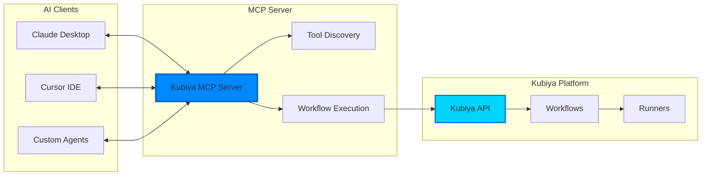

# MCP Overview

The Model Context Protocol (MCP) enables AI assistants like Claude Desktop and Cursor to interact with external tools and services. Kubiya provides MCP server integration, allowing these AI tools to discover, generate, and execute workflows directly.

## What is MCP?

MCP (Model Context Protocol) is an open protocol that standardizes how AI assistants connect to external data sources and tools. It enables:

- **Tool Discovery**: AI agents can discover available tools and their capabilities
- **Context Sharing**: Share relevant context between AI and external systems
- **Action Execution**: AI can execute actions in connected systems
- **Real-time Updates**: Stream results back to the AI interface

## Kubiya MCP Integration



## Setting Up MCP Server

### 1. Create MCP Server

Create a Python file for your MCP server:

```python
# kubiya_mcp_server.py
import os
import asyncio
from typing import Dict, List, Any
from kubiya_workflow_sdk import KubiyaClient, workflow, step
from kubiya_workflow_sdk.mcp import KubiyaWorkflowServer

# Initialize Kubiya client
client = KubiyaClient(
    api_key=os.getenv("KUBIYA_API_KEY"),
    org_name=os.getenv("KUBIYA_ORG", "default")
)

# Create MCP server
server = KubiyaWorkflowServer(
    name="kubiya-workflows",
    description="Execute and manage Kubiya workflows",
    client=client
)

# Add custom tools
@server.tool
async def list_workflows():
    """List all available workflows in Kubiya"""
    workflows = await client.list_workflows_async()
    return [
        {
            "name": w.name,
            "description": w.description,
            "version": w.version,
            "params": w.parameters
        }
        for w in workflows
    ]

@server.tool
async def execute_workflow(
    workflow_name: str,
    params: Dict[str, Any] = None,
    stream: bool = True
):
    """Execute a Kubiya workflow by name"""
    
    # Find workflow
    workflows = await client.list_workflows_async()
    workflow = next((w for w in workflows if w.name == workflow_name), None)
    
    if not workflow:
        return {"error": f"Workflow '{workflow_name}' not found"}
    
    # Execute with streaming
    if stream:
        events = []
        async for event in client.execute_workflow_events_async(
            workflow=workflow,
            params=params or {}
        ):
            events.append({
                "type": event.type,
                "data": event.data,
                "timestamp": event.timestamp
            })
        return {"execution_id": events[0].get("execution_id"), "events": events}
    else:
        result = await client.execute_workflow_async(
            workflow=workflow,
            params=params or {}
        )
        return {
            "execution_id": result.execution_id,
            "status": result.status,
            "outputs": result.outputs
        }

@server.tool
async def create_workflow(
    name: str,
    description: str,
    steps: List[Dict[str, Any]]
):
    """Create a new workflow programmatically"""
    
    # Build workflow using DSL
    wf = workflow(name).description(description)
    
    for step_def in steps:
        s = step(step_def["name"])
        
        # Configure step based on type
        if step_def.get("type") == "shell":
            s.shell(step_def["command"])
        elif step_def.get("type") == "docker":
            s.docker(
                image=step_def["image"],
                command=step_def.get("command")
            )
        elif step_def.get("type") == "inline_agent":
            s.inline_agent(
                message=step_def["message"],
                agent_name=step_def["agent_name"],
                ai_instructions=step_def["ai_instructions"],
                runners=step_def.get("runners", ["auto"])
            )
        
        # Add dependencies
        if step_def.get("depends"):
            s.depends(step_def["depends"])
            
        wf.add_step(s)
    
    # Create in Kubiya
    result = await client.create_workflow_async(wf)
    return {
        "workflow_id": result.id,
        "name": result.name,
        "status": "created"
    }

@server.tool  
async def get_execution_status(execution_id: str):
    """Get the status of a workflow execution"""
    status = await client.get_execution_status_async(execution_id)
    return {
        "execution_id": execution_id,
        "status": status.state,
        "started_at": status.started_at,
        "completed_at": status.completed_at,
        "outputs": status.outputs,
        "errors": status.errors
    }

# Run the server
if __name__ == "__main__":
    server.run()
```

### 2. Configure Claude Desktop

Add the MCP server to Claude Desktop's configuration:

```json
// ~/Library/Application Support/Claude/claude_desktop_config.json
{
  "mcpServers": {
    "kubiya": {
      "command": "python",
      "args": ["/path/to/kubiya_mcp_server.py"],
      "env": {
        "KUBIYA_API_KEY": "your-api-key",
        "KUBIYA_ORG": "your-org"
      }
    }
  }
}
```

### 3. Configure Cursor

For Cursor IDE, add to settings:

```json
// .cursor/mcp_config.json
{
  "servers": [
    {
      "name": "kubiya",
      "command": "python",
      "args": ["kubiya_mcp_server.py"],
      "env": {
        "KUBIYA_API_KEY": "${env:KUBIYA_API_KEY}"
      }
    }
  ]
}
```

## Usage Examples

### In Claude Desktop

Once configured, you can ask Claude to:

```
"List all available Kubiya workflows"

"Execute the 'deploy-application' workflow with version 1.2.3"

"Create a workflow that backs up the database and uploads to S3"

"Check the status of execution abc123"
```

Claude will use the MCP tools to interact with Kubiya directly.

### Advanced MCP Tools

Create specialized tools for your use cases:

```python
@server.tool
async def deploy_to_kubernetes(
    app_name: str,
    image: str,
    namespace: str = "default",
    replicas: int = 3
):
    """Deploy an application to Kubernetes via Kubiya workflow"""
    
    # Create deployment workflow
    wf = workflow(f"deploy-{app_name}")
    
    # Update deployment
    wf.add_step(
        step("update-deployment")
        .docker(
            image="bitnami/kubectl:latest",
            command=f"""
kubectl set image deployment/{app_name} \
  {app_name}={image} \
  -n {namespace}
"""
        )
    )
    
    # Scale deployment
    wf.add_step(
        step("scale-deployment")
        .docker(
            image="bitnami/kubectl:latest",
            command=f"kubectl scale deployment/{app_name} --replicas={replicas} -n {namespace}"
        )
        .depends("update-deployment")
    )
    
    # Wait for rollout
    wf.add_step(
        step("wait-rollout")
        .docker(
            image="bitnami/kubectl:latest",
            command=f"kubectl rollout status deployment/{app_name} -n {namespace}"
        )
        .depends("scale-deployment")
        .retry(limit=5, interval_sec=30)
    )
    
    # Execute workflow
    result = await client.execute_workflow_async(wf)
    return {
        "status": "deployed",
        "app": app_name,
        "image": image,
        "execution_id": result.execution_id
    }

@server.tool
async def run_database_migration(
    database_url: str,
    migration_dir: str,
    rollback: bool = False
):
    """Run database migrations through Kubiya"""
    
    wf = workflow("database-migration")
    
    # Create migration step with database service
    migration_step = (
        step("run-migration")
        .tool_def(
            name="migrator",
            type="docker",
            image="migrate/migrate:latest",
            content=f"""#!/bin/sh
migrate -path {migration_dir} -database {database_url} {"down" if rollback else "up"}
""",
            args=[],
            with_services=[{
                "name": "postgres",
                "image": "postgres:15",
                "env": {
                    "POSTGRES_PASSWORD": "temp"
                }
            }]
        )
    )
    
    wf.add_step(migration_step)
    
    # Execute
    result = await client.execute_workflow_async(wf)
    return {
        "status": "completed",
        "direction": "rollback" if rollback else "forward",
        "execution_id": result.execution_id
    }
```

## Resource Management

MCP servers can manage Kubiya resources:

```python
@server.resource("workflows")
async def list_workflow_resources():
    """Provide workflows as MCP resources"""
    workflows = await client.list_workflows_async()
    return [
        {
            "uri": f"kubiya://workflows/{w.name}",
            "name": w.name,
            "mimeType": "application/x-kubiya-workflow",
            "description": w.description
        }
        for w in workflows
    ]

@server.resource("executions")  
async def list_execution_resources():
    """Provide recent executions as resources"""
    executions = await client.list_executions_async(limit=50)
    return [
        {
            "uri": f"kubiya://executions/{e.id}",
            "name": f"{e.workflow_name} - {e.started_at}",
            "mimeType": "application/x-kubiya-execution",
            "metadata": {
                "status": e.status,
                "duration": e.duration_seconds
            }
        }
        for e in executions
    ]
```

## Prompts and Context

Provide contextual prompts for AI assistants:

```python
@server.prompt("debug-workflow")
async def debug_workflow_prompt(execution_id: str):
    """Generate a debugging prompt for failed workflows"""
    
    # Get execution details
    execution = await client.get_execution_async(execution_id)
    logs = await client.get_execution_logs_async(execution_id)
    
    return f"""
Debug the following Kubiya workflow execution:

Workflow: {execution.workflow_name}
Status: {execution.status}
Error: {execution.error_message}

Recent logs:
{logs[-100:]}  # Last 100 log lines

Analyze the failure and suggest fixes.
"""

@server.prompt("optimize-workflow")
async def optimize_workflow_prompt(workflow_name: str):
    """Generate optimization suggestions for workflows"""
    
    # Get workflow definition and recent executions
    workflow = await client.get_workflow_async(workflow_name)
    executions = await client.list_executions_async(
        workflow_name=workflow_name,
        limit=10
    )
    
    avg_duration = sum(e.duration_seconds for e in executions) / len(executions)
    
    return f"""
Analyze this Kubiya workflow for optimization opportunities:

Workflow: {workflow_name}
Average Duration: {avg_duration}s
Steps: {len(workflow.steps)}

Definition:
{workflow.to_yaml()}

Suggest optimizations for:
1. Performance (parallel execution, caching)
2. Reliability (retry policies, error handling)
3. Resource usage (container sizes, concurrency)
"""
```

## Security Considerations

### Authentication

MCP servers should authenticate with Kubiya:

```python
# Use environment variables
KUBIYA_API_KEY = os.getenv("KUBIYA_API_KEY")
if not KUBIYA_API_KEY:
    raise ValueError("KUBIYA_API_KEY environment variable required")

# Or use configuration file
config_path = os.path.expanduser("~/.kubiya/config.json")
if os.path.exists(config_path):
    with open(config_path) as f:
        config = json.load(f)
        api_key = config.get("api_key")
```

### Authorization

Implement authorization checks:

```python
@server.tool
async def execute_production_workflow(
    workflow_name: str,
    require_approval: bool = True
):
    """Execute production workflows with safety checks"""
    
    # Check if workflow is production
    if "production" in workflow_name.lower():
        if require_approval:
            # Could integrate with approval systems
            return {
                "error": "Production workflow requires approval",
                "workflow": workflow_name,
                "action_required": "approval"
            }
    
    # Proceed with execution
    return await execute_workflow(workflow_name)
```

### Audit Logging

Log all MCP operations:

```python
import logging

logging.basicConfig(
    level=logging.INFO,
    format='%(asctime)s - %(name)s - %(levelname)s - %(message)s'
)
logger = logging.getLogger("kubiya-mcp")

@server.middleware
async def audit_log(tool_name: str, args: dict, result: Any):
    """Log all tool invocations"""
    logger.info(f"MCP Tool: {tool_name}, Args: {args}, User: {os.getenv('USER')}")
    return result
```

## Best Practices

### 1. Tool Design
- Keep tools focused and single-purpose
- Provide clear descriptions and parameter docs
- Return structured data for AI consumption

### 2. Error Handling
```python
@server.tool
async def safe_execution(workflow_name: str):
    """Execute workflow with comprehensive error handling"""
    try:
        result = await execute_workflow(workflow_name)
        return {"success": True, "result": result}
    except WorkflowNotFoundError:
        return {"success": False, "error": "Workflow not found"}
    except ExecutionError as e:
        return {"success": False, "error": str(e), "details": e.details}
    except Exception as e:
        logger.error(f"Unexpected error: {e}")
        return {"success": False, "error": "Internal error occurred"}
```

### 3. Performance
- Cache frequently accessed data
- Use async operations throughout
- Implement pagination for large results

### 4. Versioning
```python
@server.metadata
async def server_info():
    """Provide server version and capabilities"""
    return {
        "version": "1.0.0",
        "kubiya_sdk_version": kubiya_workflow_sdk.__version__,
        "capabilities": [
            "workflow_execution",
            "workflow_creation",
            "status_monitoring",
            "resource_management"
        ]
    }
```

## Next Steps

<CardGroup cols={2}>
  <Card title="AI Providers" icon="robot" href="/providers/adk/getting-started">
    Learn about AI-powered workflows
  </Card>
  <Card title="ADK Agents" icon="code" href="/providers/adk/agents">
    Build intelligent agents
  </Card>
  <Card title="SDK Overview" icon="wand-magic-sparkles" href="/sdk/overview">
    Explore the complete SDK
  </Card>
  <Card title="Examples" icon="book" href="/workflows/examples">
    See workflow examples
  </Card>
</CardGroup> 