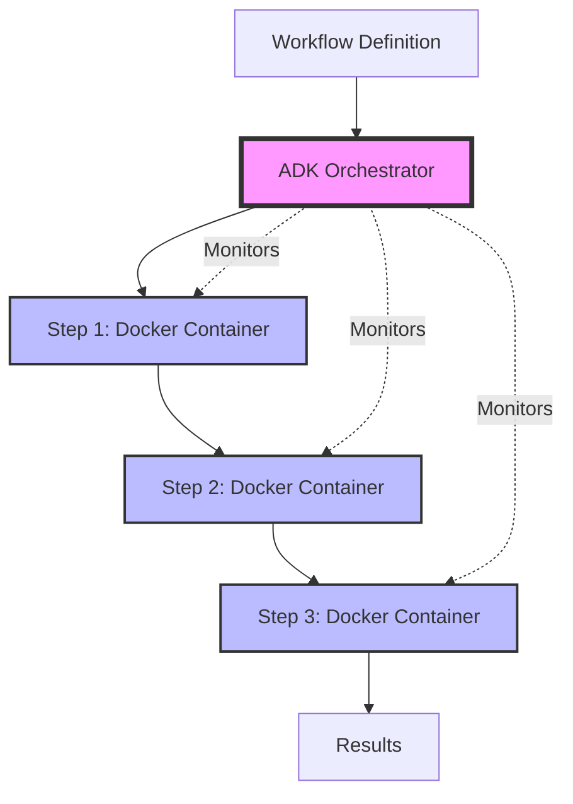

# Workflow Orchestration with ADK

Kubiya SDK currently leverages **ADK (Agent Development Kit)** as its orchestration provider for workflow execution. ADK brings powerful AI capabilities to workflow automation, enabling intelligent orchestration and decision-making.

## Serverless, Containerized Execution

<Card title="🚀 Run Any Software, Anywhere" icon="docker">
  Every workflow and step in Kubiya runs as an independent, serverless Docker container. This means:
  
  - **Complete Software Freedom**: Install and run any software, library, or tool
  - **Language Agnostic**: Python, Node.js, Go, Rust, Java - use any language
  - **Stateless Execution**: Each execution starts fresh, ensuring consistency
  - **Infinite Scalability**: Workflows scale automatically based on demand
  - **Resource Isolation**: Each step runs in its own secure environment
</Card>

## Why Containerized Execution?

### 1. **Universal Compatibility**
```python
# Your workflow can use ANY software
workflow = Workflow(
    name="multi-language-pipeline",
    runner="kubiya-hosted"
)

# Run Python data processing
workflow.add_step(
    name="process-data",
    image="python:3.11",
    code="""
    import pandas as pd
    df = pd.read_csv('data.csv')
    # Process with any Python library
    """
)

# Then run Node.js API calls
workflow.add_step(
    name="call-apis",
    image="node:20",
    code="""
    const axios = require('axios');
    // Use any npm package
    """
)

# Even compile and run Go code
workflow.add_step(
    name="high-performance",
    image="golang:1.21",
    code="""
    package main
    // Write high-performance Go code
    """
)
```

### 2. **True Statelessness**

Each workflow execution is completely independent:

- No shared state between executions
- No side effects from previous runs
- Predictable, reproducible results
- Perfect for event-driven architectures

### 3. **Security & Isolation**

- Each step runs in its own container
- Network isolation between steps
- Resource limits prevent runaway processes
- Clean environment for each execution

## ADK: The AI-Powered Orchestrator

ADK serves as the intelligent orchestration layer that:

### **Multi-Agent Architecture**
- Specialized agents for different tasks
- Context-aware decision making
- Intelligent error handling and recovery

### **Natural Language Processing**
- Generate workflows from descriptions
- Understand complex requirements
- Adapt execution based on context

### **Streaming Capabilities**
- Real-time execution feedback
- Progress updates as workflows run
- Interactive debugging support

## Execution Flow



## Practical Example: Multi-Tool Pipeline

Here's a real-world example leveraging the containerized architecture:

```python
from kubiya_workflow_sdk import Workflow, Step

# Create a data processing pipeline that uses multiple tools
workflow = Workflow(
    name="etl-pipeline",
    runner="kubiya-hosted"
)

# Extract: Use Python with specialized libraries
workflow.add_step(Step(
    name="extract-data",
    image="python:3.11-slim",
    packages=["requests", "beautifulsoup4"],
    code="""
    import requests
    from bs4 import BeautifulSoup
    
    # Scrape data from websites
    response = requests.get('https://example.com/data')
    soup = BeautifulSoup(response.text, 'html.parser')
    data = extract_tables(soup)
    """
))

# Transform: Use R for statistical analysis
workflow.add_step(Step(
    name="analyze-data",
    image="r-base:latest",
    code="""
    library(tidyverse)
    library(forecast)
    
    # Perform time series analysis
    data <- read.csv('input.csv')
    model <- auto.arima(data$values)
    forecast <- predict(model, n.ahead=30)
    """
))

# Load: Use Go for high-performance database operations
workflow.add_step(Step(
    name="load-to-db",
    image="golang:1.21",
    code="""
    package main
    
    import (
        "database/sql"
        _ "github.com/lib/pq"
    )
    
    func main() {
        // High-performance bulk insert
        db, _ := sql.Open("postgres", connStr)
        // Efficient data loading
    }
    """
))
```

## Key Benefits

<CardGroup cols={2}>
  <Card title="🔧 Use Any Tool" icon="wrench">
    Install and use any software package, library, or tool within your workflows
  </Card>
  
  <Card title="🔒 Secure Isolation" icon="shield">
    Each step runs in its own container with resource limits and network isolation
  </Card>
  
  <Card title="📈 Infinite Scale" icon="chart-line">
    Serverless execution scales automatically based on demand
  </Card>
  
  <Card title="🎯 Predictable Results" icon="bullseye">
    Stateless execution ensures consistent, reproducible outcomes
  </Card>
</CardGroup>

## Coming Soon

While ADK is currently the sole orchestration provider, the Kubiya SDK architecture is designed to support multiple providers in the future, allowing you to choose the orchestration engine that best fits your needs.

## Next Steps

<Card title="Get Started with ADK" href="/providers/adk/getting-started" icon="rocket">
  Learn how to create your first AI-powered workflow with ADK
</Card>

<Card title="Explore Streaming" href="/providers/adk/streaming" icon="broadcast">
  Understand real-time execution feedback and monitoring
</Card>

<Card title="Multi-Agent Architecture" href="/providers/adk/agents" icon="users">
  Dive deep into ADK's intelligent agent system
</Card> 