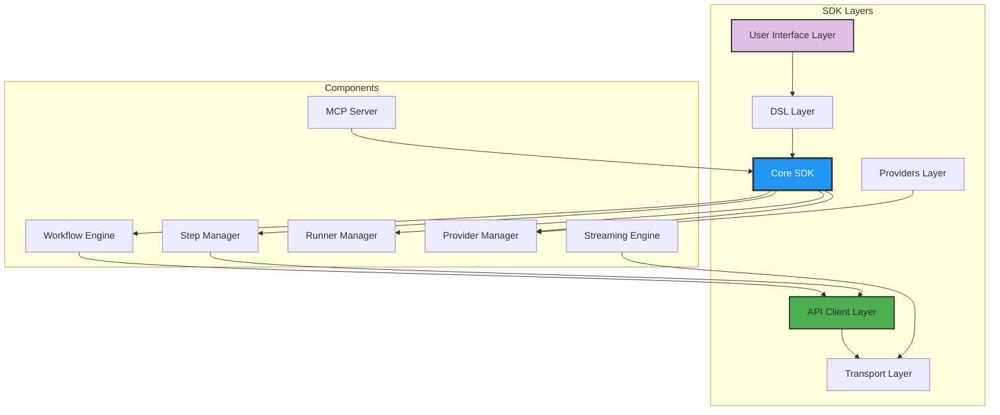
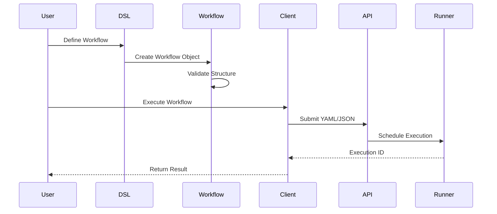

# SDK Deep Dive

Master every aspect of the Kubiya Workflow SDK - from core architecture to advanced patterns.

## SDK Architecture



## Core Components

### 1. **Workflow Engine**

The heart of the SDK - manages workflow lifecycle:

```python
from kubiya_workflow_sdk import KubiyaClient
from kubiya_workflow_sdk.dsl import workflow

# Create a workflow using the DSL
wf = (
    workflow("data-pipeline")
    .description("Process data through pipeline")
    .runner("kubernetes")  # Specify runner
    .params(VERSION="1.0.0")
)

# Add steps
wf.step("fetch", "python fetch_data.py")
wf.step("process", "python process_data.py")
wf.step("store", "python store_data.py")

# Execute using client
client = KubiyaClient()
result = client.execute_workflow_yaml(wf.to_yaml())
```

### 2. **Step Management**

Advanced step configuration and execution:

```python
from kubiya_workflow_sdk.dsl import step

# Shell step with advanced options
shell_step = (
    step("process-data")
    .docker(
        image="python:3.11",
        command="python process.py"
    )
    .timeout(1800)  # 30 minutes
    .retry(
        limit=3,
        exponential_base=2.0,
        interval_sec=10
    )
    .env(
        API_KEY="${secrets.API_KEY}",
        CONFIG="${CONFIG_VALUE}"
    )
)

# Container step with specific configuration
container_step = (
    step("web-server")
    .docker(
        image="nginx:alpine",
        command="nginx -g 'daemon off;'"
    )
    # Note: Health checks, ports, and lifecycle hooks
    # are configured at the runner/platform level
)

# Inline agent step
agent_step = (
    step("analyze")
    .inline_agent(
        message="Analyze the deployment metrics",
        agent_name="metrics-analyzer",
        ai_instructions="You are a metrics expert. Return JSON analysis.",
        runners=["kubiya-hosted"],
        llm_model="gpt-4o"
    )
)
```

### 3. **DSL Parser**

Transform Python DSL to internal representation:

```python
from kubiya_workflow_sdk.dsl import workflow, step

# Create workflow using fluent API
wf = workflow("my-pipeline")

# Add steps
fetch_step = step("fetch", "wget source.csv")
transform_step = step("transform", "python transform.py").depends("fetch")
store_step = step("store", "aws s3 cp output.csv s3://bucket/").depends("transform")

# Add steps to workflow
wf.data["steps"].extend([
    fetch_step.to_dict(),
    transform_step.to_dict(),
    store_step.to_dict()
])

# Convert to YAML
print(wf.to_yaml())
```

### 4. **Provider System**

Extensible provider architecture:

```python
from kubiya_workflow_sdk.providers import BaseProvider, register_provider

class CustomProvider(BaseProvider):
    """Custom AI provider implementation"""
    
    def __init__(self, client=None, config=None):
        super().__init__(client, config)
        self.api_key = config.get("api_key") if config else None
    
    async def compose(self, task, mode="plan", **kwargs):
        """Generate workflow from natural language"""
        # Generate workflow code
        workflow_code = await self._generate_workflow(task)
        
        return {
            "success": True,
            "workflow_code": workflow_code,
            "workflow_yaml": self._code_to_yaml(workflow_code)
        }
    
    async def _generate_workflow(self, task):
        # Your LLM implementation
        return f'''
from kubiya_workflow_sdk.dsl import workflow

wf = workflow("generated")
wf.step("task", "echo '{task}'")
'''

# Register provider
register_provider("custom", CustomProvider)

# Use provider
from kubiya_workflow_sdk.providers import get_provider

provider = get_provider("custom", config={"api_key": "..."})
result = await provider.compose("Deploy my application")
```

## Advanced SDK Features

### Workflow Composition

```python
from kubiya_workflow_sdk.dsl import workflow

# Create multiple workflows
def create_etl_workflow():
    wf = workflow("etl")
    wf.step("extract", "python extract.py")
    wf.step("transform", "python transform.py")
    wf.step("load", "python load.py")
    return wf

def create_ml_workflow():
    wf = workflow("ml")
    wf.step("train", "python train.py")
    wf.step("evaluate", "python evaluate.py")
    return wf

# Create composite workflow
def create_pipeline():
    wf = workflow("data-science-pipeline")
    
    # Run ETL first
    wf.sub_workflow("etl-phase", "etl-workflow.yaml")
    
    # Then run ML (depends on ETL)
    wf.sub_workflow("ml-phase", "ml-workflow.yaml").depends("etl-phase")
    
    return wf

# Dynamic composition
def create_regional_pipeline(regions):
    wf = workflow("multi-region")
    
    # Process each region in parallel
    wf.parallel_steps(
        "process-regions",
        items=regions,
        command="python process_region.py ${ITEM}"
    )
    
    return wf
```

### Custom Step Patterns

```python
from kubiya_workflow_sdk.dsl import step

# Create reusable step patterns
def create_ml_training_step(name, model_type, dataset, gpus=1):
    """Create a step for ML model training"""
    
    return (
        step(name)
        .docker(
            image=f"ml-trainer:{model_type}",
            command=f"""
python train.py \
  --dataset {dataset} \
  --model {model_type} \
  --epochs 100 \
  --batch-size 32
"""
        )
        # GPU allocation is handled by runner configuration
        .env(
            CUDA_VISIBLE_DEVICES="0",
            MODEL_TYPE=model_type
        )
    )

# Use custom step pattern
train_step = create_ml_training_step(
    name="train-transformer",
    model_type="transformer",
    dataset="s3://data/training.csv",
    gpus=2
)

# Add to workflow
wf = workflow("ml-pipeline")
wf.data["steps"].append(train_step.to_dict())
```

### Event Processing

```python
from kubiya_workflow_sdk import KubiyaClient
import asyncio

class WorkflowMonitor:
    """Monitor workflow execution"""
    
    def __init__(self, client: KubiyaClient):
        self.client = client
        self.metrics = {}
        self.alerts = []
    
    async def monitor_execution(self, execution_id):
        """Monitor a workflow execution"""
        
        while True:
            # Get current status
            status = self.client.get_execution_status(execution_id)
            
            # Process status
            if status['state'] == 'running':
                for step in status.get('steps', []):
                    if step['state'] == 'completed':
                        self.metrics[step['name']] = {
                            'duration': step.get('duration'),
                            'exit_code': step.get('exit_code')
                        }
            
            # Check for completion
            if status['state'] in ['completed', 'failed']:
                if status['state'] == 'failed':
                    self.alerts.append({
                        'execution_id': execution_id,
                        'error': status.get('error')
                    })
                break
            
            await asyncio.sleep(5)  # Poll interval
        
        return status

# Use monitor
client = KubiyaClient()
monitor = WorkflowMonitor(client)

# Execute and monitor
execution_id = client.execute_workflow_yaml(workflow_yaml)
final_status = await monitor.monitor_execution(execution_id)
```

### Workflow Context

```python
from kubiya_workflow_sdk.dsl import workflow, step

# Create workflows with context
def create_deployment_pipeline(environment="staging"):
    """Create environment-specific pipeline"""
    
    wf = (
        workflow(f"deploy-{environment}")
        .description(f"Deploy to {environment}")
        .params(
            ENVIRONMENT=environment,
            API_KEY="${API_KEY}",  # From environment
            VERSION="${VERSION}"   # From parameters
        )
    )
    
    # Environment-specific steps
    if environment == "production":
        # Add approval step for production
        wf.step(
            "get-approval",
            "echo 'Waiting for approval...'"
        )
    
    # Common deployment steps
    wf.step(
        "deploy",
        f"kubectl apply -f {environment}/deployment.yaml"
    )
    
    if environment == "production":
        # Add monitoring for production
        wf.step(
            "monitor",
            "python monitor_deployment.py"
        ).depends("deploy")
    
    return wf

# Create different pipelines
staging_pipeline = create_deployment_pipeline("staging")
prod_pipeline = create_deployment_pipeline("production")
```

## SDK Internals

### Execution Pipeline



### Error Handling

```python
from kubiya_workflow_sdk.dsl import workflow, step

# Create workflow with robust error handling
wf = workflow("error-handling-example")

# Step with retry on specific errors
api_call = (
    step("api-call")
    .docker(
        image="curlimages/curl",
        command="curl https://api.example.com/data"
    )
    .retry(
        limit=3,
        exit_codes=[1, 2, 124],  # Retry on specific exit codes
        interval_sec=30
    )
)

# Step that continues on failure
optional_step = (
    step("optional-notification")
    .shell("send-notification.sh")
    .continue_on(failure=True)  # Don't fail workflow
)

# Conditional error handling
error_handler = (
    step("handle-error")
    .shell("python handle_error.py")
    .depends("api-call")
    .preconditions("${api-call.exit_code} != 0")
)

wf.data["steps"].extend([
    api_call.to_dict(),
    optional_step.to_dict(),
    error_handler.to_dict()
])
```

### Performance Patterns

```python
from kubiya_workflow_sdk.dsl import workflow

# Optimize workflow performance
wf = workflow("optimized-pipeline")

# Parallel processing for better performance
wf.parallel_steps(
    "process-batch",
    items=list(range(100)),  # Process 100 items
    command="python process_item.py ${ITEM}",
    max_concurrent=10  # Limit concurrency
)

# Use lightweight images
wf.step(
    "quick-check",
    "echo 'Checking...'"
    # Uses default alpine image - very lightweight
)

# Cache dependencies in custom images
wf.step(
    "analyze"
).docker(
    image="myapp:latest",  # Pre-built with all dependencies
    command="python analyze.py"
)
```

## Best Practices

### 1. **Workflow Design**

```python
from kubiya_workflow_sdk.dsl import workflow, step

# Good: Modular, reusable steps
def create_data_pipeline(source, destination):
    wf = workflow("data-pipeline")
    
    # Clear, atomic steps
    wf.step("fetch", f"wget {source} -O /tmp/data.csv")
    wf.step("validate", "python validate.py /tmp/data.csv")
    wf.step("transform", "python transform.py /tmp/data.csv /tmp/output.csv")
    wf.step("store", f"aws s3 cp /tmp/output.csv {destination}")
    
    return wf

# Bad: Monolithic step
# wf.step("process", "fetch_validate_transform_and_store.sh")  # Too much
```

### 2. **Resource Management**

```python
# Good: Use appropriate images and commands
step("process").docker(
    image="python:3.11-slim",  # Minimal image
    command="python process.py"
)

# Note: Resource limits (CPU, memory) are configured
# at the runner/platform level, not in workflow definition
```

### 3. **Error Handling**

```python
# Good: Graceful degradation
wf = workflow("resilient-pipeline")

# Primary service with retry
primary = (
    step("primary-service")
    .docker(image="service:latest", command="./run.sh")
    .retry(limit=3)
    .output("RESULT")
)

# Fallback service
fallback = (
    step("fallback-service")
    .docker(image="service:stable", command="./run-stable.sh")
    .depends("primary-service")
    .preconditions("${primary-service.exit_code} != 0")
    .output("RESULT")
)

# Alert on fallback
alert = (
    step("alert-team")
    .shell("send-alert.sh 'Using fallback service'")
    .depends("fallback-service")
)

wf.data["steps"].extend([
    primary.to_dict(),
    fallback.to_dict(),
    alert.to_dict()
])
```

## SDK Ecosystem

<CardGroup cols={2}>
  <Card title="CLI Tools" icon="terminal">
    Command-line interface for workflow management
  </Card>
  <Card title="VS Code Extension" icon="code">
    IntelliSense and debugging for workflows
  </Card>
  <Card title="Testing Framework" icon="flask">
    Unit and integration testing utilities
  </Card>
  <Card title="Monitoring Tools" icon="chart-line">
    Real-time workflow monitoring
  </Card>
</CardGroup>

## Next Steps

<CardGroup cols={2}>
  <Card title="API Reference" icon="book" href="/sdk/api-reference">
    Complete SDK API documentation
  </Card>
  <Card title="Examples" icon="lightbulb" href="/sdk/examples">
    Real-world SDK usage patterns
  </Card>
  <Card title="Contributing" icon="code-branch" href="/sdk/contributing">
    Contribute to the SDK
  </Card>
  <Card title="Changelog" icon="clock" href="/sdk/changelog">
    SDK version history
  </Card>
</CardGroup> 