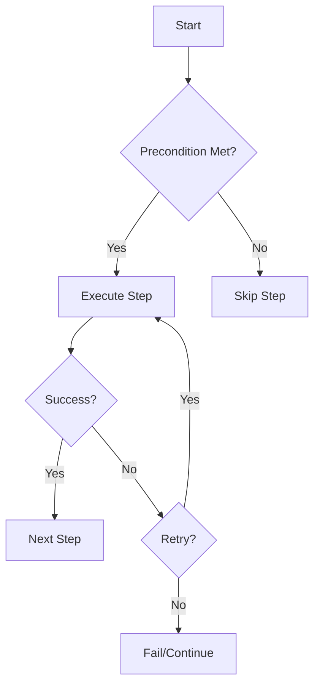

# Workflow DSL Reference

## Why Our DSL is Perfect for AI

Kubiya's workflow DSL is designed to be **deterministic, declarative, and AI-friendly**. Unlike complex multi-agent systems that require intricate programming, our DSL is:

<CardGroup cols={3}>
  <Card title="Declarative Schema" icon="file-code">
    Simple YAML/JSON structure that AI can easily generate
  </Card>
  <Card title="Deterministic Execution" icon="route">
    Same inputs always produce same execution path
  </Card>
  <Card title="Application Layer Only" icon="shield">
    No infrastructure access, no god-mode permissions
  </Card>
</CardGroup>

## Core Concept: Application Layer Orchestration

<Warning>
  Unlike other AI orchestration systems that require deep infrastructure access, Kubiya operates purely at the **application layer**. This means:
  
  - ✅ No direct access to your Kubernetes clusters
  - ✅ No ability to modify infrastructure
  - ✅ No god-mode permissions required
  - ✅ Complete audit trail of all actions
  - ✅ Runs in isolated containers with limited scope
</Warning>

## Complete DSL Reference

## 🤖 Serverless AI Agents Built-In

<Card title="Inline Agents: AI as a Workflow Step" icon="robot">
  Kubiya's DSL exposes **serverless AI agents** that run as workflow steps. These agents use state-of-the-art techniques including:
  
  - **Function calling** for structured outputs
  - **Tool integration** to execute workflow steps
  - **Context awareness** from previous steps
  - **Deterministic execution** within the workflow DAG
</Card>

### The Power of Inline Agents

Unlike traditional AI orchestration that requires complex agent frameworks, Kubiya's inline agents are:

1. **Simple function calls** - Just another step in your workflow
2. **Serverless execution** - Spin up on-demand, no persistent processes
3. **Tool-enabled** - Can call other workflow steps as tools
4. **Context-aware** - Access outputs from previous steps
5. **Deterministic** - Same prompt → Same structured output

```python
# AI agent as a simple workflow step
.step("intelligent-decision")
.inline_agent(
    message="Analyze the deployment metrics and decide next action",
    agent_name="deployment-strategist",
    ai_instructions="""You are a deployment expert. Based on the metrics:
    - If CPU < 50% and memory < 60%, recommend scale down
    - If error rate > 5%, recommend rollback
    - Otherwise, recommend proceed
    Output JSON with: action, reasoning, confidence""",
    runners=["kubiya-hosted"],
    tools=[
        # Agent can call these tools
        {
            "name": "get_metrics",
            "type": "shell",
            "command": "kubectl top pods"
        },
        {
            "name": "check_errors", 
            "type": "shell",
            "command": "kubectl logs -l app=myapp | grep ERROR | wc -l"
        }
    ]
)
.output("AI_DECISION")

# Use AI decision in subsequent steps
.step("execute-action")
.shell("./execute.sh ${AI_DECISION.action}")
.preconditions(
    {"condition": "${AI_DECISION.confidence}", "expected": "gt:0.8"}
)
```

### Workflow Definition

```python
from kubiya_workflow_sdk.dsl import workflow

wf = (
    workflow("my-workflow")
    .description("Comprehensive workflow example")
    .params(
        # Define input parameters with defaults
        ENVIRONMENT="${ENVIRONMENT:-staging}",
        VERSION="${VERSION}",
        DRY_RUN="${DRY_RUN:-false}"
    )
    .runner("kubiya-hosted")  # Serverless execution
)
```

### Step Types

#### 1. Shell Commands
```python
.step("shell-example")
.shell("echo 'Hello from ${ENVIRONMENT}'")
```

#### 2. Inline Agents (AI-Powered Steps)

<Note>
  **Serverless AI Agents**: Kubiya's inline agents are serverless AI components that run as workflow steps. They use best-in-class techniques like function calling and can invoke other workflow tools, making them incredibly powerful yet simple to use.
</Note>

```python
.step("ai-analysis")
.inline_agent(
    message="Analyze the deployment risk for version ${VERSION}",
    agent_name="risk-analyzer",
    ai_instructions="""You are a deployment risk analyst. 
    Evaluate the version and provide a structured risk assessment.
    Output JSON with fields: risk_level (low|medium|high), reasons[]""",
    runners=["kubiya-hosted"],  # Required - specify which runner to use
    llm_model="gpt-4o",  # Optional, defaults to gpt-4o-mini
    is_debug_mode=True,  # Optional, enables debug logging
    
    # Agents can call tools (function calling)
    tools=[
        {
            "name": "check-previous-deployments",
            "type": "docker",
            "image": "kubectl:latest",
            "content": """#!/bin/sh
kubectl rollout history deployment/app --namespace=${NAMESPACE}
""",
            "args": [{"name": "NAMESPACE", "type": "string"}]
        },
        {
            "name": "analyze-metrics", 
            "type": "docker",
            "image": "alpine:latest",
            "content": """#!/bin/sh
# Simulate metrics check
echo '{"cpu_usage": 45, "memory_usage": 62, "error_rate": 2.3}'
""",
            "args": []
        }
    ]
)
.output("RISK_ANALYSIS")  # Capture structured output for downstream steps
```

**Key Features of Inline Agents:**
- **Serverless**: Spin up on-demand, no persistent processes
- **Function Calling**: Agents can call defined tools to gather information
- **Structured Output**: Enforce JSON/structured responses
- **Context Aware**: Access previous step outputs via `${VARIABLE}` syntax
- **Deterministic**: Same inputs produce same analysis structure

**Real Working Example - Log Analysis Agent:**

```python
from kubiya_workflow_sdk.dsl import workflow

wf = workflow("intelligent-log-analysis")

# Add the inline agent step
wf.step("analyze-logs")
.inline_agent(
    message="Analyze these application logs and identify patterns: ${LOG_CONTENT}",
    agent_name="log-analyzer", 
    ai_instructions="""You are a log analysis expert. Analyze the logs and:
1. Identify error patterns and frequency
2. Find performance bottlenecks
3. Detect security concerns
4. Provide actionable recommendations

Output as JSON with structure:
{
  "error_count": number,
  "error_patterns": ["pattern1", "pattern2"],
  "performance_issues": ["issue1", "issue2"],
  "security_concerns": ["concern1"],
  "recommendations": ["rec1", "rec2"]
}""",
    runners=["kubiya-hosted"],
    llm_model="gpt-4o",
    tools=[
        {
            "name": "parse-json",
            "type": "docker",
            "image": "alpine:latest",
            "content": "#!/bin/sh\necho '$1' | jq .",
            "args": [{"name": "json", "type": "string"}]
        }
    ]
)
.output("ANALYSIS")

# Use the analysis in next step
wf.step("create-report")
.shell("echo 'Log Analysis Report:' && echo '${ANALYSIS}' | jq '.'")
```

**Complex Example - Incident Response Agent:**

```python
.step("incident-responder")
.inline_agent(
    message="""System alert detected:
- Service: ${SERVICE_NAME}
- Error rate: ${ERROR_RATE}%
- Response time: ${RESPONSE_TIME}ms

Analyze and provide remediation plan.""",
    
    agent_name="incident-commander",
    
    ai_instructions="""You are an SRE incident response expert. Based on the alert:
1. Determine severity (P1/P2/P3)
2. Identify likely root cause
3. Provide immediate mitigation steps
4. Create runbook for resolution

Use available tools to gather more context before making recommendations.
Output JSON with: severity, root_cause, immediate_actions[], runbook_steps[]""",
    
    runners=["kubiya-hosted"],
    
    # Tools the agent can use for investigation
    tools=[
        {
            "name": "check-pod-status",
            "type": "docker",
            "image": "bitnami/kubectl:latest",
            "content": """#!/bin/sh
kubectl get pods -l app=${SERVICE_NAME} -o json | jq '.items[] | {name: .metadata.name, status: .status.phase, restarts: .status.containerStatuses[0].restartCount}'
""",
            "args": []
        },
        {
            "name": "get-recent-logs",
            "type": "docker", 
            "image": "bitnami/kubectl:latest",
            "content": """#!/bin/sh
kubectl logs -l app=${SERVICE_NAME} --tail=100 --since=5m
""",
            "args": []
        },
        {
            "name": "check-resource-usage",
            "type": "docker",
            "image": "bitnami/kubectl:latest", 
            "content": """#!/bin/sh
kubectl top pods -l app=${SERVICE_NAME} | tail -n +2 | awk '{cpu+=$2; mem+=$3; count++} END {print "{\"avg_cpu\": " cpu/count ", \"avg_memory\": " mem/count "}"}'
""",
            "args": []
        }
    ],
    
    is_debug_mode=True  # Enable detailed logging
)
.output("INCIDENT_PLAN")

# Execute the remediation plan
.step("execute-remediation")
.shell("""
echo "Executing incident response plan..."
SEVERITY=$(echo '${INCIDENT_PLAN}' | jq -r '.severity')
if [ "$SEVERITY" = "P1" ]; then
    echo "CRITICAL: Executing immediate remediation"
    # Add actual remediation commands here
fi
""")
.preconditions(
    {"condition": "${INCIDENT_PLAN.severity}", "expected": "ne:"}
)
```

#### 3. Docker Containers
```python
.step("custom-tool")
.docker(
    image="python:3.11",
    packages=["pandas", "numpy"],  # Auto-installed
    code="""
    import pandas as pd
    # Your code here
    """,
    resources={"cpu": "2", "memory": "4Gi"}
)
```

#### 4. Tool Definitions
```python
.step("use-tool")
.tool_def(
    name="my-tool",
    type="docker",
    image="ubuntu:latest",
    content="""#!/bin/bash
    echo "Processing $1"
    """,
    args=[
        {"name": "input", "type": "string"},
        {"name": "secret", "type": "string", "secret": True}
    ]
)
.args(input="${DATA}", secret="${API_KEY}")
```

### Flow Control

#### Preconditions
Control when steps execute with powerful conditions:

```python
.step("conditional-deploy")
.shell("kubectl apply -f deployment.yaml")
.preconditions(
    # Simple equality
    {"condition": "${ENVIRONMENT}", "expected": "production"},
    
    # Regex matching
    {"condition": "${VERSION}", "expected": "re:v[0-9]+\\.[0-9]+\\.[0-9]+"},
    
    # Numeric comparisons
    {"condition": "${RISK_ANALYSIS.risk_score}", "expected": "lt:5"},
    
    # Command output evaluation
    {"condition": "`date +%u`", "expected": "re:[1-5]"},  # Weekdays only
    
    # Complex JSON path evaluation
    {"condition": "${ANALYSIS.metrics.cpu_usage}", "expected": "lt:80"}
)
```

#### Parallel Steps
Execute multiple steps concurrently:

```python
# Static parallel execution
.parallel([
    ("fetch-us", "aws s3 cp s3://us-bucket/data.json ."),
    ("fetch-eu", "aws s3 cp s3://eu-bucket/data.json ."),
    ("fetch-asia", "aws s3 cp s3://asia-bucket/data.json .")
])

# Dynamic parallel execution over items
.parallel_steps(
    name="process-regions",
    items=["us-east-1", "eu-west-1", "ap-south-1"],
    command="./deploy-to-region.sh ${ITEM}",
    max_concurrent=2  # Limit concurrency
)
```

#### Sub-Workflows
Compose workflows from other workflows:

```python
.sub_workflow("deploy", "workflows/deploy.yaml")
.with_params(
    VERSION="${VERSION}",
    TARGET="${ENVIRONMENT}"
)
```

### Error Handling

#### Retry Configuration
Sophisticated retry logic with exponential backoff:

```python
.step("flaky-api-call")
.shell("curl https://unreliable-api.com/endpoint")
.retry(
    limit=3,                    # Max attempts
    interval_sec=60,           # Base interval
    exponential_base=2.0,      # Exponential multiplier
    exit_codes=[1, 2, 124],    # Retry only on specific exit codes
    max_interval_sec=300       # Cap the backoff
)
```

#### Continue on Failure
Allow workflow to proceed even if step fails:

```python
.step("optional-notification")
.shell("send-slack-alert.sh")
.continue_on(failure=True)  # Workflow continues even if this fails
```

### Data Flow

#### Output Capture
Capture step outputs for use in subsequent steps:

```python
# Capture command output
.step("get-version")
.shell("git describe --tags")
.output("GIT_TAG")

# Use in later steps
.step("deploy")
.shell("docker push myapp:${GIT_TAG}")
```

#### Artifacts
Share files between steps:

```python
# Step 1: Generate artifact
.step("generate")
.docker(
    image="python:3.11",
    code="""
    data = process_data()
    save_artifact('results.json', data)
    """
)

# Step 2: Use artifact
.step("analyze")
.docker(
    image="python:3.11",
    code="""
    data = load_artifact('results.json')
    analyze(data)
    """
)
```

## Why This DSL is AI-Friendly

### 1. **Structured Schema**
The DSL is a simple, structured format that LLMs can easily generate:

```yaml
# AI can generate this deterministic structure
name: deploy-app
steps:
  - name: check-health
    command: curl health-check
    retry:
      limit: 3
  - name: deploy
    command: kubectl apply
    preconditions:
      - condition: "${HEALTH_STATUS}"
        expected: "healthy"
```

### 2. **No Complex State Management**
Unlike multi-agent systems that accumulate state and errors:
- Each step is independent
- No hidden state between executions
- Clear inputs and outputs

### 3. **Deterministic Execution**


### 4. **Application Layer Safety**
Traditional AI orchestration systems often require dangerous permissions:

<ComparisonTable>
  <Row>
    <Cell>Traditional AI Orchestration</Cell>
    <Cell>Kubiya Workflows</Cell>
  </Row>
  <Row>
    <Cell>❌ Direct infrastructure access</Cell>
    <Cell>✅ Containerized execution only</Cell>
  </Row>
  <Row>
    <Cell>❌ God-mode Kubernetes permissions</Cell>
    <Cell>✅ Limited to defined actions</Cell>
  </Row>
  <Row>
    <Cell>❌ Can modify any resource</Cell>
    <Cell>✅ Explicit step definitions</Cell>
  </Row>
  <Row>
    <Cell>❌ Complex MCP server setup</Cell>
    <Cell>✅ Simple API/SDK integration</Cell>
  </Row>
</ComparisonTable>

## Real-World Example

Here's a complete example showing all DSL features with REAL working syntax:

```python
from kubiya_workflow_sdk.dsl import workflow

# Production deployment with all safety features
wf = (
    workflow("production-deployment")
    .description("Safe production deployment with rollback")
    .runner("kubiya-hosted")  # Use Kubiya's serverless runner
    .params(
        VERSION="${VERSION}",
        ENVIRONMENT="production",
        MAX_UNAVAILABLE="1",
        ROLLBACK_ON_ERROR="true"
    )
    .env(
        NAMESPACE="production",
        APP_NAME="myapp"
    )
)

# AI-powered risk assessment using inline agent
wf.step("assess-risk")
.inline_agent(
    message="Analyze deployment risk for ${APP_NAME} version ${VERSION} to ${ENVIRONMENT}",
    agent_name="deployment-analyst",
    ai_instructions="""You are a deployment risk analyst. Analyze the deployment and:
1. Check if this is a major version change
2. Evaluate the risk level based on version jump
3. Consider the target environment
4. Provide deployment recommendations

Return JSON with structure:
{
  "risk_level": "low|medium|high",
  "is_major_version": true|false,
  "checks_passed": ["version_format", "environment_valid"],
  "warnings": ["any warnings"],
  "proceed": true|false,
  "recommendations": ["recommendation1", "recommendation2"]
}""",
    runners=["kubiya-hosted"],
    llm_model="gpt-4o",
    is_debug_mode=True
)
.output("RISK_ASSESSMENT")

# Conditional deployment based on risk assessment
wf.step("deploy")
.shell("kubectl set image deployment/${APP_NAME} ${APP_NAME}=${VERSION} -n ${NAMESPACE}")
.preconditions(
    {"condition": "${RISK_ASSESSMENT.proceed}", "expected": "true"},
    {"condition": "${RISK_ASSESSMENT.risk_level}", "expected": "re:(low|medium)"}
)
.retry(
    limit=3,
    interval_sec=30,
    exponential_base=2.0
)
.output("DEPLOY_RESULT")

# Parallel health checks
wf.parallel([
    ("check-pods", "kubectl get pods -l app=${APP_NAME} -n ${NAMESPACE} -o json"),
    ("check-endpoints", "kubectl get endpoints ${APP_NAME} -n ${NAMESPACE} -o json"),
    ("check-services", "kubectl get svc ${APP_NAME} -n ${NAMESPACE} -o json")
])

# Smoke test with output capture
wf.step("smoke-test")
.shell("""
# Try to hit the health endpoint
HEALTH_URL="http://${APP_NAME}.${NAMESPACE}.svc.cluster.local/health"
curl -f -m 5 $HEALTH_URL || echo 'FAILED'
""")
.output("HEALTH_CHECK")
.retry(limit=5, interval_sec=10)

# Conditional rollback using inline agent for decision
wf.step("rollback-decision")
.inline_agent(
    message="Health check result: ${HEALTH_CHECK}. Deployment result: ${DEPLOY_RESULT}. Should we rollback?",
    agent_name="rollback-analyzer",
    ai_instructions="""You are a deployment safety expert. Based on the health check and deployment results:
1. If health check contains 'FAILED', recommend rollback
2. If deployment had errors, recommend rollback
3. Otherwise, deployment is successful

Return JSON: {"should_rollback": true|false, "reason": "explanation"}""",
    runners=["kubiya-hosted"],
    llm_model="gpt-4o"
)
.output("ROLLBACK_DECISION")

# Execute rollback if needed
wf.step("rollback")
.shell("kubectl rollout undo deployment/${APP_NAME} -n ${NAMESPACE}")
.preconditions(
    {"condition": "${ROLLBACK_DECISION.should_rollback}", "expected": "true"}
)
.continue_on(failure=False)  # Stop workflow on rollback failure

# Notification step with tool definition
wf.step("notify")
.tool_def(
    name="slack-notify",
    type="docker",
    image="curlimages/curl:latest",
    content="""#!/bin/sh
STATUS="SUCCESS"
if [ "${ROLLBACK_DECISION.should_rollback}" = "true" ]; then
    STATUS="ROLLED_BACK"
fi

curl -X POST $SLACK_WEBHOOK \
  -H 'Content-Type: application/json' \
  -d "{
    \"text\": \"Deployment Status: $STATUS\",
    \"blocks\": [{
        \"type\": \"section\",
        \"text\": {
            \"type\": \"mrkdwn\",
            \"text\": \"*App:* ${APP_NAME}\\n*Version:* ${VERSION}\\n*Environment:* ${ENVIRONMENT}\\n*Risk Level:* ${RISK_ASSESSMENT.risk_level}\"
        }
    }]
}"
""",
    args=[
        {"name": "SLACK_WEBHOOK", "type": "string", "secret": True}
    ]
)
.args(SLACK_WEBHOOK="${SLACK_WEBHOOK_URL}")
.continue_on(failure=True)  # Don't fail workflow if notification fails

# Convert to dict for execution
workflow_dict = wf.to_dict()
```

## Best Practices

### 1. **Use Preconditions Liberally**
Preconditions make workflows safer and more predictable:
```python
.preconditions(
    {"condition": "${DRY_RUN}", "expected": "ne:true"},
    {"condition": "${APPROVAL_STATUS}", "expected": "approved"}
)
```

### 2. **Capture Outputs for Observability**
```python
.step("critical-operation")
.shell("important-command.sh")
.output("OPERATION_RESULT")  # Always capture critical outputs
```

### 3. **Design for Idempotency**
Ensure steps can be safely re-run:
```python
.step("create-resource")
.shell("kubectl apply -f resource.yaml")  # apply is idempotent
```

### 4. **Use Parallel Steps for Performance**
```python
# Bad: Sequential
.step("backup-db1", "backup.sh db1")
.step("backup-db2", "backup.sh db2")
.step("backup-db3", "backup.sh db3")

# Good: Parallel
.parallel_steps(
    "backup-all",
    items=["db1", "db2", "db3"],
    command="backup.sh ${ITEM}"
)
```

## Summary

Kubiya's DSL provides:

- **Deterministic execution** - No surprises, no drift
- **AI-friendly schema** - Easy for LLMs to generate
- **Application-layer safety** - No infrastructure god-mode
- **Rich flow control** - Preconditions, retries, parallelism
- **Container isolation** - Every step in its own Docker container
- **Simple integration** - Just API calls, no complex MCP servers

This is why Kubiya puts you on rails to successful, deterministic AI automation - without the chaos and risk of traditional multi-agent systems. 