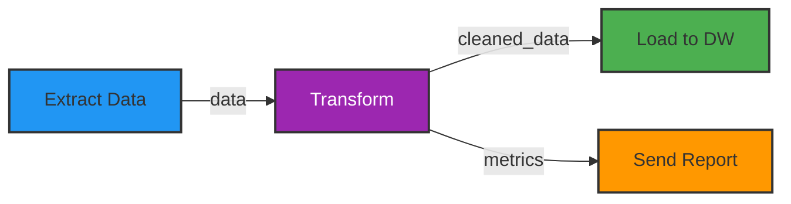
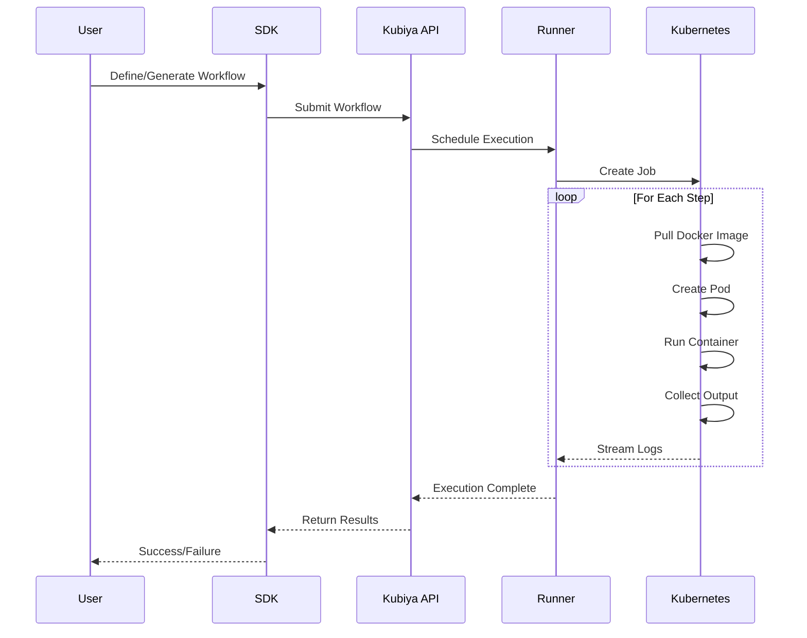
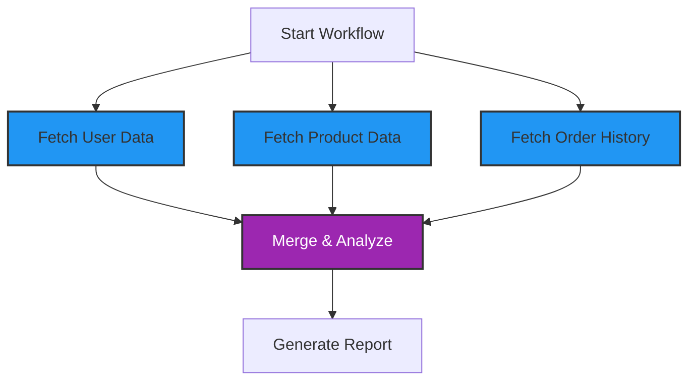
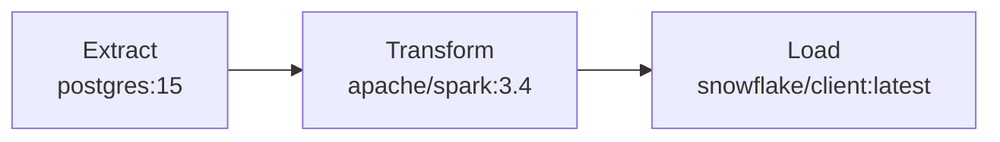
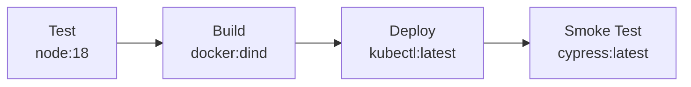
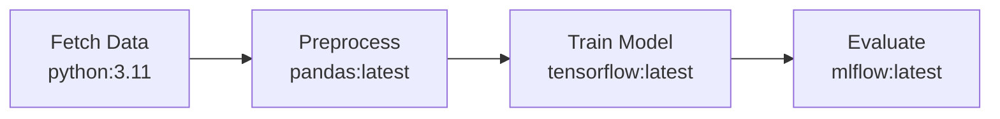

# Workflows Overview

Kubiya workflows are the foundation of intelligent automation. They combine the power of AI generation with the reliability of deterministic execution, all running in containerized environments.

## The DAG Revolution

```mermaid
graph TB
    subgraph "Traditional Script"
        S1[Linear Script]
        S2[Step 1]
        S3[Step 2]
        S4[Step 3]
        
        S1 --> S2
        S2 --> S3
        S3 --> S4
        
        S2 -.->|"Fails?"| FAIL1[Entire Script Fails]
    end
    
    subgraph "Agent Framework"
        A1[Agent Decision]
        A2[Maybe Step A]
        A3[Or Step B?]
        A4[Loop Forever?]
        
        A1 --> A2
        A1 --> A3
        A2 --> A4
        A3 --> A4
        A4 --> A1
        
        A4 -.->|"Lost?"| CHAOS[🌪️ Chaos]
    end
    
    subgraph "Kubiya DAG"
        K1[Define Workflow]
        K2[Step 1: Container A]
        K3[Step 2: Container B]
        K4[Step 3: Container C]
        
        K1 --> K2
        K2 --> K3
        K2 --> K4
        K3 --> SUCCESS[✅ Predictable Success]
        K4 --> SUCCESS
        
        K2 -.->|"Fails?"| RETRY[Retry with Backoff]
        RETRY --> K2
    end
    
    style FAIL1 fill:#FF5252,stroke:#333,stroke-width:2px,color:#fff
    style CHAOS fill:#FF5252,stroke:#333,stroke-width:3px,color:#fff
    style SUCCESS fill:#4CAF50,stroke:#333,stroke-width:3px,color:#fff
```



## What is a Kubiya Workflow?

A workflow in Kubiya is:

- **Directed Acyclic Graph (DAG)**: Steps with dependencies, no circular references
- **Container-Based**: Each step runs in its own Docker container
- **Language Agnostic**: Use Python, Go, Node.js, or any language
- **AI-Generated**: Created from natural language or defined programmatically
- **Deterministic**: Same input → Same execution → Same output

## Core Components

### 1. **Workflow Definition**

```python
from kubiya_workflow_sdk.dsl import workflow, step

# Create a workflow
wf = workflow("my-data-pipeline")
wf.description("Process data through multiple stages")
```

### 2. **Steps**

Each step is an atomic unit of work:

```python
from kubiya_workflow_sdk.dsl import step

# Create a step
data = (
    step("extract-data")
    .docker(
        image="python:3.11",
        command="python extract.py"
    )
    .env(SOURCE="database")
)
```

### 3. **Dependencies**

Steps can depend on outputs from other steps:



### 4. **Containers**

Every step runs in isolation:

<CardGroup cols={3}>
  <Card title="🐳 Any Docker Image" icon="docker">
    Public or private registries
  </Card>
  <Card title="🔒 Complete Isolation" icon="lock">
    No shared state between steps
  </Card>
  <Card title="📦 Dependency Freedom" icon="box">
    Each step has its own environment
  </Card>
</CardGroup>

## Workflow Execution Model



## Key Features

### Parallel Execution

Run independent steps simultaneously:



### Conditional Logic

Dynamic paths based on results:

```python
# Use preconditions for conditional execution
deploy_step = (
    step("deploy-production")
    .docker(image="kubectl:latest", command="kubectl apply -f prod.yaml")
    .preconditions("${QUALITY_SCORE} > 0.8")
)

alert_step = (
    step("alert-team")
    .shell("send-alert.sh 'Data quality issues detected'")
    .preconditions("${QUALITY_SCORE} <= 0.8")
)
```

### Error Handling

Built-in retry mechanisms:

```python
critical = (
    step("critical-operation")
    .docker(image="processor:latest", command="./critical.sh")
    .retry(limit=3, exponential_base=2.0)
    .continue_on(failure=False)
)
```

### Inline AI Agents

Embed intelligent decision-making:

```python
analysis = (
    step("analyze-logs")
    .inline_agent(
        message="Analyze these logs for anomalies",
        agent_name="log-analyzer",
        ai_instructions="You are a log analysis expert...",
        runners=["kubiya-hosted"],
        tools=[
            {
                "name": "parse-logs",
                "type": "docker",
                "image": "alpine:latest",
                "content": "#!/bin/sh\ngrep ERROR /logs/*.log",
                "args": []
            }
        ]
    )
)
```

## Workflow vs Other Approaches

<ComparisonTable>
  <Row>
    <Cell>Feature</Cell>
    <Cell>Bash Scripts</Cell>
    <Cell>Agent Frameworks</Cell>
    <Cell>Traditional DAGs</Cell>
    <Cell>Kubiya Workflows</Cell>
  </Row>
  <Row>
    <Cell>Execution Model</Cell>
    <Cell>Linear, single process</Cell>
    <Cell>Non-deterministic</Cell>
    <Cell>Fixed DAG</Cell>
    <Cell>Dynamic DAG + Containers</Cell>
  </Row>
  <Row>
    <Cell>Error Recovery</Cell>
    <Cell>Manual scripting</Cell>
    <Cell>Agent "figures it out"</Cell>
    <Cell>Basic retry</Cell>
    <Cell>Smart retries + backoff</Cell>
  </Row>
  <Row>
    <Cell>Language Support</Cell>
    <Cell>Bash only</Cell>
    <Cell>Framework language</Cell>
    <Cell>Usually Python</Cell>
    <Cell>Any language/tool</Cell>
  </Row>
  <Row>
    <Cell>AI Integration</Cell>
    <Cell>None</Cell>
    <Cell>Chaotic</Cell>
    <Cell>None</Cell>
    <Cell>Structured inline agents</Cell>
  </Row>
  <Row>
    <Cell>Production Ready</Cell>
    <Cell>No</Cell>
    <Cell>No</Cell>
    <Cell>Yes, but complex</Cell>
    <Cell>Yes, simple</Cell>
  </Row>
</ComparisonTable>

## Real-World Example

Let's see a complete workflow that showcases Kubiya's power:

```python
from kubiya_workflow_sdk.dsl import workflow, step

def create_intelligent_deployment():
    """AI-assisted deployment with safety checks"""
    
    # Create workflow
    wf = (
        workflow("intelligent-deployment")
        .description("AI-assisted deployment with safety checks")
    )
    
    # Run tests in Node.js container
    test = (
        step("run-tests")
        .docker(
            image="node:18",
            command="npm test"
        )
        .timeout(300)  # 5 minutes
        .output("TEST_RESULTS")
    )
    
    # Analyze results with AI
    analysis = (
        step("analyze")
        .inline_agent(
            message="Analyze these test results: ${TEST_RESULTS}",
            agent_name="deployment-analyzer",
            ai_instructions="""You are a deployment safety expert.
            Analyze the test results and return JSON with:
            - should_deploy: boolean
            - confidence: 0-1
            - concerns: array of strings""",
            runners=["kubiya-hosted"],
            llm_model="gpt-4o"
        )
        .depends("run-tests")
        .output("ANALYSIS")
    )
    
    # Build Docker image (conditional)
    build = (
        step("build-docker-image")
        .docker(
            image="docker:dind",
            command="docker build -t myapp:latest ."
        )
        .depends("analyze")
        .preconditions("${ANALYSIS.should_deploy} == true")
        .output("IMAGE_TAG")
    )
    
    # Deploy to Kubernetes (conditional)
    deploy = (
        step("deploy-to-k8s")
        .docker(
            image="bitnami/kubectl:latest",
            command="kubectl set image deployment/app app=myapp:latest -n production"
        )
        .depends("build-docker-image")
    )
    
    # Notify team (conditional success)
    notify_success = (
        step("send-notification")
        .docker(
            image="curlimages/curl:latest",
            command="curl -X POST https://slack.com/webhook -d '{\"text\":\"🚀 Deployed successfully!\"}'"
        )
        .depends("deploy-to-k8s")
    )
    
    # Create incident (conditional failure)
    alert = (
        step("create-incident")
        .docker(
            image="alpine:latest",
            command="echo 'Creating incident with details: ${ANALYSIS.concerns}'"
        )
        .depends("analyze")
        .preconditions("${ANALYSIS.should_deploy} == false")
    )
    
    # Add all steps
    wf.data["steps"].extend([
        test.to_dict(),
        analysis.to_dict(),
        build.to_dict(),
        deploy.to_dict(),
        notify_success.to_dict(),
        alert.to_dict()
    ])
    
    return wf
```

## Visual Workflow Builder

```mermaid
graph TD
    subgraph "Workflow Definition"
        DEF[Natural Language: "Deploy my app safely"]
    end
    
    subgraph "AI Generation"
        GEN[ADK Generates DAG]
    end
    
    subgraph "Execution DAG"
        TEST[Run Tests<br/>node:18]
        AI[Analyze Results<br/>inline_agent]
        
        BUILD[Build Image<br/>docker:dind]
        DEPLOY[Deploy to K8s<br/>kubectl:latest]
        NOTIFY[Send Notification<br/>slack-cli:latest]
        
        ALERT[Create Incident<br/>pagerduty:latest]
    end
    
    DEF --> GEN
    GEN --> TEST
    
    TEST --> AI
    AI -->|"Safe"| BUILD
    AI -->|"Issues"| ALERT
    
    BUILD --> DEPLOY
    DEPLOY --> NOTIFY
    
    style DEF fill:#E1BEE7,stroke:#333,stroke-width:2px
    style GEN fill:#9C27B0,stroke:#333,stroke-width:3px,color:#fff
    style AI fill:#FFF59D,stroke:#333,stroke-width:2px
    style BUILD fill:#4CAF50,stroke:#333,stroke-width:2px
    style ALERT fill:#FF5252,stroke:#333,stroke-width:2px,color:#fff
```

## Benefits of Kubiya Workflows

### 1. **Predictability**
- Deterministic execution paths
- No agent wandering or infinite loops
- Clear audit trails

### 2. **Flexibility**
- Use any programming language
- Integrate any tool or service
- Mix AI and traditional logic

### 3. **Scalability**
- Parallel execution by default
- Kubernetes-native scaling
- Efficient resource usage

### 4. **Maintainability**
- Version control friendly
- Easy to test and debug
- Clear dependencies

## Common Patterns

### ETL Pipeline


### CI/CD Pipeline


### Data Science Pipeline


## Next Steps

Ready to build your first workflow?

<CardGroup cols={2}>
  <Card title="Workflow Architecture" icon="building" href="/workflows/architecture">
    Deep dive into execution model
  </Card>
  <Card title="DSL Reference" icon="code" href="/workflows/dsl-reference">
    Complete workflow syntax guide
  </Card>
  <Card title="Examples" icon="lightbulb" href="/workflows/examples">
    Real-world workflow patterns
  </Card>
  <Card title="Quick Start" icon="rocket" href="/getting-started/quickstart">
    Build your first workflow
  </Card>
</CardGroup> 