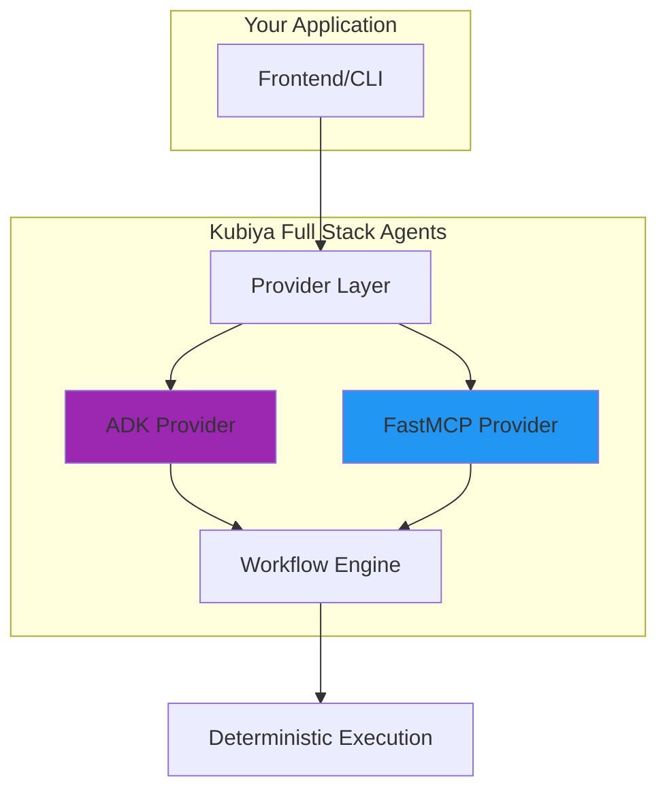

# Full Stack Agents

Full Stack Agents combine Kubiya's deterministic workflow engine with AI providers to create powerful automation solutions. You can choose from different providers based on your needs.

## Available Providers

<CardGroup cols={2}>
  <Card title="ADK Provider" icon="robot" href="/providers/adk/getting-started">
    **Natural language to workflow generation**
    
    Use ADK when you want to:
    - Generate workflows from plain English
    - Let AI plan and execute complex tasks
    - Stream real-time progress to users
    
    ```python
    adk = get_provider("adk")
    result = await adk.compose("Deploy my app with health checks")
    ```
  </Card>
  
  <Card title="FastMCP Provider" icon="plug" href="/providers/fastmcp">
    **Direct tool execution via MCP protocol**
    
    Use FastMCP when you want to:
    - Connect existing MCP-compatible tools
    - Execute specific tools directly
    - Build on standardized protocols
    
    ```python
    mcp = get_provider("fastmcp")
    result = await mcp.execute_tool("database_query", params)
    ```
  </Card>
</CardGroup>

## How It Works

Both providers integrate with Kubiya workflows:



## Quick Example: Using ADK

```python
from kubiya_workflow_sdk.providers import get_provider

# 1. Get the ADK provider
adk = get_provider("adk", api_key="YOUR_KEY")

# 2. Generate and execute a workflow
result = await adk.compose(
    task="Create a Python script that analyzes CSV files",
    mode="act",  # Execute immediately
    stream=True  # Stream progress
)

# 3. Handle streaming results
async for event in result:
    print(event)  # Real-time updates
```

## Quick Example: Using FastMCP

```python
from kubiya_workflow_sdk.providers import get_provider

# 1. Get the FastMCP provider
mcp = get_provider("fastmcp", server_path="/path/to/mcp/server")

# 2. Execute a tool directly
result = await mcp.execute_tool(
    tool_name="file_operations",
    arguments={"action": "read", "path": "/data/report.csv"}
)

print(result)  # Tool execution result
```

## Building Full Stack Applications

### 1. Choose Your Provider
- **ADK**: For natural language interfaces and complex automation
- **FastMCP**: For direct tool integration and MCP compatibility

### 2. Add Frontend
Use the [Vercel AI SDK](/frontend/vercel-ai-sdk) or any frontend framework to create user interfaces.

### 3. Deploy
Run agent servers locally or deploy to production with [Helm charts](/deployment/helm-chart).

## Integration with Existing Frameworks

You can also integrate Kubiya with existing AI frameworks:

<CardGroup cols={2}>
  <Card title="LangGraph" icon="diagram-project" href="/full-stack-agents/existing-frameworks/langgraph">
    Use LangGraph agents within Kubiya workflows
  </Card>
  <Card title="Other Frameworks" icon="puzzle-piece" href="/full-stack-agents/existing-frameworks/overview">
    Integrate LangChain, CrewAI, and more
  </Card>
</CardGroup>

## Next Steps

<Steps>
  <Step title="Pick a Provider">
    Choose between [ADK](/providers/adk/getting-started) for AI generation or [FastMCP](/providers/fastmcp) for tool execution
  </Step>
  
  <Step title="Build Your Agent">
    Follow the provider documentation to create your agent server
  </Step>
  
  <Step title="Add UI (Optional)">
    Create a [frontend](/frontend) for user interaction
  </Step>
  
  <Step title="Deploy">
    Run locally or deploy to production
  </Step>
</Steps> 