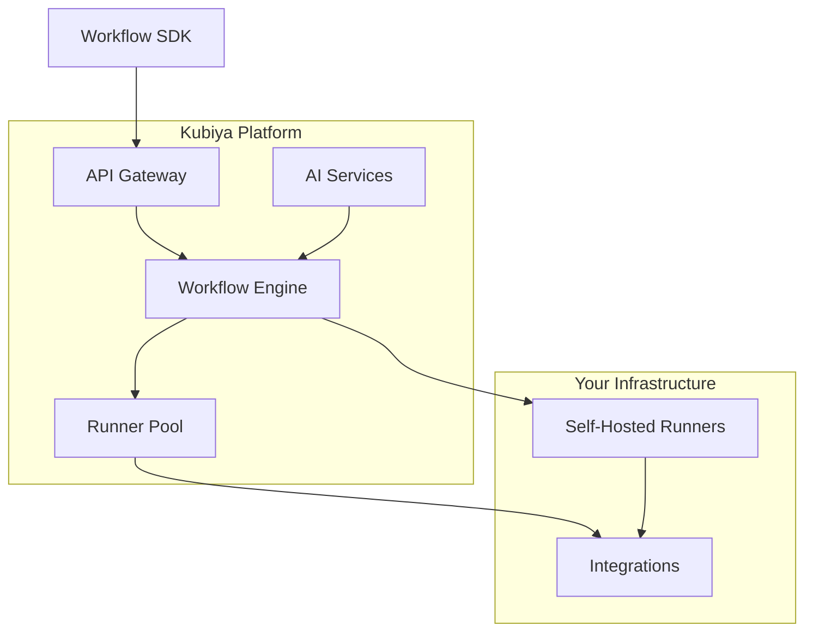

# Kubiya Platform Overview

Kubiya is a comprehensive platform for building, deploying, and managing AI-powered automation workflows.

## Core Components

<CardGroup cols={2}>
  <Card title="Workflow Engine" icon="gears">
    Deterministic workflow execution with support for complex DAGs, parallel execution, and error handling
  </Card>
  
  <Card title="AI Integration" icon="brain">
    Native AI capabilities through providers like ADK for intelligent automation
  </Card>
  
  <Card title="Runner Infrastructure" icon="server">
    Distributed execution across self-hosted or Kubiya-managed runners
  </Card>
  
  <Card title="Tool Ecosystem" icon="toolbox">
    Extensive library of pre-built tools and integrations
  </Card>
</CardGroup>

## Architecture



## Key Features

### 🔄 Deterministic Execution
Unlike traditional AI agents, Kubiya workflows are deterministic and predictable, making them suitable for production environments.

### 🚀 Scalable Infrastructure
Deploy runners in your own infrastructure or use Kubiya-hosted runners for instant scalability.

### 🤖 AI-Powered Automation
Combine deterministic workflows with AI capabilities for intelligent decision-making and natural language interfaces.

### 🔌 Extensive Integrations
Connect to your existing tools and services through pre-built integrations or custom tools.

## Platform Capabilities

### Workflow Management
- Visual workflow designer
- Version control and rollback
- Audit logging and compliance
- Schedule and trigger management

### Security & Compliance
- Role-based access control (RBAC)
- Secrets management
- Audit trails
- SOC2 compliance

### Monitoring & Observability
- Real-time execution tracking
- Performance metrics
- Error tracking and alerts
- Custom dashboards

### Developer Experience
- Comprehensive SDK
- CLI tools
- API-first design
- Local development environment

## Getting Started

<Steps>
  <Step title="Install the SDK">
    ```bash
    pip install kubiya-workflow-sdk
    ```
  </Step>
  
  <Step title="Create Your First Workflow">
    ```python
    from kubiya_workflow_sdk.dsl import workflow
    
    wf = workflow("hello-kubiya").step("greet", "echo 'Hello, Kubiya!'")
    ```
  </Step>
  
  <Step title="Deploy and Execute">
    ```python
    from kubiya_workflow_sdk import execute_workflow
    
    result = execute_workflow(wf.to_dict(), api_key="YOUR_KEY")
    ```
  </Step>
</Steps>

## Next Steps

<CardGroup cols={2}>
  <Card title="Workflows" icon="sitemap" href="/concepts/workflows">
    Learn about workflow concepts
  </Card>
  <Card title="Runners" icon="running" href="/concepts/runners">
    Understand runner infrastructure
  </Card>
  <Card title="Integrations" icon="plug" href="/concepts/integrations">
    Explore available integrations
  </Card>
  <Card title="Quickstart" icon="rocket" href="/getting-started/quickstart">
    Build your first workflow
  </Card>
</CardGroup> 