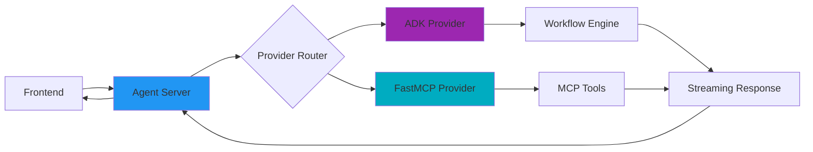

# Agent Servers

Agent servers are the backend layer that connects AI providers (like ADK or FastMCP) to your frontend applications. They handle request routing, streaming, and session management.

## What is an Agent Server?

An agent server:
- Receives requests from your frontend (web UI, CLI, API)
- Routes them to the appropriate provider (ADK, FastMCP, etc.)
- Streams responses back in real-time
- Manages authentication and sessions

## Quick Start

### 1. Start an ADK Agent Server

```bash
# Install Kubiya SDK
pip install kubiya-workflow-sdk

# Start the ADK agent server
python -m kubiya_workflow_sdk.providers.adk.provider

# Server runs on http://localhost:8001
```

### 2. Connect from Frontend

```typescript
// Using Vercel AI SDK
import { streamText } from 'ai';
import { kubiya } from '@kubiya/vercel-ai';

const { textStream } = await streamText({
  model: kubiya('http://localhost:8001'),
  prompt: 'Deploy my application with health checks',
});

// Display streaming results
for await (const text of textStream) {
  console.log(text);
}
```

## How Agent Servers Work



## Available Agent Servers

### ADK Orchestration Server
- **Purpose**: Generate and execute workflows from natural language
- **Port**: 8001 (default)
- **Provider**: ADK
- **Use Case**: "Create a Python script that analyzes logs"

### FastMCP Server
- **Purpose**: Execute MCP-compatible tools directly
- **Port**: 8002 (default)
- **Provider**: FastMCP
- **Use Case**: Direct tool execution like file operations

### Custom Agent Server
Build your own agent server with any provider:

```python
from kubiya_workflow_sdk.server import AgentServer
from kubiya_workflow_sdk.providers import get_provider

# Create custom server
server = AgentServer(
    provider=get_provider("your_provider"),
    port=8003
)

# Start server
server.run()
```

## Configuration

### Environment Variables

```bash
# ADK Configuration
export KUBIYA_API_KEY="your-api-key"
export KUBIYA_ADK_MODEL="gemini-1.5-pro"  # or gpt-4, claude-3

# Server Configuration
export KUBIYA_SERVER_PORT=8001
export KUBIYA_SERVER_HOST="0.0.0.0"

# FastMCP Configuration
export KUBIYA_MCP_SERVER_PATH="/path/to/mcp/server"
```

### Server Options

```python
# Start with custom configuration
python -m kubiya_workflow_sdk.providers.adk.provider \
  --port 8080 \
  --host 0.0.0.0 \
  --model claude-3-opus \
  --api-key $KUBIYA_API_KEY
```

## Streaming Protocol

Agent servers use Server-Sent Events (SSE) for real-time streaming:

```json
// Request
{
  "prompt": "Create a backup script",
  "stream": true
}

// Streaming Response Events
data: {"type": "plan", "content": "Creating backup script..."}
data: {"type": "code", "content": "#!/bin/bash\n..."}
data: {"type": "execution", "content": "Running script..."}
data: {"type": "complete", "content": "Backup completed"}
```

## Deployment

### Local Development
```bash
# Quick start
python -m kubiya_workflow_sdk.providers.adk.provider
```

### Production with Docker
```dockerfile
FROM python:3.11
RUN pip install kubiya-workflow-sdk
CMD ["python", "-m", "kubiya_workflow_sdk.providers.adk.provider"]
```

### Kubernetes with Helm
```bash
helm install kubiya-agent kubiya/agent-server \
  --set provider=adk \
  --set apiKey=$KUBIYA_API_KEY
```

## Next Steps

<Cards>
  <Card title="Try ADK Provider" icon="robot" href="/providers/adk/getting-started">
    Build your first AI workflow
  </Card>
  <Card title="Frontend Integration" icon="browser" href="/frontend">
    Connect to web applications
  </Card>
  <Card title="Production Deployment" icon="rocket" href="/deployment/docker">
    Deploy to production
  </Card>
</Cards> 