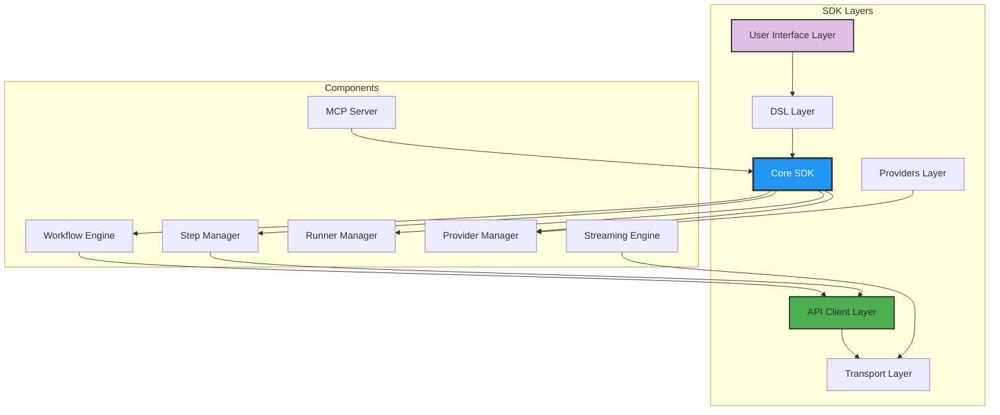
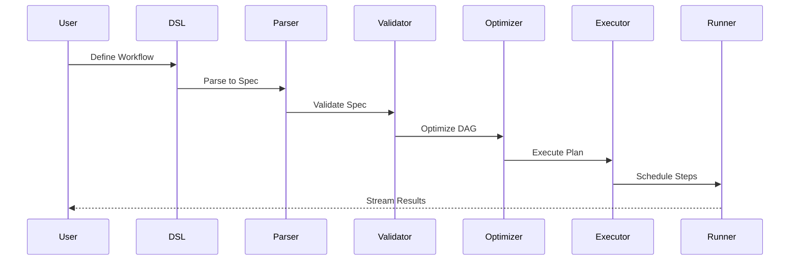

# SDK Deep Dive

Master every aspect of the Kubiya Workflow SDK - from core architecture to advanced patterns.

## SDK Architecture



## Core Components

### 1. **Workflow Engine**

The heart of the SDK - manages workflow lifecycle:

```python
from kubiya_workflow_sdk.core import WorkflowEngine

engine = WorkflowEngine(
    executor="kubernetes",  # or "docker", "local"
    max_parallel=10,
    retry_policy="exponential"
)

# Internal workflow representation
workflow_spec = {
    "name": "data-pipeline",
    "version": "1.0.0",
    "steps": [...],
    "dependencies": {...}
}

result = await engine.execute(workflow_spec)
```

### 2. **Step Management**

Advanced step configuration and execution:

```python
from kubiya_workflow_sdk.core.steps import StepBuilder, StepType

# Create custom step types
builder = StepBuilder()

# Shell step with advanced options
shell_step = builder.create(
    type=StepType.SHELL,
    name="process-data",
    config={
        "image": "python:3.11",
        "command": "python process.py",
        "resources": {"cpu": "2", "memory": "4Gi"},
        "timeout": "30m",
        "retry": {
            "max_attempts": 3,
            "backoff": "exponential",
            "initial_delay": "10s"
        },
        "env_from": [
            {"secret_ref": {"name": "api-keys"}},
            {"config_map_ref": {"name": "app-config"}}
        ]
    }
)

# Container step with health checks
container_step = builder.create(
    type=StepType.CONTAINER,
    name="web-server",
    config={
        "image": "nginx:alpine",
        "ports": {"80/tcp": 8080},
        "health_check": {
            "test": ["CMD", "curl", "-f", "http://localhost/"],
            "interval": "30s",
            "timeout": "10s",
            "retries": 3,
            "start_period": "40s"
        },
        "lifecycle": {
            "pre_stop": {
                "exec": {"command": ["/bin/sh", "-c", "nginx -s quit"]}
            }
        }
    }
)
```

### 3. **DSL Parser**

Transform Python DSL to internal representation:

```python
from kubiya_workflow_sdk.dsl.parser import DSLParser

parser = DSLParser()

# Parse Python function to workflow
@workflow
def my_pipeline():
    data = step.fetch("source.csv")
    processed = step.transform(data, parallel=True)
    step.store(processed)

workflow_spec = parser.parse(my_pipeline)
print(workflow_spec.to_yaml())
```

### 4. **Provider System**

Extensible provider architecture:

```python
from kubiya_workflow_sdk.providers import BaseProvider, ProviderRegistry

class CustomProvider(BaseProvider):
    """Custom AI provider implementation"""
    
    def __init__(self, config):
        self.config = config
        self.client = self._init_client()
    
    async def compose(self, task, mode="plan", **kwargs):
        """Generate workflow from natural language"""
        # Your implementation
        pass
    
    async def execute_workflow(self, workflow, **kwargs):
        """Execute with provider-specific logic"""
        # Your implementation
        pass
    
    def get_capabilities(self):
        return {
            "streaming": True,
            "ai_generation": True,
            "custom_models": ["model1", "model2"]
        }

# Register provider
ProviderRegistry.register("custom", CustomProvider)
```

## Advanced SDK Features

### Workflow Composition

```python
from kubiya_workflow_sdk import Workflow, compose

# Compose multiple workflows
etl_workflow = Workflow("etl", steps=[...])
ml_workflow = Workflow("ml", steps=[...])

# Create composite workflow
pipeline = compose(
    name="data-science-pipeline",
    workflows=[
        etl_workflow,
        ml_workflow.depends_on(etl_workflow)
    ],
    parallel=False
)

# Dynamic composition
def create_regional_pipeline(regions):
    workflows = []
    for region in regions:
        wf = Workflow(f"process-{region}", steps=[...])
        workflows.append(wf)
    
    return compose("multi-region", workflows, parallel=True)
```

### Custom Step Types

```python
from kubiya_workflow_sdk.core.steps import register_step_type

@register_step_type("ml-training")
class MLTrainingStep:
    """Custom step for ML model training"""
    
    def __init__(self, name, model_type, dataset, **kwargs):
        self.name = name
        self.model_type = model_type
        self.dataset = dataset
        self.config = kwargs
    
    def to_container_spec(self):
        return {
            "image": f"ml-trainer:{self.model_type}",
            "command": ["python", "train.py"],
            "args": [
                "--dataset", self.dataset,
                "--model", self.model_type,
                *self._build_args()
            ],
            "resources": {
                "limits": {
                    "nvidia.com/gpu": self.config.get("gpus", 1)
                }
            }
        }

# Use custom step
step.ml_training(
    name="train-model",
    model_type="transformer",
    dataset="s3://data/training.csv",
    gpus=2,
    epochs=100
)
```

### Streaming Architecture

```python
from kubiya_workflow_sdk.streaming import StreamProcessor, EventType

class CustomStreamProcessor(StreamProcessor):
    """Process workflow execution streams"""
    
    def __init__(self):
        self.metrics = {}
        self.alerts = []
    
    async def process_event(self, event):
        if event.type == EventType.STEP_STARTED:
            self.metrics[event.step_name] = {"start": event.timestamp}
            
        elif event.type == EventType.STEP_COMPLETED:
            duration = event.timestamp - self.metrics[event.step_name]["start"]
            await self.send_metric(f"step.{event.step_name}.duration", duration)
            
        elif event.type == EventType.ERROR:
            self.alerts.append(event)
            await self.trigger_alert(event)
    
    async def process_stream(self, stream):
        async for event in stream:
            await self.process_event(event)
            yield self.transform_event(event)

# Use custom processor
processor = CustomStreamProcessor()
async for event in processor.process_stream(workflow.stream()):
    print(event)
```

### Plugin System

```python
from kubiya_workflow_sdk.plugins import Plugin, hook

class MetricsPlugin(Plugin):
    """Add metrics collection to workflows"""
    
    @hook("before_step")
    def before_step(self, step, context):
        self.send_metric(f"step.{step.name}.started", 1)
        context["start_time"] = time.time()
    
    @hook("after_step")
    def after_step(self, step, result, context):
        duration = time.time() - context["start_time"]
        self.send_metric(f"step.{step.name}.duration", duration)
        
        if result.exit_code != 0:
            self.send_metric(f"step.{step.name}.failed", 1)
    
    @hook("workflow_completed")
    def workflow_completed(self, workflow, result):
        self.send_metric(f"workflow.{workflow.name}.completed", 1)

# Register plugin
workflow.register_plugin(MetricsPlugin())
```

### Context Management

```python
from kubiya_workflow_sdk.context import WorkflowContext, ContextVar

# Define context variables
api_key = ContextVar("api_key", secret=True)
environment = ContextVar("environment", default="development")

# Use in workflows
@workflow
def deployment_pipeline():
    ctx = WorkflowContext.current()
    
    if ctx[environment] == "production":
        step.validate_permissions()
    
    step.deploy(
        api_key=ctx[api_key],
        env=ctx[environment]
    )

# Set context for execution
with WorkflowContext(api_key="...", environment="production"):
    result = deployment_pipeline.execute()
```

## SDK Internals

### Execution Pipeline



### Error Handling

```python
from kubiya_workflow_sdk.errors import (
    WorkflowError,
    StepError,
    ValidationError,
    ExecutionError
)

# Custom error handlers
class RetryableError(WorkflowError):
    """Errors that can be retried"""
    pass

@workflow.error_handler(RetryableError)
def handle_retryable(error, context):
    if context.retry_count < 3:
        return "retry"
    else:
        return "fail"

@workflow.error_handler(ValidationError)
def handle_validation(error, context):
    # Log and skip
    logger.error(f"Validation failed: {error}")
    return "skip"
```

### Performance Optimization

```python
from kubiya_workflow_sdk.optimization import WorkflowOptimizer

optimizer = WorkflowOptimizer(
    strategies=[
        "parallel_detection",  # Auto-detect parallelizable steps
        "resource_pooling",    # Reuse containers
        "cache_optimization",  # Smart caching
        "dead_code_elimination"  # Remove unreachable steps
    ]
)

# Optimize workflow
optimized = optimizer.optimize(workflow)
print(f"Optimization report: {optimizer.get_report()}")
```

## Best Practices

### 1. **Workflow Design**

```python
# Good: Modular, reusable steps
@workflow
def process_data(source, destination):
    data = step.fetch(source)
    validated = step.validate(data)
    transformed = step.transform(validated)
    step.store(transformed, destination)

# Bad: Monolithic step
@workflow
def process_all():
    step.do_everything()  # Too much in one step
```

### 2. **Resource Management**

```python
# Good: Explicit resource limits
step.process(
    resources={
        "requests": {"cpu": "1", "memory": "2Gi"},
        "limits": {"cpu": "2", "memory": "4Gi"}
    }
)

# Bad: No resource constraints
step.process()  # May consume unlimited resources
```

### 3. **Error Handling**

```python
# Good: Graceful degradation
try:
    result = step.primary_service()
except ServiceError:
    result = step.fallback_service()
    step.alert_team("Using fallback service")

# Bad: Let it crash
result = step.primary_service()  # No error handling
```

## SDK Ecosystem

<CardGroup cols={2}>
  <Card title="CLI Tools" icon="terminal">
    Command-line interface for workflow management
  </Card>
  <Card title="VS Code Extension" icon="code">
    IntelliSense and debugging for workflows
  </Card>
  <Card title="Testing Framework" icon="flask">
    Unit and integration testing utilities
  </Card>
  <Card title="Monitoring Tools" icon="chart-line">
    Real-time workflow monitoring
  </Card>
</CardGroup>

## Next Steps

<CardGroup cols={2}>
  <Card title="API Reference" icon="book" href="/sdk/api-reference">
    Complete SDK API documentation
  </Card>
  <Card title="Examples" icon="lightbulb" href="/sdk/examples">
    Real-world SDK usage patterns
  </Card>
  <Card title="Contributing" icon="code-branch" href="/sdk/contributing">
    Contribute to the SDK
  </Card>
  <Card title="Changelog" icon="clock" href="/sdk/changelog">
    SDK version history
  </Card>
</CardGroup> 