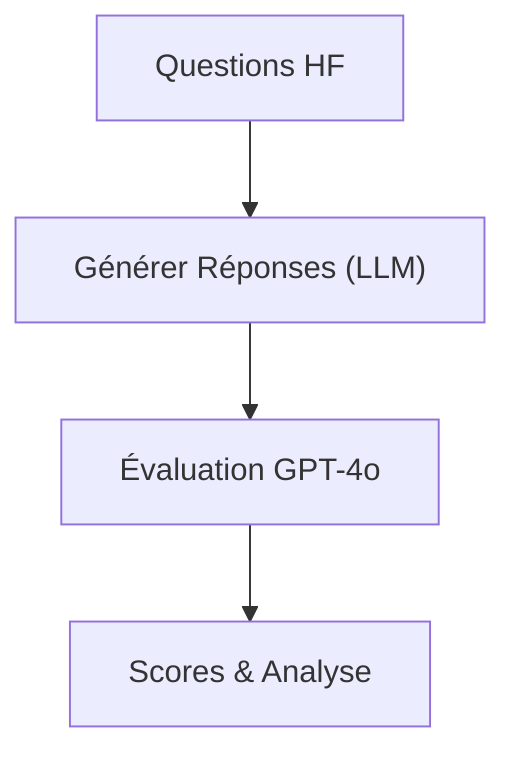
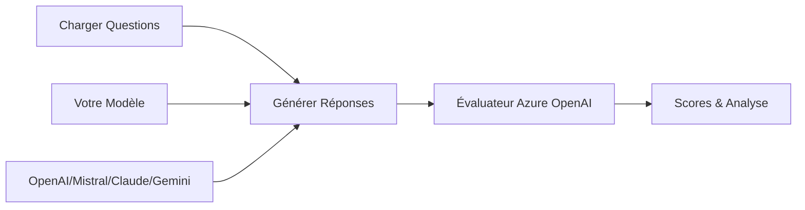
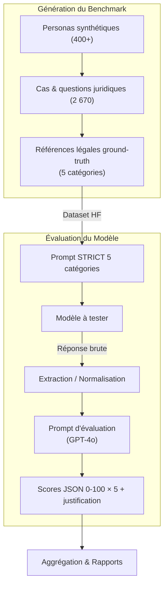

# Les Audits-Affaires - Harness d'Évaluation LLM

<p align="left">🇬🇧 <a href="README_EN.md">English version</a></p>
<p align="center">
  
</p>

Un framework d'évaluation complet pour les modèles de langage sur le benchmark juridique français **Les Audits-Affaires**.

## 🎯 Aperçu

Ce harness d'évaluation fournit une méthode systématique pour évaluer les LLM sur des tâches juridiques françaises en utilisant le dataset `legmlai/les-audits-affaires`. Le framework utilise Azure OpenAI GPT-4o comme évaluateur expert pour noter les réponses des modèles selon cinq catégories juridiques clés :

- **Action Requise** - Actions légales nécessaires
- **Délai Légal** - Échéances et délais légaux
- **Documents Obligatoires** - Documentation requise
- **Impact Financier** - Implications financières
- **Conséquences Non-Conformité** - Conséquences du non-respect

## 🗺️ Workflow en un coup d'œil



## 🚀 Fonctionnalités

- **Évaluation Asynchrone/Synchrone** : Traitement par batch efficace avec concurrence contrôlée
- **Notation Complète** : Évaluation sur 5 catégories avec justifications détaillées
- **Gestion d'Erreurs Robuste** : Gestion gracieuse des échecs d'API et tentatives de reprise
- **Formats de Sortie Multiples** : JSON, CSV, Excel et rapports Markdown
- **Suivi des Progrès** : Barres de progression en temps réel et sauvegarde intermédiaire
- **Outils d'Analyse** : Visualisation et analyse statistique intégrées
- **Configuration Flexible** : Personnalisation facile des paramètres d'évaluation
- **Fournisseurs Externes** : Support pour OpenAI, Mistral, Claude, Gemini

## 📋 Prérequis

- Python 3.8+
- Accès à l'API Azure OpenAI
- Accès à votre endpoint de modèle ou clés API des fournisseurs externes

## 🛠️ Installation

### Installation via pip (recommandée)
```bash
pip install les-audits-affaires-eval-harness
```

### Installation depuis les sources
```bash
git clone <repository-url>
cd les-audits-affaires-eval-harness
pip install -e .
```

### Installation pour le développement
```bash
pip install -e ".[dev]"
```

## ⚙️ Configuration

### Variables d'Environnement

Créez un fichier `.env` basé sur `.env.example` :

```bash
# Configuration Azure OpenAI (obligatoire)
AZURE_OPENAI_ENDPOINT=https://votre-endpoint.cognitiveservices.azure.com/
AZURE_OPENAI_API_KEY=votre_clé_api
AZURE_OPENAI_API_VERSION=2024-12-01-preview
AZURE_OPENAI_DEPLOYMENT_NAME=gpt-4o

# Configuration du modèle à évaluer
MODEL_ENDPOINT=https://votre-modele.ngrok-free.app/generate
MODEL_NAME=nom-de-votre-modele

# Fournisseurs externes (optionnel)
OPENAI_API_KEY=sk-...
MISTRAL_API_KEY=...
ANTHROPIC_API_KEY=sk-ant-...
GOOGLE_API_KEY=...

# Configuration d'évaluation
MAX_SAMPLES=1000
BATCH_SIZE=20
TEMPERATURE=0.1
MAX_TOKENS=32768
CONCURRENT_REQUESTS=150
```

## 🚀 Utilisation

### Interface en Ligne de Commande

```bash
# Évaluation de base (asynchrone par défaut)
lae-eval run --max-samples 50

# Évaluation synchrone (traitement séquentiel)
lae-eval run --sync --max-samples 50

# Mode strict avec formatage amélioré (asynchrone)
lae-eval run --strict --max-samples 100

# Mode strict synchrone
lae-eval run --sync --strict --max-samples 100

# Reprendre depuis un échantillon spécifique
lae-eval run --start-from 200

# Tester les fournisseurs externes
lae-eval test-providers

# Générer des analyses
lae-eval analyze --plots --report --excel
```

### Utilisation Programmatique

```python
from les_audits_affaires_eval import LesAuditsAffairesEvaluator
from les_audits_affaires_eval.clients import create_client
import asyncio

# Évaluation avec fournisseur externe (asynchrone)
async with create_client("openai", model="gpt-4o") as client:
    response = await client.generate_response("Question juridique...")

# Évaluation asynchrone (par défaut, haut débit)
evaluator = LesAuditsAffairesEvaluator(use_chat_endpoint=True)
    results = await evaluator.run_evaluation(max_samples=100)

# Évaluation synchrone (séquentielle, plus simple)
evaluator = LesAuditsAffairesEvaluator(use_strict_mode=True)
results = evaluator.run_evaluation_sync(max_samples=50)

# Utiliser asyncio.run() pour les méthodes async
results = asyncio.run(evaluator.run_evaluation(max_samples=100))
```

## 🤖 Modèles Supportés

### Modèles Locaux/Personnalisés
- Tout endpoint HTTP avec endpoints `/generate` ou `/chat`
- Configurable via `MODEL_ENDPOINT` et `MODEL_NAME`

### Fournisseurs Externes
- **OpenAI** : GPT-4o, GPT-4-turbo, GPT-3.5-turbo
- **Mistral** : mistral-large-latest, mistral-medium-latest
- **Claude** : claude-3-5-sonnet, claude-3-haiku
- **Gemini** : gemini-1.5-pro, gemini-1.0-pro

## 🔄 Fonctionnement



1. **Chargement** des questions juridiques depuis le dataset HuggingFace
2. **Génération** des réponses via votre modèle ou fournisseurs externes
3. **Évaluation** des réponses avec Azure OpenAI et prompts d'expertise juridique
4. **Notation** sur 5 catégories juridiques (0-100 chacune)
5. **Analyse** des résultats avec graphiques, rapports et exports Excel

## 🛤️ Pipeline Technique Complète

Le cadre d'évaluation suit **un pipeline à six étapes** :



### 1. Génération du Dataset
- 400 + personas couvrant régions, secteurs, tailles d'entreprise
- 9 codes juridiques français (commerce, travail, finance, etc.)
- Chaque cas contient : `question` + **ground-truth** structuré sur 5 rubriques
- Pipeline open-source (voir [`datasets/legmlai/les-audits-affaires`](https://huggingface.co/datasets/legmlai/les-audits-affaires))

### 2. Prompt STRICT (injection dans le modèle à tester)
```text
Tu es un expert juridique français spécialisé en droit des affaires…

INSTRUCTIONS CRITIQUES – RESPECTE CE FORMAT EXACTEMENT :
Réponds UNIQUEMENT avec ces 5 éléments dans cet ordre précis :
• Action Requise: … parce que [référence légale]
• Délai Legal: … parce que …
• Documents Obligatoires: … parce que …
• Impact Financier: … parce que …
• Conséquences Non-Conformité: … parce que …
```
Objectif : **forcer** le modèle à structurer sa réponse et citer la loi.

### 3. Extraction / Normalisation
- Nettoyage éventuel (tags, markdown)
- Vérification de la présence des 5 rubriques

### 4. Prompt d'Évaluation (LLM Evaluator)
```text
Tu es un juriste-expert français …
Barème : 5 rubriques × 100 pts.

"question": "{user_question}",
"model_response": "{model_response}",
"ground_truth": { … }

# Format JSON strict demandé
{
  "score_global": 0,
  "scores": { … },
  "justifications": { … }
}
```
Le **GPT-4o** (ou tout autre LLM expert) renvoie un JSON structuré avec :
- `scores` individuels (0-100)
- `score_global` (moyenne simple)
- `justifications` textuelles

### 5. Agrégation & Rapports
- Calcul de statistiques (moyennes, médianes, écarts-types)
- Export : CSV, Excel, JSONL
- Visualisations automatiques (distribution des scores, heatmaps, etc.)

### 6. Suivi & Reproductibilité
- Chaque exécution produit un dossier `results/<model>/`
- Les logs détaillent prompts, réponses, scores, temps de latence
- Pipeline entièrement scripté via `lae-eval run` → `lae-eval analyze`

> 📌 **But final** : fournir **un indicateur fiable de compétence juridique** des LLM en droit des affaires français, afin de guider le développement de modèles experts plus petits et sobres en carbone.

## 📊 Format de Réponse Attendu

Les modèles doivent répondre avec cette structure :

```
[Analyse et raisonnement...]

• Action Requise: [action spécifique] parce que [référence légale]
• Délai Legal: [échéance] parce que [référence légale]
• Documents Obligatoires: [documents requis] parce que [référence légale]
• Impact Financier: [coûts/frais] parce que [référence légale]
• Conséquences Non-Conformité: [risques] parce que [référence légale]
```

## 📁 Structure des Résultats

L'évaluation génère plusieurs fichiers dans le répertoire `results/{nom_modele}/` :

```
results/nom_modele/
├── evaluation_results.json      # Résultats complets
├── evaluation_summary.json      # Statistiques résumées
├── evaluation_summary.csv       # Format CSV pour analyse
├── detailed_results.jsonl       # Résultats détaillés ligne par ligne
├── analysis_report.md           # Rapport d'analyse complet
├── evaluation_results.xlsx      # Excel avec plusieurs feuilles
├── score_distributions.png      # Graphiques de distribution des scores
├── correlation_heatmap.png      # Carte de corrélation des catégories
└── evaluation.log              # Logs d'exécution détaillés
```

## 📈 Métriques d'Évaluation

### Système de Notation

Chaque échantillon reçoit des scores (0-100) sur 5 catégories :
- **Action Requise** : Actions légales nécessaires
- **Délai Légal** : Échéances et délais légaux
- **Documents Obligatoires** : Documentation requise
- **Impact Financier** : Implications financières
- **Conséquences Non-Conformité** : Conséquences du non-respect

### Score Global
Le score global est la moyenne arithmétique des 5 scores de catégorie.

### Critères d'Évaluation
Pour chaque catégorie, l'évaluateur Azure OpenAI évalue :
- **Exactitude juridique** : Précision légale
- **Concordance** : Accord avec la vérité terrain
- **Clarté** : Clarté de la réponse
- **Justification** : Qualité du raisonnement juridique

## 🔧 Développement

```bash
# Installation pour développement
pip install -e ".[dev]"

# Exécuter les tests
make test

# Formater le code
make format

# Vérifier la qualité
make quality

# Voir toutes les commandes
make help
```

## 🏗️ Architecture

```
src/les_audits_affaires_eval/
├── clients/              # Clients de modèles
│   ├── external_providers.py
│   └── model_client.py
├── evaluation/           # Logique d'évaluation principale
├── utils.py             # Analyse et visualisation
├── config.py            # Configuration
└── cli.py               # Interface en ligne de commande
```

## 🔍 Dépannage

### Problèmes Courants

1. **Erreurs de Connexion** :
   - Vérifiez que votre endpoint de modèle est accessible
   - Vérifiez que le tunnel ngrok est actif
   - Assurez-vous de la connectivité réseau

2. **Erreurs Azure OpenAI** :
   - Vérifiez la clé API et l'endpoint
   - Vérifiez les quotas et limites de taux
   - Assurez-vous que le nom de déploiement est correct

3. **Problèmes de Chargement du Dataset** :
   - Vérifiez la connexion internet
   - Vérifiez l'accès au dataset HuggingFace
   - Essayez de charger manuellement avec la bibliothèque `datasets`

### Mode Debug

Activez les logs détaillés :

```python
import logging
logging.basicConfig(level=logging.DEBUG)
```

## 📚 Détails du Benchmark

- **Dataset** : `legmlai/les-audits-affaires` sur HuggingFace
- **Questions** : 1000+ scénarios de droit des affaires français
- **Évaluation** : GPT-4o avec prompts d'expert juridique
- **Notation** : 0-100 par catégorie, moyenné pour le score global
- **Langues** : Domaine juridique français

## 🤝 Contribution

1. Forkez le dépôt
2. Créez une branche de fonctionnalité
3. Effectuez vos modifications avec des tests
4. Exécutez `make quality`
5. Soumettez une pull request

## 📄 Licence

Licence MIT - voir le fichier LICENSE pour les détails.

## 🙏 Remerciements

- **Dataset Les Audits-Affaires** : `legmlai/les-audits-affaires`
- **Azure OpenAI** : Pour les services d'évaluation
- **HuggingFace** : Pour l'hébergement du dataset et les outils

---

**Bonne Évaluation ! 🚀** 