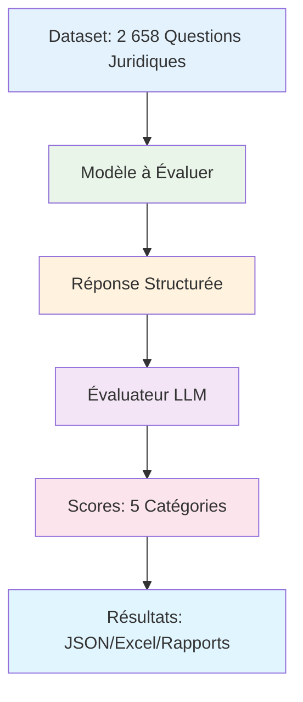

# Les Audits-Affaires - Harness d'Évaluation LLM

<p align="left">🇬🇧 <a href="README_EN.md">English version</a></p>
<p align="center">
  
</p>

Un framework d'évaluation complet pour tester les modèles de langage sur le benchmark juridique français **Les Audits-Affaires**. Évalue les modèles sur 5 catégories de compétences juridiques en utilisant le dataset `legmlai/les-audits-affaires`.

## Démarrage Rapide

### Installation
```bash
pip install -e .
```

### Utilisation de Base
```bash
# Évaluer OpenAI GPT-4o avec évaluateur Azure OpenAI
export EXTERNAL_PROVIDER=openai
export EXTERNAL_MODEL=gpt-4o
export OPENAI_API_KEY=votre_cle_openai
export AZURE_OPENAI_API_KEY=votre_cle_azure
export AZURE_OPENAI_ENDPOINT=votre_endpoint_azure

lae-eval run --max-samples 10
```

## Configuration

### Modèle à Évaluer

**Fournisseurs Externes :**
```bash
# OpenAI
export EXTERNAL_PROVIDER=openai
export EXTERNAL_MODEL=gpt-4o
export OPENAI_API_KEY=votre_cle

# Mistral
export EXTERNAL_PROVIDER=mistral  
export EXTERNAL_MODEL=mistral-large-latest
export MISTRAL_API_KEY=votre_cle

# Claude
export EXTERNAL_PROVIDER=claude
export EXTERNAL_MODEL=claude-3-5-sonnet-20241022
export ANTHROPIC_API_KEY=votre_cle

# Gemini
export EXTERNAL_PROVIDER=gemini
export EXTERNAL_MODEL=gemini-1.5-pro
export GOOGLE_API_KEY=votre_cle
```

**Modèles Locaux :**
```bash
export MODEL_ENDPOINT=http://localhost:8000/generate
export MODEL_NAME=nom_de_votre_modele
```

### Configuration de l'Évaluateur

**Azure OpenAI (Par défaut) :**
```bash
export AZURE_OPENAI_API_KEY=votre_cle
export AZURE_OPENAI_ENDPOINT=votre_endpoint
```

**Évaluateurs Alternatifs :**
```bash
# OpenAI comme évaluateur
export EVALUATOR_PROVIDER=openai
export EVALUATOR_MODEL=gpt-4o
export EVALUATOR_OPENAI_API_KEY=votre_cle

# Mistral comme évaluateur
export EVALUATOR_PROVIDER=mistral
export EVALUATOR_MODEL=mistral-large-latest
export EVALUATOR_MISTRAL_API_KEY=votre_cle

# Claude comme évaluateur
export EVALUATOR_PROVIDER=claude
export EVALUATOR_MODEL=claude-3-5-sonnet-20241022
export EVALUATOR_ANTHROPIC_API_KEY=votre_cle

# Gemini comme évaluateur
export EVALUATOR_PROVIDER=gemini
export EVALUATOR_MODEL=gemini-1.5-pro
export EVALUATOR_GOOGLE_API_KEY=votre_cle

# Modèle local comme évaluateur
export EVALUATOR_PROVIDER=local
export EVALUATOR_ENDPOINT=http://localhost:8001/generate
```

## Commandes

### Lancer l'Évaluation
```bash
# Évaluation complète (2 658 échantillons)
lae-eval run

# Échantillons limités
lae-eval run --max-samples 100

# Mode synchrone (plus stable)
lae-eval run --sync

# Endpoint chat pour modèles locaux
lae-eval run --chat

# Répertoire de sortie personnalisé
lae-eval run --output-dir resultats_personnalises
```

### Tester les Composants
```bash
# Tester la connexion au modèle
lae-eval test-model

# Tester la connexion à l'évaluateur
lae-eval test-evaluator

# Afficher la configuration actuelle
lae-eval info
```

## Architecture

### Flux de Travail



### Format de Réponse Requis

Les modèles doivent répondre avec cette structure :
```
[Analyse et raisonnement...]

• Action Requise: [action spécifique] parce que [référence légale]
• Délai Legal: [délai] parce que [référence légale]
• Documents Obligatoires: [documents requis] parce que [référence légale]
• Impact Financier: [coûts/frais] parce que [référence légale]
• Conséquences Non-Conformité: [risques] parce que [référence légale]
```

### Catégories d'Évaluation

1. **Action Requise** - Actions légales nécessaires
2. **Délai Legal** - Échéances et délais légaux
3. **Documents Obligatoires** - Documentation obligatoire
4. **Impact Financier** - Implications financières
5. **Conséquences Non-Conformité** - Conséquences du non-respect

Chaque catégorie notée de 0 à 100 avec justifications détaillées.

## Résultats

### Fichiers de Sortie
- `evaluation_results.json` - Résultats détaillés avec scores et justifications
- `evaluation_summary.csv` - Statistiques agrégées
- `evaluation_report.xlsx` - Rapport Excel multi-feuilles avec visualisations
- `score_distribution.png` - Graphiques de distribution des scores
- `evaluation.log` - Logs d'exécution détaillés

### Métriques Clés
- **Score Global** - Moyenne de toutes les catégories
- **Scores par Catégorie** - Performance individuelle par domaine juridique
- **Qualité des Réponses** - Conformité du format et complétude
- **Statistiques de Traitement** - Temps et taux d'erreur

## Dépannage

### Problèmes Courants

**Erreurs de Connexion API :**
```bash
# Vérifier les identifiants
lae-eval info
env | grep -E "(API_KEY|ENDPOINT)"

# Tester avec un échantillon minimal
lae-eval run --max-samples 1
```

**Problèmes de Modèle Local :**
```bash
# Tester l'endpoint manuellement
curl -X POST http://localhost:8000/generate \
  -H "Content-Type: application/json" \
  -d '{"prompt": "Test", "max_new_tokens": 100}'

# Essayer l'endpoint chat
lae-eval run --chat
```

**Problèmes de Performance :**
```bash
# Réduire la concurrence
export BATCH_SIZE=5
export CONCURRENT_REQUESTS=10

# Utiliser le mode synchrone
lae-eval run --sync
```

### Mode Debug
```bash
export LOG_LEVEL=DEBUG
lae-eval run --max-samples 1
# Vérifier evaluation.log pour les informations détaillées
```

## Dataset

**Source :** `legmlai/les-audits-affaires` sur HuggingFace
- 2 658 scénarios de droit des affaires français
- Questions juridiques réelles de divers contextes d'entreprise
- Ground truth validée par des experts sur 5 catégories juridiques
- Couverture complète du droit commercial français

## Développement

### Configuration
```bash
git clone <repository-url>
cd les-audits-affaires-eval-harness
python -m venv venv
source venv/bin/activate
pip install -e ".[dev]"
```

### Qualité du Code
```bash
pytest tests/
black src/ tests/
isort src/ tests/
mypy src/
```

## Licence

Licence MIT - voir le fichier LICENSE pour les détails.

## Support

1. Consultez ce README pour les solutions courantes
2. Lancez `lae-eval info` pour vérifier la configuration
3. Testez avec `--max-samples 1` d'abord
4. Vérifiez `evaluation.log` pour les messages d'erreur détaillés
5. Ouvrez une issue si les problèmes persistent 