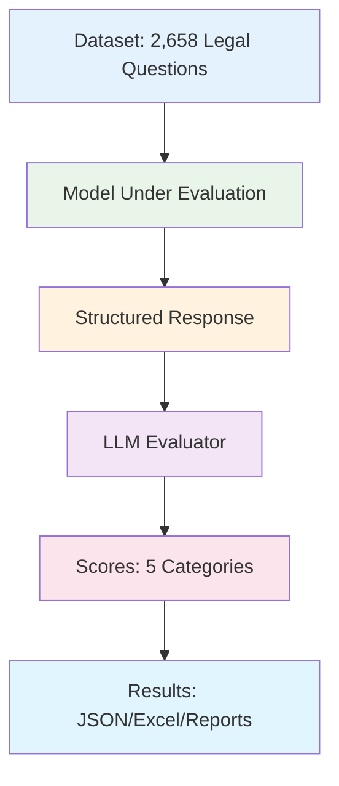

# Les Audits-Affaires - LLM Evaluation Harness

<p align="left">🇫🇷 <a href="README.md">Version française</a></p>
<p align="center">
  
</p>

A comprehensive evaluation framework for testing language models on the French business law benchmark **Les Audits-Affaires**. Evaluates models across 5 legal competency categories using the `legmlai/les-audits-affaires` dataset.

## Quick Start

### Installation
```bash
pip install -e .
```

### Basic Usage
```bash
# Evaluate OpenAI GPT-4o with Azure OpenAI evaluator
export EXTERNAL_PROVIDER=openai
export EXTERNAL_MODEL=gpt-4o
export OPENAI_API_KEY=your_openai_key
export AZURE_OPENAI_API_KEY=your_azure_key
export AZURE_OPENAI_ENDPOINT=your_azure_endpoint

lae-eval run --max-samples 10
```

## Configuration

### Model Under Evaluation

**External Providers:**
```bash
# OpenAI
export EXTERNAL_PROVIDER=openai
export EXTERNAL_MODEL=gpt-4o
export OPENAI_API_KEY=your_key

# Mistral
export EXTERNAL_PROVIDER=mistral  
export EXTERNAL_MODEL=mistral-large-latest
export MISTRAL_API_KEY=your_key

# Claude
export EXTERNAL_PROVIDER=claude
export EXTERNAL_MODEL=claude-3-5-sonnet-20241022
export ANTHROPIC_API_KEY=your_key

# Gemini
export EXTERNAL_PROVIDER=gemini
export EXTERNAL_MODEL=gemini-1.5-pro
export GOOGLE_API_KEY=your_key
```

**Local Models:**
```bash
export MODEL_ENDPOINT=http://localhost:8000/generate
export MODEL_NAME=your_model_name
```

### Evaluator Configuration

**Azure OpenAI (Default):**
```bash
export AZURE_OPENAI_API_KEY=your_key
export AZURE_OPENAI_ENDPOINT=your_endpoint
```

**Alternative Evaluators:**
```bash
# OpenAI as evaluator
export EVALUATOR_PROVIDER=openai
export EVALUATOR_MODEL=gpt-4o
export EVALUATOR_OPENAI_API_KEY=your_key

# Mistral as evaluator
export EVALUATOR_PROVIDER=mistral
export EVALUATOR_MODEL=mistral-large-latest
export EVALUATOR_MISTRAL_API_KEY=your_key

# Claude as evaluator
export EVALUATOR_PROVIDER=claude
export EVALUATOR_MODEL=claude-3-5-sonnet-20241022
export EVALUATOR_ANTHROPIC_API_KEY=your_key

# Gemini as evaluator
export EVALUATOR_PROVIDER=gemini
export EVALUATOR_MODEL=gemini-1.5-pro
export EVALUATOR_GOOGLE_API_KEY=your_key

# Local model as evaluator
export EVALUATOR_PROVIDER=local
export EVALUATOR_ENDPOINT=http://localhost:8001/generate
```

## Commands

### Run Evaluation
```bash
# Full evaluation (2,658 samples)
lae-eval run

# Limited samples
lae-eval run --max-samples 100

# Synchronous mode (more stable)
lae-eval run --sync

# Chat endpoint for local models
lae-eval run --chat

# Custom output directory
lae-eval run --output-dir custom_results
```

### Test Components
```bash
# Test model connection
lae-eval test-model

# Test evaluator connection
lae-eval test-evaluator

# Show current configuration
lae-eval info
```

## Architecture

### Workflow



### Required Response Format

Models must respond with this structure:
```
[Analysis and reasoning...]

• Action Requise: [specific action] parce que [legal reference]
• Délai Legal: [timeframe] parce que [legal reference]
• Documents Obligatoires: [required documents] parce que [legal reference]
• Impact Financier: [costs/fees] parce que [legal reference]
• Conséquences Non-Conformité: [risks] parce que [legal reference]
```

### Evaluation Categories

1. **Action Requise** - Required legal actions
2. **Délai Legal** - Legal timeframes and deadlines
3. **Documents Obligatoires** - Mandatory documentation
4. **Impact Financier** - Financial implications
5. **Conséquences Non-Conformité** - Non-compliance consequences

Each category scored 0-100 with detailed justifications.

## Results

### Output Files
- `evaluation_results.json` - Detailed results with scores and justifications
- `evaluation_summary.csv` - Aggregated statistics
- `evaluation_report.xlsx` - Multi-sheet Excel report with visualizations
- `score_distribution.png` - Score distribution charts
- `evaluation.log` - Detailed execution logs

### Key Metrics
- **Global Score** - Average across all categories
- **Category Scores** - Individual performance per legal area
- **Response Quality** - Format compliance and completeness
- **Processing Stats** - Timing and error rates

## Troubleshooting

### Common Issues

**API Connection Errors:**
```bash
# Verify credentials
lae-eval info
env | grep -E "(API_KEY|ENDPOINT)"

# Test with minimal sample
lae-eval run --max-samples 1
```

**Local Model Issues:**
```bash
# Test endpoint manually
curl -X POST http://localhost:8000/generate \
  -H "Content-Type: application/json" \
  -d '{"prompt": "Test", "max_new_tokens": 100}'

# Try chat endpoint
lae-eval run --chat
```

**Performance Issues:**
```bash
# Reduce concurrency
export BATCH_SIZE=5
export CONCURRENT_REQUESTS=10

# Use synchronous mode
lae-eval run --sync
```

### Debug Mode
```bash
export LOG_LEVEL=DEBUG
lae-eval run --max-samples 1
# Check evaluation.log for detailed information
```

## Dataset

**Source:** `legmlai/les-audits-affaires` on HuggingFace
- 2,658 French business law scenarios
- Real-world legal questions from various business contexts
- Expert-validated ground truth across 5 legal categories
- Comprehensive coverage of French commercial law

## Development

### Setup
```bash
git clone <repository-url>
cd les-audits-affaires-eval-harness
python -m venv venv
source venv/bin/activate
pip install -e ".[dev]"
```

### Code Quality
```bash
pytest tests/
black src/ tests/
isort src/ tests/
mypy src/
```

## License

MIT License - see LICENSE file for details.

## Support

1. Check this README for common solutions
2. Run `lae-eval info` to verify configuration
3. Test with `--max-samples 1` first
4. Check `evaluation.log` for detailed error messages
5. Open an issue if problems persist 