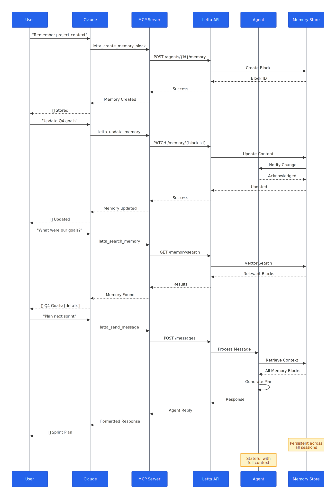

# Letta MCP Server - Technical Diagrams

This document provides detailed information about the technical diagrams used throughout the Letta MCP Server documentation.

## Overview

All diagrams are created using [Mermaid](https://mermaid.js.org/), a powerful diagramming tool that generates diagrams from text definitions. This approach ensures:

- **Version Control**: Diagram source files can be tracked in Git
- **Consistency**: All diagrams share the same visual style
- **Maintainability**: Easy to update without design tools
- **Accessibility**: Text-based definitions can be read by screen readers

## Diagram Catalog

### 1. System Architecture (`architecture.mmd`)


**Purpose**: Visualizes the complete system architecture showing how Letta MCP Server bridges Claude and Letta.ai.

**Key Elements**:
- Claude ecosystem (Desktop/Code)
- MCP protocol layer
- Letta MCP Server components (connection pooling, error handling, streaming)
- Letta.ai platform services
- Agent ecosystem

**When to Update**: When adding new components, changing the architecture, or modifying the data flow.

### 2. Installation Flow (`installation-flow.mmd`)


**Purpose**: Step-by-step visual guide for installing and configuring the Letta MCP Server.

**Key Elements**:
- Prerequisites check
- Installation methods (automatic vs manual)
- Configuration steps
- Verification process

**When to Update**: When installation process changes or new configuration options are added.

### 3. Tool Catalog (`tool-catalog.mmd`)


**Purpose**: Comprehensive mind map of all available MCP tools organized by category.

**Key Elements**:
- Agent Management tools
- Conversation tools
- Memory System tools
- Tools & Workflows

**When to Update**: When new tools are added or tool categories are reorganized.

### 4. Performance Comparison (`performance-comparison.mmd`)


**Purpose**: Visual benchmark comparing direct API approach vs MCP Server approach.

**Key Elements**:
- Time breakdown for each approach
- Performance gains visualization
- Specific operation comparisons

**When to Update**: When new benchmarks are available or performance improvements are made.

### 5. Error Handling Flow (`error-handling.mmd`)


**Purpose**: State diagram showing robust error handling and recovery mechanisms.

**Key Elements**:
- Request validation
- API call states
- Error types and recovery
- Retry logic with exponential backoff

**When to Update**: When error handling logic changes or new error types are added.

### 6. Memory Lifecycle (`memory-lifecycle.mmd`)


**Purpose**: Sequence diagram illustrating how agent memory persists and is managed.

**Key Elements**:
- Memory block creation
- Update operations
- Search functionality
- Agent memory usage

**When to Update**: When memory management features change or new operations are added.

### 7. Streaming Flow (`streaming-flow.mmd`)


**Purpose**: Comparison of traditional vs streaming approach for better UX.

**Key Elements**:
- Traditional waiting approach
- Streaming token delivery
- User experience impact

**When to Update**: When streaming implementation changes or new streaming features are added.

## Maintaining Diagrams

### Prerequisites

1. **Node.js** (v18+)
2. **Mermaid CLI**: `npm install -g @mermaid-js/mermaid-cli`
3. **Puppeteer Config**: Use the provided `puppeteer-config.json` for WSL/sandbox issues

### Directory Structure

```
letta-mcp-server-enhanced/
├── diagrams/
│   ├── src/              # Mermaid source files (.mmd)
│   └── output/           # Generated diagrams (SVG/PNG)
├── scripts/
│   └── generate-diagrams.py  # Automation script
├── mermaid-config.json   # Theme configuration
└── puppeteer-config.json # Browser configuration
```

### Updating Diagrams

1. **Edit Source Files**: Modify `.mmd` files in `diagrams/src/`
2. **Regenerate**: Run `python scripts/generate-diagrams.py`
3. **Verify**: Check output in `diagrams/output/`
4. **Commit**: Include both source and output files

### Creating New Diagrams

1. **Create Source**: Add new `.mmd` file in `diagrams/src/`
2. **Update Script**: Add entry to `diagrams` list in `generate-diagrams.py`
3. **Generate**: Run the generation script
4. **Document**: Add to this file and relevant docs

### Best Practices

1. **Consistent Styling**: Use the color scheme defined in `mermaid-config.json`
2. **Clear Labels**: Use descriptive, concise labels
3. **Accessibility**: Include alt text when embedding
4. **File Sizes**: Keep diagrams under 500KB
5. **Mobile Friendly**: Test rendering on small screens

## Embedding Diagrams

### In GitHub README

```markdown

```

### In PyPI Description

```markdown

```

### In Documentation Sites

```html

```

## Troubleshooting

### Common Issues

1. **Sandbox Error in WSL**
   - Solution: Use provided `puppeteer-config.json` with `--no-sandbox`

2. **Large File Sizes**
   - Solution: Optimize with `svgo` for SVG files
   - Use appropriate scale factor for PNG (2x is usually sufficient)

3. **Theme Not Applied**
   - Ensure `-c mermaid-config.json` flag is used
   - Check JSON syntax in config file

4. **Diagram Not Rendering**
   - Validate Mermaid syntax at [live.mermaid.js.org](https://mermaid.live/)
   - Check for special characters that need escaping

## Contributing

When contributing new diagrams or updates:

1. Follow the existing visual style
2. Test generation locally before submitting PR
3. Include both source and output files
4. Update this documentation if adding new diagrams
5. Ensure diagrams are referenced in appropriate docs

## Resources

- [Mermaid Documentation](https://mermaid.js.org/)
- [Mermaid Live Editor](https://mermaid.live/)
- [Mermaid CLI GitHub](https://github.com/mermaid-js/mermaid-cli)
- [SVG Optimization](https://github.com/svg/svgo)

---

Generated with ❤️ for the Letta MCP Server community