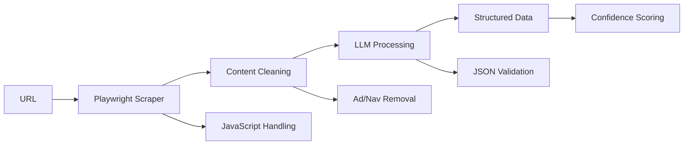

# 🤖 LLM WebExtract

> **AI-Powered Web Content Extraction** - Turn any website into structured data using Large Language Models

[](https://badge.fury.io/py/llm-webextract)
[](https://www.python.org/downloads/)
[](https://opensource.org/licenses/MIT)

Ever wanted to extract meaningful information from websites but got tired of parsing HTML and dealing with messy data? **LLM WebExtract** combines modern web scraping with Large Language Models to intelligently extract structured information from any webpage.

## 🎯 What Does This Do?

Instead of writing complex parsing rules for every website, this tool:

1. **🌐 Scrapes webpages** using Playwright (handles modern JavaScript sites)
2. **🧠 Feeds content to AI** (local via Ollama, or cloud via OpenAI/Anthropic)
3. **📊 Returns structured data** - topics, entities, summaries, key facts, and more

Think of it as having an AI assistant that reads web pages and summarizes them for you.

## ⭐ Key Features

- **🔄 Multi-Provider Support**: Works with Ollama (local), OpenAI, and Anthropic
- **🚀 Modern Web Scraping**: Handles JavaScript-heavy sites with Playwright
- **📋 Pre-built Profiles**: Ready configurations for news, research, e-commerce
- **🛡️ Robust Error Handling**: Specific exceptions for different failure types
- **⚡ Batch Processing**: Extract from multiple URLs concurrently
- **🎛️ Flexible Configuration**: Environment variables, custom prompts, schemas
- **💾 Smart Caching**: Avoid re-processing the same URLs

## 🚀 Quick Start

### Installation

```bash
# Basic installation
pip install llm-webextract
playwright install chromium

# With cloud providers
pip install llm-webextract[openai]     # For GPT models
pip install llm-webextract[anthropic]  # For Claude models
pip install llm-webextract[all]        # Everything
```

### 30-Second Example

```bash
# Command line (requires local Ollama)
llm-webextract extract "https://news.ycombinator.com"

# Test your setup
llm-webextract test
```

```python
# Python - Local Ollama
import webextract

result = webextract.quick_extract("https://techcrunch.com")
print(f"Summary: {result.summary}")
print(f"Topics: {result.topics}")

# Or use the dedicated Ollama function
result = webextract.extract_with_ollama("https://techcrunch.com", model="llama3.2")
```

## 🛠️ Configuration & Usage

### Provider Setup

#### 🏠 Local with Ollama (Free & Private)
```python
from webextract import WebExtractor, ConfigBuilder, extract_with_ollama

# Using ConfigBuilder
extractor = WebExtractor(
    ConfigBuilder()
    .with_ollama("llama3.2")  # or any model you have
    .build()
)

result = extractor.extract("https://example.com")

# Quick one-liner
result = extract_with_ollama("https://example.com", model="llama3.2")
```

#### ☁️ OpenAI GPT
```python
from webextract import extract_with_openai

# Quick one-liner
result = extract_with_openai("https://example.com", api_key="sk-...", model="gpt-4o-mini")

# Using ConfigBuilder
extractor = WebExtractor(
    ConfigBuilder()
    .with_openai(api_key="sk-...", model="gpt-4o-mini")
    .build()
)
```

#### 🧠 Anthropic Claude
```python
from webextract import extract_with_anthropic

# Quick one-liner
result = extract_with_anthropic("https://example.com", api_key="sk-ant-...", model="claude-3-5-sonnet-20241022")

# Using ConfigBuilder
extractor = WebExtractor(
    ConfigBuilder()
    .with_anthropic(api_key="sk-ant-...", model="claude-3-5-sonnet-20241022")
    .build()
)
```

### Pre-built Profiles

```python
from webextract import ConfigProfiles, WebExtractor

# Optimized for different content types
news_extractor = WebExtractor(ConfigProfiles.news_scraping())
research_extractor = WebExtractor(ConfigProfiles.research_papers())
shop_extractor = WebExtractor(ConfigProfiles.ecommerce())
```

### Environment Variables

Set defaults to avoid repeating configuration:

```bash
export WEBEXTRACT_LLM_PROVIDER="openai"
export WEBEXTRACT_MODEL="gpt-4o-mini"
export WEBEXTRACT_API_KEY="sk-your-key"
export WEBEXTRACT_MAX_CONTENT="8000"
export WEBEXTRACT_REQUEST_TIMEOUT="45"
```

## 📊 What You Get Back

The AI analyzes content and returns structured data:

```json
{
  "summary": "Article discusses the latest developments in AI technology...",
  "topics": ["artificial intelligence", "machine learning", "tech industry"],
  "entities": {
    "people": ["Sam Altman", "Satya Nadella"],
    "organizations": ["OpenAI", "Microsoft", "Google"],
    "locations": ["San Francisco", "Silicon Valley"]
  },
  "sentiment": "positive",
  "key_facts": [
    "New model shows 40% improvement in reasoning",
    "Beta testing starts next month",
    "Open source version planned for 2024"
  ],
  "category": "technology",
  "important_dates": ["2024-03-15", "Q2 2024"],
  "statistics": ["40% improvement", "$10B investment"],
  "confidence": 0.89
}
```

## 🔧 Advanced Usage

### Custom Extraction Schema

```python
schema = {
    "product_name": "Extract the main product name",
    "price": "Extract the current price",
    "rating": "Extract average rating (number only)",
    "reviews_count": "Extract total number of reviews",
    "key_features": "List main product features"
}

result = extractor.extract_with_custom_schema(
    "https://amazon.com/product/...",
    schema
)
```

### Batch Processing

```python
urls = [
    "https://techcrunch.com/article1",
    "https://venturebeat.com/article2",
    "https://theverge.com/article3"
]

results = extractor.extract_batch(urls, max_workers=3)
for result in results:
    if result and result.is_successful:
        print(f"{result.url}: {result.get_summary()}")
```

### Error Handling

```python
from webextract import (
    WebExtractor,
    ExtractionError,
    ScrapingError,
    LLMError,
    AuthenticationError
)

try:
    result = extractor.extract("https://problematic-site.com")
except AuthenticationError:
    print("Invalid API key")
except ScrapingError as e:
    print(f"Failed to scrape website: {e}")
except LLMError as e:
    print(f"AI processing failed: {e}")
except ExtractionError as e:
    print(f"General extraction error: {e}")
```

### Custom Prompts

```python
config = (ConfigBuilder()
    .with_openai("sk-...", "gpt-4")
    .with_custom_prompt("""
        Focus on extracting:
        1. Financial metrics and numbers
        2. Company performance indicators
        3. Market trends and predictions
        4. Executive quotes and statements
    """)
    .build())
```

## 🏗️ How It Works



1. **Modern Web Scraping**: Playwright handles JavaScript, SPAs, and modern websites
2. **Intelligent Content Processing**: Removes ads, navigation, focuses on main content
3. **AI Analysis**: Your chosen LLM extracts structured information
4. **Quality Assurance**: Validates output format and calculates confidence scores

## 🛡️ Requirements

- **Python 3.8+**
- **One of:**
  - **Ollama** running locally (free, private)
  - **OpenAI API key** (paid, powerful)
  - **Anthropic API key** (paid, great reasoning)

### Installing Ollama (Recommended for beginners)

```bash
# Install Ollama
curl -fsSL https://ollama.ai/install.sh | sh

# Pull a model
ollama pull llama3.2

# Start the service
ollama serve
```

## 🎯 Use Cases

- **📰 News Monitoring**: Extract key information from news articles
- **🔬 Research**: Process academic papers and technical documents
- **🛒 E-commerce**: Monitor product prices, reviews, specifications
- **📈 Market Research**: Analyze competitor websites and industry trends
- **📋 Content Curation**: Summarize and categorize web content
- **🤖 AI Training**: Generate structured datasets from web content

## 🧪 Testing Your Setup

```bash
# Test connection and model availability
llm-webextract test

# Test with a specific URL
llm-webextract extract "https://example.com" --format pretty

# Check available providers
python -c "
from webextract.core.llm_factory import get_available_providers
import json
print(json.dumps(get_available_providers(), indent=2))
"
```

## 🤝 Contributing

We welcome contributions! Here's how to get started:

### For Contributors

- 📖 Read our [Development Guide](DEVELOPMENT.md) for commit conventions and processes
- 🐛 Report bugs by opening an issue with detailed reproduction steps
- 💡 Suggest features through GitHub discussions
- 🔧 Submit PRs following our coding standards

### Quick Start for Development

```bash
# Fork and clone
git clone https://github.com/HimashaHerath/webextract.git
cd webextract

# Install in development mode
pip install -e ".[dev]"

# Run tests and quality checks
python -m pytest
python -m black --check .
python -m flake8 --config .flake8
```

## 🔍 Troubleshooting

### Common Issues

**"Model not available"**
```bash
# Check if Ollama is running
curl http://localhost:11434/api/tags

# Pull the model if missing
ollama pull llama3.2
```

**"Connection refused"**
- Ensure Ollama is running: `ollama serve`
- Check firewall settings
- Verify the base URL in configuration

**"Rate limit exceeded"**
- Add delays between requests
- Use batch processing with lower concurrency
- Check your API plan limits

**"Content too short"**
- Site might be blocking scrapers
- Try different user agents
- Check if site requires JavaScript (we handle this)

## 📄 License

MIT License - feel free to use this in your projects!

## 🙏 Acknowledgments

Built with these amazing tools:
- [Ollama](https://ollama.ai/) - Local LLM inference
- [Playwright](https://playwright.dev/) - Modern web scraping
- [Beautiful Soup](https://www.crummy.com/software/BeautifulSoup/) - HTML parsing
- [Pydantic](https://pydantic.dev/) - Data validation
- [Typer](https://typer.tiangolo.com/) - CLI framework

## 📞 Support

- **📫 Email**: [himasha626@gmail.com](mailto:himasha626@gmail.com)
- **🐛 Issues**: [GitHub Issues](https://github.com/HimashaHerath/webextract/issues)
- **💬 Discussions**: [GitHub Discussions](https://github.com/HimashaHerath/webextract/discussions)

---

**Got questions?** Open an issue - I'm happy to help!
**Find this useful?** Give it a ⭐ - it really helps!
