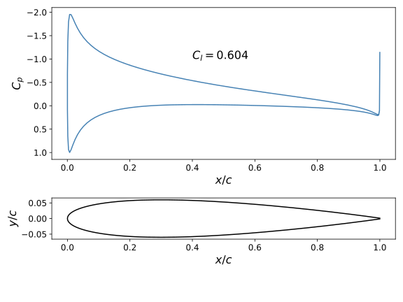
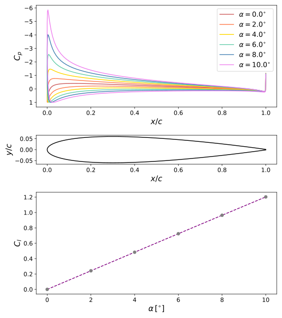

# LSV-Panel

A linear strength vortex panel method from Katz & Plotkin, implemented in 
Rust with a Python API.

## Installation

To install on any operating system from PyPi, the recommended method is pip.
First, create a virtual environment and activate. On macOS/Linux,

```shell
uv venv
source .venv/bin/activate
```

On Windows,

```shell
uv venv
.venv\Scripts\activate
```

Then, install the library using `pip`:

```shell
uv pip install lsv-panel
```

## Usage

The following Python script can be executed assuming you have a Selig-format
airfoil coordinate file called `"n0012-il.txt"` located in the same 
directory. This script plots the pressure coefficient distribution as a 
function of $x$.

```python
import lsv_panel
import matplotlib.pyplot as plt
import numpy as np
import os
file_name = os.path.join("n0012-il.txt")
coords = np.loadtxt(file_name, skiprows=1)
co, cp, cl = lsv_panel.solve(coords, alpha_deg=5.0)
fig, ax = plt.subplots(2, 1, figsize=(8, 6))
ax[0].plot(np.array(co)[:, 0], np.array(cp), color="steelblue")
ax[0].set_xlabel(r"$x/c$", fontsize=16)
ax[0].set_ylabel(r"$C_p$", fontsize=16)
ax[0].invert_yaxis()
ax[0].text(0.4, -1.0, fr"$C_l={cl:.3f}$", size=16)
ax[1].plot(coords[:, 0], coords[:, 1], color="black")
ax[1].set_xlabel(r"$x/c$", fontsize=16)
ax[1].set_ylabel(r"$y/c$", fontsize=16)
ax[1].set_aspect("equal")
for a in ax:
    a.tick_params(axis="both", which="major", labelsize=12)

fig.set_tight_layout(True)
plt.show()
```

> [!IMPORTANT]
> The third-party libraries `numpy` and `matplotlib` are not included
  in the base installation to minimize required storage space. To
  include these libraries in the installation, use
  `uv pip install lsv-panel[dev]`



The airfoil coordinate file should look something like the following. Of
course, the line of code that loads the coordinates could be modified
to accomodate different coordinate formats.

```text
NACA 0012
1.000000  0.001260
0.999416  0.001342
...       ...
0.999416 -0.001342
1.000000 -0.001260
```

The outputs of the `solve` function have the following meanings:

- `co`: The collocation points of the panel method (the midpoint of
  each airfoil coordinate panel). The data type is a list of lists.
- `cp`: The pressure coefficient at each collocation point.
  The data type is a list.
- `cl`: The lift coefficient. The data type is a float.

## Angle of Attack Sweep

```python
from cycler import cycler
import lsv_panel
import matplotlib.pyplot as plt
import numpy as np
import os
file_name = os.path.join("n0012-il.txt")
coords = np.loadtxt(file_name, skiprows=1)
alpha_deg = np.linspace(0.0, 10.0, 6)
co_list, cp_list, cl_list = lsv_panel.sweep_alpha(
    coords, alpha_deg=alpha_deg
)
fig, ax = plt.subplots(3, 1, figsize=(8, 9))
color_cycle = cycler(color=[
    "indianred", 
    "coral", 
    "gold", 
    "mediumaquamarine", 
    "steelblue", 
    "violet"
])
ax[0].set_prop_cycle(color_cycle)
for co, cp, alf in zip(co_list, cp_list, alpha_deg):
    ax[0].plot(np.array(co)[:, 0], np.array(cp), label=fr"$\alpha={alf:.1f}^{{\circ}}$")

ax[0].set_xlabel(r"$x/c$", fontsize=16)
ax[0].set_ylabel(r"$C_p$", fontsize=16)
ax[0].invert_yaxis()
ax[0].legend(loc=1, prop=dict(size=14))
ax[1].plot(coords[:, 0], coords[:, 1], color="black")
ax[1].set_xlabel(r"$x/c$", fontsize=16)
ax[1].set_ylabel(r"$y/c$", fontsize=16)
ax[1].set_aspect("equal")
ax[2].plot(alpha_deg, cl_list, color="purple", ls="--", mfc="gray", mec="gray", marker="o")
ax[2].set_xlabel(r"$\alpha\,[^{\circ}]$", fontsize=16)
ax[2].set_ylabel(r"$C_l$", fontsize=16)
for a in ax:
    a.tick_params(axis="both", which="major", labelsize=12)

fig.set_tight_layout(True)
plt.show()
```


