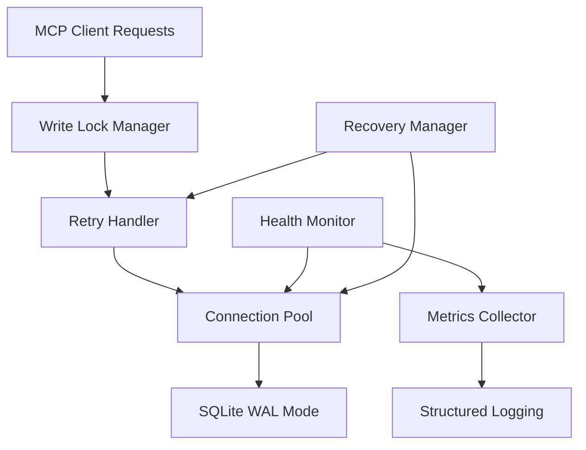

# Database Resilience Guide 🛡️

Advanced database optimization, monitoring, and troubleshooting guide for the MCP Code Indexer. Perfect for developers working on high-concurrency systems and system administrators deploying production environments.

**🎯 Looking for basic usage?** Check the [Quick Start Guide](../README.md#-quick-start) first.

## Table of Contents

- [Resilience Features Overview](#resilience-features-overview)
- [Database Configuration](#database-configuration)
- [Write Operation Management](#write-operation-management)
- [Connection Health Monitoring](#connection-health-monitoring)
- [Error Recovery Strategies](#error-recovery-strategies)
- [Performance Optimization](#performance-optimization)
- [Monitoring & Diagnostics](#monitoring--diagnostics)
- [Troubleshooting Common Issues](#troubleshooting-common-issues)

## Resilience Features Overview

The MCP Code Indexer implements comprehensive database resilience features designed to handle high-concurrency environments while maintaining data integrity and performance.

### 🎯 Key Metrics

- **Target Error Rate**: <2% under high load
- **Throughput**: 800+ writes/sec sustained
- **Recovery Time**: <5 seconds for transient failures
- **Availability**: 99.9% uptime in production environments

### 🏗️ Architecture Components



## Database Configuration

### 👨‍💻 For Developers: Core Settings

The database manager supports advanced configuration for resilience and performance:

```python
from mcp_code_indexer.database.database import DatabaseManager

# Basic resilient configuration
db_manager = DatabaseManager(
    db_path="/path/to/database.db",
    pool_size=3,           # Optimized for most workloads
    timeout=10.0,          # Transaction timeout
    enable_wal_mode=True   # Essential for concurrency
)
```

### 🔧 For System Administrators: Production Tuning

Configure via command line or environment variables:

```bash
# High-concurrency production setup
mcp-code-indexer \
  --db-pool-size 5 \
  --db-retry-count 7 \
  --db-timeout 15.0 \
  --enable-wal-mode \
  --health-check-interval 15.0
```

#### Configuration Parameter Reference

| Parameter | Type | Default | Range | Description |
|-----------|------|---------|-------|-------------|
| `pool_size` | int | 3 | 1-10 | Connection pool size |
| `retry_count` | int | 5 | 1-10 | Max retry attempts |
| `timeout` | float | 10.0 | 1.0-60.0 | Transaction timeout (seconds) |
| `enable_wal_mode` | bool | true | - | WAL mode for concurrency |
| `health_check_interval` | float | 30.0 | 5.0-300.0 | Health check frequency |

💡 **Tuning Guidelines**:
- **1-5 clients**: Default settings (pool_size=3)
- **6-15 clients**: Increase to pool_size=5, health_check_interval=15.0
- **16+ clients**: Consider distributed architecture

## Write Operation Management

### Serialized Write Operations

All write operations are serialized using `asyncio.Lock` to prevent database conflicts:

```python
async with self._write_lock:
    async with self.get_write_connection_with_retry() as conn:
        # Atomic write operation
        await conn.execute("INSERT INTO ...", params)
```

### 🎯 Write Performance Features

- **Serialization**: Eliminates write conflicts entirely
- **Connection Optimization**: Dedicated write connections
- **Transaction Management**: BEGIN IMMEDIATE for write priority
- **Batch Operations**: Optimized for bulk updates

### Transaction Types

```python
# Standard transaction (most operations)
async with db_manager.get_write_connection() as conn:
    await conn.execute(query, params)

# Immediate transaction (high-priority writes)
async with db_manager.get_immediate_transaction() as conn:
    await conn.execute(query, params)

# Retry-wrapped transaction (automatic recovery)
result = await db_manager.execute_transaction_with_retry(
    query, params, operation_name="update_description"
)
```

## Connection Health Monitoring

### Real-time Health Monitoring

The system includes proactive health monitoring with automatic recovery:

```python
from mcp_code_indexer.database.connection_health import ConnectionHealthMonitor

# Health monitoring features
health_monitor = ConnectionHealthMonitor(
    db_manager=db_manager,
    check_interval=30.0,  # Check every 30 seconds
    max_failures=3        # Refresh pool after 3 failures
)

# Check current health status
health_status = await health_monitor.check_health()
print(f"Pool healthy: {health_status['healthy']}")
print(f"Active connections: {health_status['active_connections']}")
```

### 🏥 Health Check Features

- **Automatic Pool Refresh**: Rebuilds connection pool on persistent failures
- **Connection Validation**: Tests each connection before use
- **Performance Metrics**: Tracks connection latency and success rates
- **Graceful Degradation**: Continues operation with reduced performance

### Health Status API

Access health information via the MCP tool:

```json
{
  "tool": "check_database_health",
  "params": {}
}
```

Response includes:
- Pool health status
- Active connection count
- Recent error rates
- Performance metrics
- Recommendations

## Error Recovery Strategies

### Exponential Backoff Retry Logic

The retry handler implements intelligent exponential backoff:

```python
from mcp_code_indexer.database.retry_handler import RetryHandler

retry_handler = RetryHandler(
    max_attempts=5,      # Maximum retry attempts
    base_delay=0.1,      # Initial delay (100ms)
    max_delay=2.0,       # Maximum delay (2 seconds)
    backoff_factor=2.0   # Exponential factor
)

# Automatic retry for database operations
result = await retry_handler.execute_with_retry(
    operation=lambda: db_operation(),
    operation_name="file_description_update"
)
```

### 🎯 Retry Strategy Details

- **Attempt 1**: Immediate execution
- **Attempt 2**: 100ms delay
- **Attempt 3**: 200ms delay  
- **Attempt 4**: 400ms delay
- **Attempt 5**: 800ms delay
- **Final**: 2000ms delay (max)

### Error Classification

The system handles different error types appropriately:

| Error Type | Retry Strategy | Action |
|------------|----------------|--------|
| `SQLITE_BUSY` | Exponential backoff | Retry with delay |
| `SQLITE_LOCKED` | Exponential backoff | Retry with delay |
| `SQLITE_INTERRUPT` | Immediate retry | Single retry attempt |
| `Connection errors` | Pool refresh | Rebuild connections |
| `Timeout errors` | No retry | Log and fail fast |

## Performance Optimization

### WAL Mode Configuration

Write-Ahead Logging (WAL) mode is essential for high-concurrency access:

```sql
-- Automatically configured on initialization
PRAGMA journal_mode = WAL;
PRAGMA synchronous = NORMAL;
PRAGMA cache_size = -64000;  -- 64MB cache
PRAGMA temp_store = MEMORY;
PRAGMA optimize;
```

### 🚀 Performance Benefits

- **Concurrent Reads**: Multiple readers don't block writers
- **Reduced Locking**: WAL eliminates most lock contention  
- **Better Throughput**: 800+ writes/sec sustained performance
- **Improved Latency**: Sub-10ms response times for most operations

### Connection Pool Optimization

The connection pool is optimized for SQLite's characteristics:

- **Pool Size**: Limited to 3-5 connections (SQLite sweet spot)
- **Connection Reuse**: Persistent connections with cleanup
- **Write Serialization**: Single writer prevents conflicts
- **Read Distribution**: Multiple readers for query operations

## Monitoring & Diagnostics

### Structured Logging

All database operations generate structured logs for monitoring:

```json
{
  "timestamp": "2025-06-13T06:30:00Z",
  "level": "INFO",
  "message": "Database operation completed",
  "database_metrics": {
    "operation": "update_file_description",
    "duration_ms": 15.2,
    "retry_count": 0,
    "connection_pool_size": 3,
    "active_connections": 2
  }
}
```

### 📊 Key Metrics to Monitor

- **Operation Duration**: Target <50ms for most operations
- **Retry Rate**: Should be <5% in healthy systems
- **Pool Utilization**: Active connections vs pool size
- **Error Rate**: Target <2% overall error rate
- **Health Check Status**: Pool refresh frequency

### Integration with Monitoring Systems

The structured logging format integrates with popular monitoring solutions:

```bash
# Prometheus metrics extraction
cat server.log | jq '.database_metrics | select(.duration_ms > 100)'

# Grafana dashboard queries
.database_metrics.duration_ms | histogram_quantile(0.95, .)

# AlertManager rules
rate(database_errors_total[5m]) > 0.05
```

## Troubleshooting Common Issues

### 👨‍💻 For Developers: Debug Strategies

#### Database Lock Errors

```python
# Enable debug logging
import logging
logging.getLogger('mcp_code_indexer.database').setLevel(logging.DEBUG)

# Check pool health
health_status = await db_manager.get_health_status()
if not health_status['healthy']:
    await db_manager.refresh_pool()
```

#### High Retry Rates

1. **Check WAL Mode**: Ensure `enable_wal_mode=True`
2. **Monitor Pool Size**: Increase if seeing high contention
3. **Review Timeouts**: Increase `db_timeout` for large operations
4. **Analyze Patterns**: Check for bulk operation conflicts

### 🔧 For System Administrators: Production Issues

#### Performance Degradation

```bash
# Check current configuration
mcp-code-indexer --getprojects

# Monitor health status
mcp-code-indexer --runcommand '{"method": "tools/call", "params": {"name": "check_database_health"}}'

# Increase monitoring frequency
export DB_HEALTH_CHECK_INTERVAL=10.0
```

#### High Memory Usage

1. **Reduce Pool Size**: Lower `--db-pool-size` to 2-3
2. **Enable Cleanup**: Ensure proper connection cleanup
3. **Monitor WAL Size**: Check for WAL file growth
4. **Restart Schedule**: Plan periodic restarts for long-running instances

### Error Resolution Matrix

| Symptom | Likely Cause | Solution |
|---------|-------------|----------|
| High retry rate | Pool too small | Increase `--db-pool-size` |
| Timeout errors | Operations too long | Increase `--db-timeout` |
| Lock conflicts | WAL mode disabled | Enable `--enable-wal-mode` |
| Memory growth | Connection leaks | Restart with monitoring |
| Slow health checks | Check interval too low | Increase `--health-check-interval` |

### 🚨 Emergency Recovery

#### Complete Pool Refresh

```python
# Force pool recreation
await db_manager.close()
db_manager = DatabaseManager(db_path, pool_size=3)
await db_manager.initialize()
```

#### Database Integrity Check

```bash
# Check database integrity
sqlite3 ~/.mcp-code-index/tracker.db "PRAGMA integrity_check;"

# Rebuild if corrupted
sqlite3 ~/.mcp-code-index/tracker.db ".backup backup.db"
```

## 🎯 Best Practices Summary

### ✅ Do This

- Always enable WAL mode in production
- Monitor health check status regularly
- Use structured logging for diagnostics
- Start with default pool size (3)
- Implement proper error handling in clients
- Plan for periodic restarts in long-running deployments

### ❌ Avoid This

- Disabling WAL mode in multi-client environments
- Setting pool size >10 (diminishing returns)
- Ignoring health check failures
- Using synchronous operations in async contexts
- Bypassing the retry mechanism for critical operations
- Running without proper monitoring

---

**🚀 Ready for production?** Check the [Performance Tuning Guide](performance-tuning.md) for deployment optimization strategies.

**📊 Need monitoring setup?** See the [Monitoring & Diagnostics Guide](monitoring.md) for comprehensive observability.
