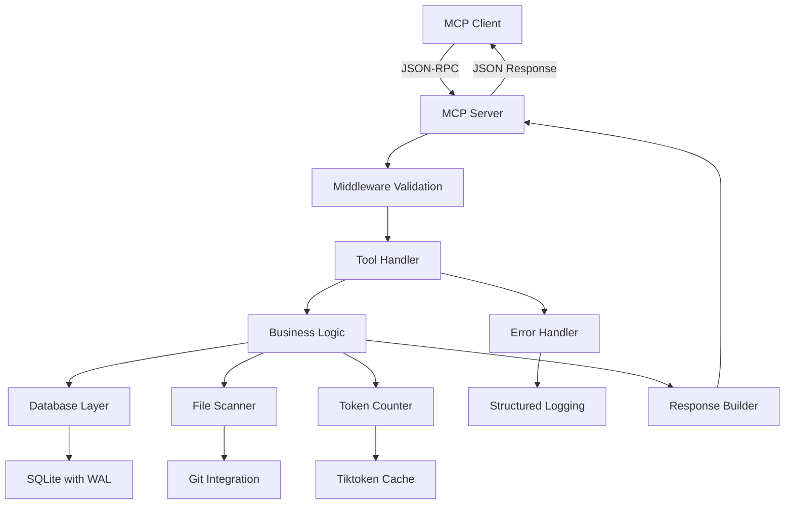
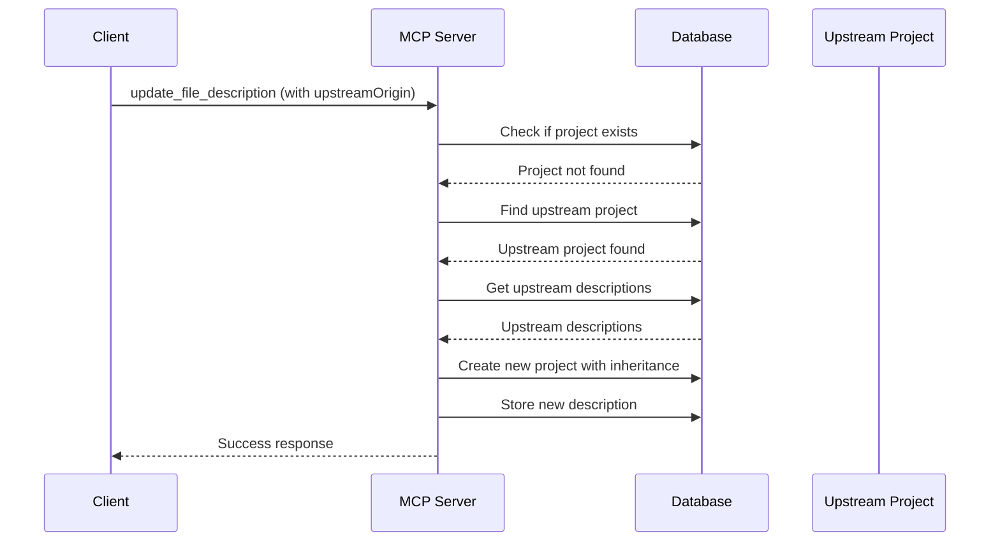

# Architecture Overview 🏗️

Technical deep dive into the MCP Code Indexer architecture, design decisions, and implementation details. Perfect for developers who want to understand how the system works, contribute to the codebase, or integrate with the MCP protocol.

**🎯 Looking for usage info?** Check the [API Reference](api-reference.md) for tool documentation.

## Table of Contents

- [System Overview](#system-overview)
- [Core Components](#core-components)
- [Data Flow](#data-flow)
- [Database Design](#database-design)
- [Performance Optimizations](#performance-optimizations)
- [Error Handling Strategy](#error-handling-strategy)
- [Concurrency Model](#concurrency-model)
- [Design Decisions](#design-decisions)

## System Overview

The MCP Code Indexer follows a **layered architecture** with clear separation of concerns and async-first design principles:

```
┌─────────────────────────────────────────────┐
│                MCP Protocol                 │ JSON-RPC over stdio
├─────────────────────────────────────────────┤
│              MCP Server Layer               │ Tool routing & validation
├─────────────────────────────────────────────┤
│            Business Logic Layer             │ Core operations
├─────────────────────────────────────────────┤
│           Infrastructure Layer              │ Database, file system, etc.
└─────────────────────────────────────────────┘
```

### 🎯 Architecture Principles

- **🚀 Async-First**: All I/O operations are asynchronous for optimal performance
- **🏗️ Layered Design**: Clear separation between protocol, business logic, and infrastructure  
- **🛡️ Error Isolation**: Comprehensive error handling prevents cascading failures
- **♻️ Resource Management**: Proper cleanup and connection pooling for scalability
- **⚡ Performance-Oriented**: Token-aware decisions and intelligent caching strategies

## Core Components

### 1. MCP Server (`src/server/mcp_server.py`)

The main entry point that handles MCP protocol communication:

```python
class MCPCodeIndexServer:
    """Primary server coordinating all operations."""
    
    def __init__(self, token_limit, db_path, cache_dir):
        self.db_manager = DatabaseManager(db_path)      # Data layer
        self.token_counter = TokenCounter(token_limit)  # Token management
        self.merge_handler = MergeHandler(db_manager)    # Merge operations
        self.error_handler = ErrorHandler()             # Error management
        self.middleware = ToolMiddleware()               # Request processing
```

**Responsibilities**:
- Protocol compliance and tool registration
- Request routing and parameter validation
- Response formatting and error handling
- Resource lifecycle management

### 2. Database Manager (`src/database/database.py`)

Handles all data persistence with performance optimizations:

```python
class DatabaseManager:
    """Async SQLite operations with connection pooling."""
    
    def __init__(self, db_path, pool_size=5):
        self._connection_pool = []                    # Connection pool
        self._pool_lock = asyncio.Lock()             # Thread safety
        
    async def get_connection(self):
        """Connection pool management with automatic cleanup."""
        # Pool-based connection management
        # Performance pragma application
        # Automatic resource cleanup
```

**Key Features**:
- **Connection Pooling**: Efficient database connection reuse
- **WAL Mode**: Write-Ahead Logging for better concurrency
- **FTS5 Integration**: Full-text search with advanced indexing
- **Migration System**: Versioned schema updates

### 3. Token Counter (`src/token_counter.py`)

Intelligent token counting for performance optimization:

```python
class TokenCounter:
    """Tiktoken integration with offline caching."""
    
    def __init__(self, token_limit=32000):
        self._setup_offline_tiktoken()              # Configure offline operation
        self._init_encoder()                        # Initialize encoder
        
    def calculate_codebase_tokens(self, descriptions):
        """Efficient token calculation with caching."""
        # Batch token counting
        # Cache-aware calculations
        # Size-based recommendations
```

**Design Features**:
- **Offline Operation**: Bundled tiktoken cache for air-gapped environments
- **Performance Caching**: Intelligent caching of token calculations
- **Threshold Management**: Smart recommendations based on token counts

### 4. Merge Handler (`src/merge_handler.py`)

Advanced two-phase merge system for branch integration:

```python
class MergeHandler:
    """Two-phase merge with conflict detection and resolution."""
    
    async def start_merge_phase1(self, project_id, source, target):
        """Phase 1: Conflict detection with session management."""
        session = MergeSession(project_id, source, target)
        conflicts = self._detect_conflicts(source_files, target_files)
        return session
        
    async def complete_merge_phase2(self, session_id, resolutions):
        """Phase 2: Apply resolutions with validation."""
        # Resolution validation
        # Optimistic locking
        # Atomic operations
```

**Advanced Features**:
- **Session Management**: Stateful merge operations with cleanup
- **Conflict Detection**: Intelligent difference analysis
- **Resolution Validation**: Comprehensive conflict resolution
- **Atomic Operations**: Transaction-safe merge completion

### 5. Error Handler (`src/error_handler.py`)

Comprehensive error management with structured logging:

```python
class ErrorHandler:
    """Production-ready error handling with structured logging."""
    
    def log_error(self, error, context, tool_name):
        """Structured error logging with context preservation."""
        error_data = {
            "error_type": type(error).__name__,
            "category": error.category if isinstance(error, MCPError) else "internal",
            "context": context,
            "traceback": traceback.format_exc()
        }
        self.logger.error("MCP Error", extra={"structured_data": error_data})
```

**Error Categories**:
- **Validation Errors**: Input parameter validation
- **Database Errors**: Data layer failures
- **File System Errors**: File access and scanning issues
- **Resource Errors**: Memory and connection limits
- **Internal Errors**: Unexpected system failures

## Data Flow

### Tool Request Processing



### File Description Lifecycle

1. **Discovery**: File scanner identifies trackable files
2. **Analysis**: AI agents analyze file contents
3. **Storage**: Descriptions stored with metadata
4. **Indexing**: FTS5 indexes for search capabilities
5. **Retrieval**: Fast lookup and search operations
6. **Updates**: Version-controlled description updates
7. **Merging**: Branch-aware conflict resolution

### Upstream Inheritance Flow



## Database Design

### Schema Overview

The database uses **SQLite with WAL mode** for optimal performance:

```sql
-- Core entities
CREATE TABLE projects (
    id TEXT PRIMARY KEY,
    name TEXT NOT NULL,
    remote_origin TEXT,
    upstream_origin TEXT,
    aliases TEXT DEFAULT '[]',  -- JSON array
    created DATETIME DEFAULT CURRENT_TIMESTAMP,
    last_accessed DATETIME DEFAULT CURRENT_TIMESTAMP
);

CREATE TABLE file_descriptions (
    project_id TEXT NOT NULL,
    branch TEXT NOT NULL,
    file_path TEXT NOT NULL,
    description TEXT NOT NULL,
    file_hash TEXT,
    last_modified DATETIME DEFAULT CURRENT_TIMESTAMP,
    version INTEGER DEFAULT 1,
    source_project_id TEXT,  -- For upstream tracking
    PRIMARY KEY (project_id, branch, file_path),
    FOREIGN KEY (project_id) REFERENCES projects(id) ON DELETE CASCADE
);

-- Full-text search
CREATE VIRTUAL TABLE file_descriptions_fts USING fts5(
    project_id UNINDEXED,
    branch UNINDEXED,
    file_path,
    description,
    content='file_descriptions',
    prefix='2 3 4'  -- Prefix search optimization
);
```

### Indexing Strategy

**Composite Indexes** for optimal query performance:

```sql
-- Primary access patterns
CREATE INDEX idx_file_descriptions_project_branch ON file_descriptions(project_id, branch);
CREATE INDEX idx_file_descriptions_project_branch_path ON file_descriptions(project_id, branch, file_path);

-- Search and filtering
CREATE INDEX idx_file_descriptions_project_modified ON file_descriptions(project_id, last_modified DESC);
CREATE INDEX idx_file_descriptions_source_project ON file_descriptions(source_project_id) 
    WHERE source_project_id IS NOT NULL;

-- Performance indexes
CREATE INDEX idx_projects_remote_origin ON projects(remote_origin);
CREATE INDEX idx_projects_upstream_origin ON projects(upstream_origin);
```

### FTS5 Configuration

**Advanced full-text search** with performance optimizations:

```sql
-- Optimized FTS5 table with prefix search
CREATE VIRTUAL TABLE file_descriptions_fts USING fts5(
    project_id UNINDEXED,     -- Don't index for search
    branch UNINDEXED,         -- Don't index for search  
    file_path,                -- Index file paths
    description,              -- Index descriptions
    content='file_descriptions',
    content_rowid='rowid',
    prefix='2 3 4'            -- Enable 2-4 character prefix search
);

-- Trigger-based synchronization
CREATE TRIGGER file_descriptions_ai AFTER INSERT ON file_descriptions BEGIN
  INSERT INTO file_descriptions_fts(rowid, project_id, branch, file_path, description)
  VALUES (new.rowid, new.project_id, new.branch, new.file_path, new.description);
END;
```

## Performance Optimizations

### 1. Connection Pooling

**Async connection pool** with intelligent resource management:

```python
class DatabaseManager:
    async def get_connection(self):
        """Pool-based connection with performance settings."""
        conn = None
        
        # Try to get from pool
        async with self._pool_lock:
            if self._connection_pool:
                conn = self._connection_pool.pop()
        
        # Create new with optimizations
        if conn is None:
            conn = await aiosqlite.connect(self.db_path)
            await conn.execute("PRAGMA busy_timeout = 30000")
            await conn.execute("PRAGMA synchronous = NORMAL")
            await conn.execute("PRAGMA cache_size = -64000")  # 64MB
            await conn.execute("PRAGMA temp_store = MEMORY")
```

### 2. Token Counting Optimization

**Intelligent caching** and batch processing:

```python
class TokenCounter:
    def calculate_codebase_tokens(self, descriptions):
        """Batch token calculation with caching."""
        total_tokens = 0
        
        # Use cached results when available
        cache_key = self.generate_cache_key(project_id, branch, content_hash)
        cached_result = await self.get_cached_tokens(cache_key)
        
        if cached_result:
            return cached_result
            
        # Batch process for efficiency
        for batch in self.batch_descriptions(descriptions, batch_size=100):
            batch_tokens = self._count_batch_tokens(batch)
            total_tokens += batch_tokens
```

### 3. Search Optimization

**FTS5 with intelligent ranking** and result optimization:

```sql
-- Optimized search query with ranking
SELECT 
    fd.project_id,
    fd.branch,
    fd.file_path,
    fd.description,
    fts.rank
FROM file_descriptions_fts fts
JOIN file_descriptions fd ON fd.rowid = fts.rowid
WHERE fts MATCH ? 
  AND fd.project_id = ? 
  AND fd.branch = ?
ORDER BY fts.rank
LIMIT ?;
```

### 4. File System Optimization

**Git-aware scanning** with intelligent filtering:

```python
class FileScanner:
    def scan_directory(self, max_files=None):
        """Optimized directory scanning with filtering."""
        files = []
        
        # Use git ls-files when available for speed
        if self._is_git_repository():
            files = self._git_tracked_files()
        else:
            files = self._manual_scan_with_gitignore()
        
        # Apply intelligent filtering
        return [f for f in files if not self.should_ignore_file(f)]
```

## Error Handling Strategy

### Layered Error Management

**Comprehensive error handling** at multiple levels:

```python
# 1. Input Validation Layer
@validate_arguments(required=["projectName", "branch"], optional=["remoteOrigin"])
async def handle_tool(self, arguments):
    # Validated input processing
    
# 2. Business Logic Layer  
try:
    result = await self.business_operation()
except DatabaseError as e:
    # Database-specific error handling
except ValidationError as e:
    # Validation error handling
except Exception as e:
    # Catch-all with structured logging
    
# 3. Infrastructure Layer
async with self.db_manager.get_connection() as conn:
    try:
        # Database operations
    except aiosqlite.Error as e:
        raise DatabaseError(f"Database operation failed: {e}") from e
```

### Error Categories and Responses

**MCP-compliant error responses** with detailed context:

```python
class MCPError(Exception):
    """Base MCP error with structured information."""
    
    def __init__(self, message, category, code, details=None):
        self.message = message
        self.category = category  # validation, database, file_system, etc.
        self.code = code         # JSON-RPC error codes
        self.details = details or {}
        self.timestamp = datetime.utcnow()

# Specific error types
class ValidationError(MCPError):
    def __init__(self, message, details=None):
        super().__init__(message, ErrorCategory.VALIDATION, -32602, details)

class DatabaseError(MCPError):
    def __init__(self, message, details=None):
        super().__init__(message, ErrorCategory.DATABASE, -32603, details)
```

## Concurrency Model

### Async-First Architecture

**Asyncio-based concurrency** with proper resource management:

```python
class AsyncTaskManager:
    """Manages async tasks with error handling."""
    
    def __init__(self, error_handler):
        self.error_handler = error_handler
        self._tasks = []
    
    def create_task(self, coro, name=None):
        """Create managed async task."""
        task = asyncio.create_task(coro, name=name)
        self._tasks.append(task)
        
        # Add error handling callback
        task.add_done_callback(
            lambda t: asyncio.create_task(self._handle_completion(t, name))
        )
        return task
```

### Resource Management

**Proper cleanup** and resource lifecycle management:

```python
class MCPCodeIndexServer:
    async def run(self):
        """Server lifecycle with proper cleanup."""
        await self.initialize()
        
        try:
            # Server operation
            async with stdio_server() as (read_stream, write_stream):
                await self.server.run(read_stream, write_stream, options)
        finally:
            # Guaranteed cleanup
            await self.shutdown()
    
    async def shutdown(self):
        """Clean shutdown with resource cleanup."""
        # Cancel running tasks
        self.task_manager.cancel_all()
        
        # Close database connections
        await self.db_manager.close_pool()
        
        # Cleanup temporary files
        self._cleanup_cache()
```

## Design Decisions

### 1. SQLite vs. PostgreSQL

**Choice: SQLite with WAL mode**

**Rationale**:
- **Simplicity**: No separate database server required
- **Performance**: WAL mode provides excellent concurrency
- **Portability**: Single-file database easy to backup/move
- **Resource Efficiency**: Lower memory and CPU overhead

**Trade-offs**:
- Limited to single-server deployments
- No built-in replication (addressed by file-based backups)
- Write scalability limits (sufficient for typical usage)

### 2. Async vs. Sync Architecture

**Choice: Async-first with asyncio**

**Rationale**:
- **I/O Efficiency**: File scanning and database operations are I/O bound
- **Concurrency**: Handle multiple tool calls simultaneously
- **Resource Efficiency**: Lower memory footprint than threading
- **Modern Python**: Aligns with current Python best practices

### 3. Token Counting Strategy

**Choice: tiktoken with offline caching**

**Rationale**:
- **Accuracy**: OpenAI's official tokenizer for precise counting
- **Performance**: Rust-based implementation for speed
- **Offline Operation**: Bundled cache for air-gapped environments
- **Compatibility**: Consistent with GPT model tokenization

### 4. Error Handling Approach

**Choice: Structured logging with error categories**

**Rationale**:
- **Debugging**: JSON logs are machine-parseable
- **Monitoring**: Structured data enables alerting
- **User Experience**: Clear error messages for developers
- **Compliance**: MCP protocol error code requirements

### 5. Merge Strategy

**Choice: Two-phase merge with session management**

**Rationale**:
- **User Control**: Developers review conflicts before resolution
- **Atomic Operations**: All-or-nothing merge completion
- **Resume Capability**: Interrupted merges can be resumed
- **Audit Trail**: Full history of merge decisions

---

**Next Steps**:
- Explore the [API Reference](api-reference.md) for detailed tool documentation
- Check [Configuration Guide](configuration.md) for deployment options
- Review [Contributing Guide](contributing.md) for development practices

Questions about the architecture? Check the [Configuration Guide](configuration.md) for deployment options or the [Contributing Guide](contributing.md) for development practices! 🚀
