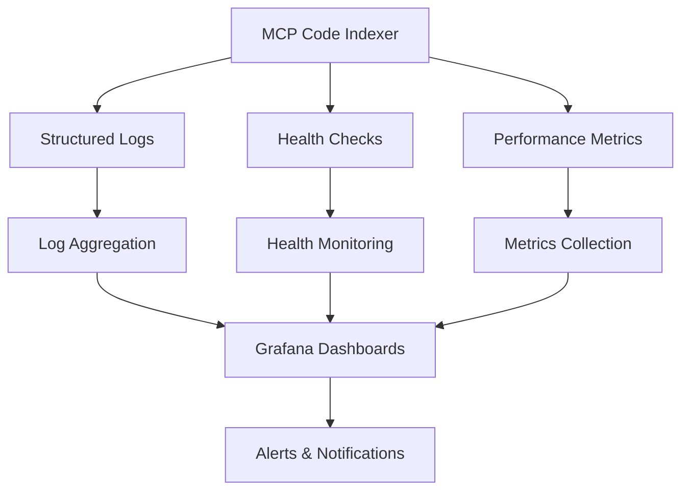

# Monitoring & Diagnostics Guide 📊

Comprehensive monitoring, logging, and troubleshooting guide for production MCP Code Indexer deployments. Essential for system administrators and DevOps teams maintaining high-availability systems.

**🎯 Looking for performance optimization?** Check the [Performance Tuning Guide](performance-tuning.md) first.

## Table of Contents

- [Monitoring Overview](#monitoring-overview)
- [Structured Logging](#structured-logging)
- [Health Check System](#health-check-system)
- [Metrics Collection](#metrics-collection)
- [Alerting Strategies](#alerting-strategies)
- [Diagnostic Tools](#diagnostic-tools)
- [Troubleshooting Runbook](#troubleshooting-runbook)
- [Production Monitoring Setup](#production-monitoring-setup)

## Monitoring Overview

### 🎯 Monitoring Objectives

- **Availability**: Ensure 99.9%+ uptime
- **Performance**: Maintain <50ms response times
- **Reliability**: Keep error rates <2%
- **Capacity**: Plan for growth and scaling
- **Security**: Detect and respond to anomalies

### 📊 Monitoring Stack



## Structured Logging

### 🔧 Log Configuration

Enable comprehensive structured logging:

```bash
# Production logging setup
export MCP_LOG_FORMAT=json
export MCP_LOG_LEVEL=INFO
mcp-code-indexer \
  --log-level INFO \
  --cache-dir /var/log/mcp-code-indexer
```

### 📋 Log Structure

All logs follow a consistent JSON structure:

```json
{
  "timestamp": "2025-06-13T06:30:00.123Z",
  "level": "INFO",
  "logger": "mcp_code_indexer.database.database",
  "message": "Database operation completed successfully",
  "structured_data": {
    "operation": {
      "type": "update_file_description",
      "duration_ms": 15.2,
      "success": true,
      "retry_count": 0
    },
    "database": {
      "pool_size": 5,
      "active_connections": 3,
      "health_status": "healthy"
    },
    "performance": {
      "throughput_ops_per_sec": 850,
      "p95_latency_ms": 45,
      "error_rate": 0.015
    }
  },
  "context": {
    "project_name": "example-project",
    "file_path": "src/components/auth.ts",
    "client_id": "client-123"
  }
}
```

### 📊 Log Categories

#### Application Logs
```json
{
  "level": "INFO",
  "message": "MCP tool executed successfully",
  "structured_data": {
    "tool_usage": {
      "tool_name": "get_file_description",
      "execution_time_ms": 25.3,
      "success": true,
      "result_size_bytes": 1024
    }
  }
}
```

#### Database Logs
```json
{
  "level": "INFO", 
  "message": "Database health check completed",
  "structured_data": {
    "database_health": {
      "pool_healthy": true,
      "active_connections": 3,
      "failed_connections": 0,
      "avg_response_time_ms": 12.5
    }
  }
}
```

#### Performance Logs
```json
{
  "level": "INFO",
  "message": "Performance metrics updated",
  "structured_data": {
    "performance_metrics": {
      "total_operations": 10000,
      "operations_per_second": 825,
      "avg_latency_ms": 18.2,
      "p95_latency_ms": 48.1,
      "error_count": 23,
      "error_rate": 0.0023
    }
  }
}
```

#### Error Logs
```json
{
  "level": "ERROR",
  "message": "Database operation failed after retries",
  "structured_data": {
    "error_details": {
      "error_type": "OperationalError",
      "error_code": "SQLITE_BUSY",
      "retry_count": 5,
      "total_duration_ms": 2150,
      "recovery_action": "pool_refresh_scheduled"
    }
  }
}
```

## Health Check System

### 🏥 Built-in Health Monitoring

The system provides comprehensive health checking via the `check_database_health` MCP tool:

```json
{
  "tool": "check_database_health",
  "params": {}
}
```

#### Health Check Response

```json
{
  "health_status": {
    "overall_health": "healthy",
    "database": {
      "pool_healthy": true,
      "active_connections": 3,
      "total_connections": 5,
      "failed_connections": 0,
      "avg_response_time_ms": 15.2
    },
    "performance": {
      "current_throughput": 847,
      "target_throughput": 800,
      "p95_latency_ms": 42,
      "error_rate": 0.008
    },
    "system": {
      "memory_usage_mb": 245,
      "cpu_usage_percent": 35,
      "disk_usage_percent": 67
    }
  },
  "recommendations": [
    "System operating within normal parameters",
    "Consider monitoring disk usage trends"
  ]
}
```

### 🔍 Health Check Categories

#### Database Health
- Connection pool status
- Active connection count
- Response time metrics
- Error rate tracking
- WAL file size monitoring

#### Application Health
- Tool execution success rates
- Memory usage patterns
- Cache performance
- File system access

#### System Health  
- CPU and memory utilization
- Disk I/O performance
- Network connectivity
- Process stability

### ⚙️ Health Check Configuration

```python
# Custom health check intervals
from mcp_code_indexer.database.connection_health import ConnectionHealthMonitor

health_monitor = ConnectionHealthMonitor(
    db_manager=db_manager,
    check_interval=15.0,  # Check every 15 seconds
    failure_threshold=3,   # Refresh after 3 failures
    timeout=5.0           # 5-second timeout
)
```

## Metrics Collection

### 📈 Core Metrics

#### Throughput Metrics
```python
# Operations per second
ops_per_second = total_operations / time_window

# Request rate by tool
tool_request_rates = {
    "get_file_description": 450,
    "update_file_description": 200,
    "search_descriptions": 150,
    "check_codebase_size": 50
}
```

#### Latency Metrics
```python
# Response time percentiles
latency_metrics = {
    "p50_ms": 12.5,
    "p90_ms": 35.2,
    "p95_ms": 48.7,
    "p99_ms": 120.3,
    "max_ms": 250.1
}
```

#### Error Metrics
```python
# Error tracking
error_metrics = {
    "total_errors": 23,
    "error_rate": 0.0023,
    "errors_by_type": {
        "SQLITE_BUSY": 15,
        "SQLITE_LOCKED": 5,
        "timeout": 3
    }
}
```

### 🔧 Metrics Export

#### Prometheus Format

```python
# Export metrics in Prometheus format
from prometheus_client import Counter, Histogram, Gauge

# Counters
operations_total = Counter('mcp_operations_total', 'Total operations', ['tool_name', 'status'])
errors_total = Counter('mcp_errors_total', 'Total errors', ['error_type'])

# Histograms
operation_duration = Histogram('mcp_operation_duration_seconds', 'Operation duration')

# Gauges
active_connections = Gauge('mcp_database_active_connections', 'Active database connections')
```

#### Custom Metrics API

```python
class MetricsCollector:
    def __init__(self):
        self.metrics = {
            'operations': {},
            'latency': {},
            'errors': {},
            'database': {}
        }
    
    def record_operation(self, tool_name: str, duration_ms: float, success: bool):
        """Record tool operation metrics."""
        key = f"{tool_name}_{'success' if success else 'failure'}"
        self.metrics['operations'][key] = self.metrics['operations'].get(key, 0) + 1
        self.metrics['latency'][tool_name] = duration_ms
    
    def get_metrics_snapshot(self) -> dict:
        """Get current metrics snapshot."""
        return {
            'timestamp': datetime.utcnow().isoformat(),
            'metrics': self.metrics.copy()
        }
```

## Alerting Strategies

### 🚨 Alert Categories

#### Critical Alerts (Immediate Response)
- Service unavailable (>30 seconds)
- Error rate >5% (sustained)
- Database corruption detected
- Memory leak detected (>90% usage)

#### Warning Alerts (Monitor Closely)
- Error rate >2% (5 minutes)
- Latency >100ms P95 (10 minutes)
- Disk usage >80%
- Connection pool exhaustion

#### Info Alerts (Awareness)
- High throughput achieved
- Performance improvement detected
- Successful recovery from issue
- Scheduled maintenance completed

### 📧 Alert Configuration

#### AlertManager Rules

```yaml
groups:
- name: mcp-code-indexer-critical
  rules:
  - alert: ServiceDown
    expr: up{job="mcp-code-indexer"} == 0
    for: 30s
    labels:
      severity: critical
    annotations:
      summary: "MCP Code Indexer service is down"
      description: "Service has been down for more than 30 seconds"

  - alert: HighErrorRate
    expr: rate(mcp_errors_total[5m]) / rate(mcp_operations_total[5m]) > 0.05
    for: 2m
    labels:
      severity: critical
    annotations:
      summary: "High error rate detected"
      description: "Error rate is {{ $value | humanizePercentage }}"

- name: mcp-code-indexer-warning
  rules:
  - alert: HighLatency
    expr: histogram_quantile(0.95, rate(mcp_operation_duration_seconds_bucket[5m])) > 0.1
    for: 5m
    labels:
      severity: warning
    annotations:
      summary: "High latency detected"
      description: "95th percentile latency is {{ $value }}s"

  - alert: DatabasePoolExhaustion
    expr: mcp_database_active_connections / mcp_database_pool_size > 0.9
    for: 3m
    labels:
      severity: warning
    annotations:
      summary: "Database connection pool nearly exhausted"
```

#### Notification Channels

```yaml
# Slack notifications
route:
  group_by: ['alertname', 'severity']
  group_wait: 10s
  group_interval: 10s
  repeat_interval: 1h
  receiver: 'slack-notifications'
  routes:
  - match:
      severity: critical
    receiver: 'slack-critical'
  - match:
      severity: warning
    receiver: 'slack-warning'

receivers:
- name: 'slack-critical'
  slack_configs:
  - api_url: 'https://hooks.slack.com/services/YOUR/WEBHOOK/URL'
    channel: '#alerts-critical'
    title: 'Critical Alert: {{ .GroupLabels.alertname }}'
    text: '{{ range .Alerts }}{{ .Annotations.summary }}{{ end }}'

- name: 'slack-warning'
  slack_configs:
  - api_url: 'https://hooks.slack.com/services/YOUR/WEBHOOK/URL'
    channel: '#alerts-warning'
    title: 'Warning: {{ .GroupLabels.alertname }}'
```

## Diagnostic Tools

### 🔧 Built-in Diagnostics

#### Database Health Check
```bash
# Check database health via MCP
mcp-code-indexer --runcommand '{
  "method": "tools/call",
  "params": {
    "name": "check_database_health",
    "arguments": {}
  }
}'
```

#### System Information
```bash
# Get detailed system information
mcp-code-indexer --runcommand '{
  "method": "tools/call", 
  "params": {
    "name": "get_system_info",
    "arguments": {}
  }
}'
```

### 🔍 Custom Diagnostic Scripts

#### Performance Analysis
```python
#!/usr/bin/env python3
"""Performance diagnostic script."""

import asyncio
import time
import statistics
from mcp_client import MCPClient

async def diagnose_performance():
    client = MCPClient()
    
    # Test operation latency
    latencies = []
    for i in range(100):
        start = time.time()
        
        await client.call_tool("get_file_description", {
            "projectName": "test-project",
            "folderPath": "/tmp/test",
            "branch": "main", 
            "filePath": f"test_{i}.py"
        })
        
        latency = (time.time() - start) * 1000
        latencies.append(latency)
    
    # Calculate statistics
    print(f"Mean latency: {statistics.mean(latencies):.1f}ms")
    print(f"P95 latency: {statistics.quantiles(latencies, n=20)[18]:.1f}ms")
    print(f"Max latency: {max(latencies):.1f}ms")

if __name__ == "__main__":
    asyncio.run(diagnose_performance())
```

#### Memory Usage Analysis
```bash
#!/bin/bash
# Memory diagnostic script

echo "=== MCP Code Indexer Memory Analysis ==="
PID=$(pgrep -f mcp-code-indexer)

if [ -z "$PID" ]; then
    echo "ERROR: MCP Code Indexer process not found"
    exit 1
fi

echo "Process ID: $PID"
echo "Memory usage:"
cat /proc/$PID/status | grep -E "(VmSize|VmRSS|VmHWM)"

echo -e "\nMemory map:"
cat /proc/$PID/smaps | awk '/^Size:/ {sum+=$2} END {print "Total memory:", sum, "kB"}'

echo -e "\nFile descriptors:"
ls /proc/$PID/fd | wc -l

echo -e "\nDatabase connections:"
lsof -p $PID | grep -c "\.db"
```

## Troubleshooting Runbook

### 🚨 Incident Response Procedures

#### High Error Rate (>5%)

**Immediate Actions:**
1. Check service status: `systemctl status mcp-code-indexer`
2. Review recent logs: `journalctl -u mcp-code-indexer -n 50`
3. Check database health: `mcp-code-indexer --runcommand '{"method": "tools/call", "params": {"name": "check_database_health"}}'`

**Investigation Steps:**
1. Identify error patterns in logs
2. Check system resources (CPU, memory, disk)
3. Verify database integrity
4. Review recent configuration changes

**Resolution Actions:**
1. Restart service if needed
2. Adjust configuration parameters
3. Clear corrupted cache if detected
4. Scale resources if capacity issue

#### High Latency (>100ms P95)

**Immediate Actions:**
1. Check current load: `top -p $(pgrep mcp-code-indexer)`
2. Monitor I/O: `iotop -p $(pgrep mcp-code-indexer)`
3. Check database performance

**Investigation Steps:**
1. Analyze slow query patterns
2. Check disk I/O utilization
3. Review connection pool status
4. Examine cache hit rates

**Resolution Actions:**
1. Optimize database queries
2. Increase connection pool size
3. Add more storage IOPS
4. Implement query caching

#### Service Unavailable

**Immediate Actions:**
1. Attempt service restart: `systemctl restart mcp-code-indexer`
2. Check for port conflicts: `netstat -tulpn | grep 8080`
3. Verify file permissions

**Investigation Steps:**
1. Review startup logs
2. Check configuration validity
3. Verify database accessibility
4. Test with minimal configuration

**Resolution Actions:**
1. Fix configuration issues
2. Restore from backup if needed
3. Rebuild database if corrupted
4. Contact development team if unknown issue

### 📋 Common Issues & Solutions

| Issue | Symptoms | Diagnosis | Solution |
|-------|----------|-----------|----------|
| Database locks | High retry rates, timeouts | Check WAL mode, pool size | Enable WAL, tune pool |
| Memory leak | Increasing RSS, swap usage | Monitor over time | Restart, update version |
| High CPU | >80% CPU usage | Profile operations | Optimize queries, scale |
| Disk full | Write errors, corruption | Check disk space | Clean logs, expand storage |
| Network issues | Connection timeouts | Test connectivity | Fix network config |

## Production Monitoring Setup

### 🏗️ Complete Monitoring Stack

#### Docker Compose Setup

```yaml
version: '3.8'
services:
  mcp-code-indexer:
    image: mcp-code-indexer:latest
    environment:
      - MCP_LOG_FORMAT=json
      - DB_POOL_SIZE=5
    volumes:
      - ./data:/data
      - ./logs:/var/log/mcp
    ports:
      - "8080:8080"

  prometheus:
    image: prom/prometheus:latest
    ports:
      - "9090:9090"
    volumes:
      - ./prometheus.yml:/etc/prometheus/prometheus.yml
      - prometheus_data:/prometheus

  grafana:
    image: grafana/grafana:latest
    ports:
      - "3000:3000"
    environment:
      - GF_SECURITY_ADMIN_PASSWORD=admin
    volumes:
      - grafana_data:/var/lib/grafana
      - ./grafana/dashboards:/etc/grafana/provisioning/dashboards

  loki:
    image: grafana/loki:latest
    ports:
      - "3100:3100"
    volumes:
      - ./loki.yml:/etc/loki/local-config.yaml

  promtail:
    image: grafana/promtail:latest
    volumes:
      - ./logs:/var/log/mcp:ro
      - ./promtail.yml:/etc/promtail/config.yml

volumes:
  prometheus_data:
  grafana_data:
```

#### Grafana Dashboard Configuration

```json
{
  "dashboard": {
    "title": "MCP Code Indexer Monitoring",
    "panels": [
      {
        "title": "Operations per Second",
        "type": "graph",
        "targets": [
          {
            "expr": "rate(mcp_operations_total[5m])",
            "legendFormat": "{{tool_name}}"
          }
        ]
      },
      {
        "title": "Response Time Distribution",
        "type": "heatmap",
        "targets": [
          {
            "expr": "rate(mcp_operation_duration_seconds_bucket[5m])",
            "format": "heatmap"
          }
        ]
      },
      {
        "title": "Error Rate",
        "type": "stat",
        "targets": [
          {
            "expr": "rate(mcp_errors_total[5m]) / rate(mcp_operations_total[5m])",
            "legendFormat": "Error Rate"
          }
        ]
      },
      {
        "title": "Database Health",
        "type": "table",
        "targets": [
          {
            "expr": "mcp_database_active_connections",
            "legendFormat": "Active Connections"
          },
          {
            "expr": "mcp_database_pool_size", 
            "legendFormat": "Pool Size"
          }
        ]
      }
    ]
  }
}
```

### 📊 Monitoring Checklist

#### ✅ Basic Monitoring
- [ ] Service health checks
- [ ] Basic performance metrics
- [ ] Error rate monitoring
- [ ] Log aggregation

#### ✅ Advanced Monitoring
- [ ] Custom dashboards
- [ ] Alerting rules configured
- [ ] Performance trend analysis
- [ ] Capacity planning metrics

#### ✅ Production Ready
- [ ] 24/7 alerting setup
- [ ] Incident response procedures
- [ ] Performance baselines established
- [ ] Disaster recovery tested

---

**⚡ Need performance optimization?** See the [Performance Tuning Guide](performance-tuning.md) for deployment strategies.

**🛡️ Want resilience features?** Check the [Database Resilience Guide](database-resilience.md) for advanced error handling.
