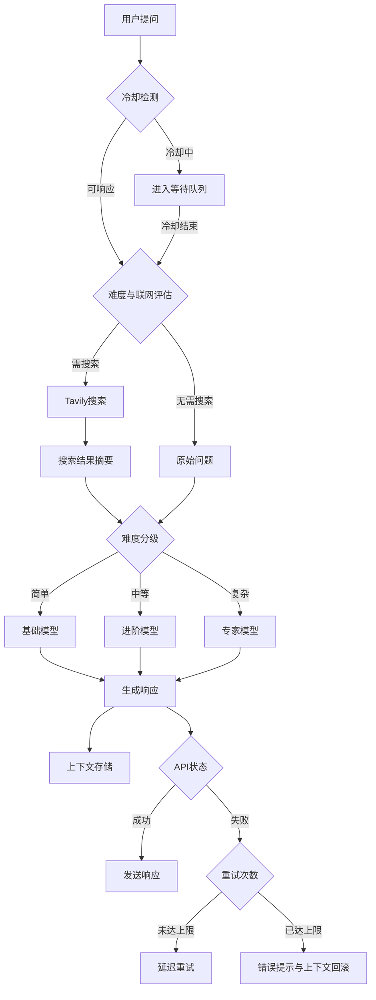

<div align="center"> <a href="https://v2.nonebot.dev/store"></a> <br> <p></p> </div><div align="center">

# nonebot-plugin-moellmchats

✨ 混合专家模型调度LLM插件 | 混合调度·联网搜索·上下文优化·个性定制·Token节约·更加拟人 ✨

<a href="./LICENSE">  </a> <a href="https://pypi.python.org/pypi/nonebot-plugin-moellmchats">  </a> </div>

- [🚀 核心特性](#-核心特性)
- [📦 安装](#-安装)
- [⚙️ 配置](#️-配置)
  - [`.env` 配置](#env-配置)
  - [本插件主要配置](#本插件主要配置)
    - [基础配置](#基础配置-configjson手动维护)
    - [模型管理](#模型管理-modelsjson手动维护)
    - [智能调度配置](#智能调度配置-model_configjson指令维护)
    - [性格设定](#性格设定-temperamentsjson-手动维护)
    - [用户性格设定](#用户性格设定-temperament_configjson-指令维护)
- [🎮 使用](#-使用)
  - [指令表](#指令表)
  - [效果图](#效果图)
- [🔄 处理流程](#-处理流程)
- [更新日志](#更新日志)
- [鸣谢](#鸣谢)

## 🚀 核心特性

- MoE架构（混合专家模型调度）：

  - 动态路由至最优模型，支持所有OpenAI兼容接口
  - 智能难度分级（简单/中等/复杂）自动匹配模型，Token消耗降低35%

- 智能网络搜索整合：

  - 语义分析自动触发Tavily搜索，提供精准摘要
  - 支持任意LLM，大幅节约Token

- 立体上下文管理：

  - 群组/用户双层级隔离存储，群组滑动窗口，用户滑动窗口+TTL过期机制
  - 支持上下文长度定制（默认群组10条/用户8条）

- 个性化对话定制：

  - 用户级性格预设，支持动态切换与自定义模板

- 工业级稳定性设计：

  - 对话冷却时间
  - 请求队列管理
  - 请求失败自动重试

- 更加拟人的回复风格：
  - 分段发送回复
  - 每段根据回复内容长度增加延迟
  - 自定义发送表情包

## 📦 安装

<details>
<summary>使用 nb-cli 安装</summary>
在 nonebot2 项目的根目录下打开命令行, 输入以下指令即可安装

    nb plugin install nonebot-plugin-moellmchats

</details>

<details>
<summary>使用包管理器安装</summary>
在 nonebot2 项目的插件目录下, 打开命令行, 根据你使用的包管理器, 输入相应的安装命令

<details>
<summary>pip</summary>

    pip install nonebot-plugin-moellmchats

</details>
<details>
<summary>pdm</summary>

    pdm add nonebot-plugin-moellmchats

</details>
<details>
<summary>poetry</summary>

    poetry add nonebot-plugin-moellmchats

</details>
<details>
<summary>conda</summary>

    conda install nonebot-plugin-moellmchats

</details>

打开 nonebot2 项目根目录下的 `pyproject.toml` 文件, 在 `[tool.nonebot]` 部分追加写入

    plugins = ["nonebot_plugin_moellmchats"]

</details>

## ⚙️ 配置

### `.env` 配置

在 nonebot2 项目的`.env`文件中添加下表中的必填配置

|       配置项       | 必填 | 默认值 |                                          说明                                          |
| :----------------: | :--: | :----: | :------------------------------------------------------------------------------------: |
|     SUPERUSERS     |  是  |   无   |                    超级用户，NoneBot自带配置项，本插件要求此项必填                     |
|      NICKNAME      |  是  |   无   |                   机器人昵称，NoneBot自带配置项，本插件要求此项必填                    |
| LOCALSTORE_USE_CWD |  否  |   无   | 是否使用当前工作目录作为本地存储目录，如果为True，则会将本地存储目录设置为当前工作目录 |
|   COMMAND_START    |  否  |   /   |                           命令前缀。一些指令需要前缀才能识别                           |

例：

```.env
SUPERUSERS=["your qq"]  # 配置 NoneBot 超级用户
NICKNAME=["bot","机器人"]  # 配置机器人的昵称
# localstore 配置
LOCALSTORE_USE_CWD=True # 可选
# 配置命令前缀
COMMAND_START=["/",""]  # 可选
```

### 本插件主要配置

由于文件较多，所以统一放在 `nonebot_plugin_localstore.get_plugin_config_dir()` 目录，具体参照[NoneBot Plugin LocalStore](https://github.com/nonebot/plugin-localstore)。<br>
配置文件在首次运行时自动生成，可以先运行一下，再停止后手动修改。<br>
**注意**：若是手动复制，因为json不能有注释，所以复制后记得删除注释以及末尾逗号。

#### 基础配置 `config.json`(手动维护)<br>

📌修改后需要重启。Tavily搜索: [获取API Key](https://tavily.com/)。

```json5
{
  max_group_history: 10, // 群组上下文最大长度
  max_user_history: 8, // 每个用户上下文最大长度
  max_retry_times: 3, // 最大重试次数
  user_history_expire_seconds: 600, // 用户上下文过期时间
  cd_seconds: 0, // 每个用户冷却时间（秒）
  search_api: "Bearer your_tavily_key", //联网搜索tavily api key。开启搜索必填，且开启MoE才能使用
  fastai_enabled: false, // 快速AI助手开关。方便快速调用纯AI助手，无角色扮演。调用快速AI助手时，仅有用户上下文，不会有群聊上下文。不会分段发送也不会发表情包。调用方法下文提到。
  emotions_enabled: false, // 是否开启表情包（只有stream和is_segmemt为true才会发送表情包，模型设置中设置）
  emotion_rate: 0.1, // 发送表情包概率（0-1）（经测试 LLM 几乎每句都会发送表情包，所以手动设置概率）
  emotions_dir: "absolute path", // 表情包目录，绝对路径
}
```

**表情包目录结构示例**:

```plaintext
your_absolute_path/
├── smile/
│   ├── smile1.jpg
│   ├── smile2.png
│   └── smile3.jpg
├── 滑稽/
│   ├── huaji001.png
│   ├── huaji002.jpg
│   └── huaji003.png
└── 阴险/
    ├── yinxian_a.jpg
    ├── yinxian_b.png
    └── yinxian_c.jpg
```

> **说明**: 每个文件夹为表情包名字（中英皆可），用于LLM识别，每张图片名字任意。系统自动读取文件夹名字，不需要手动在prompt中添加说明。

#### 模型管理 `models.json`(手动维护)<br>

⚠️**必填**。其中**url、model、key**必填，其他可省略。只能手动修改，重启生效。

```json5
{
  "dpsk-chat": {
    "url": "https://api.deepseek.com/chat/completions",
    "key": "Bearer xxx",
    "model": "deepseek-chat",
    "temperature": 1.5,
    "max_tokens": 1024,
    "proxy": "http://127.0.0.1:7890",
    "stream": True, // 是否流式响应
    "is_segment": True, // 是否开启分段发送（只有stream为true才会生效）
    "max_segments": 5, // 分段发送最大段数（开启分段发送后，为了防止刷屏，设置发送上限，超过后会直接停止发送）
  },
  "dpsk-r1": {
    "url": "https://api.deepseek.com/chat/completions",
    "key": "Bearer xxxx",
    "model": "deepseek-reasoner",
    "stream": false,
    "top_k": 5,
    "top_p": 1.0
  }
}
```

#### 智能调度配置 `model_config.json`(指令维护)<br>

📌 默认不开启moe和网络搜索，支持QQ指令实时切换；若手动修改，重启生效。<br>
**模型名字必须为 `medels.json` 中的键值。**

```json5
{
  use_moe: false, // 启用混合专家模式。若开启联网搜索，则需开启此项
  moe_models: {
    // 问题难度分级模型映射
    "0": "dpsk-chat", // 简单问题
    "1": "dpsk-chat", // 中等问题
    "2": "dpsk-r1", // 复杂问题
  },
  selected_model: "dpsk-r1", // 不启用MoE时的模型。最好填写上，在难度分级失败时也会回滚至此模型
  category_model: "glm-4-flash", // 问题分类模型（建议用免费或较小的模型）
  use_web_search: false, // 启用网络搜索（use_moe 为 true 时才生效）
}
```

#### 性格设定 `temperaments.json` (手动维护)<br>

📌 不用写“你在群组”等设定，系统自动补全 | 修改后需重启生效

```json5
{
  默认: "你是ai助手。回答像真人且尽量简短，回复格式为@id content", //性格默认值，可以不填，但是最好填上，没设置过性格的群友默认调用该性格
  ai助手: "你是ai助手。回复格式为@id content", // ai助手，若开启快速调用纯ai助手，则需要填写
  艾拉: "你是《可塑性记忆》中的角色“艾拉”，不怎么表现出感情的少女型Giftia。性格傲娇，当听到不想听的话语时，会说：'ERROR，没听清楚'。回答尽量简短",
}
```

#### 用户性格设定 `temperament_config.json` (指令维护)<br>

📌 全自动生成和命令配置，无需手动复制或修改 | 若手动修改，需重启生效

```json
{
  "用户1的qq号": "ai助手",
  "用户2的qq号": "默认"
}
```

## 🎮 使用

### 指令表

|         指令         |    权限    | 范围 |     参数      |                      说明                      |
| :------------------: | :--------: | :--: | :-----------: | :--------------------------------------------: |
| @Bot或以nickname开头 |     无     | 群聊 |   对话内容    |                    聊天对话                    |
|       性格切换       |     无     | 群聊 |   性格名称    |    发送`切换性格、切换人格、人格切换` 均可     |
|       查看性格       |     无     | 群聊 |      无       |         发送 `查看性格、查看人格` 均可         |
|       查看模型       |     无     | 群聊 |      无       |          查看当前 `model_config` 配置          |
|          ai          |     无     | 群聊 |   对话内容    | 若已开启和配置，快速调用纯ai助手。如 `ai 你好` |
|       切换模型       | 超级管理员 | 群聊 |   模型名字    |             不使用moe时指定的模型              |
|       设置moe        | 超级管理员 | 群聊 | 0、1、开、关  |            是否开启混合专家调度模式            |
|       切换moe        | 超级管理员 | 群聊 | 难度 模型名字 |     难度为0、1、2，如：`切换moe 0 dpsk-r1`     |
|       设置联网       | 超级管理员 | 群聊 | 0、1、开、关  |       是否开启网络搜索，如：`设置联网 0`       |

### 效果图

**冷却与队列**


**联网搜索**


**一个ai驯服另一个ai的实录**

> 橙色头像为本插件的bot，使用了qwq-32b模型。（注：为了防止上下文干扰，新版的快速AI助手不再有群聊上下文，只保留用户上下文）


**分段发送与表情包**


## 🔄 处理流程



**核心机制说明**

1. 智能冷却系统

   - 独立计时：每个用户拥有独立冷却计时器（通过cd_seconds配置）

   - 队列管理：冷却期间的新消息进入队列，冷却结束自动处理

2. 容错重试机制

   - 多级重试：网络错误时自动触发阶梯式重试（间隔：2s → 4s → 8s）

3. 混合调度流程

   - 预检阶段：优先执行冷却状态检测和队列管理

   - 双评估层：并行分析「问题复杂度」与「实时信息需求」

   - 分级路由：简单问题直连轻量模型（响应速度提升40%），复杂问题调用专家模型（准确度提升60%）

4. Token消耗降低
   - 大致可降低API调用失败率78%，Token浪费减少63%，同时保障高并发场景下的系统稳定性。

## 更新日志

### 2023-06-22 v0.15.11
- 重试间隔从 `2**retry_times` 改为 `2**(retry_times+1)`

### 2025-05-20 v0.15.10

- 去掉了谷歌单独处理，可以免得其他模型出bug
- 优化了sse处理，鲁棒性更强

### 2025-05-13 v0.15.9

- 修复获取不到昵称时再次产生bug的bug
- 优化搜索的提示，现在更可爱了

### 2025-04-23 v0.15.8

- 修复未开启分段和流式发送时也发表情包的bug
- 修复读性格失败时，再产生新bug的bug

### 2025-04-22 v0.15.7

- 对话的优先级降低
- 修复非流式模式忘了加await的bug

### 2025-04-21 v0.15.6

- 优化发送表情包逻辑：为防止上下文干扰，现在发送的表情包不会进入上下文了
- 优化重试逻辑

### 2025-04-16 v0.15.5

- 修复错误提示bug

### 2025-04-16 v0.15.4

- 优化错误提示
- 优化description

### 2025-04-13 v0.15.2

- 修复有些模型没有top_k的bug（说的就是你，Gemini）
- 优化表情包发送逻辑

### 2025-04-12 v0.15.0

- **新增**：支持分段发送与表情包
- 修复一些bug，优化性能和提升容错

## 鸣谢

- [Nonebot](https://nonebot.dev/) 项目所发布的高品质机器人框架
- [nonebot-plugin-template](https://github.com/A-kirami/nonebot-plugin-template) 所发布的插件模板
- [nonebot-plugin-llmchat](https://github.com/FuQuan233/nonebot-plugin-llmchat) 部分参考
- [deepseek-r1](https://deepseek.com/) 我和共同创作README
- 以及所有LLM开发者
