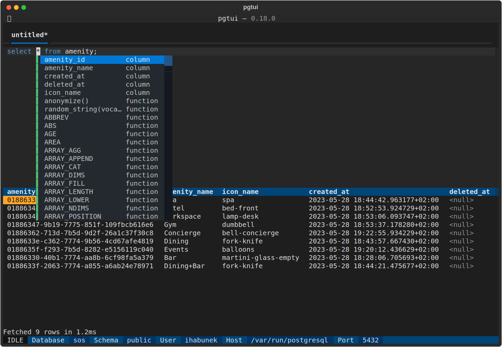

pgtui
=====

Terminal user interface for PostgreSQL.

Project status: in development, things will change, but usable.

Install from pypi, preferably using [pipx](https://github.com/pypa/pipx):

```
pipx install pgtui
```

## Screenshots


Autocomplete:



Data export:


## Key bindings

In app, press **F1** to see all key bindings.

Default bindings rely a lot on the Alt+key combinations which may not work in all terminals. They seem to not work in gnome terminal, but work in Kitty, Alacritty and Foot.

You can override default key binding by creating a settings file at:
* `~/.config/pgtui/settings.toml` (Linux & co.)
* `%APPDATA%\pgtui\settings.toml` (Windows)

Within the settings add a `[bindings]` section and you can override the key bindings there.

Here's all the bindings at the time of writing:

```toml
[bindings]

# General
show_help = "f1"
open_file = "alt+o"
exit = "alt+q"
save = "alt+s"
select_database = "alt+d"

# Editor
execute_query = "alt+enter"
autocomplete_open = "alt+space"
autocomplete_close = "escape"
autocomplete_apply = "tab,enter"
format_query = "alt+f"
format_all = "alt+shift+f"
select_query = "alt+shift+s"
copy_selection = "alt+c"
switch_layout = "alt+x"

# Results
export = "alt+e"
toggle_cursor = "alt+s"

# Tabs
new_tab = "alt+n"
close_tab = "alt+w"
next_tab = "alt+tab,alt+pagedown"
prev_tab = "alt+shift+tab,alt+pageup"
show_tab_1 = "alt+1"
show_tab_2 = "alt+2"
show_tab_3 = "alt+3"
show_tab_4 = "alt+4"
show_tab_5 = "alt+5"
show_tab_6 = "alt+6"
show_tab_7 = "alt+7"
show_tab_8 = "alt+8"
show_tab_9 = "alt+9"
show_tab_10 = "alt+0"
```
