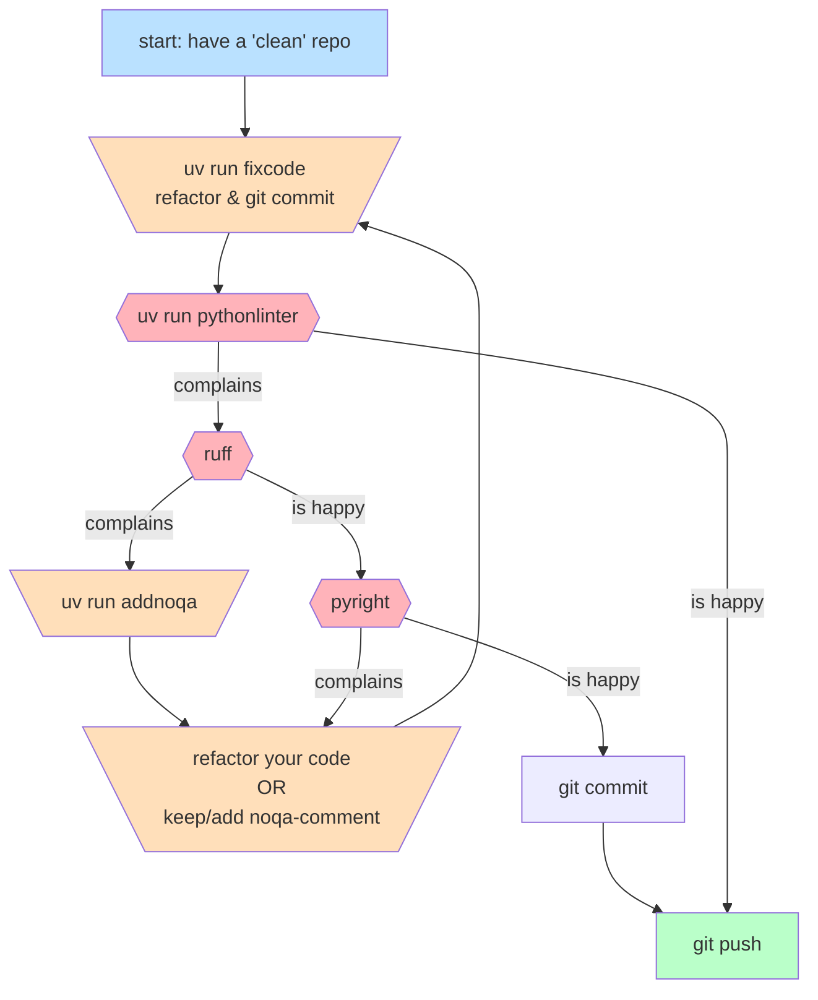

[](https://opensource.org/licenses/MIT)
[](https://beartype.readthedocs.io)
# python-linters
- bundles ruff and ~~flake8~~ basedpyright into a single ~~poetry~~uv-script
- even though I liked some flake8-rules (especially from [wemake-python-styleguide](https://wemake-python-styleguide.readthedocs.io/en/latest/)) dropped it in favor of ruff for being too slow
- project independent linter configuration (via `ruff.toml`,~~`.flake8`~~`pyrightconfig.json`) -> one config to rule them all
  - well one can still override the default config via `ruff_extensions.toml` and `pyrightconfig.json` 
### use-cases:
1. interactively learning python code quality standards via ruff+pyright, see [local development workflow](#2-local-development-workflow-before-pushing-to-ci-pipeline)
2. enforcing minimal quality-standards via a "lint-stage" in a ci-pipeline, see [setup for ci-pipeline](#3-setup-for-ci-pipeline)
## 0. motivation: 
### Python is a Bicycle!
- initial idea of python: `Bridge the gap between the shell and C.`[see](https://www.artima.com/articles/pythons-design-goals)

### run-time "safety"
- type and data validation at runtime
- pytests run your code -> runtime

### lint-time "safety"
- linting and static type checking

- flake8 already fell down!
### more "safety" via shorter feed-back loops


## 1. install (via poetry)
1. in `pyproject.toml` add to dependencies
```toml

[tool.poetry.group.dev.dependencies]
python-linters = { version = "<some-version-here>" }
```
2. in your `pyproject.toml` specify the directories that you want to be linted (currently `tests`-dir is added by default)
   a. via `packages`
     ```toml
     packages = [
         { include = "my_package_name" }, 
     ]
     ```
   b. or via `tool.python-linters`
    ```toml
    [tool.python-linters]
    folders_to_be_linted=["my_directory","another_dir/my_sub_package"]
    ```
## 2. local development workflow (before pushing to ci-pipeline)
### enhanced "usability" via VSCODE-Extension
1. git clone this repo
2. install [ruff-extension](https://marketplace.visualstudio.com/items?itemName=charliermarsh.ruff)
3. add the following to your `settings.json`
```json
    "ruff.lint.args": [
        "--config=<wherever-you-git-cloned-it>/python-linters/python_linters/ruff.toml"
    ],
```
### three scripts/commands that you can run locally
1. `uv run fixcode` to let black+isort+ruff "auto-fix" your code -> always have a `clean` git-repo before doing this (no uncommitted changes)
   - [example output](#fixcode-example)
1. `uv run pythonlinter` -> to lint your code
   - [example black is not happy](#pythonlinter-black-is-not-happy) -> if you ran `fixcode` black is guaranteed to be happy!
   - [example ruff is not happy](#pythonlinter-ruff-is-not-happy)
1. `uv run addnoqa` to let ruff insert rules-violation-comments to your code
   - [example](#addnoqa-example)

- write-operations (changing your code): `uv run fixcode`, `poerty run addnoqa`, `refactor your code`
- read-only-operations: `uv run pythonlinter`,`git commit`, `git push`

## 3. setup for ci-pipeline
* if you specified the packages in the `pyproject.toml` and you run just run `uv run pythonlinter` without any arguments than the `pyproject.toml` is getting parsed and specified packages are getting linted 
```yaml
stages:
  - lint # lint-stage!
  - build
  - test
  - deploy

...

linting:
  stage: lint
  extends: .poetry
  variables:
    DEBIAN_FRONTEND: noninteractive
  script:
    - poetry install --only dev
    - poetry run pythonlinter package_a package_b tests # specify folders to be linted
      ## OR
    - poetry run pythonlinter # to be linted folders are parsed out of the pyproject.toml packages-include section
    


```
## example outputs
### fixcode example
```commandline
cd <somehwere>/whisper-streaming
uv run fixcode
Fixing <somehwere>/whisper-streaming/whisper_streaming/post_asr_preparations.py
whisper_streaming/faster_whisper_inference/faster_whisper_inferencer.py:231:30: ARG005 Unused lambda argument: `x`
whisper_streaming/faster_whisper_inference/faster_whisper_inferencer.py:234:5: RET503 Missing explicit `return` at the end of function able to return non-`None` value
whisper_streaming/post_asr_preparations.py:113:5: ANN201 Missing return type annotation for public function `remove_empty_segments`
whisper_streaming/post_asr_preparations.py:113:27: ANN001 Missing type annotation for function argument `whisper_output_segments`
Found 5 errors (1 fixed, 4 remaining).
No fixes available (2 hidden fixes can be enabled with the `--unsafe-fixes` option).
reformatted <somehwere>/whisper-streaming/whisper_streaming/post_asr_preparations.py
reformatted <somehwere>/whisper-streaming/whisper_streaming/faster_whisper_inference/faster_whisper_inferencer.py

All done! ✨ 🍰 ✨
2 files reformatted, 20 files left unchanged.
folders_to_be_linted=['whisper_streaming', 'tests']
```

### pythonlinter ruff is not happy
- complains about
  - an unused argument
  - a missing return statement
  - missing type annotations
```commandline
uv run pythonlinter
linter-order: black->ruff->pyright

...

running ruff
whisper_streaming/faster_whisper_inference/faster_whisper_inferencer.py:232:29: ARG005 Unused lambda argument: `x`
whisper_streaming/faster_whisper_inference/faster_whisper_inferencer.py:235:5: RET503 Missing explicit `return` at the end of function able to return non-`None` value
whisper_streaming/post_asr_preparations.py:114:5: ANN201 Missing return type annotation for public function `remove_empty_segments`
whisper_streaming/post_asr_preparations.py:114:27: ANN001 Missing type annotation for function argument `whisper_output_segments`
Found 4 errors.
No fixes available (2 hidden fixes can be enabled with the `--unsafe-fixes` option).
python_linters.run_linters.LinterException: 💩 ruff is not happy! 💩
```
### addnoqa example
- only shows how many noqas it added (`3`) and how many files it left unchanged (`22`)
```commandline
uv run addnoqa
Added 3 noqa directives.
All done! ✨ 🍰 ✨
22 files would be left unchanged.
folders_tobelinted=['whisper_streaming', 'tests']
addnoqa iteration: 0
```
- it adds noqas like this one:
```python
def foobar(x): # noqa: ANN001, ANN202
   return "whatever"

```
# IDE integration
## manual vscode integration
- in `.vscode/tasks.json`
```json
{
    // See https://go.microsoft.com/fwlink/?LinkId=733558
    // for the documentation about the tasks.json format
    "version": "2.0.0",
    "tasks": [
        {
            "label": "fixcode",
            "type": "shell",
            "command": "cd $(cd ${fileDirname} && git rev-parse --show-toplevel) && uv run fixcode"
        },
        {
            "label": "addnoqa",
            "type": "shell",
            "command": "cd $(cd ${fileDirname} && git rev-parse --show-toplevel) && uv run addnoqa"
        },
        {
            "label": "pythonlinter",
            "type": "shell",
            "command": "cd $(cd ${fileDirname} && git rev-parse --show-toplevel) && uv run pythonlinter"
        }
    ]
}
```
## manual pycharm integration

## alternatives
- https://github.com/astral-sh/ruff-vscode
- https://plugins.jetbrains.com/plugin/20574-ruff