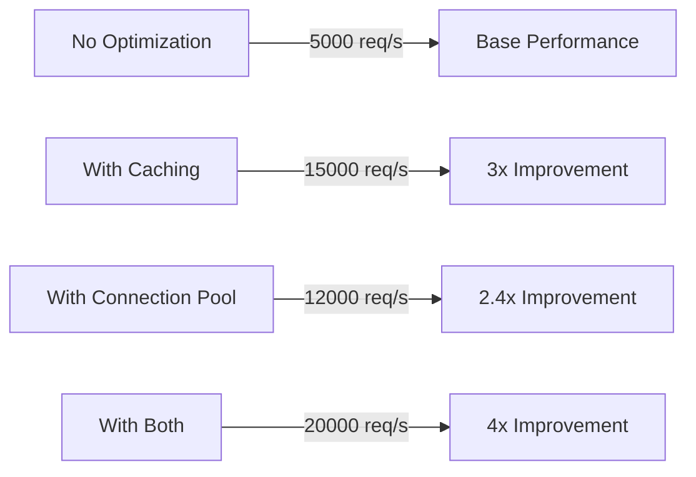

# Performance Optimization

## Caching Strategies

### In-Memory Caching

```python
from qakeapi.cache import Cache

cache = Cache(backend="memory")

@app.get("/expensive-data/{id}")
@cache(ttl=300)  # Cache for 5 minutes
async def get_expensive_data(id: int):
    data = await expensive_database_query(id)
    return data
```

### Redis Caching

```python
cache = Cache(
    backend="redis",
    redis_url="redis://localhost:6379/0"
)

@app.get("/user/{user_id}")
async def get_user(user_id: int):
    # Try to get from cache first
    cached_user = await cache.get(f"user:{user_id}")
    if cached_user:
        return cached_user
    
    # If not in cache, get from database
    user = await db.get_user(user_id)
    await cache.set(f"user:{user_id}", user, ttl=3600)
    return user
```

## Connection Pooling

### Database Connection Pool

```python
from qakeapi.core.optimization import ConnectionPool

class DatabasePool(ConnectionPool):
    async def _create_connection(self):
        return await create_database_connection()
    
    async def _close_connection(self, conn):
        await conn.close()
    
    async def _is_connection_valid(self, conn):
        try:
            await conn.execute("SELECT 1")
            return True
        except Exception:
            return False

# Initialize pool
db_pool = DatabasePool(
    min_size=5,
    max_size=20,
    timeout=30.0
)

@app.get("/data")
async def get_data():
    conn = await db_pool.acquire()
    try:
        return await conn.fetch_data()
    finally:
        await db_pool.release(conn)
```

## Request Profiling

### Profile Endpoints

```python
from qakeapi.core.optimization import RequestProfiler

profiler = RequestProfiler()

@app.get("/profile-me")
@profile_endpoint(profiler)
async def profiled_endpoint():
    # Your endpoint logic here
    return {"status": "success"}

@app.get("/profile-stats")
async def get_profile_stats():
    return profiler.get_stats()
```

## Asynchronous Operations

### Parallel Processing

```python
import asyncio

@app.get("/parallel-data")
async def get_parallel_data():
    # Execute multiple operations in parallel
    results = await asyncio.gather(
        fetch_users(),
        fetch_posts(),
        fetch_comments()
    )
    
    users, posts, comments = results
    return {
        "users": users,
        "posts": posts,
        "comments": comments
    }
```

## Response Optimization

### JSON Serialization

```python
import orjson
from qakeapi.responses import Response

class ORJSONResponse(Response):
    def render(self, content) -> bytes:
        return orjson.dumps(content)

@app.get("/fast-json")
async def get_fast_json():
    data = await get_large_dataset()
    return ORJSONResponse(data)
```

## Memory Management

### Streaming Large Responses

```python
from qakeapi.responses import StreamingResponse

async def number_generator():
    for i in range(1_000_000):
        yield f"{i}\n"

@app.get("/stream")
async def stream_numbers():
    return StreamingResponse(
        number_generator(),
        media_type="text/plain"
    )
```

## Load Testing Results



## Best Practices

1. **Use Connection Pooling**
   - Reuse connections instead of creating new ones
   - Set appropriate pool sizes based on your hardware

2. **Implement Caching**
   - Cache frequently accessed data
   - Use appropriate TTL values
   - Consider cache invalidation strategies

3. **Optimize Database Queries**
   - Use indexes properly
   - Minimize the number of queries
   - Use bulk operations when possible

4. **Profile Your Code**
   - Monitor endpoint performance
   - Track memory usage
   - Identify bottlenecks

5. **Use Asynchronous Operations**
   - Run independent operations in parallel
   - Don't block the event loop
   - Use appropriate pool sizes

## Monitoring

### Prometheus Metrics

```python
from prometheus_client import Counter, Histogram
from qakeapi.middleware import Middleware

requests_total = Counter(
    'requests_total',
    'Total requests processed'
)

request_duration = Histogram(
    'request_duration_seconds',
    'Request processing time'
)

@app.middleware
async def metrics_middleware(request, call_next):
    requests_total.inc()
    with request_duration.time():
        response = await call_next(request)
    return response
```

## Next Steps

- Implement suggested optimizations gradually
- Monitor performance metrics
- Adjust based on your specific use case
- Consider horizontal scaling if needed 