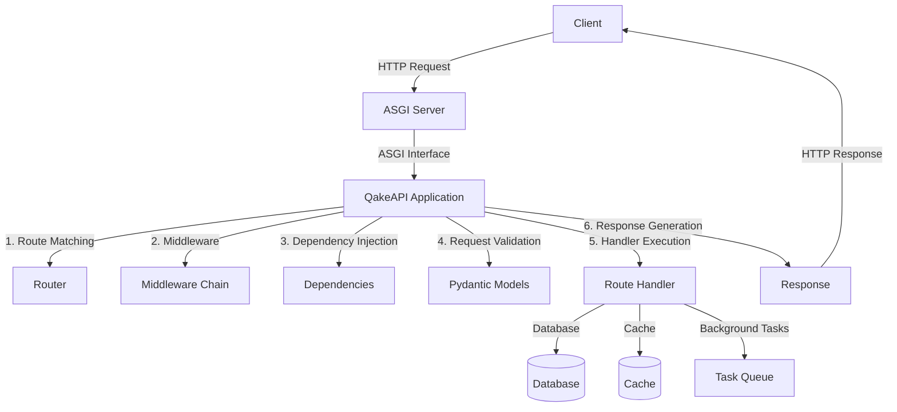

# QakeAPI Reference Documentation

## Core Components

### Application

The `Application` class is the main entry point for creating a QakeAPI application.

```python
from qakeapi import Application

app = Application()
```

#### Key Features
- ASGI-compatible
- Built-in dependency injection
- Middleware support
- Background task handling

#### Methods

##### `add_route(path: str, handler: Callable, methods: List[str])`
Adds a new route to the application.

```python
@app.route("/items/{item_id}")
async def get_item(item_id: int):
    return {"item_id": item_id}
```

### Router

The `Router` class handles URL routing and request dispatching.

```python
from qakeapi import Router

router = Router()
```

#### Methods

##### `include_router(router: Router, prefix: str = "")`
Includes another router with an optional prefix.

### Request

The `Request` class represents an incoming HTTP request.

#### Properties
- `headers`: HTTP headers
- `query_params`: URL query parameters
- `path_params`: URL path parameters
- `body`: Request body
- `method`: HTTP method
- `url`: Full request URL

### Response

The `Response` class represents an HTTP response.

```python
from qakeapi import Response

response = Response(
    content={"message": "Hello World"},
    status_code=200,
    headers={"X-Custom-Header": "value"}
)
```

## Dependency Injection

QakeAPI provides a powerful dependency injection system:

```python
from qakeapi import Dependency

async def get_db():
    # Database connection logic
    return db_connection

@app.route("/users")
async def get_users(db: Dependency[Database] = Depends(get_db)):
    return await db.fetch_all("SELECT * FROM users")
```

## Performance Optimization

### Caching

```python
from qakeapi.cache import Cache

cache = Cache()

@app.route("/expensive-operation")
@cache(ttl=300)  # Cache for 5 minutes
async def expensive_operation():
    # Complex computation
    return result
```

### Connection Pooling

```python
from qakeapi.db import create_pool

pool = await create_pool(
    min_size=5,
    max_size=20,
    connection_timeout=30
)
```

## Architecture Diagram



## Best Practices

### Error Handling
```python
from qakeapi.exceptions import HTTPException

@app.exception_handler(HTTPException)
async def http_exception_handler(request, exc):
    return Response(
        content={"detail": exc.detail},
        status_code=exc.status_code
    )
```

### Request Validation
```python
from pydantic import BaseModel

class Item(BaseModel):
    name: str
    price: float
    is_offer: bool = False

@app.post("/items/")
async def create_item(item: Item):
    return item
```

### Background Tasks
```python
from qakeapi import BackgroundTask

@app.post("/send-email")
async def send_email(
    email_data: EmailData,
    background_tasks: BackgroundTask
):
    background_tasks.add_task(send_email_async, email_data)
    return {"message": "Email will be sent"}
``` 