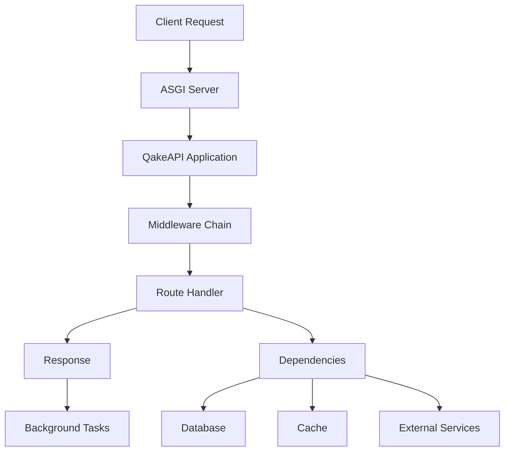

# Core Concepts

## Application

The `Application` class is the main entry point for creating a QakeAPI application. It handles:
- Route registration
- Middleware processing
- Exception handling
- Dependency injection
- Background tasks

```python
from qakeapi import Application

app = Application()
```

## Routing System

### Route Decorators

QakeAPI uses decorators for route registration:

```python
@app.get("/")  # HTTP GET
@app.post("/")  # HTTP POST
@app.put("/")  # HTTP PUT
@app.delete("/")  # HTTP DELETE
@app.patch("/")  # HTTP PATCH
```

### Path Parameters

Dynamic path parameters are enclosed in curly braces:

```python
@app.get("/users/{user_id}")
async def get_user(user_id: int):
    return {"user_id": user_id}
```

### Query Parameters

Query parameters are automatically parsed from the URL:

```python
@app.get("/items")
async def list_items(skip: int = 0, limit: int = 10):
    return {"skip": skip, "limit": limit}
```

## Request Handling

### Request Object

The `Request` object contains all the information about the incoming HTTP request:

```python
@app.get("/info")
async def get_info(request: Request):
    return {
        "method": request.method,
        "url": str(request.url),
        "headers": dict(request.headers),
        "query_params": dict(request.query_params)
    }
```

### Request Body

Request bodies are automatically parsed based on content type:

```python
from pydantic import BaseModel

class User(BaseModel):
    username: str
    email: str
    full_name: str | None = None

@app.post("/users/")
async def create_user(user: User):
    return user
```

## Response Handling

### Response Types

QakeAPI supports various response types:

```python
from qakeapi.responses import (
    JSONResponse,
    HTMLResponse,
    PlainTextResponse,
    RedirectResponse
)

@app.get("/json")
async def get_json():
    return JSONResponse({"message": "Hello"})

@app.get("/html")
async def get_html():
    return HTMLResponse("<h1>Hello</h1>")

@app.get("/text")
async def get_text():
    return PlainTextResponse("Hello")

@app.get("/redirect")
async def redirect():
    return RedirectResponse("/destination")
```

## Dependency Injection

### Dependencies

Dependencies are reusable components that can be injected into route handlers:

```python
async def get_db():
    db = await create_db_connection()
    try:
        yield db
    finally:
        await db.close()

async def get_current_user(
    token: str,
    db: Database = Depends(get_db)
):
    user = await db.get_user_by_token(token)
    if not user:
        raise HTTPException(status_code=401)
    return user

@app.get("/me")
async def read_me(user: User = Depends(get_current_user)):
    return user
```

## Middleware

Middleware functions process requests before they reach route handlers:

```python
@app.middleware
async def logging_middleware(request, call_next):
    # Pre-processing
    print(f"Request to {request.url}")
    
    # Call route handler
    response = await call_next(request)
    
    # Post-processing
    print(f"Response status: {response.status_code}")
    return response
```

## Background Tasks

Background tasks run after the response is sent:

```python
async def send_email(to: str, body: str):
    # Email sending logic
    pass

@app.post("/subscribe")
async def subscribe(
    email: str,
    background_tasks: BackgroundTask
):
    background_tasks.add_task(
        send_email,
        email,
        "Welcome to our newsletter!"
    )
    return {"status": "subscribed"}
```

## Exception Handling

Custom exception handlers can be registered for specific exception types:

```python
from qakeapi.exceptions import HTTPException

class CustomException(Exception):
    pass

@app.exception_handler(CustomException)
async def custom_exception_handler(request, exc):
    return JSONResponse(
        status_code=500,
        content={"message": str(exc)}
    )

@app.get("/error")
async def trigger_error():
    raise CustomException("Something went wrong")
```

## Architecture Overview



## Next Steps

- Learn about [Security](security.md) features
- Explore [Database](database.md) integration
- Check out [Caching](caching.md) strategies
- See [Performance](../advanced/performance.md) optimization tips 