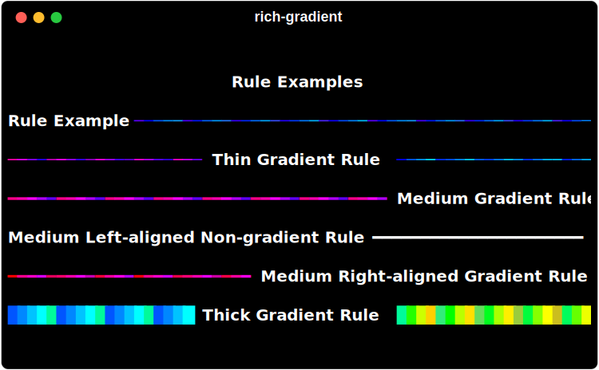

# GradientRule

The 'GradientRule` class is based off of the rich.rule.Rule class and is used to define a rule in gradient color and variable thickness.


## Usage

```python
from rich.console import Console
from rich_gradient.rule import GradientRule

console = Console()
console.print(
    GradientRule(
        "Hello, world!",
    )
)
```


## Alignment

The `GradientRule` class supports the same alignment options as the `Rule` class.

```python
console.print(
    GradientRule(
        "Hello, world! on the left",
        align="left",
    )
)
```


## Thickness

The `GradientRule` class add the ability to determine the thickness of the rule. Valid values are `thin`, `medium`, and `thick`. Defaults to `medium`.

```python
console.print(
    GradientRule(
        "Hello, world! thick",
        thickness="thick"
    )
)
```


