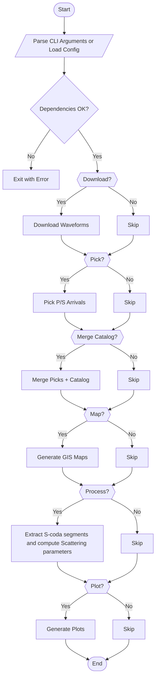

# ScodaKit: A scientific Python-based command line toolkit for S-coda seismic wave analysis and scattering parameters estimation

**ScodaKit** is an open-source command-line pipeline for estimating the **scattering parameters of S-coda waves** from seismic waveform data. It combines waveform downloading, manual seismic phase picking, catalog metadata merging, coda window extraction, energy decay analysis and visualization — all within a modular and extensible architecture.

> Designed for researchers, seismologists, and geophysicists working on seismic attenuation, crustal scattering, or seismic coda-based energy models.

---

## 🛠️ Features

This command-line pipeline allows you to:

- 📡 Download waveform data from FDSN-compliant data centers (e.g., NOA, IRIS)
- ⌛ Manual picking of **P and S seismic wave arrivals** using interactive seismic waveform viewers
- 🗃️ Merge waveform arrival data with seismic event metadata
- 🌍 Generate interactive or GIS-compatible **maps of events and stations**
- 🧠 Extract **S-coda waveforms** from the seismic traces using signal to noise ratio (SNR) method
- 📉 Analyze S-coda energy decay to estimate **mean free path (ℓ)** and **Coda attenuation factor (B)** using the Single Isotropic Scattering Model
- 📊 Visualize full waveforms, spectrograms and coda windows 
- 📉Analyze and visualize results statistically
- 🧪 Modular stages via CLI for reproducible research

---

# 📚 Theoretical Background / Methodology

### What Are Coda Waves?

In the seismogram of a local earthquake, we typically observe early-arriving body waves (**P** and **S**) and later surface waves (**Rayleigh** and **Love**). However, in the high-frequency range, seismograms often exhibit **coda waves**: trailing incoherent wave trains that follow the direct P and S-waves.

**S-coda waves** are considered scattered incoherent waves caused by randomly distributed heterogeneities (e.g., cracks, faults, lithological changes). This scattering process transforms the direct energy into a diffuse field whose amplitude decays with time. Coda waves were first formalized by Aki and Chouet (1975) as a tool for quantifying crustal heterogeneity.

---

### Single Isotropic Scattering Model

The ScodaKit toolkit implements the **Single Isotropic Scattering Model**, a simplification in which:

- The Earth's crust is treated as a **homogeneous elastic medium** with isotropically distributed scatterers.
- Scattering is modeled as an exponential decay due to energy loss (attenuation).
- S-wave coda energy density is used to back-calculate the **mean free path (ℓ)** and the **coda attenuation factor (B)**.

---

### Mathematical Formulation

The scattered S-wave energy density **Es(t)** is modeled as:

```
Es(t) = (10^(-Bt) × W) / (8πℓR²) × K(t/ts),  for t > ts
```

Where:

- **W** = Total S-wave radiated energy
- **ℓ** = Mean free path (characterizes scatterer density)
- **R** = Hypocentral distance
- **B** = Coda attenuation coefficient
- **t** = Lapse time since event origin
- **ts** = S-wave arrival time
- **K(t/ts)** = A function defined as:
  ```
  K(t/ts) = 1/(t/ts) × ln((t/ts + 1)/(t/ts - 1))
  ```

Attenuation is modeled as:
```
10^(-Bt)
```

The mean seismic energy density of the scattered S-waves is related to the three-component particle velocity amplitudes:

```
Es(t) = 1 / (8 × ρm) × (Ax(t)² + Ay(t)² + Az(t)²)
```

Where:
- **ρm** = Mass density (e.g., 2.7 g/cm³)
- **Ax, Ay, Az** = Amplitudes of the particle velocity components

---

### Linearization for Parameter Estimation

By combining the expressions, the energy decay can be expressed as:

```
F(t) = log₁₀( W × K(t/ts) / (8πR²) ) - log₁₀( Ax(t)² + Ay(t)² + Az(t)² )
```

F(t) is then fit as a **linear function of time**:

```
F(t) = log₁₀(ℓ) + Bt
```

From this regression:
- The **intercept** gives the logarithmic mean free path **log₁₀(ℓ)**
- The **slope** gives the attenuation factor **B**


---

### Coda Window Extraction

The **S-coda window** is selected in a seismic waveform based on the arrival times:

- Start of the S-coda:  
  ```
  Tc = Tp + 2 × (Ts - Tp)
  ```
  where **Tp** = P-wave arrival and **Ts** = S-wave arrival

- End of the window:  
  A fixed sliding window (e.g., 3 seconds) is applied. The coda ends when:
  ```
  SNR = RMS(signal) / RMS(noise) ≤ 3 where RMS is the root mean squared amplitude and SNR is the signal to noise ratio
  ```

Noise is estimated from a short pre-event window before **Tp**, ensuring no contamination from early phases. The RMS amplitude in the coda is tracked until it decays into background levels.


---

---

# 🧭 Real-World Applications / Importance

Accurate estimation of S-coda scattering parameters, such as **mean free path** and **coda attenuation factor**, provides valuable insights in a range of geophysical and engineering applications:

- **Seismic Hazard Assessment**: Enhances prediction of ground motion intensity and energy distribution in urban planning and infrastructure resilience.
- **Earth Structure Characterization**: Allows seismologists to infer properties of the Earth's crust from the spatial distribution of scatterers (e.g., fractures, velocity anomalies).
- **Volcanic and Tectonic Monitoring**: Temporal variation in coda wave properties can reveal early signals of stress changes or magma transport.
- **Engineering Seismology**: Supports tuning of synthetic seismogram simulations to reflect realistic scattering effects in complex media.
- **Energy Sector (Microseismic Monitoring)**: S-coda analysis is used in oil/gas and geothermal exploration to evaluate fracture density and reservoir properties.
- **Education**: ScodaKit toolkit  can be used as a teaching tool in seismology and geophysics courses, research projects, workshops on Python-based seismic analysis

---

---

# 📂 Project Structure


```
scodakit/
├── __init__.py                # Package init
├── main.py                    # CLI entry point
├── download.py                # Download seismic waveforms
├── picking.py                 # Manual P/S arrival picker
├── merge_catalogue.py         # Merge metadata & compute distances
├── process.py                 # Extract coda & estimate mean free path
├── plots.py                   # Plot full and coda waveforms
├── map_generator.py           # Create event/station maps
├── utils.py                   # Utility functions and classes (functions for filtering seismic data using Butterworth IIR filters)                 
```

---

---

# 📦 Installation

## (Optional) create a python virtual environment. Python >=3.7 needs to be installed first in the system

```bash
python -m venv venv
source venv/bin/activate  # Windows: venv\Scripts\activate
```

## Install scodakit via the Python Package Index (PyPI)

```bash
pip install scodakit
```

Or for developement:

```bash
git clone https://github.com/marioskaragiorgas/ScodaKit.git
cd ScodaKit
pip install -e .
```

Now you can run the pipeline with either the command below:

```bash
scodakit --help
```
Or with: 

```bash
scodakit -h
```
---

---

# 🚀 How to Run

## ⚙️ CLI Flags/Core Commands

| Flag                        | Description                                                                                      |
| --------------------------- | ------------------------------------------------------------------------------------------------ |
| `-dr` , `--dry_run`         | Dry run mode. Validate arguments and configuration without executing pipeline stages             |
| `-a` , `--all`              | Run all the stages of the pipeline without parsing the other arguments                           |
| `-d` , `--download`         | Download waveforms from the FDSN-compliant data centres using earthquakes from a seismic catalog |
| `-p` , `--pick`             | Launch P and S phase picking interface                                                           |
| `-me` , `--merge_catalog`   | Match picks with seismic catalog and compute distances                                           |
| `-ma` , `--map`             | Generate maps of seismic events/stations and their metadata                                      |
| `-pr` , `--process`         | Process waveforms to extract coda segment and estimate the scaterrimg parameters                 |
| `-pl` , `--plot`            | Plot waveform and coda traces                                                                    |

---

## Download Options

| Argument            | Description                                                                 |
|---------------------|-----------------------------------------------------------------------------|
| `--catalog`         | Seismic event catalog file (`.xml`, `.csv`, `.xlsx`)                        |
| `--stations`        | List of station codes (e.g., `HL.ATH`)                                      |
| `--bbox`            | Bounding box (`minlat,minlon,maxlat,maxlon`)                                |
| `--radius`          | Search radius in km                                                         |
| `--channels`        | SEED channel pattern (e.g., `HH?`)                                          |
| `--start_offset`    | Time before origin in seconds                                               |
| `--end_offset`      | Time after origin in seconds                                                |
| `--output_format`   | Waveform format (`MSEED`, etc.)                                             |
| `--node`            | FDSN data node (e.g., `NOA`)                                                |
| `--network_filter`  | List of allowed network codes                                               |
| `--threads`         | Number of threads for parallel download                                     |

---

## Map Generation Options

| Argument            | Description                                                |
|---------------------|------------------------------------------------------------|
| `--map_output_dir`  | Output directory for maps                                  |
| `--image_formats`   | Image formats to export (`png`, `pdf`)                     |
| `--export_formats`  | Data export formats (`geojson`, `csv`)                     |

---

## General Options

| Argument         | Description                                                    |
|------------------|----------------------------------------------------------------|
| `--output_dir`   | Base output directory                                          |
| `--log`          | Enable logging to `pipeline.log`                               |
| `--dry_run`      | Validate configuration and exit without running                |
| `--config`       | Load arguments from JSON or YAML config file                   |

## Visual diagram of the pipeline stages



### 🔹 Minimal Example (Single station or multiple stations)

```bash
scodakit --catalog "path/to/your/earthquake_catalog.xml" --output_dir "path/to/your/working/directory" --stations "HL.ATH","HL.PTL","HL.VLY","HL.THVA" --download --pick --merge_catalog --map --process --plot 
```

### 🔹 Dynamic Radius-Based Station Search

```bash
scodakit --catalog "path/to/your/earhquake_catalog.csv" --radius 100 --download --pick --merge_catalog --map --process --plot
```

### 🔹 Dynamic Radius-Based Station Search

```bash
scodakit --catalog "path/to/your/catalog.csv" --bbox '37.5,38.4,23.2,24.2' --output_dir "path/to/your/working/directory" --download --pick --merge_catalog --map --process --plot
```

### 🔹Other Examples
```bash
scodakit -a --catalog "path/to/your/earthquake_catalog.csv" --stations HL.ATH --output_dir "path/to/your/working/directory" --threads 8
```
Or using a configuration file containing the appropriate arguments:

```bash
scodakit --config "path/to/your/config.json"
```
The configuration file should look like this example:

```json
{
  "all": false,
  "download": true,
  "pick": true,
  "merge_catalog": true,
  "map": true,
  "process": true,
  "plot": true,
  "catalog": "test_data/seismic_catalogue.csv",
  "stations": ["HL.ATH", "HL.APR"],
  "bbox": "37.5,22.5,39.0,24.0",
  "channels": "HH?",
  "start_offset": -30,
  "end_offset": 150,
  "output_format": "MSEED",
  "node": "NOA",
  "network_filter": ["HL"],
  "threads": 8,
  "map_output_dir": "maps",
  "image_formats": ["png", "pdf"],
  "export_formats": ["geojson", "csv"],
  "output_dir": "results",
  "log": true
}
```

```yaml
all: false
download: true
pick: true
merge_catalog: true
map: true
process: true
plot: true

catalog: test_data/seismic_catalogue.csv
stations:
  - HL.ATH
  - HL.APR
bbox: "37.5,22.5,39.0,24.0"
channels: "HH?"
start_offset: -30
end_offset: 150
output_format: "MSEED"
node: "NOA"
network_filter:
  - HL
threads: 8

map_output_dir: "maps"
image_formats:
  - png
  - pdf
export_formats:
  - geojson
  - csv

output_dir: "results"
log: true
```

##  Graceful Exit
Pressing Ctrl+C will safely stop execution and preserve intermediate results.


## 📥 Inputs

* Output directory: Base output directory specified by the user in which the analysis results will be generated

* `catalog.xml` or `catalog.xlsx,.xlsx,.csv,.txt`: A path to a catalog containing seismic event metadata. !!! IMPORTANT !!! A catalog provided in .xls,.xlsx,.csv,.txt formats must has the extact same columns names as listed here:[Origin Time (GMT),	Latitude,	Longitude,	Depth (km),	Magnitude (ML)] for the succesfull completion of the dowload stage, like the example image below.


* Station codes (e.g. `ATH`) or search radius (e.g. `100` km) or Geographic coordinates Bounding Box (Lat/Lon limits: minlatitude, maxlatitude, minlongitude maxlongitude) (e.g `37.5,38.4,23.2,24.2`)

## 📤 Outputs

* Excel files with seismic arrival times, merged/filtered seismic catalog, summary of the scattering parameters
* MiniSEED waveforms
* Visual plots and regressions
* Maps of seismic events/stations and their metadata

## 🔍 Dependencies

* numpy
* scipy
* obspy
* pandas
* matplotlib
* seaborn
* scikit-learn
* cartopy
* geopandas
* openpyxl
* pyyaml

---

---

## 📁 Folder Structure

After running the pipeline, the following structure will be created:

```
output directory/              # The Output directory specified by the user (eg."C:/your/path/to/directory")
├── waveforms/                 # Raw downloaded miniSEED files
├── validated_waveforms/       # Waveforms saved after picking
├── arrival_times.xlsx         # P/S arrival picks per waveform
├── merged_catalog.xlsx        # Picks matched with seismic catalog and distances
├── maps/                      # Maps of seismic events and stations and their metadata
├── processed_output/          # S-coda segmented waveforms and derived metrics from the mean free path estimation
├── plots/
│   ├── full_waveforms/        # Full waveforms with picks and their spectrograms
│   └── coda_waveforms/        # Coda waveform segments 
```
---

---

# 📑 License

Licensed under the Apache License, Version 2.0.  
You may use, distribute, and modify this software under the terms of this license.  
See the [LICENSE](License.md) file for full details.

---

---

# 🙋 Contributing

Contributions are welcomne! Feel free to:

- 🐛 Open issues

- 🧠 Suggest features

- 📦 Improve docs

- 🧪 Add unit tests

- 🤝 Submit a pull request

---

---

# Acknowledgements

- Numpy for numerical calculations

- Scipy for signal processing

- pandas for data analysis

- Scikit-learn for linear regression

- matplotlib for plotting data

- seaborn for advanced statistical data ploting

- ObsPy for seismic waveform handling and processing

- Cartopy for geospatial mapping

- GeoPandas for creating geodataframes

- FDSN providers like NOA and IRIS for seismic data aquisition

- openpyxl for handling Excel files

- json and yaml for handling configuration files

- Research papers for providing the theoretical background. Here only the papers used for the methodology and the theoretical background description will be referenced:
1. Aki K, Chouet B (1975) Origin of coda waves: Source, attenuation and scattering effects. J Geophys Res 80:3322–3342, DOI 10.1029/JB080i023p03322
2. Sato H. (1977a) Energy propagation including scattering effects: Single isotropic scattering approximation. J Phys Earth 25:27–41 
3. Sato H. (1978) Mean free path of S-waves under the Kanto district of Japan. J Phys Earth 26:185–198
4. Koutalonis I. (2018) A non-extensive statistics approach of seismic coda waves. Evidence in earthquake events of Greece and Italy. MS.c IN “GEO-ENVIRONMENTAL RESOURCES AND RISKS” THESIS WORK 20/12/2018 

--- 

🎓 This pipeline is built as part of my Bachelor's thesis project "Karagiorgas Marios, Mean free path of S-coda wave scattering under the front of the hellenic arc (Crete, Greece), 2022". Please cite responsibly and contribute if it’s useful in your work.
