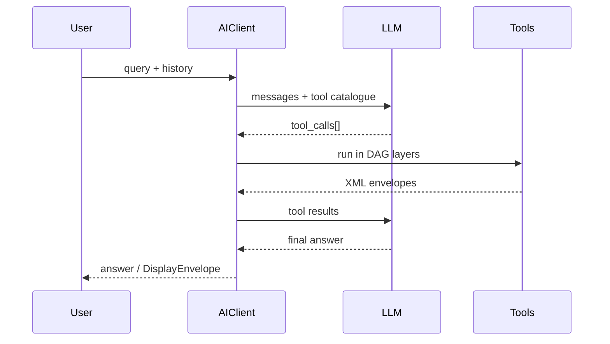

# Using AIClient

The `AIClient` orchestrates the dance between:

1. Your **conversation history** (stateless, caller-managed).
2. One or more **XMCP servers** exposing tools.
3. One or more **LLM providers** (OpenAI, Anthropic, local models).



---

## Minimal Setup

```python
providers = [OpenAIProvider(model_id="gpt-4o")]
async with AIClient(urls=["http://localhost:3333"], providers=providers) as ai:
    history = []
    res = await ai.chat("What is 2 + 2?", history)
    print(res["answer"])
```

### Streaming

```python
async for chunk in ai.stream_chat("Show sales as a chart", history):
    if chunk.type == "llm_delta":
        ui.append_text(chunk.text)
    elif chunk.type == "tool_display":
        ui.render(chunk.envelope)
```

### Hot-Reload

```python
aiclient = AIClient(urls=[...], providers=[...], refresh_interval=300)
# ... later
await aiclient.refresh_tools()
```

### Caching

```python
from xmcp.client.cache import RedisCache
ai = AIClient(urls=[...], providers=[...], cache=RedisCache(ttl=300))
```

---

## Dependency Graph Execution

When the LLM requests multiple tools in the same turn, `AIClient` executes them **layer-by-layer** based on the `depends_on` annotation.

```python
@mcp.tool()
def a(): ...
@mcp.tool(depends_on=["a"])
def b(): ...
@mcp.tool(depends_on=["b"])
def c(): ...
```

`AIClient` derives: `[[a], [b], [c]]`.

---

## Meta-Tools

| Name | Purpose |
|------|---------|
| `__think__` | Record hidden chain-of-thought. |
| `__summarize__` | Compress history to save tokens. |
| `__clarify__` | Ask the user a follow-up question and **return early**. |

These are injected automatically; you don't have to expose them on the server.

---

## Error & Display Callbacks

```python
def on_error(err, hist):
    log.error("tool failed", err)

aiclient = AIClient(urls=[...], providers=[...], on_error=on_error)
```

```python
def on_display(env, hist):
    ui.render(env)
```

---

## Concurrency & Timeouts

```python
aiclient = AIClient(
    urls=[...], providers=[...],
    max_concurrency=10,
    tool_timeout=8.0,
    retry_policy={"max_attempts": 3, "backoff_base": 0.5},
)
``` 