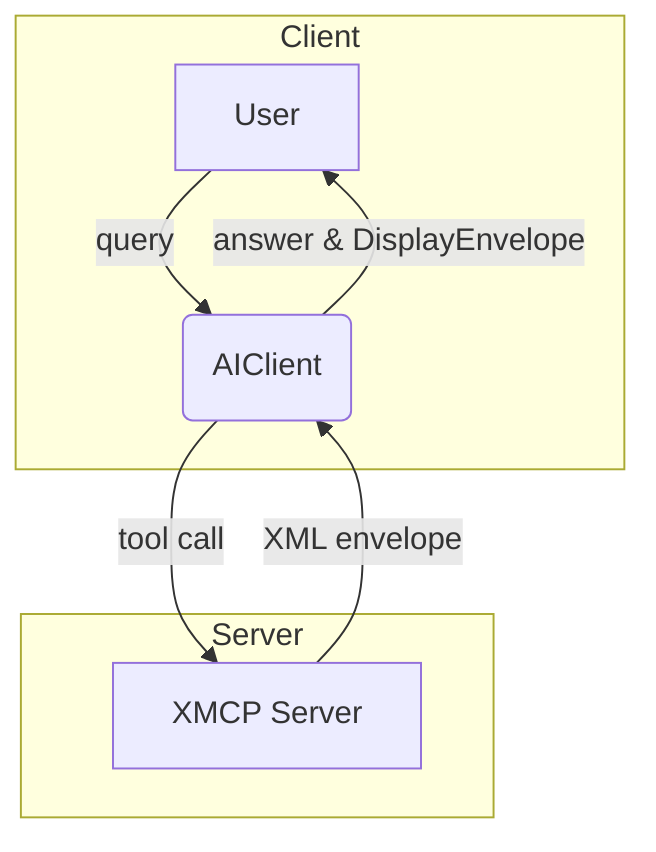

# Seqoria Agent Framework Overview

XMCP *(eXtended Multi-Channel Protocol)* builds on the **Model Context Protocol (MCP)** to let a Large-Language-Model call your Python functions and ship rich UI artefacts in one round-trip.



*Why XML?*  Wrapping the tool response in `<tool_response>` gives deterministic boundaries for the prompt while keeping the wire format 100 % plain text.

## Layer Cheat-Sheet

| Layer | Purpose | Key Module |
|-------|---------|------------|
| **AIClient** | Decides which tool(s) to run, handles retries, caching, streaming | `seqoria_agent.client.AIClient` |
| **XMCP Server** | Expose Python functions as tools, wraps results in XML | `seqoria_agent.server.fastxmcp.FastXMCP` |
| **Transport** | Streamable-HTTP JSON-RPC | `seqoria_agent.client.simple_http_transport` |
| **Providers** | OpenAI, Anthropic, local Llama 3 … | `seqoria_agent.providers.*` |

---

### Hello World in 20 Lines

```python
from seqoria_agent.server.fastxmcp import FastXMCP
from seqoria_agent import AIClient, DisplayEnvelope
from seqoria_agent.providers import OpenAIProvider
import asyncio

mcp = FastXMCP()

@mcp.display_tool
def greet(name: str, show_user: bool = False):
    if show_user:
        return DisplayEnvelope(type="markdown", payload=f"### Hello {name}! 👋")
    return {"greeting": f"Hello {name}!"}

async def main():
    async with AIClient(["http://localhost:3333"], [OpenAIProvider(model_id="gpt-4o")]) as ai:
        history: list[dict] = []
        res = await ai.chat("Say hi to Dean with a card", history)
        print(res["display"] or res["answer"])

if __name__ == "__main__":
    from threading import Thread
    Thread(target=mcp.run, kwargs=dict(port=3333), daemon=True).start()
    asyncio.run(main())
``` 