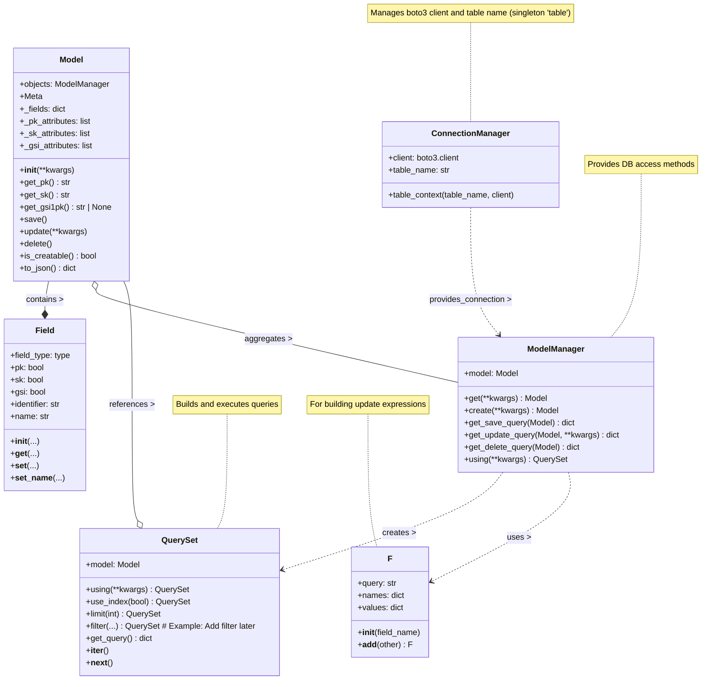

# STORM: Single Table ORM for DynamoDB

STORM is a Python library providing a Django-like ORM interface for interacting with AWS DynamoDB, specifically designed with the **single-table design** paradigm in mind.

## Project Status

- [x] Basic implementation
- [x] Testing setup with moto
- [ ] Make use of the single-table-model to allow querying multiple things at once
- [ ] Allow pydantic integration, but only optionally

## Introduction: Single-Table Design

DynamoDB is a highly scalable NoSQL database. Unlike traditional relational databases, it encourages a different approach to data modeling, often favoring a **single-table design**. This involves storing multiple different types of entities (e.g., Users, Orders, Products) within a single DynamoDB table.

This approach leverages DynamoDB's partition key design to efficiently query related items together in a single request, avoiding costly join operations common in SQL databases. By carefully crafting partition keys (PK) and sort keys (SK), you can model complex relationships and access patterns effectively.

**Why Single-Table Design?**

- **Performance:** Fetching related heterogeneous items often requires only a single query.
- **Scalability:** Aligns well with DynamoDB's horizontal scaling capabilities.
- **Reduced Operational Overhead:** Fewer tables to manage (monitoring, alarms, permissions).

**Learn More about Single-Table Design:**

- AWS Documentation: [Best practices for designing and architecting with DynamoDB](https://docs.aws.amazon.com/amazondynamodb/latest/developerguide/best-practices.html)
- AWS Blog Post: [Creating a single-table design with Amazon DynamoDB](https://aws.amazon.com/blogs/compute/creating-a-single-table-design-with-amazon-dynamodb/)
- Alex DeBrie's Post: [The What, Why, and When of Single-Table Design with DynamoDB](https://alexdebrie.com/posts/dynamodb-single-table/)

STORM aims to simplify working with this pattern by providing familiar ORM concepts.

## Installation

```bash
pip install single-table-orm
```

You will also need your AWS credentials configured (e.g., via environment variables, IAM role, or `~/.aws/credentials`).

## Publishing to PyPI

To build and upload this package to PyPI:

1. **Install build and twine:**

```bash
pip install build twine
```

2. **Build the package:**

```bash
python -m build
```

This will create `dist/` with `.tar.gz` and `.whl` files. 3. **Upload to PyPI:**

```bash
twine upload dist/*
```

You will be prompted for your PyPI credentials. For test uploads, use [TestPyPI](https://test.pypi.org/) with:

```bash
twine upload --repository testpypi dist/*
```

For more details, see the [Python Packaging User Guide](https://packaging.python.org/).

## High-Level Documentation & Usage

STORM provides several core components:

- **`Model`**: The base class for your DynamoDB entities. You define your table structure, keys, and attributes here.
- **`Field`**: Used within a `Model` to define attributes, their types, and whether they are part of the PK, SK, or a GSI.
- **`ConnectionManager` (`table`)**: A singleton object managing the DynamoDB client connection and the target table name. It provides context managers for temporary changes.
- **`ModelManager` (`Model.objects`)**: Provides methods for database interactions like `get()`, `create()`, `save()`, `update()`, `delete()`, and initiating queries (`using()`).
- **`QuerySet`**: Allows chaining of query operations like `filter()`, `limit()`, `use_index()`, etc., before executing the query.

### Basic Example

```python
from single_table_orm.models import Model
from single_table_orm.fields import Field

# Assumes AWS credentials and DB_TABLE_NAME env var are set

class User(Model):
    # PK field: User ID
    user_id = Field(str, pk=True)
    # SK field: Static value for User metadata item
    type = Field(str, sk=True, default="METADATA")
    email = Field(str)
    name = Field(str)
    # GSI field: Allows querying by email
    email_gsi = Field(str, gsi=True, identifier="E")

    class Meta:
        # Optional: Customize the suffix used in generated keys
        suffix = "USER"

class Order(Model):
    # PK field: User ID (same as the user this order belongs to)
    user_id = Field(str, pk=True)
    # SK field: Order ID (unique within a user's orders)
    order_id = Field(str, sk=True, identifier="O")
    amount = Field(float)
    order_date = Field(str) # Example: ISO 8601 format

    class Meta:
        suffix = "ORDER"

# --- Operations ---

# Create a User
# Note: You must provide all PK and SK fields
user = User.objects.create(user_id="user123", email="test@example.com", name="Test User", email_gsi="test@example.com")
# Or:
# user = User(user_id="user123", type="METADATA", email="test@example.com", name="Test User", email_gsi="test@example.com")
# user.save()

print(f"Created User PK: {user.get_pk()}, SK: {user.get_sk()}")
# Example Output: Created User PK: USER#U#user123#USER, SK: T#METADATA

# Create an Order for the User
order = Order.objects.create(user_id="user123", order_id="order456", amount=99.99, order_date="2024-01-01T10:00:00Z")

print(f"Created Order PK: {order.get_pk()}, SK: {order.get_sk()}")
# Example Output: Created Order PK: ORDER#U#user123#ORDER, SK: O#order456

# Get a specific User
try:
    retrieved_user = User.objects.get(user_id="user123", type="METADATA")
    print(f"Retrieved User: {retrieved_user.name}")
except User.DoesNotExist:
    print("User not found")

# Query for all orders for a user
user_orders = list(Order.objects.using(user_id="user123"))
print(f"User user123 has {len(user_orders)} orders.")

# Update a user's email (GSI field must also be updated)
retrieved_user.update(email="new@example.com", email_gsi="new@example.com")

# Delete an order
order.delete()
```

### Core Concepts Diagram



## License

This project is licensed under the MIT License - see the [LICENSE](LICENSE) file for details.

## Contributing

Contributions are welcome! Please see the [CONTRIBUTING.md](CONTRIBUTING.md) file for details.
