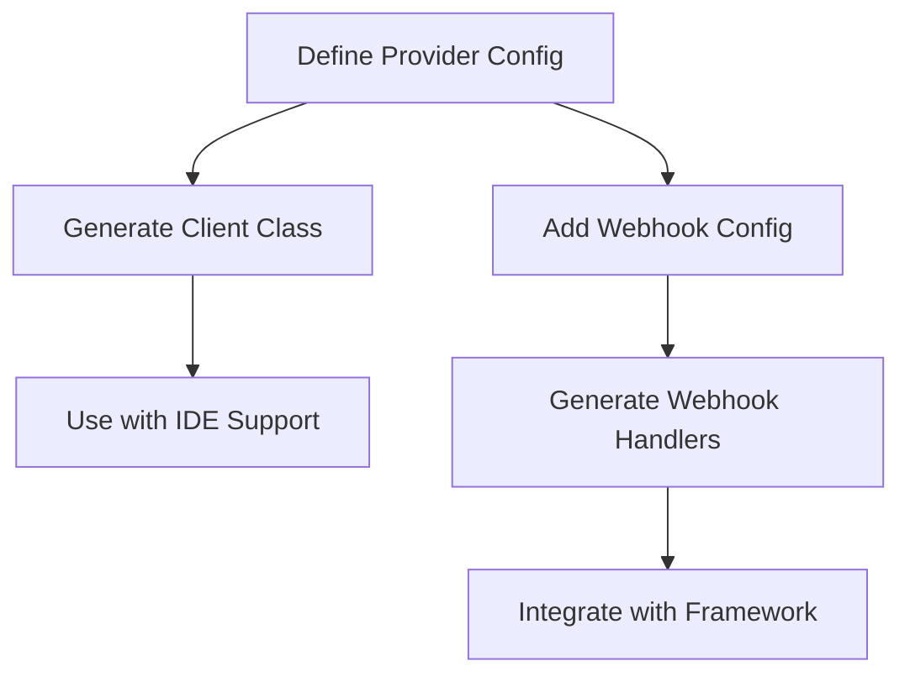

# 📚 Smart API Integrations Documentation

Welcome to the Smart API Integrations documentation! This system eliminates API integration boilerplate by providing intelligent client classes and standardized webhook handling.

## 🎯 Why Smart API Integrations?

**The Problem**: Traditional API integrations require repetitive boilerplate code, manual parameter handling, and provider-specific webhook implementations.

**The Solution**: Define endpoints once in YAML, get intelligent client classes with full IDE support, plus standardized webhook handling across providers.

## 📖 Documentation Structure

### 🚀 Getting Started
- **[Quick Start Guide](quick-start-guide.md)** - Get up and running in 5 minutes
- **[Installation & Setup](installation-setup.md)** - Detailed installation and environment setup

### 🔌 API Client Integration
- **[API Client Guide](api-client-guide.md)** - Complete guide to using API clients
- **[Adding New Providers](adding-new-providers.md)** - How to integrate new API providers
- **[Authentication Guide](authentication-guide.md)** - All supported authentication methods
- **[Type Safety & IDE Support](type-safety-guide.md)** - Generate type stubs for full IDE support

### 🪝 Webhook System
- **[Webhook System Overview](webhook-system-overview.md)** - Why our webhook system is valuable
- **[Webhook Handler Guide](webhook-handler-guide.md)** - Create and manage webhook handlers
- **[Framework Integration](framework-integration-guide.md)** - Flask, FastAPI, and Django integration

### 🛠️ Advanced Usage
- **[CLI Reference](cli-reference.md)** - Complete command-line interface documentation
- **[Provider Priority Guide](provider-priority-guide.md)** - How provider resolution and overrides work
- **[Package Setup Guide](package-setup-guide.md)** - Package structure and development setup
- **[Publishing Guide](publishing-guide.md)** - How to publish and distribute the package

### 🎯 Examples & Tutorials
- **[Real-World Examples](examples/README.md)** - Complete integration examples
- **[Provider Recipes](provider-recipes.md)** - Common provider configurations

## 🔄 Workflow Overview

## 🆘 Need Help?

- **Issues**: [GitHub Issues](https://github.com/yourusername/smart-api-integrations/issues)
- **Examples**: Check the `examples/` directory
- **Community**: [Discussions](https://github.com/yourusername/smart-api-integrations/discussions)

## 🚀 Quick Links

| What you want to do | Documentation |
|---------------------|---------------|
| Get started quickly | [Quick Start Guide](quick-start-guide.md) |
| Add a new API provider | [Adding New Providers](adding-new-providers.md) |
| Handle webhooks | [Webhook System Overview](webhook-system-overview.md) |
| Get full IDE support | [Type Safety Guide](type-safety-guide.md) |
| See real examples | [Examples](examples/README.md) |
| Use the CLI | [CLI Reference](cli-reference.md) | 