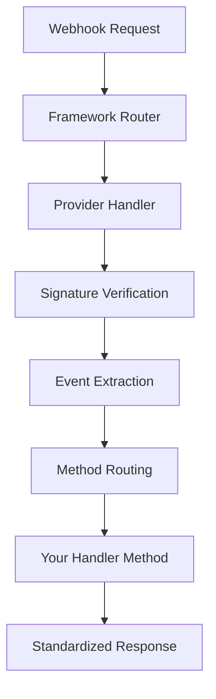

# 🪝 Webhook System Overview

## 🎯 Why Smart Webhooks?

Traditional webhook implementations require repetitive boilerplate code for each provider. Smart API Integrations standardizes webhook handling across all providers while maintaining flexibility.

## 📊 Traditional vs. Smart Webhooks

### ❌ Traditional Webhook Implementation

```python
# Separate endpoint for each provider with manual handling
@app.route('/webhooks/github', methods=['POST'])
def github_webhook():
    # Manual signature verification
    signature = request.headers.get('X-Hub-Signature-256')
    if not verify_github_signature(signature, request.data, GITHUB_SECRET):
        return jsonify({'error': 'Invalid signature'}), 401
    
    # Manual event type extraction
    event_type = request.headers.get('X-GitHub-Event')
    payload = request.json
    
    # Manual event routing
    if event_type == 'push':
        repo_name = payload.get('repository', {}).get('name')
        commits = payload.get('commits', [])
        # Process push...
    elif event_type == 'pull_request':
        pr_action = payload.get('action')
        # Process PR...
    
    return jsonify({'status': 'success'})

@app.route('/webhooks/stripe', methods=['POST'])
def stripe_webhook():
    # Different signature verification for Stripe
    signature = request.headers.get('Stripe-Signature')
    if not verify_stripe_signature(signature, request.data, STRIPE_SECRET):
        return jsonify({'error': 'Invalid signature'}), 401
    
    # Different event structure for Stripe
    payload = request.json
    event_type = payload.get('type')
    
    if event_type == 'payment_intent.succeeded':
        # Handle payment...
    elif event_type == 'customer.created':
        # Handle customer creation...
    
    return jsonify({'status': 'success'})
```

### ✅ Smart Webhook Implementation

```python
# Single handler class with automatic routing and security
from smart_api_integrations.webhooks import generate_webhook_handler

# Generate type-safe handler for GitHub
GitHubHandler = generate_webhook_handler('github', events=['push', 'pull_request'])

class MyGitHubHandler(GitHubHandler):
    def on_push(self, event):
        # Type-safe access with IDE completion
        repo_name = event.payload['repository']['name']
        commits = event.payload['commits']
        # Process push...
        return self.success_response({'processed': True})
    
    def on_pull_request(self, event):
        # Automatic action routing
        if event.payload['action'] == 'opened':
            # Handle PR opened
            pass
        return self.success_response()

# Generate handler for Stripe with different events
StripeHandler = generate_webhook_handler('stripe', events=['payment_intent.succeeded', 'customer.created'])

class MyStripeHandler(StripeHandler):
    def on_payment_intent_succeeded(self, event):
        # Process payment...
        return self.success_response()
    
    def on_customer_created(self, event):
        # Process customer creation...
        return self.success_response()

# Automatic framework integration
from flask import Flask
from smart_api_integrations.frameworks.flask import get_webhook_routes

app = Flask(__name__)
app.register_blueprint(get_webhook_routes('flask', {
    'github': MyGitHubHandler(),
    'stripe': MyStripeHandler()
}))
```

## 🔑 Key Benefits

### 1. **Standardized Interface**
- Consistent webhook handling pattern across all providers
- Same method signatures and response formats
- Unified error handling and logging

### 2. **Automatic Security**
- Provider-specific signature verification built-in
- Configurable security settings per provider
- Protection against replay attacks and invalid signatures

### 3. **Type Safety & IDE Support**
- Generated handler classes with typed event methods
- IDE completion for webhook payload fields
- Compile-time validation of event handling

### 4. **Framework Integration**
- Automatic route generation for Flask, FastAPI, and Django
- Consistent URL patterns: `/webhooks/{provider}`
- Easy integration with existing applications

### 5. **Event Routing**
- Automatic routing to specific handler methods
- Support for event filtering and conditional processing
- Graceful handling of unknown events

### 6. **Configuration-Driven**
- YAML-based webhook configuration
- Environment variable support for secrets
- Easy provider-specific customization

## 🏗️ Architecture Overview



## 🔧 Configuration Example

```yaml
# providers/github/webhook.yaml
webhooks:
  default:
    path: /webhooks/github
    verify_signature: true
    signing_secret_env: GITHUB_WEBHOOK_SECRET
    verification_type: hmac_sha256
    signature_header: X-Hub-Signature-256
    event_header: X-GitHub-Event
    events:
      - push
      - pull_request
      - issues
    
  # Multiple webhook endpoints for same provider
  releases:
    path: /webhooks/github/releases
    events:
      - release
```

## 🎯 Real-World Use Cases

### Multi-Provider Integration
```python
# Handle webhooks from multiple providers consistently
handlers = {
    'github': GitHubHandler(),
    'stripe': StripeHandler(),
    'slack': SlackHandler(),
    'twilio': TwilioHandler()
}

# All use the same integration pattern
app.register_blueprint(get_webhook_routes('flask', handlers))
```

### Event Processing Pipeline
```python
class GitHubHandler(BaseGitHubHandler):
    def on_push(self, event):
        # 1. Validate event
        if not self.validate_push_event(event):
            return self.error_response('Invalid push event')
        
        # 2. Process with business logic
        result = self.process_code_changes(event.payload)
        
        # 3. Trigger downstream actions
        self.notify_team(result)
        self.update_deployment_status(result)
        
        # 4. Return standardized response
        return self.success_response({
            'processed_commits': len(event.payload['commits']),
            'deployment_triggered': result.get('deployment_id')
        })
```

### Testing & Development
```python
# Easy testing with mock events
def test_github_push_handler():
    handler = MyGitHubHandler()
    
    # Load test payload
    with open('test_data/github_push.json') as f:
        payload = json.load(f)
    
    # Create mock event
    event = WebhookEvent(
        provider='github',
        event_type='push',
        payload=payload,
        headers={'X-GitHub-Event': 'push'}
    )
    
    # Test handler
    response = handler.on_push(event)
    assert response.status_code == 200
    assert response.json()['processed'] == True
```

## 🚀 Getting Started

1. **[Add webhook configuration](webhook-handler-guide.md#configuration)**
2. **[Generate handler classes](webhook-handler-guide.md#generation)**
3. **[Integrate with your framework](framework-integration-guide.md)**
4. **[Test your webhooks](webhook-handler-guide.md#testing)**

## 📚 Next Steps

- **[Webhook Handler Guide](webhook-handler-guide.md)** - Create and customize handlers
- **[Framework Integration](framework-integration-guide.md)** - Flask, FastAPI, Django setup
- **[Real Examples](examples/README.md)** - Complete working examples 