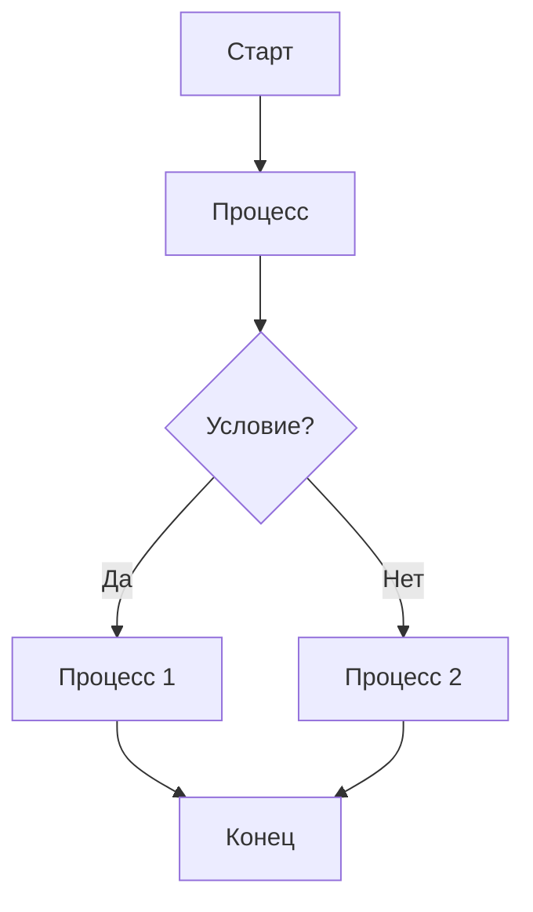
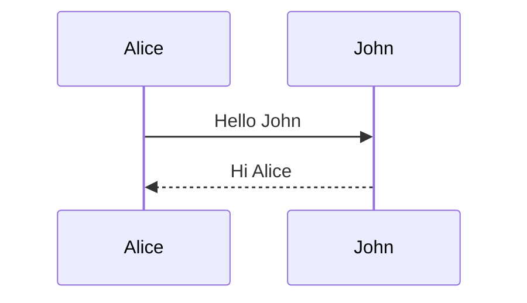
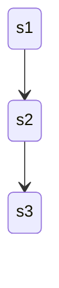
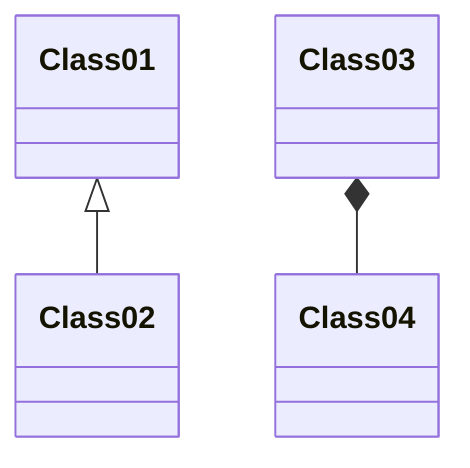

# Добро пожаловать в StaticFlow!

StaticFlow - это современный генератор статических сайтов с богатыми 
возможностями для создания контента.

## Возможности

### Подсветка кода

```python
def hello_world():
	print("Привет, StaticFlow!")
	
	if True:
		print("Tabs are working!")
		for i in range(3):
			print(f"Tab level {i+1}")
```

Here's some JavaScript with tabs:

```javascript
function testFunction() {
	console.log("Testing tabs");
	
	if (true) {
		console.log("Nested level");
		
		for (let i = 0; i < 3; i++) {
			console.log(`Loop iteration ${i}`);
		}
	}
}
```


### Диаграммы

#### Блок-схема


#### Диаграмма последовательности


#### Диаграмма состояний


#### Диаграмма классов


## Начало работы

1. Создание контента:
   - Добавьте Markdown файлы в директорию `content`
   - Используйте front matter для метаданных

2. Настройка шаблонов:
   - Измените шаблоны в директории `templates`
   - Добавьте свои стили в `static/css`

3. Запуск сервера разработки:
```bash
staticflow serve
```


