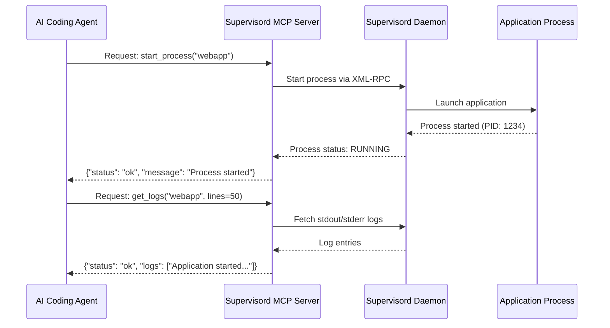

# Supervisord MCP

[](https://badge.fury.io/py/supervisord-mcp)
[](https://www.python.org/downloads/)
[](https://opensource.org/licenses/MIT)

**Streamlined Supervisord process management with AI agent integration through the Model Context Protocol (MCP).**

Supervisord MCP provides coding agents with direct access to Supervisord process management through the Model Context Protocol. By offering standardized process control capabilities, it eliminates the complexity of shell command parsing and reduces token consumption for AI agents working in production and development environments.

## MCP Integration Sequence



## What is Supervisord MCP?

Supervisord MCP enables AI coding agents to work more efficiently with production process management, contributing to better deployment reliability and operational efficiency.

Supervisord MCP provides direct process control through the Model Context Protocol, eliminating the overhead of shell commands and reducing token consumption for AI agents managing production and development environments.

**Core Features**:
- **AI Integration**: Built-in MCP protocol support for coding agents
- **Production Ready**: Based on battle-tested Supervisord process manager
- **Real-time Monitoring**: Process status and log access
- **Robust Operations**: Reliable process lifecycle management

## Quick Start

### Installation

```bash
uv add supervisord-mcp
```

### Basic Usage

```bash
# Start a process (requires it to be configured in supervisord.conf)
uv run supervisord-mcp start webapp

# Check what's running
uv run supervisord-mcp list-processes

# View logs
uv run supervisord-mcp logs webapp

# Get system information
uv run supervisord-mcp info
```

## Key Features

### 🚀 Process Management Made Easy

```bash
# Start/stop/restart processes
uv run supervisord-mcp start api
uv run supervisord-mcp stop api
uv run supervisord-mcp restart api

# Get detailed status
uv run supervisord-mcp status api
```

### 📊 Comprehensive Monitoring

```bash
# List all processes with status
uv run supervisord-mcp list-processes

# View real-time logs
uv run supervisord-mcp logs api --lines 100
uv run supervisord-mcp logs api --stderr

# System information
uv run supervisord-mcp info
```

### 🤖 AI Agent Integration

Supervisord MCP includes built-in MCP protocol support, allowing AI agents to manage your processes:

```bash
# Start MCP server for AI integration
uv run supervisord-mcp mcp
```

Configure in your AI agent using the **recommended stdio transport**:
```json
{
  "mcpServers": {
    "supervisord-mcp": {
      "command": "uv",
      "args": ["run", "supervisord-mcp", "mcp"],
      "cwd": "/path/to/your/project"
    }
  }
}
```

For different project setups:
```json
{
  "mcpServers": {
    "supervisord-mcp": {
      "command": "uv",
      "args": ["run", "supervisord-mcp", "mcp"],
      "cwd": "/app"
    }
  }
}
```

**Note**: This tool is designed for production and development environments using MCP's stdio transport method as specified in the [MCP documentation](https://modelcontextprotocol.io/). This approach provides secure, direct communication between AI agents and the process manager.

## Common Use Cases

### Production Web Application

```bash
# Configure in supervisord.conf:
[program:webapp]
command=gunicorn app:application
directory=/app
numprocs=4
autostart=true
autorestart=true

# Then manage via Supervisord MCP:
uv run supervisord-mcp start webapp
uv run supervisord-mcp logs webapp
```

### Development Environment

```bash
# Configure multiple services in supervisord.conf:
[program:frontend]
command=npm run dev
directory=/app/frontend
autostart=false

[program:backend]
command=python manage.py runserver
directory=/app/backend
autostart=false

# Manage the stack:
uv run supervisord-mcp start frontend
uv run supervisord-mcp start backend
uv run supervisord-mcp list-processes
```

### Microservices

```bash
# Multiple services configured in supervisord.conf
uv run supervisord-mcp start auth-service
uv run supervisord-mcp start user-service
uv run supervisord-mcp start notification-service
```

## Why Supervisord MCP?

### vs. Circus MCP
- **Production Focus**: Supervisord is designed for production environments
- **Stability**: Battle-tested process supervisor with years of production use
- **Configuration**: Uses standard supervisord.conf for process definitions

### vs. systemd
- **Cross-platform**: Works on any system with Python
- **User-friendly**: Simple commands and AI integration
- **Flexible**: Easy configuration and process management

### vs. PM2
- **Python-native**: Perfect for Python applications
- **AI integration**: MCP protocol support out of the box
- **Production proven**: Based on widely-used Supervisord

## Advanced Features

### Process Control

```bash
# Standard operations
uv run supervisord-mcp start webapp
uv run supervisord-mcp stop webapp
uv run supervisord-mcp restart webapp

# Get detailed status
uv run supervisord-mcp status webapp
```

### Log Management

```bash
# View logs with options
uv run supervisord-mcp logs webapp --lines 100
uv run supervisord-mcp logs webapp --stderr

# Real-time log monitoring (use supervisorctl tail in another terminal)
```

### Configuration Management

```bash
# Reload configuration after changes
uv run supervisord-mcp reload
```

## Installation & Setup

### System Requirements

- Python 3.10 or higher
- Supervisord installed and running
- Any operating system (Linux, macOS, Windows)

### Installation Options

```bash
# From PyPI (recommended)
uv add supervisord-mcp

# With pip (alternative)
pip install supervisord-mcp

# From source
git clone https://github.com/aether-platform/supervisord-mcp.git
cd supervisord-mcp
uv sync
```

### Supervisord Setup

1. Install Supervisord:
```bash
pip install supervisor
```

2. Create configuration directory:
```bash
mkdir -p /etc/supervisor/conf.d
```

3. Create main configuration file `/etc/supervisor/supervisord.conf`:
```ini
[unix_http_server]
file=/tmp/supervisor.sock

[supervisord]
logfile=/tmp/supervisord.log
logfile_maxbytes=50MB
logfile_backups=10
loglevel=info
pidfile=/tmp/supervisord.pid
nodaemon=false
minfds=1024
minprocs=200

[rpcinterface:supervisor]
supervisor.rpcinterface_factory = supervisor.rpcinterface:make_main_rpcinterface

[supervisorctl]
serverurl=unix:///tmp/supervisor.sock

[inet_http_server]
port=127.0.0.1:9001

[include]
files = /etc/supervisor/conf.d/*.conf
```

4. Start Supervisord:
```bash
supervisord -c /etc/supervisor/supervisord.conf
```

### Verify Installation

```bash
uv run supervisord-mcp --help
uv run supervisord-mcp info
```

## Configuration

Supervisord MCP works with standard Supervisord configuration. Add your programs to `/etc/supervisor/conf.d/`:

### Example Program Configuration

```ini
[program:webapp]
command=gunicorn app:application --bind 0.0.0.0:8000
directory=/app
numprocs=1
autostart=true
autorestart=true
startsecs=10
startretries=3
user=www-data
redirect_stderr=true
stdout_logfile=/var/log/webapp.log
```

### Custom Server URL

```bash
# Use custom Supervisord server
uv run supervisord-mcp --server-url http://localhost:9001/RPC2 list-processes
```

## MCP Tools Available

The following tools are available for AI agents:

- **add_process**: Add a new process (requires config reload)
- **start_process**: Start a process
- **stop_process**: Stop a process
- **restart_process**: Restart a process
- **list_processes**: List all processes
- **get_process_status**: Get detailed process status
- **get_logs**: Retrieve process logs (stdout/stderr)
- **get_system_info**: Get Supervisord system information
- **reload_config**: Reload Supervisord configuration

## Getting Help

### Documentation

- **[Supervisord Documentation](http://supervisord.org/)** - Official Supervisord documentation
- **[MCP Documentation](https://modelcontextprotocol.io/)** - Model Context Protocol specification

### Support

- **GitHub Issues**: [Report bugs or request features](https://github.com/aether-platform/supervisord-mcp/issues)
- **Discussions**: [Join the community](https://github.com/aether-platform/supervisord-mcp/discussions)

### Quick Command Reference

```bash
# Process Management
uv run supervisord-mcp start <name>
uv run supervisord-mcp stop <name>
uv run supervisord-mcp restart <name>
uv run supervisord-mcp status <name>

# Monitoring
uv run supervisord-mcp list-processes
uv run supervisord-mcp logs <name> [--lines N] [--stderr]
uv run supervisord-mcp info

# Configuration
uv run supervisord-mcp reload

# AI Integration
uv run supervisord-mcp mcp
```

## License

MIT License - see [LICENSE](LICENSE) for details.

## About the Author

**AetherPlatform** - Building the future of cloud-native development tools

- **GitHub**: [@aether-platform](https://github.com/aether-platform)
- **Project Website**: [AetherPlatform](https://github.com/aether-platform)
- **Contact**: aether-platform@re-x.info

### Our Mission
We develop tools that enhance developer productivity through AI integration and modern cloud-native technologies. Supervisord MCP is part of our broader ecosystem of development tools designed to streamline the software development lifecycle.

### Other Projects
- **AetherSaaS**: SaaS platform management console
- **AetherCoding**: AI-enhanced development environments
- **AetherOperation**: Operations and terminal management tools
- **Circus MCP**: Alternative process management with Circus

## Acknowledgments

We extend our heartfelt gratitude to the **[Supervisord](http://supervisord.org/)** development team for creating such a robust and reliable process management foundation. Their excellent work made this project possible. Supervisord MCP builds upon their solid architecture to bring modern AI agent integration to process management.

## Related Projects

- **[Supervisord](http://supervisord.org/)** - The underlying process manager
- **[Model Context Protocol](https://modelcontextprotocol.io/)** - AI agent communication standard
- **[AetherPlatform](https://github.com/aether-platform)** - Cloud-native development tools
- **[Circus MCP](https://github.com/aether-platform/circus-mcp)** - Alternative process management solution

---

**Made with ❤️ by [AetherPlatform](https://github.com/aether-platform)**

*Supervisord MCP: Production-ready process management, AI-powered automation.*