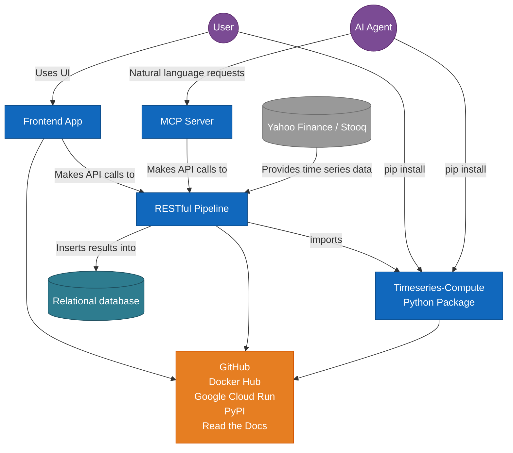
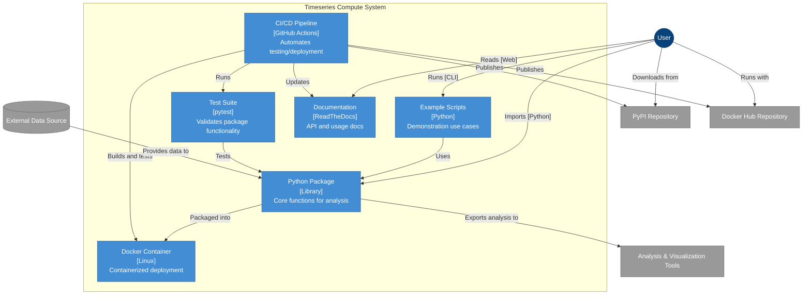
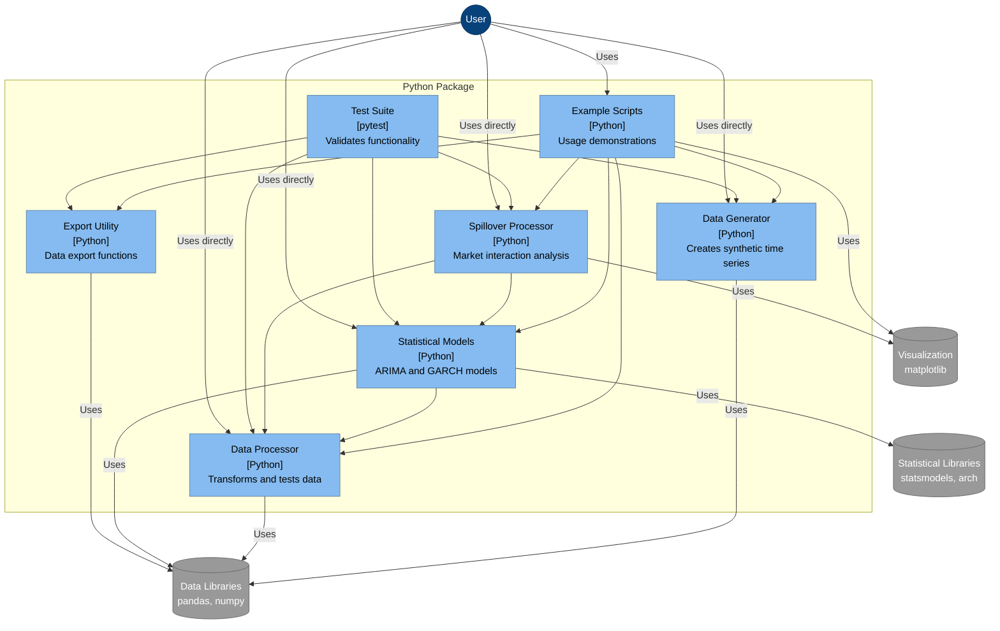
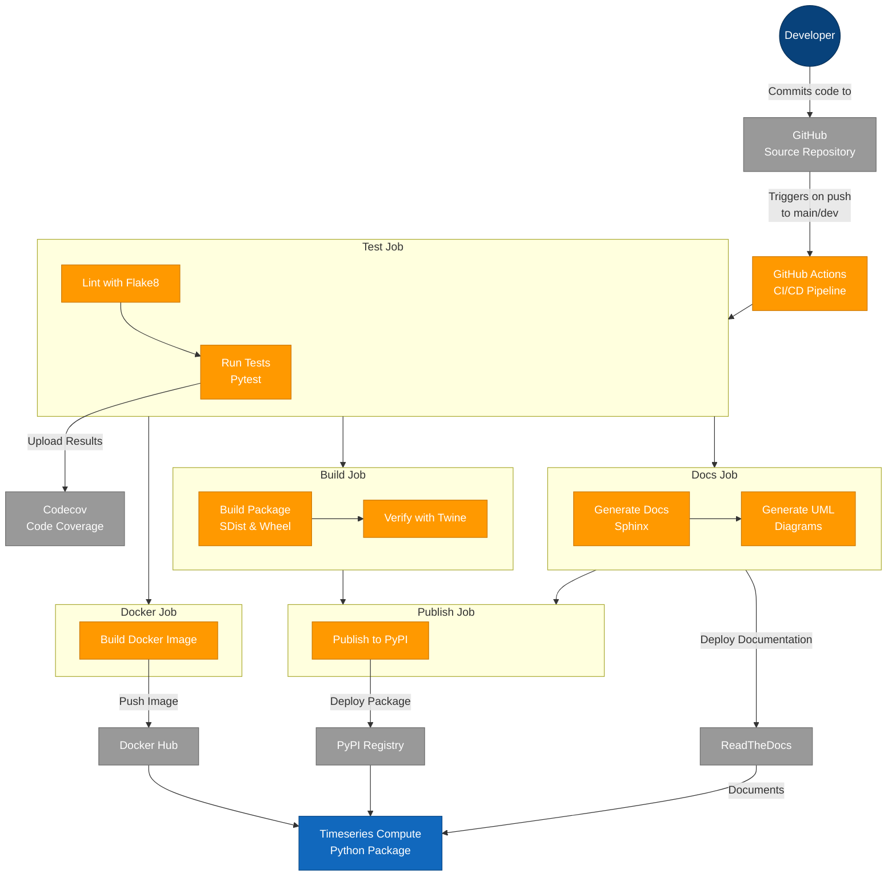
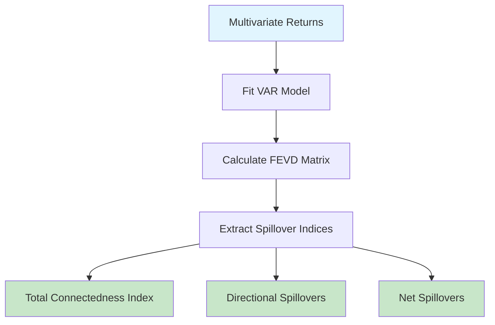
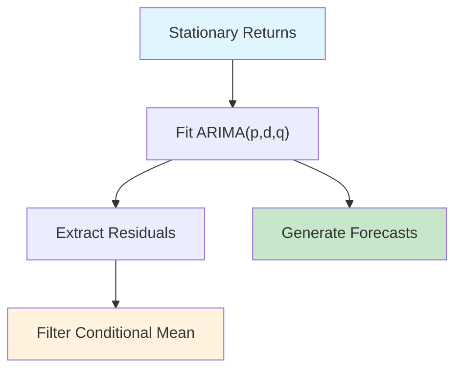
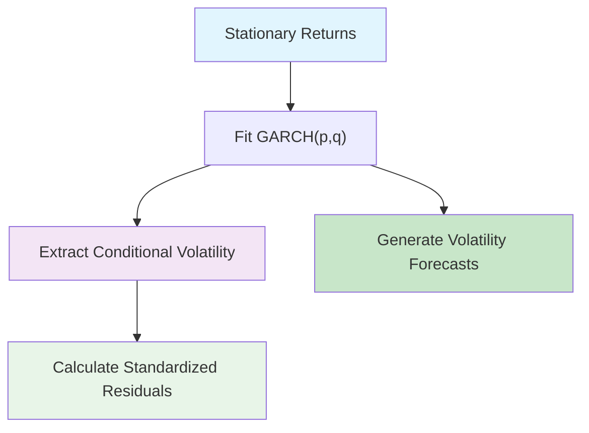
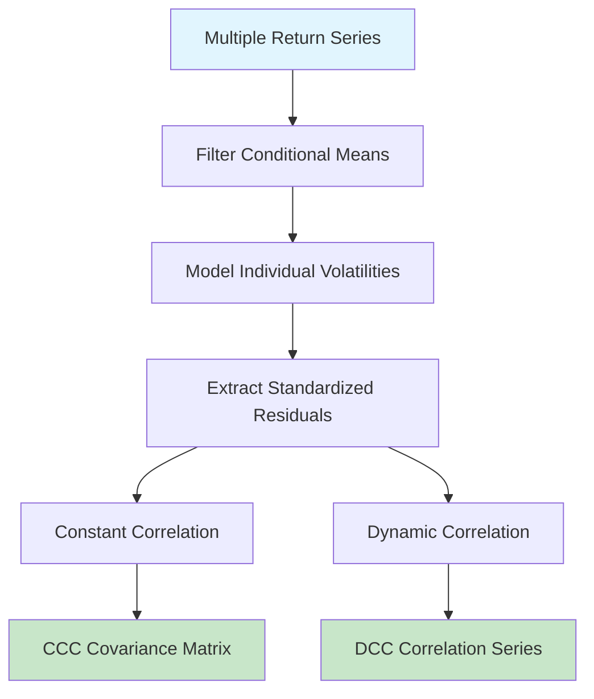
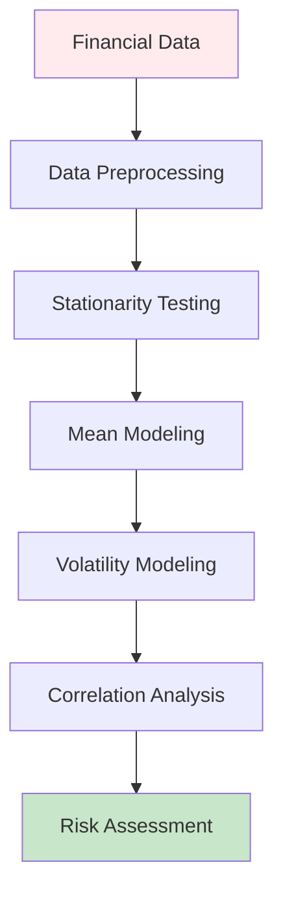

# Timeseries Compute

[](https://pypi.org/project/timeseries-compute/)
[](https://pypi.org/project/timeseries-compute/)
[](https://github.com/garthmortensen/timeseries-compute)
[](https://hub.docker.com/r/goattheprofessionalmeower/timeseries-compute)
[](https://timeseries-compute.readthedocs.io/en/latest/)

[](https://github.com/garthmortensen/timeseries-compute/actions/workflows/cicd.yml)
[](https://app.codacy.com/gh/garthmortensen/timeseries-compute/dashboard)
[](https://codecov.io/gh/garthmortensen/timeseries-compute)

## Overview

```ascii
████████╗██╗███╗   ███╗███████╗███████╗███████╗██████╗ ██╗███████╗███████╗
╚══██╔══╝██║████╗ ████║██╔════╝██╔════╝██╔════╝██╔══██╗██║██╔════╝██╔════╝
   ██║   ██║██╔████╔██║█████╗  ███████╗█████╗  ██████╔╝██║█████╗g ███████╗
   ██║   ██║██║╚██╔╝██║██╔══╝  ╚════██║██╔══╝  ██╔══██╗██║██╔══╝m ╚════██║
   ██║   ██║██║ ╚═╝ ██║███████╗███████║███████╗██║  ██║██║███████╗███████║
   ╚═╝   ╚═╝╚═╝     ╚═╝╚══════╝╚══════╝╚══════╝╚═╝  ╚═╝╚═╝╚══════╝╚══════╝
             ██████╗ ██████╗ ███╗   ███╗██████╗ ██╗   ██╗████████╗███████╗
            ██╔════╝██╔═══██╗████╗ ████║██╔══██╗██║   ██║╚══██╔══╝██╔════╝
            ██║     ██║   ██║██╔████╔██║██████╔╝██║   ██║   ██║   █████╗
            ██║     ██║   ██║██║╚██╔╝██║██╔═══╝ ██║   ██║   ██║   ██╔══╝
            ╚██████╗╚██████╔╝██║ ╚═╝ ██║██║     ╚██████╔╝   ██║   ███████╗
             ╚═════╝ ╚═════╝ ╚═╝     ╚═╝╚═╝      ╚═════╝    ╚═╝   ╚══════╝
```

Implementation hosted at www.spilloverlab.com.

A Python package for timeseries data processing and modeling using ARIMA and GARCH models with both univariate and multivariate capabilities.

### Features

- Price series generation for single and multiple assets
- Data preprocessing with configurable missing data handling and scaling options
- Stationarity testing and transformation for time series analysis
- ARIMA modeling for time series forecasting
- GARCH modeling for volatility forecasting and risk assessment
- Bivariate GARCH modeling with both Constant Conditional Correlation (CCC) and Dynamic Conditional Correlation (DCC) methods
- EWMA covariance calculation for dynamic correlation analysis
- Portfolio risk assessment using volatility and correlation matrices
- Market spillover effects analysis with Granger causality testing and shock transmission modeling
- Visualization tools for interpreting complex market interactions and spillover relationships

## Integration Overview



## Quick Start

### Installation

Using uv (fastest):

```bash
# Install uv
pip install uv
# create venv
uv venv
source .venv/bin/activate
uv pip install -r requirements.txt
```

Using venv (classic):

```bash
python -m venv venv
source venv/bin/activate  # On Windows: venv\Scripts\activate
pip install timeseries-compute
```

Install from GitHub using venv (latest development version):

```bash
python -m venv venv
source venv/bin/activate  # On Windows: venv\Scripts\activate
pip install git+https://github.com/garthmortensen/timeseries-compute.git
```

### Example Usage

For univariate time series analysis:

```bash
python -m timeseries_compute.examples.example_univariate_garch
```

For multivariate GARCH analysis (correlation between two assets):

```bash
python -m timeseries_compute.examples.example_multivariate_garch
```

### Docker Support

Run with Docker for isolated environments:

```bash
# build the image
docker build -t timeseries-compute:latest ./

# Run the univariate example
docker run -it timeseries-compute:latest /app/timeseries_compute/examples/example_univariate_garch.py

# Run the multivariate example
docker run -it timeseries-compute:latest /app/timeseries_compute/examples/example_multivariate_garch.py

# Get into interactive shell
docker run -it --entrypoint /bin/bash timeseries-compute:latest
```

### Project Structure

```text
timeseries_compute/......................
├── __init__.py                         # Package initialization and public API
├── data_generator.py                   # Synthetic price data generation with random walks and statistical properties
├── data_processor.py                   # Data transformation, missing value handling, scaling, and stationarity testing
├── export_util.py                      # Data export utilities for tracking analysis lineage
├── spillover_processor.py              # Diebold-Yilmaz spillover analysis and Granger causality testing
├── stats_model.py                      # ARIMA, GARCH, and multivariate GARCH model implementations
├── examples/............................
│   ├── __init__.py                     # Makes examples importable as a module
│   ├── example_multivariate_garch.py   # Correlation analysis between multiple markets with CC-GARCH and DCC-GARCH
│   └── example_univariate_garch.py     # Basic ARIMA and GARCH modeling for single-series forecasting
└── tests/...............................
    ├── __init__.py                     # Makes tests discoverable by pytest
    ├── test_data_generator_advanced.py # Advanced data generation features and statistical property testing
    ├── test_data_generator.py          # Basic price generation functionality testing
    ├── test_data_processor.py          # Data transformation, scaling, and stationarity testing
    ├── test_spillover_processor.py     # Spillover analysis and Granger causality testing
    ├── test_stats_model_arima.py       # ARIMA modeling with specialized fixtures and edge cases
    └── test_stats_model_garch.py       # GARCH volatility modeling with different distributions
```

### Architectural Diagrams

#### Level 2: Container Diagram



#### Level 3: Component Diagram



#### Level 4: Code/Class Diagram

```mermaid
classDiagram
    %% Main Classes (actual)
    class PriceSeriesGenerator {
        +start_date: str
        +end_date: str
        +dates: pd.DatetimeIndex
        +__init__(start_date, end_date)
        +generate_correlated_prices(anchor_prices, correlation_matrix): Dict[str, list]
    }
    
    class MissingDataHandler {
        +__init__()
        +drop_na(data): pd.DataFrame
        +forward_fill(data): pd.DataFrame
    }
    
    class DataScaler {
        +scale_data_standardize(data): pd.DataFrame
        +scale_data_minmax(data): pd.DataFrame
    }
    
    class StationaryReturnsProcessor {
        +make_stationary(data, method): pd.DataFrame
        +test_stationarity(data, test): Dict
        +log_adf_results(data, p_value_threshold): None
    }
    
    class ModelARIMA {
        +data: pd.DataFrame
        +order: Tuple[int, int, int]
        +steps: int
        +models: Dict[str, ARIMA]
        +fits: Dict[str, ARIMA]
        +__init__(data, order, steps)
        +fit(): Dict[str, ARIMA]
        +summary(): Dict[str, str]
        +forecast(): Dict[str, Union[float, list]]
    }
    
    class ModelGARCH {
        +data: pd.DataFrame
        +p: int
        +q: int
        +dist: str
        +models: Dict[str, arch_model]
        +fits: Dict[str, arch_model]
        +__init__(data, p, q, dist)
        +fit(): Dict[str, arch_model]
        +summary(): Dict[str, str]
        +forecast(steps): Dict[str, float]
    }
    
    class ModelMultivariateGARCH {
        +data: pd.DataFrame
        +p: int
        +q: int
        +model_type: str
        +fits: Dict
        +cc_results: Dict
        +dcc_results: Dict
        +__init__(data, p, q, model_type)
        +fit_cc_garch(): Dict[str, Any]
        +fit_dcc_garch(lambda_val): Dict[str, Any]
    }
    
    %% Factory Classes
    class ModelFactory {
        <<static>>
        +create_model(model_type, data, order, steps, p, q, dist, mv_model_type): Union[ModelARIMA, ModelGARCH, ModelMultivariateGARCH]
    }
    
    class MissingDataHandlerFactory {
        <<static>>
        +create_handler(strategy): Callable[[pd.DataFrame], pd.DataFrame]
    }
    
    class DataScalerFactory {
        <<static>>
        +create_handler(strategy): Callable[[pd.DataFrame], pd.DataFrame]
    }
    
    class StationaryReturnsProcessorFactory {
        <<static>>
        +create_handler(strategy): StationaryReturnsProcessor
    }
    
    %% Module-level Functions (actual implementation structure)
    class DataGeneratorModule {
        <<module>>
        +set_random_seed(seed): None
        +generate_price_series(start_date, end_date, anchor_prices, random_seed, correlations): Tuple[Dict, pd.DataFrame]
    }
    
    class DataProcessorModule {
        <<module>>
        +fill_data(df, strategy): pd.DataFrame
        +scale_data(df, method): pd.DataFrame
        +scale_for_garch(df, target_scale): pd.DataFrame
        +stationarize_data(df, method): pd.DataFrame
        +test_stationarity(df, method): Dict
        +log_stationarity(adf_results, p_value_threshold): None
        +price_to_returns(prices): pd.DataFrame
        +prepare_timeseries_data(df): pd.DataFrame
        +calculate_ewma_covariance(series1, series2, lambda_val): pd.Series
        +calculate_ewma_volatility(series, lambda_val): pd.Series
    }
    
    class StatsModelModule {
        <<module>>
        +run_arima(df_stationary, p, d, q, forecast_steps): Tuple[Dict, Dict]
        +run_garch(df_stationary, p, q, dist, forecast_steps): Tuple[Dict, Dict]
        +run_multivariate_garch(df_stationary, arima_fits, garch_fits, lambda_val): Dict
        +calculate_correlation_matrix(standardized_residuals): pd.DataFrame
        +calculate_dynamic_correlation(ewma_cov, ewma_vol1, ewma_vol2): pd.Series
        +construct_covariance_matrix(volatilities, correlation): np.ndarray
        +calculate_portfolio_risk(weights, cov_matrix): Tuple[float, float]
        +calculate_stats(series): Dict
    }

    class SpilloverProcessorModule {
        <<module>>
        +test_granger_causality(series1, series2, max_lag, significance_level): Dict
        +analyze_shock_spillover(residuals1, volatility2, max_lag): Dict
        +run_spillover_analysis(df_stationary, arima_fits, garch_fits, lambda_val, max_lag, significance_level): Dict
    }
    
    class ExportUtilModule {
        <<module>>
        +export_data(data, folder, name): Any
    }
    
    %% Example Scripts
    class ExampleUnivariateGARCH {
        <<script>>
        +main(): None
    }
    
    class ExampleMultivariateGARCH {
        <<script>>
        +main(): None
    }
    
    %% Relationships - Factory patterns
    MissingDataHandlerFactory --> MissingDataHandler: creates
    DataScalerFactory --> DataScaler: creates
    StationaryReturnsProcessorFactory --> StationaryReturnsProcessor: creates
    ModelFactory --> ModelARIMA: creates
    ModelFactory --> ModelGARCH: creates
    ModelFactory --> ModelMultivariateGARCH: creates
    
    %% Module dependencies
    DataProcessorModule --> MissingDataHandler: uses
    DataProcessorModule --> DataScaler: uses
    DataProcessorModule --> StationaryReturnsProcessor: uses
    DataProcessorModule --> MissingDataHandlerFactory: uses
    DataProcessorModule --> DataScalerFactory: uses
    DataProcessorModule --> StationaryReturnsProcessorFactory: uses
    
    StatsModelModule --> ModelARIMA: uses
    StatsModelModule --> ModelGARCH: uses
    StatsModelModule --> ModelMultivariateGARCH: uses
    StatsModelModule --> ModelFactory: uses
    StatsModelModule --> DataProcessorModule: uses
    
    SpilloverProcessorModule --> StatsModelModule: uses
    SpilloverProcessorModule --> DataProcessorModule: uses
    
    %% Example script dependencies
    ExampleUnivariateGARCH --> DataGeneratorModule: uses
    ExampleUnivariateGARCH --> DataProcessorModule: uses
    ExampleUnivariateGARCH --> StatsModelModule: uses
    
    ExampleMultivariateGARCH --> DataGeneratorModule: uses
    ExampleMultivariateGARCH --> DataProcessorModule: uses
    ExampleMultivariateGARCH --> StatsModelModule: uses
    ExampleMultivariateGARCH --> ExportUtilModule: uses
    
    %% Core class usage
    DataGeneratorModule --> PriceSeriesGenerator: uses
```



#### CI/CD Process

- Triggers: Runs when code is pushed to branches `main` or `dev`
- `pytest`: Validates code across multiple Python versions and OS
- Building: Creates package distributions and documentation
- Publishing: Deploys to PyPI, Docker Hub and ReadTheDocs



## Development

### Environment Setup

Option 1 (recommended):

```bash
mkdir timeseries-compute
cd timeseries-compute

# create and activate virtual environment
python -m venv venv
source venv/bin/activate  # On Windows: venv\Scripts\activate

pip install timeseries-compute
```

Option 2:

```bash
# clone the repository
git clone https://github.com/garthmortensen/timeseries-compute.git
cd timeseries-compute

# create and activate virtual environment
python -m venv venv
source venv/bin/activate  # On Windows: venv\Scripts\activate

pip install -e ".[dev]"
```

### Testing

```bash
pytest --cov=timeseries_compute
```

### Tag & Publish

Bump version in pyproject.toml and README.md

```bash
git add pyproject.toml README.md
git commit -m "version bump"
git tag v0.2.41
git push && git push --tags
```

## Methodology

This section illustrates the statistical workflows and logic for the key implementations in the package.

### Spillover Analysis (Diebold-Yilmaz)



### ARIMA Modeling Logic



### GARCH Modeling Logic



### Multivariate GARCH Logic



### Complete Statistical Workflow



