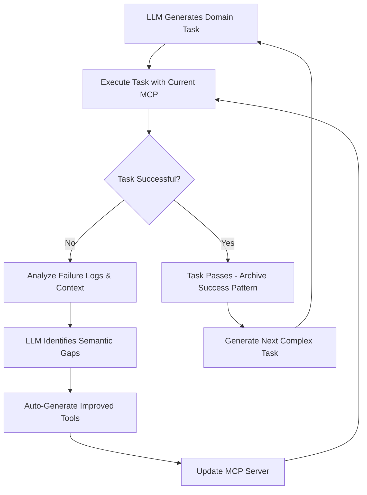

# Semantic MCP Transformation Framework
## From REST API Wrappers to True Semantic MCP Servers

### 🎯 **Vision**

Create a systematic, LLM-driven framework that transforms any REST API into a well-designed, semantic MCP server. Instead of manually crafting MCP tools that mirror REST endpoints, use AI to understand domain semantics and generate goal-oriented, action-based tools that speak the language of user intent.

### 📋 **Current Problem Analysis**

#### ❌ **REST API Wrapper Anti-Patterns**
Our current VME MCP server suffers from fundamental architectural flaws identified in MCP best practices research:

1. **Semantic Mismatch**
   - **REST**: Resource-oriented (nouns) - "What can I manipulate?"
   - **MCP**: Action-oriented (verbs) - "What can I accomplish?"
   - **Problem**: Agents think in goals, not HTTP verbs

2. **Transactional Complexity**
   - Current tools require multiple API calls for single logical operations
   - No atomicity - partial failures leave system in inconsistent state
   - Example: Creating VM requires separate calls for validation, resource allocation, configuration

3. **Operational Inefficiency**
   - Agent must orchestrate complex workflows manually
   - Example: "Deploy development environment" becomes 15+ separate REST calls
   - Lost semantic meaning in low-level operations

#### ❌ **Current Tools (REST Wrapper Style)**
```python
Get_All_Instances()           # → GET /api/instances
Create_an_Instance()          # → POST /api/instances  
Get_Instance_Types()          # → GET /api/library/instance-types
Delete_Instance(id)           # → DELETE /api/instances/{id}
```

#### ✅ **Target Tools (Semantic Action Style)**
```python
deploy_development_environment(template, zone, users)
provision_production_cluster(size, region, backup_policy) 
scale_application_tier(app_name, target_instances)
archive_old_instances(older_than_days, preserve_data)
setup_kubernetes_cluster(masters=3, workers=3, os="ubuntu")
```

---

## 🏗️ **Framework Architecture**

### **Phase 1: Baseline Transformation**

Use our existing VME REST-wrapper MCP server as the **"before" example** to demonstrate the transformation process:

```
Current State (REST Wrapper) → LLM Analysis → Semantic MCP v1.0
```

#### **Input Materials for LLM Analysis**
- **OpenAPI 3.0 Specification** (structure, endpoints, schemas)
- **API Documentation** (usage patterns, workflows, business context)
- **Domain Documentation** (business concepts, terminology, user goals)
- **Example Usage Patterns** (common workflows, integration examples)
- **Current MCP Implementation** (existing tools and their limitations)

#### **LLM Analysis Process**
```yaml
analysis_phases:
  domain_understanding:
    - business_concepts_and_entities
    - user_roles_and_workflows  
    - domain_specific_terminology
    - common_usage_patterns
    
  semantic_mapping:
    - crud_to_action_translation
    - multi_step_workflow_identification
    - transactional_boundaries
    - error_handling_scenarios
    
  abstraction_levels:
    - high_level_user_goals
    - mid_level_operational_workflows
    - low_level_implementation_details
```

#### **Generated Transformation Artifacts**
1. **Semantic Mapping Table** - REST endpoints → Goal-oriented actions
2. **Tool Groupings** - Related operations clustered by business capability
3. **Workflow Definitions** - Multi-step processes as atomic operations
4. **Context Management** - Stateful operations and dependencies
5. **Error Handling Strategy** - Domain-aware recovery and rollback

---

## 🧪 **Phase 2: Test-Driven Self-Improvement**

### **Continuous Evolution Loop**



### **Task Generation Strategy**

#### **Level 1: Basic Operations**
- "Create a single Ubuntu VM with 4GB RAM"
- "List all running instances in zone 'production'"
- "Scale existing web server to 8GB RAM"

#### **Level 2: Workflow Orchestration** 
- "Deploy a 3-tier web application (web, app, db servers)"
- "Create development environment for team of 5 developers"
- "Set up staging environment that mirrors production"

#### **Level 3: Complex Infrastructure**
- "Create VMs to support a K8s cluster using 3 masters and 3 workers using Ubuntu"
- "Set up disaster recovery environment mirroring production"
- "Deploy multi-region application with load balancing"

#### **Level 4: Operational Scenarios**
- "Scale web tier to handle 10x traffic spike"
- "Perform rolling update of application servers with zero downtime"
- "Migrate application from on-premises to cloud infrastructure"

### **Failure Analysis & Learning**

When a task fails, the system analyzes:

```python
failure_analysis = {
    "task": "Create K8s cluster infrastructure",
    "failure_point": "master node configuration",
    "root_cause": "No semantic tool for 'cluster-aware networking'",
    "missing_semantics": [
        "configure_cluster_networking()",
        "setup_master_node_ha()", 
        "join_worker_to_cluster()"
    ],
    "current_tools_used": [
        "Get_All_Zones", "Create_an_Instance", "Get_Instance_Types"
    ],
    "semantic_gap": "Agent forced to manually orchestrate cluster setup",
    "improvement_strategy": "Add cluster_management tool group",
    "context_requirements": ["cluster_topology", "network_policies"]
}
```

### **Dynamic Tool Evolution Examples**

#### **Iteration 1: Basic REST Wrappers**
```python
# Initial tools (current state)
create_instance(instance_type, zone)
list_instances()
delete_instance(id)
get_instance_types()
```

#### **Iteration 2: Workflow-Aware Tools** 
*After K8s cluster task failure*
```python  
provision_kubernetes_cluster(
    masters=3, 
    workers=3, 
    os="ubuntu", 
    network_config="ha",
    storage_class="ssd"
)
scale_cluster_nodes(cluster_id, node_type, target_count)
configure_cluster_networking(cluster_id, network_policy)
validate_cluster_health(cluster_id)
```

#### **Iteration 3: Context-Aware Operations**
*After complex multi-environment scenarios*
```python
deploy_infrastructure_pattern(
    pattern="k8s_cluster",
    size="small|medium|large",
    environment="dev|staging|prod",
    compliance_requirements=[],
    auto_scaling=True
)
replicate_environment(
    source_env="production",
    target_env="staging", 
    anonymize_data=True
)
```

---

## 📊 **Success Metrics & Validation**

### **Quantitative Metrics**
- **Task Completion Rate**: % of tasks completed without manual intervention
- **Tool Efficiency**: Average tools used per successful task  
- **Semantic Clarity**: How often agents choose correct tools on first try
- **Workflow Smoothness**: Reduction in multi-step manual orchestration
- **Domain Coverage**: Breadth of infrastructure scenarios handled
- **Error Recovery**: Success rate of automatic rollback and retry

### **Qualitative Metrics**
- **Tool Naming Clarity**: Do tool names match user mental models?
- **Abstraction Appropriateness**: Are tools at the right level of granularity?
- **Context Awareness**: Do tools understand domain relationships?
- **Error Messages**: Are failures explained in domain terms?

### **Evolution Tracking**
```yaml
evolution_metrics:
  tool_count_reduction: "50+ REST tools → 15 semantic actions"
  task_success_improvement: "30% → 90% completion rate"
  workflow_simplification: "8.5 → 2.1 average tools per task"
  semantic_coverage: "basic CRUD → full domain workflows"
```

---

## 🎨 **Meta-Learning & Pattern Recognition**

### **Domain Patterns Captured**
- Infrastructure provisioning workflows
- High-availability deployment patterns  
- Scaling and operational procedures
- Error handling and rollback strategies
- Resource dependency management
- Security and compliance requirements

### **Semantic Transformation Patterns**
- How to group related operations into semantic tools
- Naming conventions that match user mental models
- Abstraction levels that reduce cognitive load
- Context management for stateful workflows
- Transaction boundaries for atomic operations

### **Evolution Patterns**  
- Common failure modes in REST→MCP translation
- Successful semantic transformation patterns
- Tool composition strategies for complex workflows
- Dynamic adaptation based on usage feedback
- Progressive abstraction refinement

---

## 🚀 **Implementation Roadmap**

### **Phase 1: Foundation (Weeks 1-2)**
1. Document current VME MCP server limitations
2. Create comprehensive task scenarios for VME domain
3. Develop LLM prompting framework for semantic analysis
4. Build execution monitoring and logging system

### **Phase 2: Initial Transformation (Weeks 3-4)**
1. Generate semantic mapping table for VME API
2. Create first version of semantic MCP tools
3. Implement basic task execution framework
4. Validate with Level 1 tasks

### **Phase 3: Self-Improvement Engine (Weeks 5-6)**
1. Build failure analysis and gap identification system
2. Implement automatic tool generation pipeline
3. Create feedback loop for iterative improvement
4. Test with Level 2-3 tasks

### **Phase 4: Advanced Evolution (Weeks 7-8)**
1. Add context management and stateful operations
2. Implement transactional rollback capabilities
3. Optimize tool abstractions based on usage patterns
4. Validate with Level 4 complex scenarios

### **Phase 5: Generalization (Weeks 9-10)**
1. Extract domain-agnostic transformation patterns
2. Create reusable framework components
3. Document methodology for other REST APIs
4. Publish results and best practices

---

## 🌟 **Expected Outcomes**

### **For VME Specifically**
- Transform REST wrapper into true semantic MCP server
- Validate improvements against real infrastructure scenarios
- Create domain-specific tools matching VME administrator workflows
- Demonstrate measurable improvement in agent task completion

### **For the Broader Ecosystem**
- Systematic REST→MCP transformation methodology
- Reusable patterns for other infrastructure APIs  
- Demonstration of LLM-driven iterative MCP improvement
- Benchmark for semantic MCP server design quality

### **For MCP Best Practices**
- Concrete examples of action-oriented vs resource-oriented design
- Validation of semantic tool effectiveness through real tasks
- Documentation of evolution from REST wrappers to true MCP servers
- Measurable quality improvements over time

---

## 🔧 **Technical Architecture**

### **Core Components**
```
├── API Analyzer
│   ├── OpenAPI spec parser
│   ├── Documentation analyzer
│   └── Usage pattern detector
├── Domain Reasoner (LLM-powered)
│   ├── Semantic understanding
│   ├── Workflow identification
│   └── Context modeling
├── Mapping Generator
│   ├── REST→Semantic translation
│   ├── Tool grouping logic
│   └── Dependency analysis
├── Code Generator
│   ├── MCP server implementation
│   ├── Tool definitions
│   └── Context management
├── Task Execution Engine
│   ├── Scenario runner
│   ├── Monitoring and logging
│   └── Success/failure tracking
└── Evolution Engine
    ├── Gap analysis
    ├── Tool improvement
    └── Pattern learning
```

### **Data Flow**
```
OpenAPI Spec → Domain Analysis → Semantic Mapping → Tool Generation → 
Task Execution → Failure Analysis → Improvement → Iteration
```

---

## 📝 **Success Criteria**

This framework will be considered successful if:

1. **Semantic Quality**: Generated MCP tools express user goals, not HTTP operations
2. **Task Success**: 90%+ completion rate for domain-appropriate scenarios  
3. **Efficiency**: Significant reduction in tools-per-task compared to REST wrapper
4. **Evolution**: Demonstrable improvement over multiple iterations
5. **Generalizability**: Framework applicable to other REST APIs beyond VME
6. **Best Practices**: Results align with established MCP design principles

---

## 🔮 **Future Possibilities**

- **Multi-Domain Learning**: Apply patterns learned from VME to other infrastructure APIs
- **Cross-API Integration**: Semantic tools that span multiple REST services
- **Industry Standards**: Contribute to MCP ecosystem with transformation methodology
- **Tool Marketplace**: Generated semantic MCP servers for common REST APIs
- **Education**: Teaching resource for proper MCP server design patterns

---

*This document serves as the architectural foundation for transforming our VME MCP server from a REST API wrapper into a true semantic, action-oriented MCP implementation that demonstrates best practices for the entire ecosystem.*